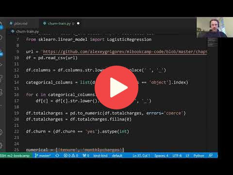

## 11.3 Deploying a Scikit-Learn model with KServe

 

## Notes

Add notes from the video (PRs are welcome)

<table>
   <tr>
      <td>⚠️</td>
      <td>
         The notes are written by the community.  
         If you see an error here, please create a PR with a fix.
      </td>
   </tr>
</table>

## Navigation

* [Machine Learning Zoomcamp course](../)
* [Session 11: KServe](./)
* Previous: [Running KServe locally](02-kserve-local.md)
* Next: [Deploying custom Scikit-Learn images with KServe](04-kserve-custom-image.md)