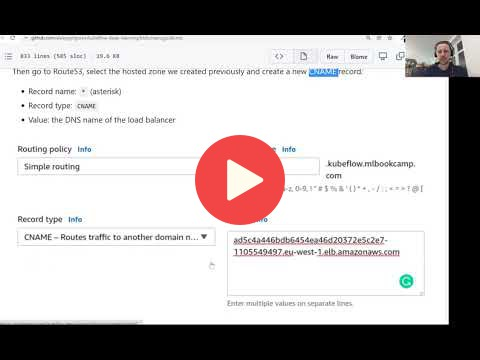

## 11.7 Deploying with KServe and EKS

 

## Notes

Add notes from the video (PRs are welcome)

<table>
   <tr>
      <td>⚠️</td>
      <td>
         The notes are written by the community.  
         If you see an error here, please create a PR with a fix.
      </td>
   </tr>
</table>

### Updated Instructions (13 July, 2022)   
See [the instructions here](07-kserve-eks-upd.md)

## Navigation

* [Machine Learning Zoomcamp course](../)
* [Session 11: KServe](./)
* Previous: [KServe transformers](06-kserve-transformers.md)
* Next: [Summary](08-summary.md)
