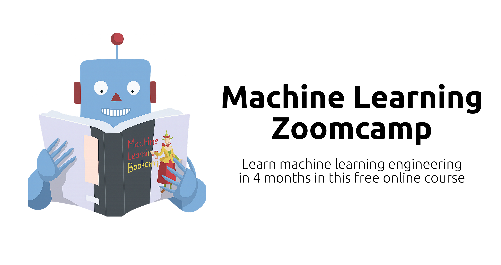
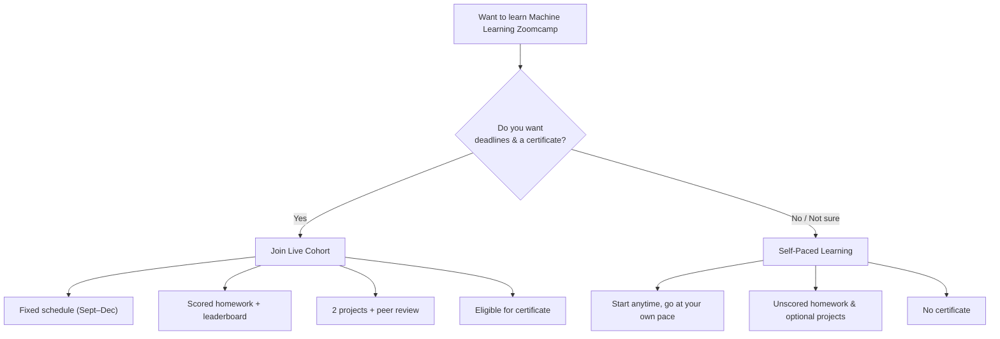

<h1 align="center">
    <strong>Machine Learning Zoomcamp: A Free 4-Month Course on ML Engineering</strong>
</h1>

<a href="https://courses.datatalks.club/">Course platform with deadlines and submission forms for homework assignments and projects</a> •
<a href="https://datatalks.club/slack.html"> Course Channel on Slack (#course-ml-zoomcamp) </a> •
<a href="https://t.me/mlzoomcamp">Telegram Announcements</a> •
<a href="https://www.youtube.com/playlist?list=PL3MmuxUbc_hIhxl5Ji8t4O6lPAOpHaCLR">Course Playlist</a> •
<a href="https://datatalks.club/faq/machine-learning-zoomcamp.html">FAQ</a> •
<a href="https://ctt.ac/XZ6b9">Tweet about the Course</a>

Learn machine learning engineering end-to-end, from core models to deploying real applications.

Build regression and classification models in Python, work with key algorithms like linear/logistic regression, decision trees, and deep learning, and then take them to production using Docker, FastAPI, Kubernetes, and AWS Lambda.

## Table of Contents
- [What This Course Is About](#about-ml-zoomcamp)
- [Prerequisites](#prerequisites)
- [How to Join](#how-to-join)
- [Syllabus](#syllabus)
- [Community & Getting Help](#community--getting-help)
- [Certificates](#certificates)
- [Sponsors](#sponsors)
- [About DataTalks.Club](#about-datatalksclub)

## About ML Zoomcamp
Machine Learning Zoomcamp teaches you the complete machine learning engineering, covering the entire pipeline: from building models with Python to deploying them in production environments.

You’ll master the key ML algorithms like linear regression, logistic regression, decision trees, and deep learning with TensorFlow and PyTorch, then learn to containerize with Docker, build APIs with FastAPI, and scale with Kubernetes and AWS Lambda.

## Prerequisites

**You'll need:**
- Prior programming experience (at least 1+ year)
- Comfort with command line basics

You don't need any prior experience with machine learning. We'll start from the basics.

**Technical setup**: For machine learning modules, you only need a laptop with an internet connection. For deep learning sections, we'll use cloud resources for more intensive computations.

## How to Join

You can join ML Zoomcamp either by **following a live cohort** or **learning at your own pace**.

All materials are freely available in this repository. Each module has its own folder (e.g., `01-intro`, `03-classification`), and cohort-specific homework and deadlines are in the `cohorts` directory. Lectures are pre-recorded and available in this [YouTube playlist](https://www.youtube.com/playlist?list=PL3MmuxUbc_hIhxl5Ji8t4O6lPAOpHaCLR).

### Option 1: Self-Paced Learning

Start anytime. You get full access to materials and community support on Slack.

Complete homework assignments: homework and solutions are available on the [course platform](https://courses.datatalks.club). Build a project for your portfolio.

> Under self-paced learning, homework isn't scored, your project isn't peer-reviewed, and you can't earn a certificate.

### Option 2: Live Cohort

> **2025 Cohort:** Starts September 15. Register here: [Fill in this form](https://airtable.com/shryxwLd0COOEaqXo)

Runs once per year (September–December).

Includes:
- Updated homework
- Automatic homework scoring and a leaderboard
- Project peer review
- Eligibility for a certificate after meeting all requirements

Even if you join after the official start date, you can still follow along — but note that some homework forms may already be closed. All active deadlines are listed on the [course platform](https://courses.datatalks.club).

> To earn a [certificate](#certificate), you'll need enough time to complete two [projects](#projects) and the required peer reviews. Details are in the Projects and Certificate sections.

### Comparison

We summarized the key differences between the two joining options in this table:
| Feature | Self-Paced | Live Cohort |
|---------|------------|-------------|
| **Timing** | Learn at your own pace, start anytime | Fixed 4-month schedule (September–December each year) |
| **Course Materials** | Full access to GitHub repository and YouTube lectures | Full access to GitHub repository and YouTube lectures |
| **Community** | Access to Slack community (`#course-ml-zoomcamp`) | Access to Slack community (`#course-ml-zoomcamp`) |
| **Homework** | Available but not scored | Scored automatically, appears on leaderboard |
| **Projects** | Build on your own, no evaluation | Submit 2 projects (midterm + capstone OR two capstones) with peer review |
| **Certificate** | Not available | Available after completing projects and peer reviews |
| **Structure** | Flexible, no deadlines | Weekly rhythm with deadlines and peer accountability |

  <strong>Ready to start? <a href="https://airtable.com/shryxwLd0COOEaqXo">Join the 2025 cohort</a> or <a href="01-intro/">start with Module 1</a></strong>

## Syllabus

| Module | Description | Topics |
|--------|-------------|--------|
| **[Module 1: Introduction to Machine Learning](01-intro/)** | Learn the fundamentals: what ML is, when to use it, and how to approach ML problems using the CRISP-DM framework. | • ML vs rule-based systems • Supervised learning basics • CRISP-DM methodology • Model selection concepts • Environment setup |
| **[Module 2: Machine Learning for Regression](02-regression/)** | Build a car price prediction model while learning linear regression, feature engineering, and regularization. | • Linear regression (from scratch and with scikit-learn) • Exploratory data analysis • Feature engineering • Regularization techniques • Model validation |
| **[Module 3: Machine Learning for Classification](03-classification/)** | Create a customer churn prediction system using logistic regression and learn about feature selection. | • Logistic regression • Feature importance and selection • Categorical variable encoding • Model interpretation |
| **[Module 4: Evaluation Metrics for Classification](04-evaluation/)** | Learn how to properly evaluate classification models and handle imbalanced datasets. | • Accuracy, precision, recall, F1-score • ROC curves and AUC • Cross-validation • Confusion matrices • Class imbalance handling |
| **[Module 5: Deploying Machine Learning Models](05-deployment/)** | Turn your models into web services and deploy them with Docker and cloud platforms. | • Model serialization with Pickle • FastAPI web services • Docker containerization • Cloud deployment |
| **[Module 6: Decision Trees & Ensemble Learning](06-trees/)** | Learn tree-based models and ensemble methods for better predictions. | • Decision trees • Random Forest • Gradient boosting (XGBoost) • Hyperparameter tuning • Feature importance |
| **[Midterm Project](projects/)** |  |  |
| **[Module 8: Neural Networks & Deep Learning](08-deep-learning/)** | Introduction to neural networks using TensorFlow and Keras, including CNNs and transfer learning. | • Neural network fundamentals • PyTorch • TensorFlow & Keras • Convolutional Neural Networks • Transfer learning • Model optimization |
| **[Module 9: Serverless Deep Learning](09-serverless/)** | Deploy deep learning models using serverless technologies like AWS Lambda. | • Serverless concepts • Deploying Scikit-Learn models with AWS Lambda • Deploying TensorFlow and PyTorch models with AWS Lambda • API Gateway |
| **[Module 10: Kubernetes & TensorFlow Serving](10-kubernetes/)** | Learn to serve ML models at scale using Kubernetes and TensorFlow Serving. | • Kubernetes basics • TensorFlow Serving • Model deployment and scaling • Load balancing |
| **[Capstone project 1](https://github.com/DataTalksClub/machine-learning-zoomcamp/tree/master#capstone-project-1)** |  |  |
| **[Capstone project 2](https://github.com/DataTalksClub/machine-learning-zoomcamp/tree/master#capstone-project-2-optional)** |  |  |

### Projects

Choose a problem that interests you, find a suitable dataset, develop your model, and deploy it as a web service.

There will be 3 projects:
1. [Midterm Project](projects/) after [Module 6: Decision Trees & Ensemble Learning](06-trees/)
2. [Capstone project 1](https://github.com/DataTalksClub/machine-learning-zoomcamp/tree/master#capstone-project-1) at the end of the course, after [Module 10: Kubernetes & TensorFlow Serving](10-kubernetes/)
3. [Capstone project 2](https://github.com/DataTalksClub/machine-learning-zoomcamp/tree/master#capstone-project-2-optional) at the end of the course, after [Module 10: Kubernetes & TensorFlow Serving](10-kubernetes/)

These projects allow you to apply everything you've learned and make a great addition to your GitHub profile and portfolio.

#### Project Examples from Past Cohorts

 <i> A local deployment architecture using Kubernetes with Kind from one of the students' projects </i> 

Some of the course projects from past cohorts:
- [Blood cell classifier for cancer prediction](https://datatalks.club/blog/how-to-build-blood-cell-classifier-for-cancer-prediction-case-study-from-ml-zoomcamp.html): an end-to-end tool that segments and classifies blood cells from microscope images to assist in detecting signs of acute lymphoblastic leukemia (ALL)
- [Waste classifier](https://datatalks.club/blog/how-to-build-waste-classifier-case-study-from-ml-zoomcamp.html): an Xception-based image classifier on ~15,000 waste images, reaching 93.3% test accuracy, and serving predictions via a Flask API packaged in Docker

## Certificate

 <i> Machine Learning Zoomcamp certificate awarded upon successful completion </i> 

To receive a certificate, you'll need to complete and submit two projects:

1. **Complete two projects**: Submit either a midterm project and a capstone project, OR two capstone projects
2. **Submit on time**: Meet the project submission deadlines to qualify for certification
3. **Peer review**: Evaluate and provide feedback on 3 fellow students' projects during the peer review process

## Testimonials

> Machine Learning Zoomcamp was exhaustive, with very comprehensive content that covered concepts in depth. You can learn everything from the simplest concepts to preparing and deploying an ML model for production. Additionally, the entire community behind this course is highly participative and collaborative. I would like to thank Alexey Grigorev for all the knowledge he shared with us and his team for providing the support we needed to solve each problem we faced.
>
> - [Alexander Daniel Rios](https://www.linkedin.com/in/alexander-daniel-rios) ([Source](https://www.linkedin.com/posts/alexander-daniel-rios_mlzoomcamp-activity-7295527609239584768-TWHh))

> Machine Learning Zoomcamp has been an incredible journey, thanks to the expert guidance of Alexey Grigorev. Hugely grateful to Alexey, Timur, and the entire DataTalksClub team for this course, and to my cohort batchmates for the invaluable support that enriched my learning experience. I’m thankful for this programme, which provided challenging coursework that is taught in a very structured and lucid way. The timely assignments & hands-on projects instill the sense of timely delivery, besides equipping us with practical acumen to solve real-life problems.
>
> - [Siddhartha Gogoi](https://www.linkedin.com/in/siddhartha-gogoi) ([Source](https://www.linkedin.com/posts/activity-7299906113997524994-R-oD?utm_source=share&utm_medium=member_desktop&rcm=ACoAADJu9vMBW6iyIYswCQnN6t8UJLkXH2tQPi4))

> Balancing the intensive Machine Learning Zoomcamp with my other engagements was no easy task, but the experience deepened my expertise in machine learning engineering, reinforced my passion for ML deployment and cloud technologies, and strengthened my resilience in handling real-world ML challenges. Thank you, Alexey Grigorev, for this course!
>
> - [Patrick Edosoma](https://www.linkedin.com/in/patrickedosoma) ([Source](https://www.linkedin.com/posts/patrickedosoma_machinelearning-mlzoomcamp-datascience-activity-7299090071201193985-JyuC))

> Highly recommend the ML Zoomcamp for anyone wanting a structured path to production-ready machine learning. A big thank you - Alexey Grigorev and to the team at DataTalksClub for providing such a well-structured and engaging course.
>
> - [Abdiaziz Mohamed](https://www.linkedin.com/in/abdiaziz-mohamed) ([Source 1](https://www.linkedin.com/posts/abdiaziz-mohamed_machinelearning-deployment-docker-activity-7257086439333523456-CyK4), [Source 2](https://www.linkedin.com/posts/abdiaziz-mohamed_machinelearningzoomcamp-machinelearning-kubernetes-activity-7277039208072904704-OAiY?utm_source=share&utm_medium=member_desktop&rcm=ACoAADJu9vMBW6iyIYswCQnN6t8UJLkXH2tQPi4))

> A huge thank you to Alexey Grigoriev for creating such an amazing course—and making it free! It’s truly inspiring.
>
> - [Guilherme Pereira](https://www.linkedin.com/in/guilherme-torres-pereira) ([Source](https://www.linkedin.com/posts/guilherme-torres-pereira_alexeygrigoriev-mlzoomcamp-machinelearning-activity-7396336012018356224-sK27))

> Huge thanks to Alexey Grigorev and the DataTalksClub community for the incredible support and clarity throughout. The open-source spirit and collaborative notes made the learning experience even richer.
>
> - [Rajendra Rawale](https://www.linkedin.com/in/rajendra1x) ([Source](https://www.linkedin.com/posts/rajendra1x_machinelearning-mlzoomcamp-datatalksclub-activity-7378450260999852032-V5Z1))

  <strong>Ready to start? <a href="https://airtable.com/shryxwLd0COOEaqXo">Join the 2025 cohort</a> or <a href="01-intro/">start with Module 1</a></strong>

## Community & Getting Help

### Where to Get Help
- **Slack**: [`#course-ml-zoomcamp`](https://app.slack.com/client/T01ATQK62F8/C0288NJ5XSA) channel
- **FAQ**: [Common questions and answers](https://datatalks.club/faq/machine-learning-zoomcamp.html)
- **Study Groups**: Connect with other learners

### Community Guidelines
- Check the [FAQ](https://datatalks.club/faq/machine-learning-zoomcamp.html) first
- Follow our [question guidelines](asking-questions.md)
- Be helpful and respectful
- Share your learning journey

### Learning in Public
We encourage sharing your progress! Write blog posts, create videos, post on social media with #mlzoomcamp. It helps you learn better and builds your professional network.

**Bonus**: You can earn extra points for sharing your learning experience publicly.

Learn more: [Learning in Public](learning-in-public.md)

## Sponsors

Interested in sponsoring? Contact [alexey@datatalks.club](mailto:alexey@datatalks.club).

## About DataTalks.Club

  

<a href="https://datatalks.club/">DataTalks.Club</a> is a global online community of data enthusiasts. It's a place to discuss data, learn, share knowledge, ask and answer questions, and support each other.

<a href="https://datatalks.club/">Website</a> •
<a href="https://datatalks.club/slack.html">Join Slack Community</a> •
<a href="https://us19.campaign-archive.com/home/?u=0d7822ab98152f5afc118c176&id=97178021aa">Newsletter</a> •
<a href="http://lu.ma/dtc-events">Upcoming Events</a> •
<a href="https://www.youtube.com/@DataTalksClub/featured">YouTube</a> •
<a href="https://github.com/DataTalksClub">GitHub</a> •
<a href="https://www.linkedin.com/company/datatalks-club/">LinkedIn</a> •
<a href="https://twitter.com/DataTalksClub">Twitter</a>

All the activity at DataTalks.Club mainly happens on [Slack](https://datatalks.club/slack.html). We post updates there and discuss different aspects of data, career questions, and more.
