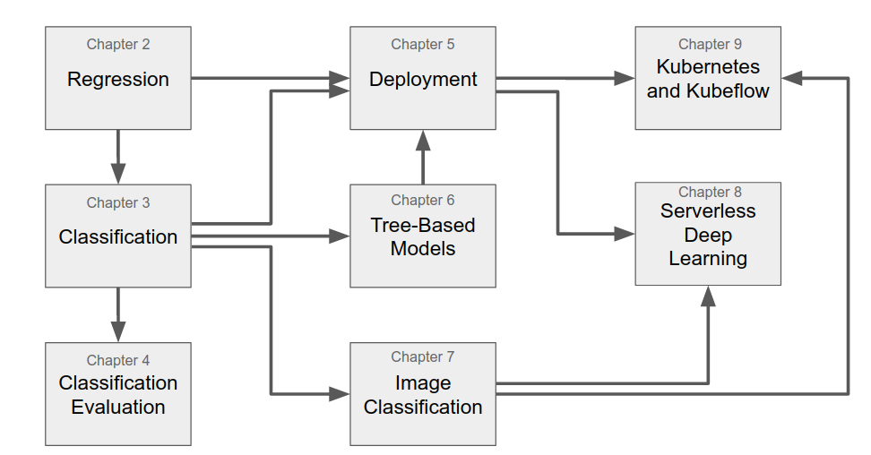

# Machine Learning Bookcamp

The code from the Machine Learning Bookcamp book

Useful links: 

* [https://mlbookcamp.com](https://mlbookcamp.com): supplimentary materials
* [https://datatalks.club](https://datatalks.club): the place to talk about data (and the book: join the `#ml-bookcamp` channel to ask questions about the book and report any problems)

## Machine Learning Zoomcamp

Machine Learning Zoomcamp is a course based on the book

* It's online and free
* You can join at any moment
* More information in the [course-zoomcamp](course-zoomcamp) folder

## Reading Plan

# Chapters

## Chapter 1: Introduction to Machine Learning

* Understanding machine learning and the problems it can solve
* CRISP-DM: Organizing a successful machine learning project
* Training and selecting machine learning models
* Performing model validation

No code

## Chapter 2: Machine Learning for Regression

* Creating a car-price prediction project with a linear regression model
* Doing an initial exploratory data analysis with Jupyter notebooks
* Setting up a validation framework 
* Implementing the linear regression model from scratch
* Performing simple feature engineering for the model
* Keeping the model under control with regularization
* Using the model to predict car prices

Code: [chapter-02-car-price/02-carprice.ipynb](chapter-02-car-price/02-carprice.ipynb)

## Chapter 3: Machine Learning for Classification

* Predicting customers who will churn with logistic regression
* Doing exploratory data analysis for identifying important features
* Encoding categorical variables to use them in machine learning models
* Using logistic regression for classification

Code: [chapter-03-churn-prediction/03-churn.ipynb](chapter-03-churn-prediction/03-churn.ipynb)

## Chapter 4: Evaluation Metrics for Classification

* Accuracy as a way of evaluating binary classification models and its limitations
* Determining where our model makes mistakes using a confusion table
* Deriving other metrics like precision and recall from the confusion table
* Using ROC and AUC to further understand the performance of a binary classification model 
* Cross-validating a model to make sure it behaves optimally
* Tuning the parameters of a model to achieve the best predictive performance

Code: [chapter-03-churn-prediction/04-metrics.ipynb](chapter-03-churn-prediction/04-metrics.ipynb)

## Chapter 5: Deploying Machine Learning Models

* Saving models with Pickle
* Serving models with Flask
* Managing dependencies with Pipenv
* Making the service self-contained with Docker
* Deploying it to the cloud using AWS Elastic Beanstalk

Code: [chapter-05-deployment](chapter-05-deployment)

## Chapter 6: Decision Trees and Ensemble Learning

* Predicting the risk of default with tree-based models
* Decision trees and the decision tree learning algorithm
* Random forest: putting multiple trees together into one model
* Gradient boosting as an alternative way of combining decision trees 

Code: [chapter-06-trees/06-trees.ipynb](chapter-06-trees/06-trees.ipynb)

## Chapter 7: Neural Networks and Deep Learning

* Convolutional neural networks for image classification 
* TensorFlow and Keras — frameworks for building neural networks 
* Using pre-trained neural networks
* Internals of a convolutional neural network
* Training a model with transfer learning
* Data augmentations — the process of generating more training data

Code: [chapter-07-neural-nets/07-neural-nets-train.ipynb](chapter-07-neural-nets/07-neural-nets-train.ipynb)

## Chapter 8: Serverless Deep Learning

* Serving models with TensorFlow-Lite — a light-weight environment for applying TensorFlow models
* Deploying deep learning models with AWS Lambda
* Exposing the Lambda function as a web service via API Gateway

Code: [chapter-08-serverless](chapter-08-serverless)

## Chapter 9: Kubernetes and Kubeflow 

Kubernetes:

* Understanding different methods of deploying and serving models in the cloud.
* Serving Keras and TensorFlow models with TensorFlow-Serving
* Deploying TensorFlow-Serving to Kubernetes

Code: [chapter-09-kubernetes](chapter-09-kubernetes)

Kubeflow:

* Using Kubeflow and KFServing for simplifying the deployment process

Code: [chapter-09-kubeflow](chapter-09-kubeflow)

Articles from [mlbookcamp.com](https://mlbookcamp.com):

* [Creating an EKS Cluster](https://mlbookcamp.com/article/eks)
* [Creating a KFServing Cluster on EKS](https://mlbookcamp.com/article/kfserving-eks-install)
* [KFServing Transformers](https://mlbookcamp.com/article/kfserving-transformers)

# Appendices 

## Appendix A: Setting up the Environment

* Installing Anaconda, a Python distribution that includes most of the scientific libraries we need
* Running a Jupyter Notebook service from a remote machine
* Installing and configuring the Kaggle command line interface tool for accessing datasets from Kaggle
* Creating an EC2 machine on AWS using the web interface and the command-line interface

Code: no code

Articles from [mlbookcamp.com](https://mlbookcamp.com):

* [Creating an AWS account](https://mlbookcamp.com/article/aws)
* [Renting an EC2 instance](https://mlbookcamp.com/article/aws-ec2)

## Appendix B: Introduction to Python

* Basic python syntax: variables and control-flow structures
* Collections: lists, tuples, sets, and dictionaries
* List comprehensions: a concise way of operating on collections
* Reusability: functions, classes and importing code
* Package management: using pip for installing libraries
* Running python scripts 

Code: [appendix-b-python.ipynb](appendix-b-python.ipynb)

Articles from [mlbookcamp.com](https://mlbookcamp.com):

* [Introduction to Python](https://mlbookcamp.com/article/python)

## Appendix C: Introduction to NumPy and Linear Algebra

* One-dimensional and two-dimensional NumPy arrays
* Generating NumPy arrays randomly
* Operations with NumPy arrays: element-wise operations, summarizing operations, sorting and filtering
* Multiplication in linear algebra: vector-vector, matrix-vector and matrix-matrix multiplications
* Finding the inverse of a matrix and solving the normal equation

Code: [appendix-c-numpy.ipynb](appendix-c-numpy.ipynb)

Articles from [mlbookcamp.com](https://mlbookcamp.com):

* [Introduction to NumPy](https://mlbookcamp.com/article/numpy)

## Appendix C: Introduction to Pandas

* The main data structures in Pandas: DataFrame and Series
* Accessing rows and columns of a DataFrame
* Element-wise and summarizing operations
* Working with missing values
* Sorting and grouping

Code: [appendix-d-pandas.ipynb](appendix-d-pandas.ipynb)

## Appendix D: AWS SageMaker

* Increasing the GPU quota limits
* Renting a Jupyter notebook with GPU in AWS SageMaker
