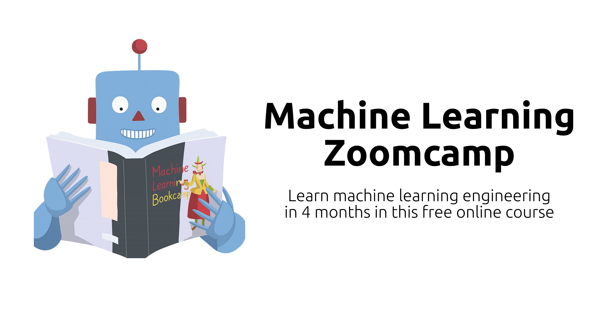

  

<h1 align="center">
  Machine Learning Zoomcamp: A Free Course on ML Engineering
</h1>

  A free, hands-on course on building, evaluating, and deploying machine learning systems.

  

  <a href="https://courses.datatalks.club/register/ml-zoomcamp/">Register</a> |
  <a href="https://courses.datatalks.club/ml-zoomcamp-2026/">Course Platform</a> |
  <a href="https://github.com/DataTalksClub/machine-learning-zoomcamp">Course Materials</a> |
  <a href="https://datatalks.club/slack.html">Join Slack</a> |
  <a href="https://app.slack.com/client/T01ATQK62F8/C0288NJ5XSA">Course Slack Channel</a> |
  <a href="https://t.me/mlzoomcamp">Telegram</a> |
  <a href="https://www.youtube.com/playlist?list=PL3MmuxUbc_hIhxl5Ji8t4O6lPAOpHaCLR">YouTube Playlist</a> |
  <a href="https://datatalks.club/faq/machine-learning-zoomcamp.html">FAQ</a>

  
  

## Quick Links

| Resource | Link |
| --- | --- |
| Register | [Sign up for the free 2026 cohort](https://courses.datatalks.club/register/ml-zoomcamp/) |
| Start date | September 14, 2026 |
| Learn | [Course platform](https://courses.datatalks.club/ml-zoomcamp-2026/) &middot; [Materials](https://github.com/DataTalksClub/machine-learning-zoomcamp) &middot; [Videos](https://www.youtube.com/playlist?list=PL3MmuxUbc_hIhxl5Ji8t4O6lPAOpHaCLR) |
| Current cohort | [2026 syllabus and deadlines](cohorts/2026/) |
| Community | [Slack](https://datatalks.club/slack.html) &middot; [Course channel](https://app.slack.com/client/T01ATQK62F8/C0288NJ5XSA) &middot; [Telegram](https://t.me/mlzoomcamp) |
| Help | [Course docs](https://datatalks.club/docs/courses/ml-zoomcamp/) &middot; [Logistics](https://datatalks.club/docs/courses/zoomcamp-logistics/) &middot; [FAQ](https://datatalks.club/faq/machine-learning-zoomcamp.html) |

## About the Course

Machine Learning Zoomcamp is a free, practical course for people who want to learn machine learning engineering by building and deploying real projects.

The course follows the complete path from a machine learning problem to a production service:

> Frame the problem, prepare the data, train and evaluate the model, expose it through an API, package it, and deploy it.

You will work with Python, NumPy, pandas, scikit-learn, TensorFlow, PyTorch, FastAPI, Docker, Kubernetes, and AWS Lambda. Along the way, you will build regression and classification models, evaluate them with appropriate metrics, train tree-based and deep learning models, and deploy machine learning services.

  

This is not a theory-only course. The emphasis is on applying machine learning to practical problems and turning trained models into services that other applications can use.

## Who Should Join

This course is for you if you:

- Already have programming experience and want to move into machine learning engineering.
- Want a structured introduction to machine learning without assuming prior ML knowledge.
- Want to understand both model development and production deployment.
- Learn best by completing homework and building end-to-end projects.
- Want portfolio projects that demonstrate practical machine learning skills.
- Benefit from cohort deadlines, community support, peer review, and certificate eligibility.

The course is especially relevant for software engineers, data analysts, data engineers, technical students, and other practitioners who want to build and deploy machine learning systems.

This course is probably not the right fit if you have no programming experience, want a non-technical introduction to AI, or are looking primarily for advanced machine learning research topics.

## Prerequisites

You do not need prior machine learning experience.

You should have:

- At least one year of programming experience.
- Comfort using the command line.
- A laptop with an internet connection.

Helpful, but not required:

- Familiarity with Python.
- Basic Git and GitHub experience.
- Experience working with data in notebooks or scripts.

Not required:

- Previous experience training machine learning models.
- Cloud or Kubernetes experience.
- A powerful computer or local GPU. The deep learning modules use cloud resources for more intensive computation.

## How to Take the Course

You can follow the course as part of the live cohort or use the materials self-paced.

| | Live Cohort | Self-Paced |
| --- | --- | --- |
| Start | September 14, 2026 | Anytime |
| Cost | Free | Free |
| Lectures | Pre-recorded | Pre-recorded |
| Homework | Graded | Available, but not scored |
| Leaderboard | Yes | No |
| Peer review | Yes | No |
| Certificate eligibility | Yes | No |
| Registration | [Sign up here](https://courses.datatalks.club/register/ml-zoomcamp/) | Start from the repository |

> [!IMPORTANT]
> "Live cohort" does not mean mandatory live classes. Lectures are pre-recorded. Live cohort means shared deadlines, scored homework, leaderboard participation, peer review, community support, and certificate eligibility. The cohort runs once a year: modules take place from September through December, and the final projects conclude in January.

To earn a certificate, you must submit two qualifying projects and complete the required peer reviews during a live cohort. You may submit the midterm and one capstone, or both capstone projects.

Self-paced steps:

1. Follow the [course materials](https://github.com/DataTalksClub/machine-learning-zoomcamp).
2. Watch the lectures in the [YouTube playlist](https://www.youtube.com/playlist?list=PL3MmuxUbc_hIhxl5Ji8t4O6lPAOpHaCLR).
3. Ask questions and share your progress in [DataTalks.Club Slack](https://datatalks.club/slack.html).
4. Complete the homework for practice and build an end-to-end project for your portfolio.

## Syllabus

### [Module 1: Introduction to Machine Learning](cohorts/2026/01-intro/)

Learn what machine learning is, when to use it, and how to structure a machine learning project with the CRISP-DM framework.

In this module, you will:

- Compare machine learning systems with rule-based systems.
- Learn the foundations of supervised learning.
- Use CRISP-DM to organize a machine learning project.
- Understand the basic model-selection process.
- Set up the course development environment.

Outcome: a structured approach to framing machine learning problems and starting a reproducible project.

### [Module 2: Machine Learning for Regression](cohorts/2026/02-regression/)

Build a car-price prediction model while learning the foundations of regression.

In this module, you will:

- Explore and prepare a real dataset.
- Implement linear regression from scratch and with scikit-learn.
- Create and select useful features.
- Apply regularization.
- Validate and compare regression models.

Outcome: a regression model built through a repeatable process from exploratory analysis to validation.

### [Module 3: Machine Learning for Classification](cohorts/2026/03-classification/)

Build a customer-churn prediction system with logistic regression.

In this module, you will:

- Train and use logistic regression models.
- Encode categorical variables.
- Measure and interpret feature importance.
- Select useful features.
- Interpret a model's predictions.

Outcome: a classification model that estimates customer-churn risk from structured data.

### [Module 4: Evaluation Metrics for Classification](cohorts/2026/04-evaluation/)

Learn how to evaluate classification systems and choose metrics that match the problem.

In this module, you will:

- Work with accuracy, precision, recall, and F1 score.
- Build and interpret confusion matrices.
- Use ROC curves and AUC.
- Validate models with cross-validation.
- Evaluate models when classes are imbalanced.

Outcome: an evaluation workflow that supports informed model selection and reliable performance reporting.

### [Module 5: Deploying Machine Learning Models](cohorts/2026/05-deployment/)

Turn a trained model into a web service that other applications can call.

In this module, you will:

- Serialize trained models.
- Expose predictions through a FastAPI service.
- Package the service with Docker.
- Deploy the service to a cloud platform.

Outcome: a containerized prediction service available through an API.

### [Module 6: Decision Trees and Ensemble Learning](cohorts/2026/06-trees/)

Train tree-based models and combine them into stronger predictive systems.

In this module, you will:

- Train and interpret decision trees.
- Build random forest models.
- Use gradient boosting with XGBoost.
- Tune model hyperparameters.
- Analyze feature importance.

Outcome: a tuned tree-based model selected through systematic evaluation.

### [Midterm Project](projects/)

Apply Modules 1 through 6 to an end-to-end machine learning problem of your choice.

You will select a dataset, define the problem, train and evaluate a model, and deploy it as a web service.

### [Module 8: Neural Networks and Deep Learning](cohorts/2026/08-deep-learning/)

Learn the foundations of neural networks and apply deep learning to image problems.

In this module, you will:

- Understand the main components of a neural network.
- Work with PyTorch, TensorFlow, and Keras.
- Train convolutional neural networks.
- Apply transfer learning.
- Improve and optimize model performance.

Outcome: an image-classification model trained and evaluated with a modern deep learning framework.

### [Module 9: Serverless Deep Learning](cohorts/2026/09-serverless/)

Deploy machine learning and deep learning models with serverless infrastructure.

In this module, you will:

- Understand the serverless deployment model.
- Deploy scikit-learn models with AWS Lambda.
- Deploy TensorFlow and PyTorch models with AWS Lambda.
- Expose Lambda functions through API Gateway.

Outcome: a prediction endpoint deployed without managing a persistent application server.

### [Module 10: Kubernetes and TensorFlow Serving](cohorts/2026/10-kubernetes/)

Learn how to serve and scale machine learning models with Kubernetes and TensorFlow Serving.

In this module, you will:

- Learn the core Kubernetes concepts used in model deployment.
- Serve models with TensorFlow Serving.
- Deploy model-serving components to Kubernetes.
- Scale services and distribute traffic.

Outcome: a scalable model-serving setup running on Kubernetes.

### [Capstone Project 1](projects/)

Build a larger end-to-end machine learning project after completing the course modules.

### [Capstone Project 2](projects/)

Build an optional second capstone project. Together with the midterm or first capstone, it can count toward the two projects required for a certificate.

## Projects

Projects are where you apply the course workflow to a problem that interests you. You choose a dataset, define the prediction task, develop and evaluate a model, and deploy it as a web service.

The live cohort provides three project opportunities:

1. [Midterm project](projects/), after [Module 6: Decision Trees and Ensemble Learning](cohorts/2026/06-trees/).
2. [Capstone project 1](projects/), after [Module 10: Kubernetes and TensorFlow Serving](cohorts/2026/10-kubernetes/).
3. [Capstone project 2](projects/), an optional second capstone at the end of the course.

To qualify for a certificate, submit either:

- The midterm project and one capstone project.
- Both capstone projects.

The projects give you practical experience with the complete machine learning lifecycle and provide concrete work you can add to your GitHub profile and portfolio.

### Project Examples from Past Cohorts

  

<em>A local deployment architecture using Kubernetes with Kind from a learner project</em>

Examples include:

- [Blood cell classifier for cancer prediction](https://datatalks.club/blog/how-to-build-blood-cell-classifier-for-cancer-prediction-case-study-from-ml-zoomcamp.html): an end-to-end tool that segments and classifies blood cells from microscope images to help detect signs of acute lymphoblastic leukemia.
- [Waste classifier](https://datatalks.club/blog/how-to-build-waste-classifier-case-study-from-ml-zoomcamp.html): an Xception-based image classifier trained on approximately 15,000 waste images, achieving 93.3% test accuracy and serving predictions through a Docker-packaged API.

## Certificate

  

<em>Machine Learning Zoomcamp certificate awarded after successful completion</em>

Certificates are available to learners who complete the requirements during a live cohort.

To qualify, you must:

1. Submit two projects: either the midterm and one capstone, or both capstones.
2. Submit the projects by the applicable cohort deadlines.
3. Review three other learners' projects and provide feedback through the peer-review process.

See the [certificate guide](https://datatalks.club/docs/courses/zoomcamp-logistics/certification/) for details about the process and instructions for adding the certificate to LinkedIn.

Self-paced learners can use all course materials for free, but certificates are available only through a live cohort.

## Learner Stories

> Machine Learning Zoomcamp was exhaustive, with very comprehensive content that covered concepts in depth. You can learn everything from the simplest concepts to preparing and deploying an ML model for production. Additionally, the entire community behind this course is highly participative and collaborative. I would like to thank Alexey Grigorev for all the knowledge he shared with us and his team for providing the support we needed to solve each problem we faced.
>
> - [Alexander Daniel Rios](https://www.linkedin.com/in/alexander-daniel-rios) ([Source](https://www.linkedin.com/posts/alexander-daniel-rios_mlzoomcamp-activity-7295527609239584768-TWHh))

> Machine Learning Zoomcamp has been an incredible journey, thanks to the expert guidance of Alexey Grigorev. Hugely grateful to Alexey, Timur, and the entire DataTalksClub team for this course, and to my cohort batchmates for the invaluable support that enriched my learning experience. I'm thankful for this programme, which provided challenging coursework that is taught in a very structured and lucid way. The timely assignments & hands-on projects instill the sense of timely delivery, besides equipping us with practical acumen to solve real-life problems.
>
> - [Siddhartha Gogoi](https://www.linkedin.com/in/siddhartha-gogoi) ([Source](https://www.linkedin.com/posts/activity-7299906113997524994-R-oD?utm_source=share&utm_medium=member_desktop&rcm=ACoAADJu9vMBW6iyIYswCQnN6t8UJLkXH2tQPi4))

> Balancing the intensive Machine Learning Zoomcamp with my other engagements was no easy task, but the experience deepened my expertise in machine learning engineering, reinforced my passion for ML deployment and cloud technologies, and strengthened my resilience in handling real-world ML challenges. Thank you, Alexey Grigorev, for this course!
>
> - [Patrick Edosoma](https://www.linkedin.com/in/patrickedosoma) ([Source](https://www.linkedin.com/posts/patrickedosoma_machinelearning-mlzoomcamp-datascience-activity-7299090071201193985-JyuC))

> Highly recommend the ML Zoomcamp for anyone wanting a structured path to production-ready machine learning. A big thank you - Alexey Grigorev and to the team at DataTalksClub for providing such a well-structured and engaging course.
>
> - [Abdiaziz Mohamed](https://www.linkedin.com/in/abdiaziz-mohamed) ([Source 1](https://www.linkedin.com/posts/abdiaziz-mohamed_machinelearning-deployment-docker-activity-7257086439333523456-CyK4), [Source 2](https://www.linkedin.com/posts/abdiaziz-mohamed_machinelearningzoomcamp-machinelearning-kubernetes-activity-7277039208072904704-OAiY?utm_source=share&utm_medium=member_desktop&rcm=ACoAADJu9vMBW6iyIYswCQnN6t8UJLkXH2tQPi4))

> A huge thank you to Alexey Grigoriev for creating such an amazing course—and making it free! It's truly inspiring.
>
> - [Guilherme Pereira](https://www.linkedin.com/in/guilherme-torres-pereira) ([Source](https://www.linkedin.com/posts/guilherme-torres-pereira_alexeygrigoriev-mlzoomcamp-machinelearning-activity-7396336012018356224-sK27))

> Huge thanks to Alexey Grigorev and the DataTalks.Club community for the incredible support and clarity throughout. The open-source spirit and collaborative notes made the learning experience even richer.
>
> - [Rajendra Rawale](https://www.linkedin.com/in/rajendra1x) ([Source](https://www.linkedin.com/posts/rajendra1x_machinelearning-mlzoomcamp-datatalksclub-activity-7378450260999852032-V5Z1))

## Community and Support

### Getting Help on Slack

Join the [#course-ml-zoomcamp](https://app.slack.com/client/T01ATQK62F8/C0288NJ5XSA) channel in [DataTalks.Club Slack](https://datatalks.club/slack.html) to ask questions, troubleshoot problems, discuss the course, and connect with other learners.

To keep discussions useful and organized:

- Check the [FAQ](https://datatalks.club/faq/machine-learning-zoomcamp.html) before posting.
- Follow the [question guidelines](https://datatalks.club/docs/courses/zoomcamp-logistics/asking-questions/) when asking for help.
- Review the [community guidelines](https://datatalks.club/slack/guidelines.html).

### Learning in Public

You are encouraged to share what you learn through blog posts, videos, project updates, and social media posts using `#mlzoomcamp`.

Learning in public can help you clarify concepts, document your progress, receive feedback, and build a professional portfolio. During the live cohort, you can also earn additional points for sharing your learning experience.

Learn more in the [Learning in Public guide](learning-in-public.md).

## Sponsors

Interested in sponsoring Machine Learning Zoomcamp? Contact [alexey@datatalks.club](mailto:alexey@datatalks.club).

## FAQ

### Is the course really free?

Yes. The videos, materials, and homework are free and open source.

### Do I need prior machine learning experience?

No. The course starts with the fundamentals. You need approximately one year of programming experience and should be comfortable using the command line.

### What does "live cohort" mean? Are there live classes?

The lectures are pre-recorded, so there are no mandatory live classes. A live cohort provides shared deadlines, scored homework, a leaderboard, peer review, community support, and certificate eligibility.

### Can I take the course self-paced?

Yes. You can start at any time and use all course materials for free.

### Can self-paced learners receive a certificate?

No. Certificate eligibility requires submitting two projects and completing the required peer reviews during a live cohort.

For more answers, see the complete [Machine Learning Zoomcamp FAQ](https://datatalks.club/faq/machine-learning-zoomcamp.html).

## About DataTalks.Club

  

  <a href="https://datatalks.club/">DataTalks.Club</a> is a global online community where people learn, share knowledge, ask questions, discuss careers, and help each other build practical data skills.

  <a href="https://datatalks.club/">Website</a> |
  <a href="https://datatalks.club/slack.html">Slack</a> |
  <a href="https://us19.campaign-archive.com/home/?u=0d7822ab98152f5afc118c176&id=97178021aa">Newsletter</a> |
  <a href="http://lu.ma/dtc-events">Events</a> |
  <a href="https://www.youtube.com/@DataTalksClub/featured">YouTube</a> |
  <a href="https://github.com/DataTalksClub">GitHub</a> |
  <a href="https://www.linkedin.com/company/datatalks-club/">LinkedIn</a> |
  <a href="https://x.com/DataTalksClub">X</a>

Most DataTalks.Club activity takes place in [Slack](https://datatalks.club/slack.html), where community members discuss data, learning, projects, and career questions.

DataTalks.Club organizes online events, community activities, and free courses. Learn more in the [DataTalks.Club documentation](https://datatalks.club/docs/general/).
