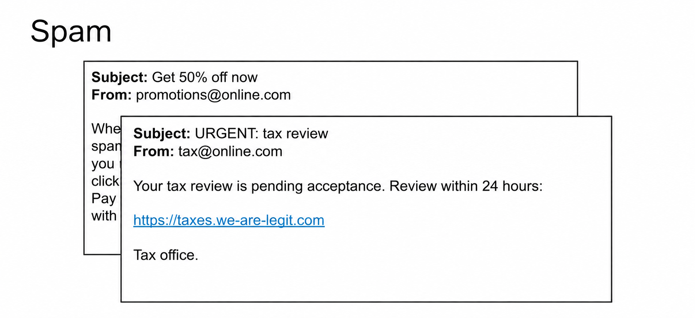
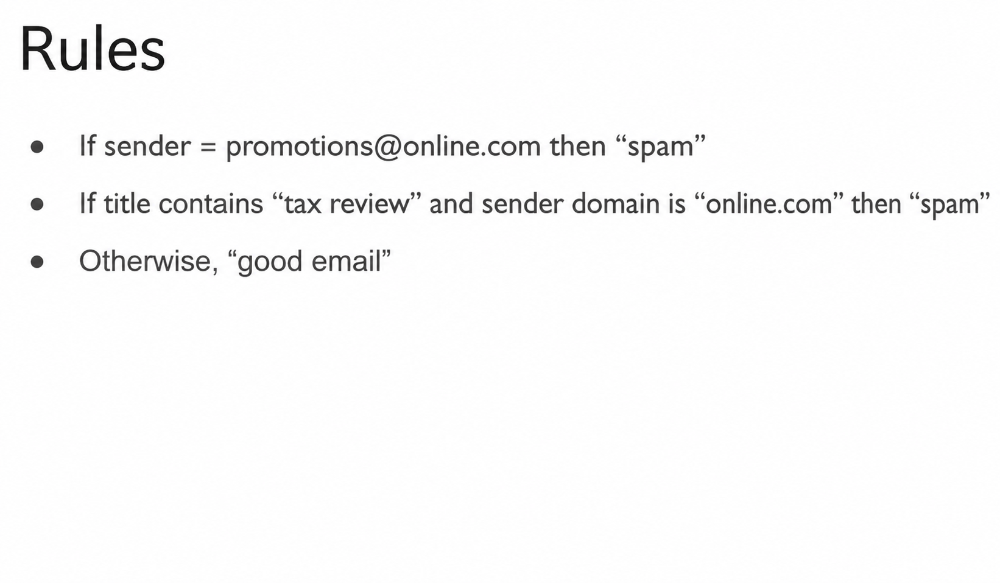
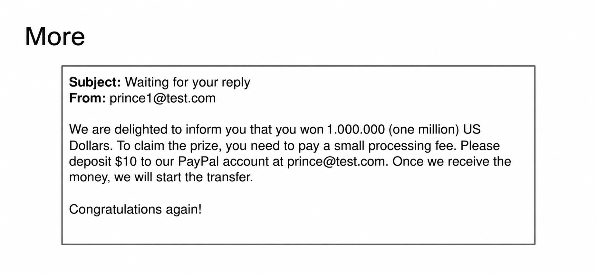
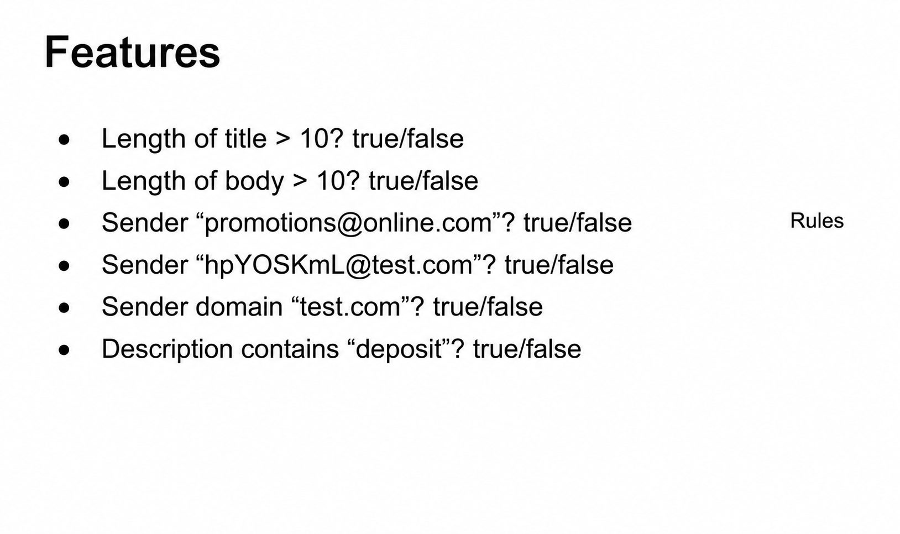
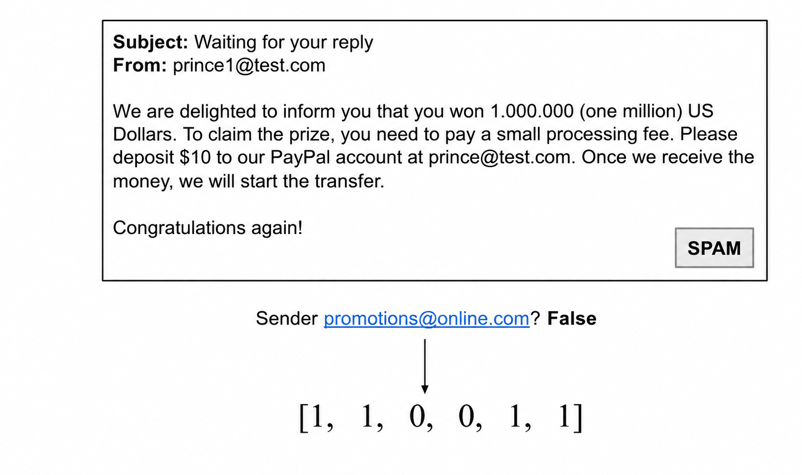
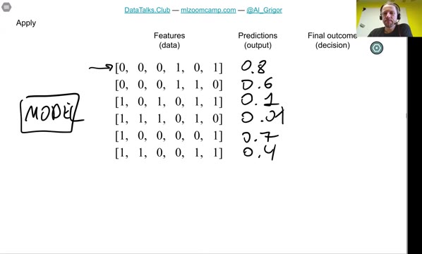
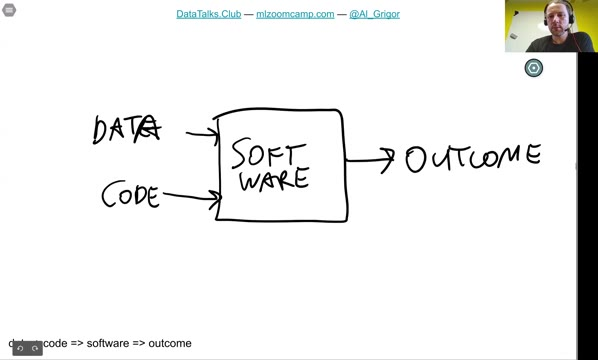
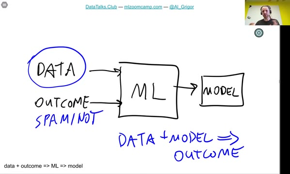

# ML vs Rule-Based Systems

In this lesson we compare machine learning with the traditional way of solving such problems: rule-based systems. We walk through a spam detection example and see why rules become hard to maintain, and how machine learning solves the same problem differently.

## A spam detection problem

Imagine we have an email system. People use it to talk to colleagues, do work-related things and chat with friends. Each row in the system is an email. Everything works well - until users start complaining about unsolicited emails: promotions about discounts they never subscribed to, or even fraudulent messages that try to trick people into sending money.

We want to fight these emails. The plan: add a spam folder and send everything that is spam there. To do this we need a classifier - something that classifies each email into spam or not spam.

## The rule-based approach

We look at the spam messages and try to find patterns: what makes a spam message spam? For example, we may notice that:

- All emails from `promotions@online.com` are spam.
- If the title contains "tax review" and the sender domain is "online.com", the message is also spam.

We turn these observations into rules, write them down in Python and deploy the system:

It works - for a while. Then people start complaining about other kinds of unsolicited messages, for example a "prize" email that asks you to pay a small fee and deposit $10 to some account. We analyze it, notice that all these spam messages contain the word "deposit", and add a new rule: if the body contains the word "deposit", mark the message as spam.

That works fine for a little while too - until a genuine user, Pedro, writes about the deposit he paid and wants to get back. His legitimate email contains the word "deposit", so our system incorrectly marks it as spam.

So we do the analysis again, come up with more rules to separate good emails containing "deposit" from bad ones, and encode them in Python. And we repeat this over and over. Spam keeps changing, so the rules need to be updated constantly. We write more and more code, and at some point it becomes a nightmare to maintain: every time we change something, things break in different places.

This is the moment to ask: is there another tool for solving this problem? That tool is machine learning.

## The machine learning approach

With machine learning we solve the problem differently, in three steps:

1. Get the data - in our case, the emails.
2. Extract features from the emails - characteristics we can use to describe them.
3. Train the model on these features, then use it to classify new messages into spam and not spam.

### Step 1: Get data

Email providers typically have a "spam" button: a user clicks it and the email goes to the spam folder. This is a source of labeled data. Users tell us which messages are spam, so we can take all our emails - the spam ones and the good ones - together with their labels, and use them to train a model.

### Step 2: Define and calculate features

Features describe each email with numbers. They can be very simple, for example:

- Is the length of the title greater than 10? True or false.
- Is the length of the body greater than 10? True or false.
- Is the sender `promotions@online.com`? True or false.
- And so on.

Notice that many of these features come directly from the rules we had before - the particular sender, the domain, the word "deposit". It is actually a good idea to start with a rule-based system and not jump into machine learning immediately: the rules you learn along the way become features for the machine learning system.

Our example has six features. Each of them can only take two values - true or false - so they are called binary features. We encode true as 1 and false as 0.

Now we can encode every email as a vector of feature values. For the spam email below: the title is longer than 10 characters (1), the body is long (1), the sender is not `promotions@online.com` (0), it is not the hard-to-read sender (0), the sender domain is "test.com" (1), and the body contains the word "deposit" (1). And because the user marked this email as spam, the target is 1.

We do this for every email until we have a dataset: the feature values for each email plus the target variable - spam or not spam.

### Step 3: Train and use the model

We take this dataset and put it into a machine learning algorithm: the features and the target variable go in, and a model comes out. Training is sometimes also called fitting a model.

Once the model is trained, we can use it to classify messages. For each message, the model outputs a prediction - and this prediction is a probability. For example:

- 0.8 - 80% likely that this message is spam.
- 0.6 - probably spam.
- 0.1 - probably not spam.
- 0.01 - very unlikely to be spam.

To actually make a decision - put an email in the spam folder or not - we define a threshold. For example: if the predicted probability is greater than or equal to 0.5 (more than 50% chance of being spam), we put the message in the spam folder. Everything predicted as spam goes to the spam folder, everything else goes to the inbox.

## Rules vs machine learning

Let's summarize the difference between the two approaches.

In a rule-based system, we extract rules ourselves and write them in code. The data (emails) and the code together form the software, and the software produces the outcome: spam or not spam. The rules are hard-coded - and, as we saw, such a system becomes difficult to maintain.

In machine learning, the roles flip. The outcome - spam or not spam - becomes the input to the machine learning algorithm, together with the data. The algorithm produces a model. Then, for cases where we don't know the outcome, we take the data and the model, and the model produces the prediction.

So in usual software we hard-code the outcome in the code. In machine learning the outcome is the input, and the rules are learned automatically from data.

In the next lesson we talk about supervised machine learning: price prediction and spam detection - the two examples we have seen so far - are both examples of it.

## Materials

- [Slides](https://www.slideshare.net/AlexeyGrigorev/ml-zoomcamp-12-ml-vs-rulebased-systems)

## Notes

The difference between ML and Rule-Based systems is explained with the example of a **spam filter**.

Traditional Rule-Based systems are based on a set of **characteristics** (keywords, email length, etc.) that identify an email as spam or not. As spam emails keep changing over time the system needs to be upgraded making the process untractable due to the complexity of code maintenance as the system grows.

ML can be used to solve this problem with the following steps:

### 1. Get data 
Emails from the user's spam folder and inbox give examples of spam and non-spam.

### 2. Define and calculate features
Rules/characteristics from rule-based systems can be used as a starting point to define features for the ML model. The value of the target variable for each email can be defined based on where the email was obtained from (spam folder or inbox).

Each email can be encoded (converted) to the values of its features and target.

### 3. Train and use the model
A machine learning algorithm can then be applied to the encoded emails to build a model that can predict whether a new email is spam or not spam. The **predictions are probabilities**, and to make a decision it is necessary to define a threshold to classify emails as spam or not spam. 

<table>
   <tr>
      <td>⚠️</td>
      <td>
         The notes are written by the community.  
         If you see an error here, please create a PR with a fix.
      </td>
   </tr>
</table>

* [Notes from Peter Ernicke](https://knowmledge.com/2023/09/10/ml-zoomcamp-2023-introduction-to-machine-learning-part-2/)
