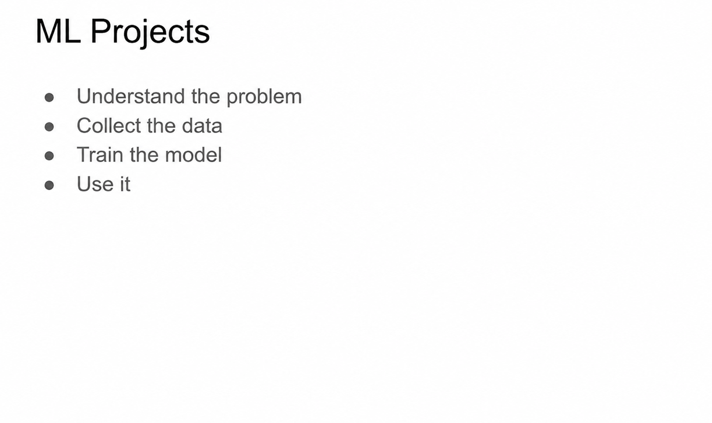
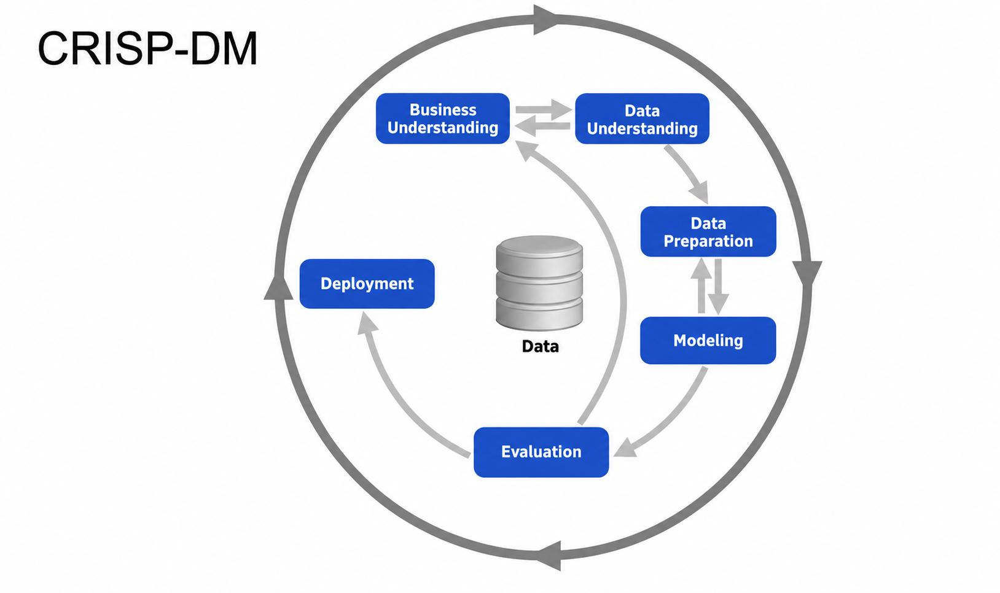
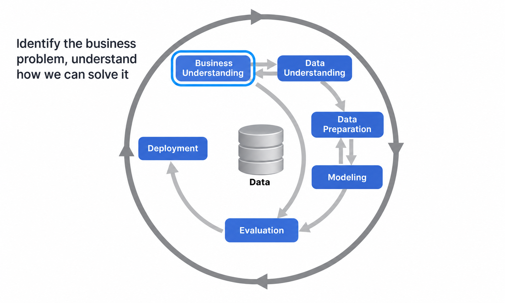
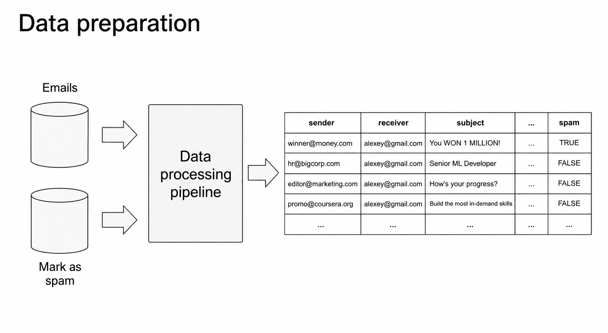

# CRISP-DM

In this lesson we step back from the machine learning itself and look at the big picture: how machine learning projects are organized. We go through a methodology called CRISP-DM, which describes the entire process from understanding the problem to deployment, and map each step to our spam detection example.

## Why a process?

For a machine learning project we need to understand the problem, collect the data, train the model and use it. Methodologies like CRISP-DM help us organize these steps in a way that is manageable, so we know what needs to happen and in which order.

To remind you the spam detection system from the previous lessons: we get an email, extract features from it, put them into the model, and the model gives a score to each email. If the score is higher than 50%, the email goes to the spam folder; otherwise it goes to the inbox. We will map this project to the methodology.

CRISP-DM stands for Cross-Industry Standard Process for Data Mining. It is a methodology that describes how machine learning projects should be organized. It is old - it was invented in the 90s - but it stood the test of time: after 25+ years it can still be used today, almost without modifications.

The process has six steps. Let's go through each of them.

## Step 1: Business understanding

The goal of this step is to identify the problem we want to solve.

For our spam example: the problem is that users complain about spam. First, we want to understand to what extent it is a problem - do a lot of users complain, or is it just one user? This helps us understand how impactful the project is and whether it is worth investing time into it.

We also need to ask ourselves an important question: do we actually need machine learning? Often we don't. If we have a hammer, everything looks like a nail - but maybe we will be fine with a simple rule-based system or a heuristic, without investing a lot of time and resources into a machine learning system.

If we decide to go with machine learning, we need to formulate the goal in a measurable way. Not just "we want to reduce the number of spam messages", but "we want to reduce the amount of spam by 50%". Some number needs to be attached to the KPI - otherwise, how do we later say whether the project was successful?

## Step 2: Data understanding

Machine learning needs data: if there is no data, there is no machine learning. In this step we understand what data is available, whether it is enough, and how we can get what is missing - maybe buy a data source, or start collecting data ourselves.

For the spam case, we have the "spam" button: users mark unwanted messages and the messages go to the spam folder. Questions we need to ask:

- Does this data source really work? What happens when a user clicks the button - do we always track and record the clicks?
- Is the data reliable? Maybe users mark messages as spam when they aren't actually spam. If we train on such data, our model will learn to mimic this behavior and also mark non-spam as spam. So we often need to manually analyze the data and see if it is good enough.
- Is the data large enough? If we only have 10 records, we cannot do much. A valid output of this step can be "we're not ready yet - we first need to collect a few thousand records".

It happens that in this step we learn new things about the problem, and this changes our understanding from step 1. That's fine: the steps are connected, and we can go back and revise the business understanding, then come back.

## Step 3: Data preparation

At this point we know we have enough good data. Now we transform it in such a way that it can be put into a machine learning algorithm. This usually means:

- Extracting features from the raw data.
- Cleaning the data and removing noise - for example, cases where users accidentally marked good messages as spam.
- Building data pipelines: a sequence of steps that takes the raw data, applies transformations, and produces clean data.
- Converting the data to a tabular format - something we can put into a machine learning model.

For our spam detection system: we have all the emails and the spam marks, and the pipeline puts everything together into a table where we clearly see the sender, the receiver, the subject, the body, and - most importantly - the target variable.

From this table we extract features - like "does the body contain the word deposit" - and get the feature vectors. The last column of each vector is the target: spam or not.

This is exactly the format we talked about in the previous lesson: the feature matrix X and the target y.

## Step 4: Modeling

Once the data is in this format, we can train the model - this is where the actual machine learning happens. We try different models and select the best one. There are many models: logistic regression, decision trees, neural networks and many more - we will talk about them throughout this course.

Often we discover at this step that the features we extracted are not sufficient, or that there are data issues we need to fix. So we quite often go back to the data preparation step, adjust something there, and make the model better.

How exactly we choose the best model is the topic of the next lesson.

## Step 5: Evaluation

We selected the best model - now we need to measure how well it performs. We go back to the business understanding step and remember the goal we set: reduce the amount of spam by 50%. We apply the model and ask ourselves: have we reached the goal? Did our metrics improve? If we reduced spam by 30% instead of 50%, is 30% good enough?

If things don't work, we can do a retrospective: maybe the goal we set was not achievable. Then we either go back and start another iteration using everything we learned, or we conclude that the project is hopeless and stop working on it.

## Step 6: Deployment

If everything works well, we deploy: we roll out the model to production, to all the users.

In practice, evaluation and deployment often come together. The framework is from the 90s - back then evaluation came first and deployment after. Today, we often evaluate models through deployment: we deploy the model and see how well it does. This is called online evaluation - we test the model on real users. Usually not on all of them: we take, say, 5% of users, evaluate the model on them, and if it works well, we roll it out to the remaining users.

At this step the focus shifts from machine learning to engineering. We want to make sure the service is monitored, maintainable, and reliable - all the best engineering practices come into the picture here, because once deployed, the service has to work.

## Iterate

We don't deploy and forget. We always iterate: we start simple, learn from the feedback, and improve.

It is a very good idea to always start simple. Do something very simple on the first iteration, quickly move through all the steps, evaluate, deploy - and learn from the process. You see that even a simple model is useful. Then go back to business understanding and make the model a bit more complex. Two or three fast iterations like this don't waste a lot of time, and you can quickly show that what you're working on is useful.

To summarize the six steps:

1. Business understanding: define a measurable goal. Ask: do we need ML?
2. Data understanding: do we have the data? Is it good?
3. Data preparation: transform data into a table, so we can put it into ML
4. Modeling: to select the best model, use the validation set
5. Evaluation: validate that the goal is reached
6. Deployment: roll out to production to all the users

In the next lesson we zoom into the modeling step - the course is, after all, about machine learning - and talk about how to select the best model.

## Materials

- [Slides](https://www.slideshare.net/AlexeyGrigorev/ml-zoomcamp-14-crispdm)

## Notes

CRISP-DM, which stands for Cross-Industry Standard Process for Data Mining, is an open standard process model that describes common approaches used by data mining experts. It is the most widely-used analytics model. Conceived in 1996, it became a European Union project under the ESPRIT funding initiative in 1997. The project was led by five companies: Integral Solutions Ltd (ISL), Teradata, Daimler AG, NCR Corporation and OHRA, an insurance company: 

1. **Business understanding:** An important question is do we need ML for the project. The goal of the project has to be measurable. 
2. **Data understanding:** Analyze available data sources, and decide if more data is required. 
3. **Data preparation:** Clean data, remove noise applying pipelines, and convert the data to a tabular format, so we can put it into ML.
4. **Modeling:** Train different models and choose the best one. Considering the results of this step, it is proper to decide if it is required to add new features or fix data issues. 
5. **Evaluation:** Measure how well the model is performing and if it solves the business problem. 
6. **Deployment:** Roll out to production to all the users. The evaluation and deployment often happen together - **online evaluation**. 

It is important to consider how well maintainable the project is.
  
In general, ML projects require many iterations.

**Iteration:** 
* Start simple
* Learn from the feedback
* Improve

<table>
   <tr>
      <td>⚠️</td>
      <td>
         The notes are written by the community.  
         If you see an error here, please create a PR with a fix.
      </td>
   </tr>
</table>

* [Notes from Peter Ernicke](https://knowmledge.com/2023/09/12/ml-zoomcamp-2023-introduction-to-machine-learning-part-4/)
