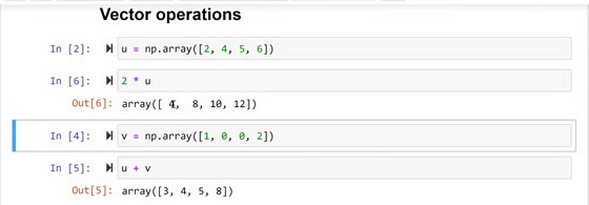
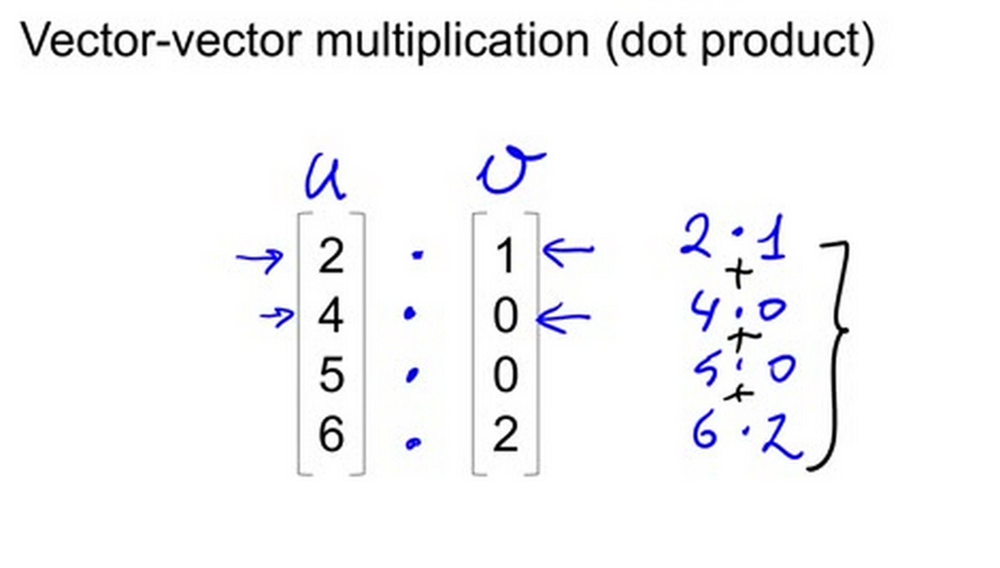
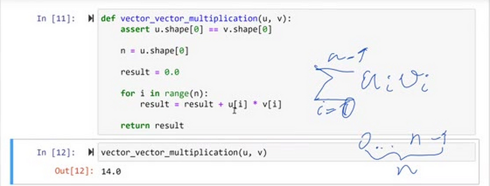
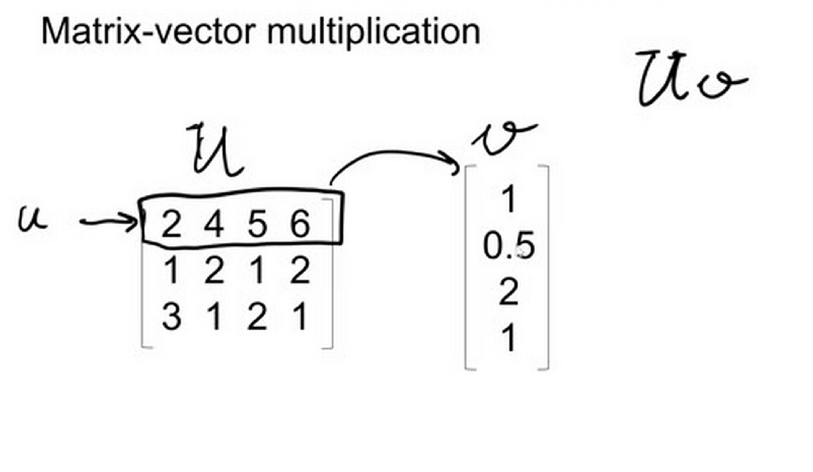
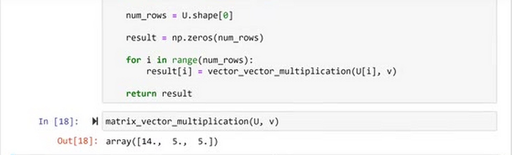
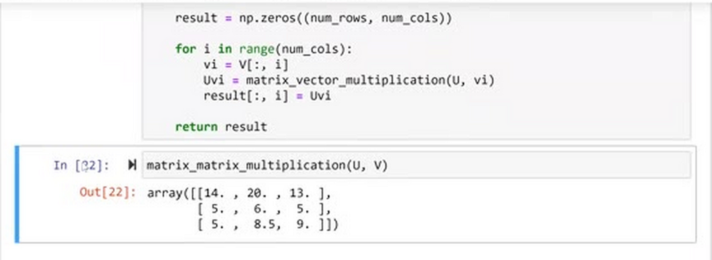
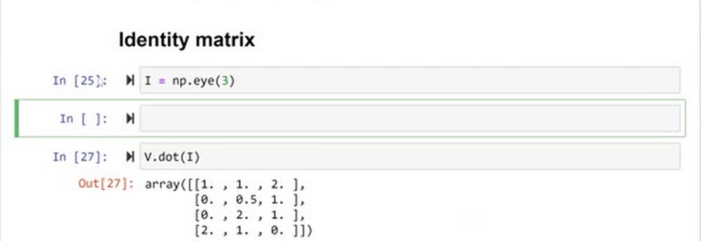
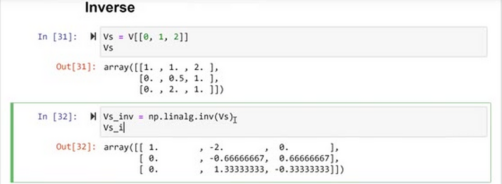

# Linear Algebra Refresher

In this lesson we go through the basics of linear algebra: simple vector operations, the three kinds of multiplication (vector-vector, matrix-vector and matrix-matrix), and two special objects - the identity matrix and the inverse. All of this comes back in the regression module, where we use it to derive linear regression.

The plan:

- Vector operations
- Multiplication
  - Vector-vector multiplication
  - Matrix-vector multiplication
  - Matrix-matrix multiplication
- Identity matrix
- Inverse

## Vector operations

Let's start with the simple vector operations. First, multiplication of a vector by a number (a scalar): we multiply every element of the vector by that number. If we multiply the vector `u` by 2:

```python
>>> u = np.array([2, 4, 5, 6])
>>> 2 * u
array([ 4,  8, 10, 12])
```

You see that the way I write a vector here is like a column - a column vector. This is just notation: in linear algebra, vectors are typically written as columns, not rows. In NumPy, if you remember, the vectors are actually rows. It doesn't matter for the math - it's the convention for how things are usually written.

Addition works element-wise: we add each element of the first vector to the corresponding element of the second vector:

```python
>>> v = np.array([1, 0, 0, 2])
>>> u + v
array([3, 4, 5, 8])
```



This is pretty much the same as we saw in the previous lecture in NumPy: element-wise addition, and multiplication by 2 is element-wise multiplication. So what happens in linear algebra here is exactly what NumPy does.

## Multiplication

Now the more interesting things: how we multiply vector by vector, matrix by vector, and matrix by matrix.

### Vector-vector multiplication

Vector-vector multiplication is also called the dot product, or sometimes the inner product.

Again we have two vectors, `u` and `v`. We want to multiply vector `u` by vector `v` - and this is not the element-wise multiplication we do in NumPy. Remember, in NumPy `u * v` multiplies elements element-wise:

```python
>>> u * v
array([ 2,  0,  0, 12])
```

The dot product, on the other hand, produces a number. The way we compute it: we multiply each element of `u` with the corresponding element of `v`, and then we sum the results:

```
u·v = 2·1 + 4·0 + 5·0 + 6·2 = 2 + 12 = 14
```



The formula: we have a sum that goes over all elements of our vectors, from 1 to n, where n is the dimension of the vector, and inside we multiply the i-th element of `u` with the i-th element of `v`.

The way we usually write the dot product in linear algebra may not be intuitive at first: `u` is a column vector, and we write `u` transposed next to `v`. The transpose operation turns columns into rows - so we have a row vector times a column vector, and this is just notation for the dot product.

Let's implement it. We want a function that does vector-vector multiplication for two vectors `u` and `v`:

```python
def vector_vector_multiplication(u, v):
    assert u.shape[0] == v.shape[0]
    
    n = u.shape[0]
    
    result = 0.0

    for i in range(n):
        result = result + u[i] * v[i]
    
    return result
```

First we make sure that the vectors have the same size - otherwise multiplication doesn't make sense. We check the shape of the vectors: `shape` is the size of the array, and for our vector the first element of this tuple is 4. That's what the assertion does.

Then, in the formula, `n` is the number of elements the vector has: `n = u.shape[0]`. Since NumPy arrays are indexed from 0 to n - 1, our loop goes from 0 to n - 1. Inside the loop is the part that corresponds to the inside of the sum - the product `u[i] * v[i]` - and the loop itself is the sum. At the end we return the result.

Let's test it:

```python
>>> vector_vector_multiplication(u, v)
14.0
```

It returns 14, like we calculated by hand.



Of course, in NumPy there is already a function that does this - `dot`:

```python
>>> u.dot(v)
14
```

The result is also 14.

### Matrix-vector multiplication

Now let's say we have a matrix `U` (capital letter) that we want to multiply by a vector `v` (lowercase).

The way we do it: take the first row of the matrix `U` and multiply it with the vector `v`. This is a row - so this is exactly the situation from the dot product: a row vector times a column vector. Let's call the rows `U[0]`, `U[1]` and so on, using the same notation as in NumPy.



For each row of the matrix we do a vector-vector multiplication with `v`, and these results together are the answer. So if `U` has k rows - `U[0]` to `U[k-1]` - the result is k dot products, one per row. Of course the dimensionality should match: each row of `U` and the vector `v` must have the same number of elements, say n.

Let's implement this in Python. We already have the matrix `U`:

```python
>>> U = np.array([
...     [2, 4, 5, 6],
...     [1, 2, 1, 2],
...     [3, 1, 2, 1],
... ])
>>> U.shape
(3, 4)
```

```python
def matrix_vector_multiplication(U, v):
    assert U.shape[1] == v.shape[0]
    
    num_rows = U.shape[0]
    
    result = np.zeros(num_rows)
    
    for i in range(num_rows):
        result[i] = vector_vector_multiplication(U[i], v)
    
    return result
```

First, make sure the dimensionalities match. We are interested in the number of columns of `U` - remember, the number of columns in `U` is the dimensionality of each row of `U`, and it should match the number of elements in `v`.

The number of rows of `U` is the dimensionality of the resulting vector: there are three rows in the matrix, so the result of the multiplication has three elements. We initialize it with zeros and then, for each row, compute the vector-vector multiplication with `v` and put it into the result.

Let's test it:

```python
>>> matrix_vector_multiplication(U, v)
array([14.,  5.,  5.])
```

We get a one-dimensional array - a vector. And again, in NumPy we don't want to write this function every time: we use `dot` again. Because we invoke it on a two-dimensional array, NumPy knows it needs to do a matrix-vector product:

```python
>>> U.dot(v)
array([14,  5,  5])
```

Same result.



### Matrix-matrix multiplication

Finally, matrix-matrix multiplication. We have a matrix `U` and a matrix `V`, and we want to compute `U` times `V`.

What we do here: take the matrix `V` and break it down into multiple columns - `V[:, 0]`, `V[:, 1]`, `V[:, 2]`. Then for each column of `V`, we multiply the entire matrix `U` by this column. Each such multiplication is a matrix-vector multiplication - we just learned how to do that. The results become the columns of the new matrix.

So matrix-matrix multiplication is represented as a bunch of matrix-vector multiplications. The resulting matrix has the number of rows coming from `U` and the number of columns coming from `V`.

Let's implement it. We already have `U`; here is `V`:

```python
>>> V = np.array([
...     [1, 1, 2],
...     [0, 0.5, 1], 
...     [0, 2, 1],
...     [2, 1, 0],
... ])
```

```python
def matrix_matrix_multiplication(U, V):
    assert U.shape[1] == V.shape[0]
    
    num_rows = U.shape[0]
    num_cols = V.shape[1]
    
    result = np.zeros((num_rows, num_cols))
    
    for i in range(num_cols):
        vi = V[:, i]
        Uvi = matrix_vector_multiplication(U, vi)
        result[:, i] = Uvi
    
    return result
```

The assertion checks that we can multiply a row of `U` with a column of `V` - that's the check that makes sure the multiplication makes sense. The result is a matrix of zeros with the number of rows coming from `U` and the number of columns coming from `V`. Then we loop over the columns of `V`, take the i-th column - all the rows, i-th column - compute the matrix-vector multiplication `U` times this column, and put the result into the i-th column of the result matrix. At the end we return the result.

Let's test it:

```python
>>> matrix_matrix_multiplication(U, V)
array([[14. , 20. , 13. ],
       [ 5. ,  6. ,  5. ],
       [ 5. ,  8.5,  9. ]])
```

And again you probably figured out the pattern by now: if we want to multiply two matrices with plain NumPy, we use the `dot` method:

```python
>>> U.dot(V)
array([[14. , 20. , 13. ],
       [ 5. ,  6. ,  5. ],
       [ 5. ,  8.5,  9. ]])
```

Same result - which means our implementation works.



This way we expressed matrix-matrix multiplication using matrix-vector multiplication, and in turn we expressed matrix-vector multiplication with vector-vector multiplication.

## Identity matrix

There are two more topics. The first one is the identity matrix - usually denoted with a capital `I`.

The identity matrix is a square matrix where on the diagonal we have ones, and zeros everywhere else:

```python
>>> I = np.eye(3)
>>> I
array([[1., 0., 0.],
       [0., 1., 0.],
       [0., 0., 1.]])
```

Why is it useful? When we take any matrix - say `U` - and multiply it by `I` (of course, the dimensions should match), we get `U` back. And it doesn't matter on which side we put it - we still get `U` back.

The identity matrix is like the number one: if we multiply any number by one, we get the number back, no matter on which side. This is the same thing, but for matrices.

In NumPy we create it with the `eye` function: we specify the dimension, and it gives us a matrix with ones on the diagonal and zeros everywhere else. Our `V` has three columns, so to test we need a 3-by-3 identity matrix:

```python
>>> V.dot(I)
array([[1. , 1. , 2. ],
       [0. , 0.5, 1. ],
       [0. , 2. , 1. ],
       [2. , 1. , 0. ]])
```

We multiplied `V` by `I` and got `V` back.



## Inverse

The identity matrix is useful for explaining what a matrix inverse is. Let's say we have a matrix `A`. The inverse of `A`, usually written `A⁻¹`, is a matrix such that when we multiply it by `A`, we get `I`.

First of all, only square matrices - matrices where the number of rows equals the number of columns - have an inverse. Our `V` is 4-by-3, so let's take its first three rows to get a square matrix:

```python
>>> Vs = V[[0, 1, 2]]
>>> Vs
array([[1. , 1. , 2. ],
       [0. , 0.5, 1. ],
       [0. , 2. , 1. ]])
```

To compute the inverse we use a method from NumPy called `inv`. It lives in the `linalg` package, which stands for linear algebra:

```python
>>> Vs_inv = np.linalg.inv(Vs)
>>> Vs_inv
array([[ 1.        , -2.        ,  0.        ],
       [ 0.        , -0.66666667,  0.66666667],
       [ 0.        ,  1.33333333, -0.33333333]])
```



And when we multiply the inverse by the matrix, what we get is the identity matrix:

```python
>>> Vs_inv.dot(Vs)
array([[1., 0., 0.],
       [0., 1., 0.],
       [0., 0., 1.]])
```

This will be quite useful for linear regression - we will see that in the next module.

That's all for this lesson. In the next one - the last of this section - we will talk about Pandas, a library for manipulating tabular data in Python.

## Materials

- [Slides](https://www.slideshare.net/AlexeyGrigorev/ml-zoomcamp-18-linear-algebra-refresher)
- [Get a visual understanding of matrix multiplication](http://matrixmultiplication.xyz/)
- [Overview of matrix multiplication functions in python/numpy](https://github.com/MemoonaTahira/MLZoomcamp2022/blob/main/Notes/Week_1-intro_to_ML_linear_algebra/Notes_for_Chapter_1-Linear_Algebra.ipynb)

## Notes

### Linear Algebra Refresher
* Vector operations
* Multiplication
  * Vector-vector multiplication
  * Matrix-vector multiplication
  * Matrix-matrix multiplication
* Identity matrix
* Inverse

### Vector operations
~~~~python
u = np.array([2, 7, 5, 6])
v = np.array([3, 4, 8, 6])

# addition 
u + v

# subtraction 
u - v

# scalar multiplication 
2 * v
~~~~
### Multiplication

#####  Vector-vector multiplication

~~~~python
def vector_vector_multiplication(u, v):
    assert u.shape[0] == v.shape[0]
    
    n = u.shape[0]
    
    result = 0.0

    for i in range(n):
        result = result + u[i] * v[i]
    
    return result
~~~~

#####  Matrix-vector multiplication

~~~~python
def matrix_vector_multiplication(U, v):
    assert U.shape[1] == v.shape[0]
    
    num_rows = U.shape[0]
    
    result = np.zeros(num_rows)
    
    for i in range(num_rows):
        result[i] = vector_vector_multiplication(U[i], v)
    
    return result
~~~~

#####  Matrix-matrix multiplication

~~~~python
def matrix_matrix_multiplication(U, V):
    assert U.shape[1] == V.shape[0]
    
    num_rows = U.shape[0]
    num_cols = V.shape[1]
    
    result = np.zeros((num_rows, num_cols))
    
    for i in range(num_cols):
        vi = V[:, i]
        Uvi = matrix_vector_multiplication(U, vi)
        result[:, i] = Uvi
    
    return result
~~~~
### Identity matrix

~~~~python
I = np.eye(3)
~~~~
### Inverse
~~~~python
V = np.array([
    [1, 1, 2],
    [0, 0.5, 1], 
    [0, 2, 1],
])
inv = np.linalg.inv(V)
~~~~

<table>
   <tr>
      <td>⚠️</td>
      <td>
         The notes are written by the community. <br>
         If you see an error here, please create a PR with a fix.
      </td>
   </tr>
</table>

* [Notes from Peter Ernicke - Part 1/3](https://knowmledge.com/2023/09/15/ml-zoomcamp-2023-introduction-to-machine-learning-part-9/)
* [Notes from Peter Ernicke - Part 2/3](https://knowmledge.com/2023/09/15/ml-zoomcamp-2023-introduction-to-machine-learning-part-10/)
* [Notes from Peter Ernicke - Part 3/3](https://knowmledge.com/2023/09/15/ml-zoomcamp-2023-introduction-to-machine-learning-part-11/)
