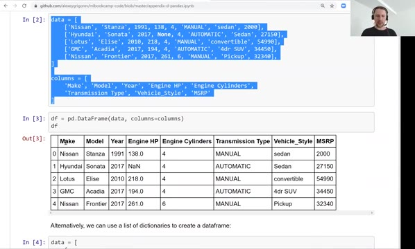
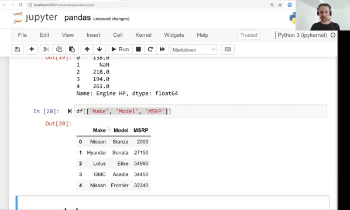
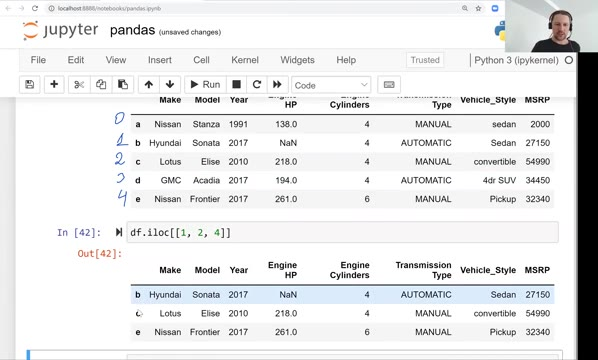
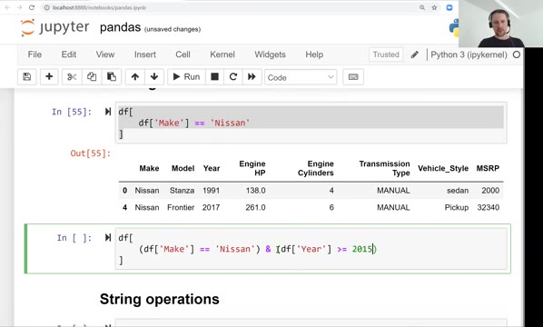
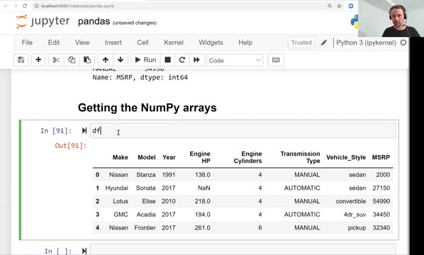
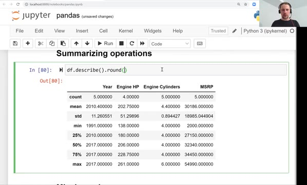
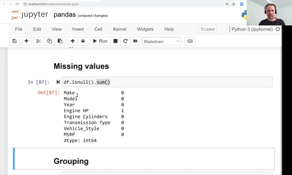
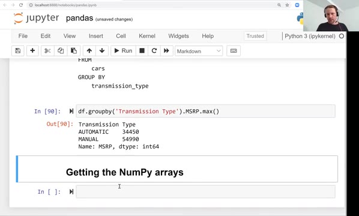

# Introduction to Pandas

In this lesson - the last one of the first session - we go through Pandas, a library for manipulating tabular data in Python. We look at DataFrames and Series, indexing and accessing elements, element-wise operations, filtering, string operations, summarizing operations, missing values and grouping.

## DataFrames

By now you have hopefully installed everything, including Pandas. Like in case of NumPy, we use an alias and import it as `pd`:

```python
import numpy as np
import pandas as pd
```

The main abstraction, the main data structure we use in Pandas, is called a DataFrame - it's basically a table.

Let's create a simple one. We will use a dataset prepared specifically for this session: a subset of the dataset we will use in the next module for predicting the price of a car. It has five cars, and the characteristics of a car: make, model, year, engine horsepower, number of cylinders, transmission type, vehicle style, and the price (MSRP).

The data is a list of lists - each sublist is a row in the table, so each row is a car - and a separate variable that defines the column names:

```python
data = [
    ['Nissan', 'Stanza', 1991, 138, 4, 'MANUAL', 'sedan', 2000],
    ['Hyundai', 'Sonata', 2017, None, 4, 'AUTOMATIC', 'Sedan', 27150],
    ['Lotus', 'Elise', 2010, 218, 4, 'MANUAL', 'convertible', 54990],
    ['GMC', 'Acadia',  2017, 194, 4, 'AUTOMATIC', '4dr SUV', 34450],
    ['Nissan', 'Frontier', 2017, 261, 6, 'MANUAL', 'Pickup', 32340],
]

columns = [
    'Make', 'Model', 'Year', 'Engine HP', 'Engine Cylinders',
    'Transmission Type', 'Vehicle_Style', 'MSRP'
]
```

Now we can turn it into a DataFrame using the `DataFrame` constructor. If we create it just with the data, Pandas doesn't know what the columns are, so it simply numbers them 0, 1, 2, 3, 4. We can tell it what each column means with the special parameter `columns`:

```python
df = pd.DataFrame(data, columns=columns)
```

```python
>>> df
      Make     Model  Year  Engine HP  Engine Cylinders Transmission Type  \
0   Nissan    Stanza  1991      138.0                 4            MANUAL   
1  Hyundai    Sonata  2017        NaN                 4         AUTOMATIC   
2    Lotus    Elise  2010      218.0                 4            MANUAL   
3      GMC    Acadia  2017      194.0                 4         AUTOMATIC   
4   Nissan  Frontier  2017      261.0                 6            MANUAL   

  Vehicle_Style   MSRP  
0         sedan   2000  
1         Sedan  27150  
2  convertible  54990  
3       4dr SUV  34450  
4        Pickup  32340  
```



Usually I call DataFrames `df`.

This is not the only way to create a DataFrame. A more compact way is a list of dictionaries, where we explicitly specify the value for each column - this is the first car, this is the second car, and so on:

```python
data = [
    {
        "Make": "Nissan",
        "Model": "Stanza",
        "Year": 1991,
        "Engine HP": 138.0,
        "Engine Cylinders": 4,
        "Transmission Type": "MANUAL",
        "Vehicle_Style": "sedan",
        "MSRP": 2000
    },
    {
        "Make": "Hyundai",
        "Model": "Sonata",
        "Year": 2017,
        "Engine HP": None,
        "Engine Cylinders": 4,
        "Transmission Type": "AUTOMATIC",
        "Vehicle_Style": "Sedan",
        "MSRP": 27150
    },
    # ...
]
```

If we create a DataFrame from a list of dictionaries, we don't need to provide the column names: Pandas infers them from the dictionaries, using the keys as column names.

Our DataFrame is really small, but when I read a larger DataFrame, the first thing I do is look at the first couple of rows - for that I use the `head` method. It returns the first rows; we can also ask for only the first two:

```python
>>> df.head(n=2)
```

This is one of the first things I do after loading a DataFrame, say from a CSV file or from a SQL query.

## Series

Every column of a DataFrame is a Series - a special abstraction from Pandas. A DataFrame is a table, and the table consists of multiple Series: each column is a Pandas Series.

If we want to access a particular column, we can use the dot notation:

```python
>>> df.Make
```

Another option is the brackets notation - we specify the name of the column we want to extract:

```python
>>> df['Engine HP']
0    138.0
1      NaN
2    218.0
3    194.0
4    261.0
Name: Engine HP, dtype: float64
```

These two ways are the same. But as you see, some columns have spaces in their names - for these, the dot notation doesn't work. When we have spaces or minuses in the name, the only way to access the column is with the brackets notation.

We can also access multiple columns at the same time. Say we want a subset of our DataFrame that contains only Make, Model and MSRP. We put a list inside the brackets - that's why we have double brackets - and in this list we say which columns we want:

```python
>>> df[['Make', 'Model', 'MSRP']]
      Make     Model   MSRP
0   Nissan    Stanza   2000
1  Hyundai    Sonata  27150
2    Lotus    Elise  54990
3      GMC    Acadia  34450
4   Nissan  Frontier  32340
```

It returns a DataFrame that has only these three columns.



We can add a new column using the same brackets notation - for example, a column `id` with numbers:

```python
>>> df['id'] = [1, 2, 3, 4, 5]
```

Now there is a column called `id`, which we can extract, and also replace with a different set of values if we want. To delete a column, we use the `del` operator - very similar to dictionaries, where we also use `del` to remove something:

```python
>>> del df['id']
```

## Index

You may have noticed the numbers on the left of the DataFrame: 0, 1, 2 and so on. These are ids of the rows - this is how we can refer to each row - and this is called the index.

If we look at the index, we see it's a RangeIndex that starts with 0 and stops at 5 - and 5 is not included, as usual it's exclusive - so the index goes from 0 to 4:

```python
>>> df.index
RangeIndex(start=0, stop=5, step=1)
```

All the Series of this DataFrame have the same index. If we access `df['Make']`, we see the same numbers on the left - this is the index of the Series, and it's the same index that the DataFrame has.

Using this index we can access the elements of the DataFrame. Let's say we want to access elements by their index - we use `loc`, which stands for location:

```python
>>> df.loc[1]
```

This gives us the row indexed by 1, and we can also return multiple rows at once.

We can actually replace the index and use something else instead. For example, let's use letters:

```python
>>> df.index = ['a', 'b', 'c', 'd', 'e']
```

```python
>>> df
      Make     Model  Year  Engine HP  Engine Cylinders Transmission Type  \
a   Nissan    Stanza  1991      138.0                 4            MANUAL   
b  Hyundai    Sonata  2017        NaN                 4         AUTOMATIC   
c    Lotus    Elise  2010      218.0                 4            MANUAL   
d      GMC    Acadia  2017      194.0                 4         AUTOMATIC   
e   Nissan  Frontier  2017      261.0                 6            MANUAL   

  Vehicle_Style   MSRP  
a         sedan   2000  
b         Sedan  27150  
c  convertible  54990  
d       4dr SUV  34450  
e        Pickup  32340  
```

Now the old `df.loc[[1, 2]]` no longer works - there are no records with these ids in the index. We need to use, say, `b` and `c` to refer to these particular records.

However, we can still refer to elements by their positional index - the usual index like in lists or NumPy arrays, referring to a position from 0 to 4. For that, instead of `loc` we use `iloc`:

```python
>>> df.iloc[[1, 2, 4]]
      Make     Model  Year  Engine HP  Engine Cylinders Transmission Type  \
b  Hyundai    Sonata  2017        NaN                 4         AUTOMATIC   
c    Lotus    Elise  2010      218.0                 4            MANUAL   
e   Nissan  Frontier  2017      261.0                 6            MANUAL   

  Vehicle_Style   MSRP  
b         Sedan  27150  
c  convertible  54990  
e        Pickup  32340  
```



The index of the DataFrame is still the letter index, but we use the positional index to refer to the records.

Now we have this strange letter index - what if we want to come back to the usual sequential index? We use the function `reset_index`. It resets the index to the sequential one, and keeps the previous index by creating a new column called `index` with the old values. If we don't need the values of the old index, we use the parameter `drop=True`:

```python
>>> df = df.reset_index(drop=True)
```

Note that this function doesn't change the DataFrame - it creates a new one with the same data but the new index. That's why we reassign it to the `df` variable, overwriting the old DataFrame.

## Element-wise operations

Like in NumPy, when we have an array we can apply an operation to all elements - if we multiply an array by 2, all elements get multiplied by 2. We can do the same with Pandas:

```python
>>> df['Engine HP'] * 2
0    276.0
1      NaN
2    436.0
3    388.0
4    522.0
Name: Engine HP, dtype: float64
```

This is exactly the same as with a NumPy array. About that `NaN` there: it denotes a missing number - for the Hyundai Sonata we don't know the engine horsepower, so this value is missing. Multiplying doesn't do anything to it, but the rest of the values get multiplied.

We can divide, multiply, do everything we can do in NumPy - but here we operate on Pandas Series, not on NumPy arrays. The main difference between the two is that a Series has an index and a name. Under the hood, Pandas actually uses NumPy.

Like in NumPy, we also have comparison operations. For example, which cars were created in or after 2015:

```python
>>> df['Year'] >= 2015
0    False
1     True
2    False
3     True
4     True
Name: Year, dtype: bool
```

## Filtering

This brings us to filtering. Say we want to look at all the cars that were manufactured after 2015. There are two parts here. The part inside the brackets is the condition - it returns a new boolean Series with False and True values. And the brackets themselves look at the values that are True and return only those rows:

```python
>>> df[
...     df['Year'] >= 2015
... ]
```

We get a new DataFrame which contains only the rows we want.

If we want to find all Nissan cars, we write a condition on the Make column - and there are two cars manufactured by Nissan:

```python
>>> df[
...     df['Make'] == 'Nissan'
... ]
     Make     Model  Year  Engine HP  Engine Cylinders Transmission Type  \
0  Nissan    Stanza  1991      138.0                 4            MANUAL   
4  Nissan  Frontier  2017      261.0                 6            MANUAL   

  Vehicle_Style   MSRP  
0         sedan   2000  
4        Pickup  32340  
```



We can combine conditions. Let's get cars that are manufactured by Nissan and produced after 2015. We combine the two conditions using the logical and operation, `&`:

```python
>>> df[
...     (df['Make'] == 'Nissan') & (df['Year'] >= 2015)
... ]
     Make     Model  Year  Engine HP  Engine Cylinders Transmission Type  \
4  Nissan  Frontier  2017      261.0                 6            MANUAL   

  Vehicle_Style   MSRP  
4        Pickup  32340  
```

It's just one record.

## String operations

String operations are something that NumPy doesn't have: NumPy is mostly used for processing numbers, while in Pandas we will often have strings. So Pandas has a couple of useful things for manipulating strings.

Take the `Vehicle_Style` column. We see that values are not uniform: there is "sedan" with a capital S and "sedan" with a lowercase letter. It would be nice to standardize it.

In Python there is a method of the string class called `lower`, which takes a string and turns it into lowercase. We want to apply this function to every element of the Series. For that we use this thing called `str`, which allows invoking string methods on the entire Series:

```python
>>> df['Vehicle_Style'].str.lower()
0          sedan
1          sedan
2    convertible
3        4dr suv
4         pickup
Name: Vehicle_Style, dtype: object
```

All the capital letters turned into lowercase.

Another thing we can do is replace all the spaces with underscores - sometimes you have underscores, sometimes you don't, and this is a typical pre-processing step when you work with text. In case of a usual string, there is a method called `replace`: the first argument is what you want to replace and the second is what to replace it with:

```python
>>> 'machine learning zoomcamp'.replace(' ', '_')
'machine_learning_zoomcamp'
```

We can apply it to the Series the same way, via `str`:

```python
>>> df['Vehicle_Style'].str.replace(' ', '_')
```

Note that these operations don't modify the Series - they return a new Series with the modifications. We can chain them: first replace spaces, then lowercase:

```python
>>> df['Vehicle_Style'] = df['Vehicle_Style'].str.replace(' ', '_').str.lower()
```

Here we use the assignment operator to overwrite the column with this clean version, and now the values in the DataFrame are uniform.



## Summarizing operations

Like in NumPy, where we have element-wise operations and summarizing operations, we have the same summarizing operators in Pandas.

Take the MSRP column - the price. We can look at the maximal value, the minimal value, or the mean - the average number:

```python
>>> df.MSRP.mean()
30186.0
>>> df.MSRP.max()
54990
```

In addition, there is a useful function called `describe`, which reports all the useful statistics at once: how many records there are (the size of the Series), the mean value, the standard deviation, the minimal value, the percentiles - 25th, 50th, 75th - and the max:

```python
>>> df.MSRP.describe()
count        5.000000
mean     30186.000000
std      18985.037730
min       2000.000000
25%      27150.000000
50%      32340.000000
75%      34450.000000
max      54990.000000
Name: MSRP, dtype: float64
```

We can do the same thing for the entire DataFrame - just call `describe` on it. It finds all the numerical columns (we have four of them: year, engine horsepower, engine cylinders and price - of course it cannot compute the mean of Make or Model) and computes the summary statistics for them:

```python
>>> df.describe().round(2)
      Year  Engine HP  Engine Cylinders      MSRP
count  5.00       4.00              5.00      5.00
mean   2010.40     202.75              4.40  30186.00
std      11.26      51.30              0.89  18985.04
min    1991.00     138.00              4.00   2000.00
25%    2010.00     180.00              4.00  27150.00
50%    2017.00     206.00              4.00  32340.00
75%    2017.00     228.75              4.00  34450.00
max    2017.00     261.00              6.00  54990.00
```



I also often use `round` here to round everything to two decimal points - it makes the output more compact.

For string columns - we call them categorical variables - there are also useful operations. Say we have the Make column, and we want to understand how many unique values there are: we see there are two Nissans, but the rest are unique. To calculate the number of unique values we use `nunique`:

```python
>>> df.Make.nunique()
4
```

We can apply it to the entire DataFrame, and it tells us the number of unique values for all columns - for example, there are only two transmission types, MANUAL and AUTOMATIC:

```python
>>> df.nunique()
Make                 4
Model                5
Year                 3
Engine HP            4
Engine Cylinders     2
Transmission Type    2
Vehicle_Style        4
MSRP                 5
dtype: int64
```

## Missing values

We mentioned that `NaN` is a missing value, and when it comes to machine learning we don't want to have missing values - we want to know how many of them there are and do something with them.

For that we can use the `isnull` function. It returns a new DataFrame where for each cell it says True if the value is missing, and False if it's not:

```python
>>> df.isnull().sum()
Make                 0
Model                0
Year                 0
Engine HP            1
Engine Cylinders     0
Transmission Type    0
Vehicle_Style        0
MSRP                 0
dtype: int64
```



Seeing a table of Trues and Falses is not always super useful, so what we usually do is call the `sum` method on it. The sum is applied to each column, and it tells us how many missing values there are in each column. Here: one missing value in Engine HP, and none anywhere else.

## Grouping

The next to last thing is grouping - `groupby`. If you know SQL, this will look familiar. Say we have a query like this:

```sql
SELECT 
    transmission_type,
    AVG(MSRP)
FROM
    cars
GROUP BY
    transmission_type
```

Translated to human language: we want to compute the average price per transmission type - what is the mean price for all manual cars and for all automatic cars. We group by transmission type and, within each group, compute the average.

In Pandas we have a method called `groupby`, where we specify which column we want to group by. Then we select the column we are interested in - MSRP, which is the price, manufacturer suggested retail price - and compute the aggregation we want. Here, let's take the maximum price per transmission type:

```python
>>> df.groupby('Transmission Type').MSRP.max()
Transmission Type
AUTOMATIC    34450
MANUAL       54990
Name: MSRP, dtype: int64
```



We could use `mean`, `min` or `max` - any of the summarizing operations.

## Getting the NumPy arrays

Everything in Pandas is backed by NumPy. Say we have the MSRP Series, and we want to get the underlying NumPy array - we just use the `values` field:

```python
>>> df.MSRP.values
array([ 2000, 27150, 54990, 34450, 32340])
```

The last useful thing: we created our DataFrame from a list of dictionaries, and sometimes we need to convert a Pandas DataFrame back to this form. For this we use the method `to_dict`, and specify that we want to do it per record with `orient='records'`. It gives us a list of dictionaries that we can do something with - like save it to a file:

```python
>>> df.to_dict(orient='records')
[{'Make': 'Nissan',
  'Model': 'Stanza',
  'Year': 1991,
  'Engine HP': 138.0,
  'Engine Cylinders': 4,
  'Transmission Type': 'MANUAL',
  'Vehicle_Style': 'sedan',
  'MSRP': 2000},
 # ...
 ]
```

That's it for this session. The next video is not a lesson - it's a summary of everything we learned during this first session. See you soon.

## Materials

- [Notebook](https://github.com/alexeygrigorev/mlbookcamp-code/blob/master/appendix-d-pandas.ipynb)
- [Pandas Cheat sheet](https://www.datacamp.com/community/blog/python-pandas-cheat-sheet)

## Notes

<table>
   <tr>
      <td>⚠️</td>
      <td>
         The notes are written by the community. <br>
         If you see an error here, please create a PR with a fix.
      </td>
   </tr>
</table>

* [Notes from Peter Ernicke - Part 1/2](https://knowmledge.com/2023/09/16/ml-zoomcamp-2023-introduction-to-machine-learning-part-12/)
* [Notes from Peter Ernicke - Part 2/2](https://knowmledge.com/2023/09/17/ml-zoomcamp-2023-introduction-to-machine-learning-part-13/)
