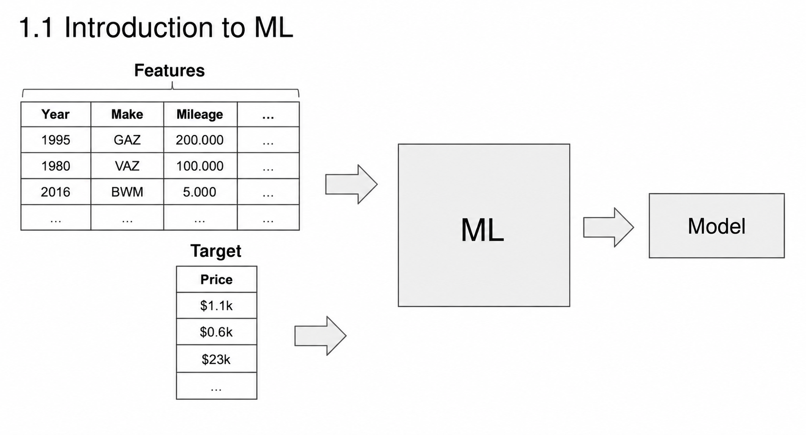
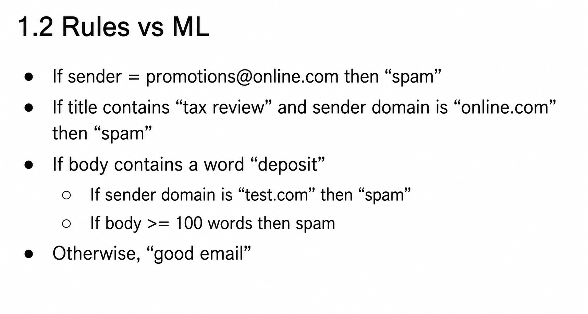
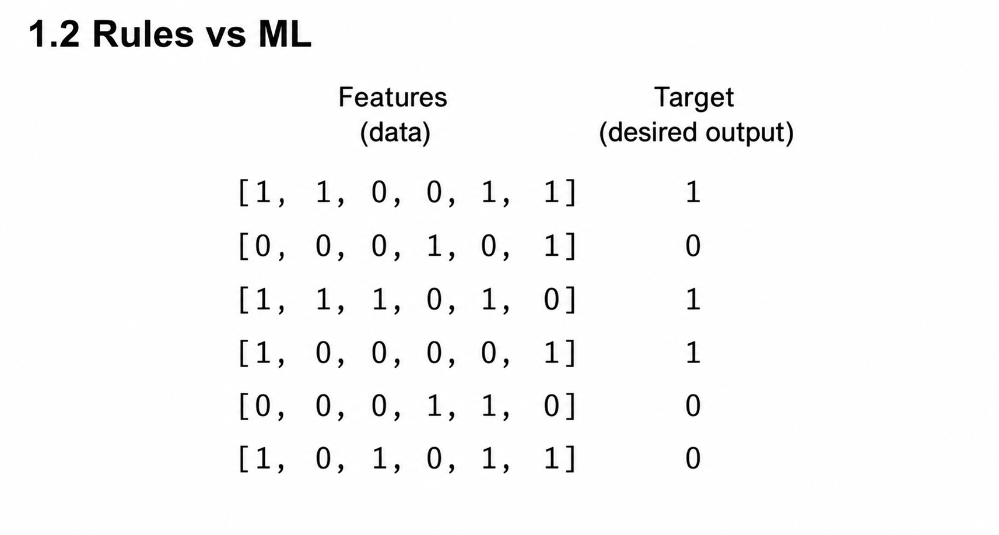
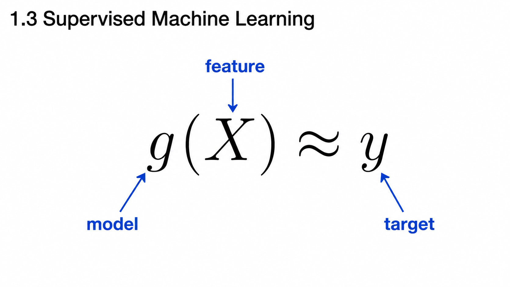
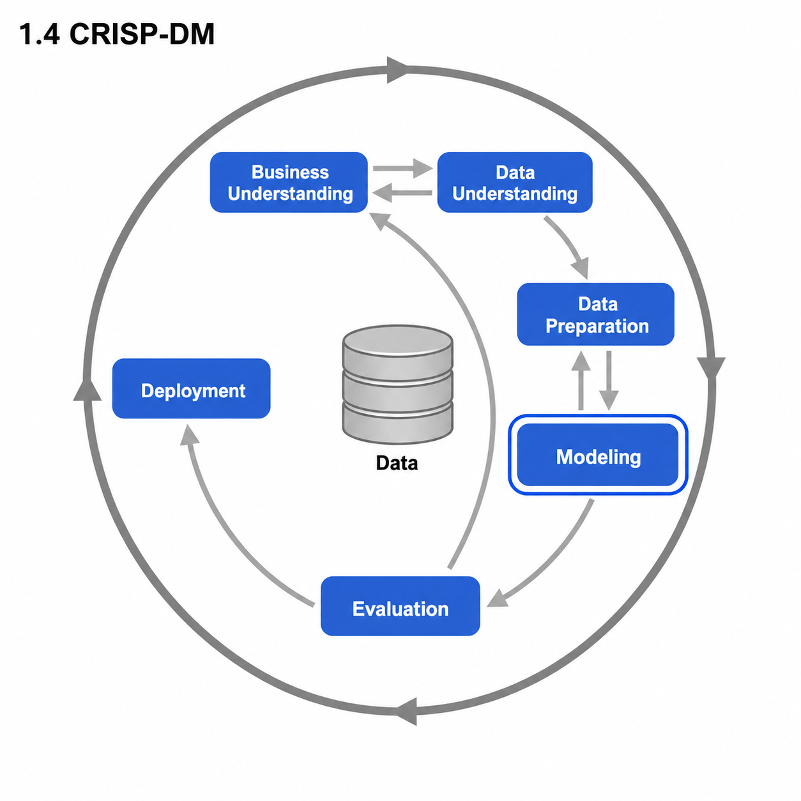
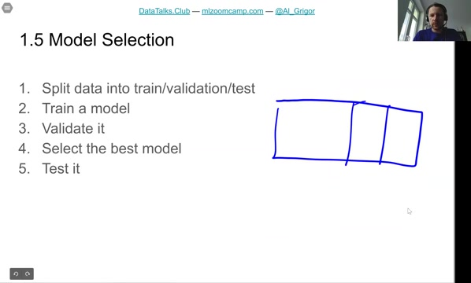

# Summary

This is the last video of the first session - a short recap of everything we learned: the introduction to machine learning, ML versus rule-based systems, supervised learning, CRISP-DM, model selection, the environment, and the three Python libraries NumPy, linear algebra and Pandas.

## Introduction to Machine Learning

In the first lesson we did a quick introduction to machine learning using the car price prediction example. We wanted to predict the price of a car, and we looked at what we need for that:

- Features - all the characteristics of a car that we have, everything we know about the car.
- The target variable - what we want to predict about the car.

These things go to a machine learning algorithm, and the output is a model. The model is something we can use later to predict the prices of cars for which we don't know the price: if there is a car for which we don't know the price, we put its features into the model, and the model tells us that the price for this car is, say, $23,000.

## ML vs Rule-Based Systems

In the second lesson we compared rule-based systems with machine learning. In a rule-based system, humans come up with rules and then convert these rules into a programming language like Python. Using the spam prediction example: we would manually analyze the data, try to extract patterns from it and code them as rules. Over time this becomes quite messy.

With machine learning we don't have this problem, because we don't need to encode the rules manually. The models extract patterns themselves: they just look at the training data - our features - and use statistics and mathematics to figure out what patterns are present in these features, and what we can use to make a decision whether something is spam or not.

## Supervised Machine Learning

Then we talked about the concept of supervised learning. Both examples we saw - price prediction and spam prediction - are supervised learning, because we have the target variable. The y is our target variable: the information we want to predict. We know it for the training data, and this is what we want to learn.

Our model, g, extracts patterns from data. Then, for data for which we don't know the answer - this is our feature matrix, capital X - we apply the model and get something that is as close as possible to the target.

## CRISP-DM and the bigger picture

We also talked about the bigger picture: this g from X to y is only a part of the entire process. In addition to modeling there are many other steps: business understanding, where we need to understand the problem; understanding the data sources; preparing the data - because X needs to be prepared in the right form so we can actually put it into a model; and, of course, the deployment step - without it even the best model is not useful. Machine learning is just a part of the entire process.

## Model Selection

Then we talked in more detail about the modeling step and the process of selecting the best model. We take the entire dataset and split it into three parts. We use one part - the validation dataset - for finding the best model, and another part - the test dataset - to make sure we don't accidentally pick a model that got good results just by chance.

## Setting up the Environment

Lesson six wasn't really a lesson - you just needed to install the environment. For this course we need NumPy, Pandas and scikit-learn, and the easiest option to get all of these is to install Anaconda. For those who are interested, it's also possible to create a server on AWS or another cloud provider and use it for the course.

## Introduction to NumPy

In lesson seven we talked about NumPy, a library in Python for manipulating numerical data - numerical arrays. We went through the operations that are useful for data science and machine learning: creating arrays, multi-dimensional and randomly generated arrays, element-wise operations, comparison operations and summarizing operations.

## Linear Algebra Refresher

In lesson eight we talked about linear algebra - multiplication:

- Vector-vector multiplication: two vectors u and v.
- Matrix-vector multiplication: one is a matrix, denoted with a capital U, the other is a vector, a small v.
- Matrix-matrix multiplication.

In all these cases it's possible to express matrix-matrix multiplication as a set of matrix-vector multiplications, and matrix-vector multiplication as a bunch of vector-vector multiplications. And we saw that if you implement everything in code, the formulas no longer look scary.

## Introduction to Pandas

Finally, in lesson nine we talked about Pandas, a library in Python for processing tabular data - basically dealing with tables. The main abstraction there is a DataFrame, and we talked about the different operations we can do with it.

## What's next

That's what we covered in this session. It was more abstract: what you can do with machine learning, what you can do with NumPy, what you can do with Pandas.

In the next session we will do something practical: we will actually work on a project and predict the price of a car. Stay tuned.

## Materials

- [Slides](https://www.slideshare.net/AlexeyGrigorev/ml-zoomcamp-110-summary)

## Notes
---

### 📚 Summary of First Session - Machine Learning Zoomcamp

1. **🚗 Introduction to Machine Learning with Cars Data**  
   We start with data about cars, including characteristics (features) and prices (target). A Machine Learning (ML) model can be used to extract patterns from known information (data) about some cars in order to predict car prices based on their characteristics.

2. **🧠 Rules-Based Systems vs. Machine Learning**  
   - **Rules-Based Systems:** It is necessary to manually convert rules into code using a programming language and apply them to data. Extracting patterns manually can become complex and challenging.  
   - **Machine Learning:** Instead of manually coding rules, ML models automatically extract patterns from data using Mathematics and Statistics.

3. **🔍 Supervised Machine Learning**  
   In supervised learning, models learn from labeled data (with known outcomes) to make predictions on unseen data.

4. **🛠️ CRISP-DM (Cross Industry Standard Process for Data Mining)**  
   A structured methodology for organizing ML projects, consisting of the following steps:  
   - 💼 **Business Understanding**  
   - 🔎 **Data Understanding**  
   - 🧹 **Data Preparation**  
   - 🤖 **Modeling** (choosing and training models, then selecting the best one)  
   - 📊 **Evaluation**  
   - 🚀 **Deployment**  
   This process is iterative, allowing for continuous improvement.

5. **🏆 Model Selection**  
   Split data into training, validation, and test sets. Train different models, validate them, select the best performing one, and then test it on the test set to ensure generalization.

6. **💻 Setting Up the Environment**  
   Install necessary tools like Python, Numpy, Pandas, Matplotlib, Scikit-learn. Anaconda is the easiest option. Eventually create an AWS account for cloud resources.

7. **🔢 Introduction to Numpy**  
   Numpy is crucial for manipulating numerical data, providing efficient operations on arrays and matrices.

8. **🔗 Linear Algebra**  
   Covering all types of multiplication with vectors and matrices, including the creation of identity matrices using functions like `np.eye()`.

9. **📊 Introduction to Pandas**  
   Pandas is a Python library used for processing and analyzing tabular data efficiently.

---

<table>
   <tr>
      <td>⚠️</td>
      <td>
         The notes are written by the community.  
         If you see an error here, please create a PR with a fix.
      </td>
   </tr>
</table>
* [Notes from Maximilien Eyengue](https://github.com/maxim-eyengue/Python-Codes/blob/main/ML_Zoomcamp_2024/01_intro/Summary_Session_01.md)
