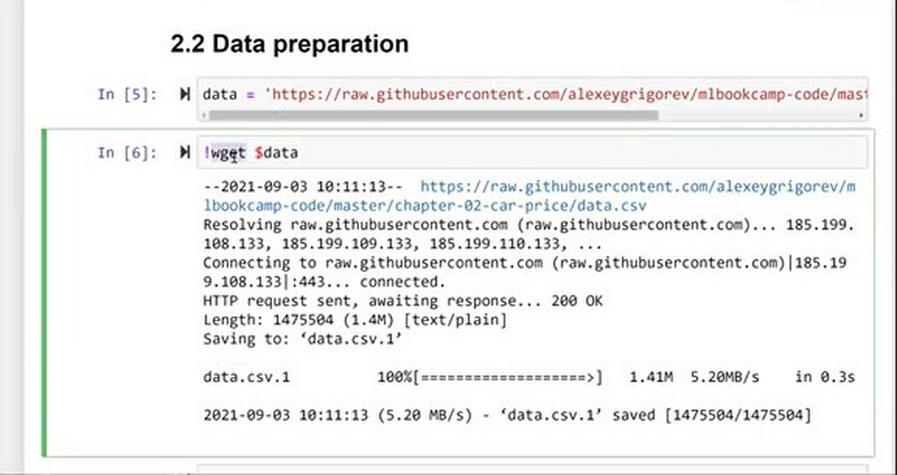
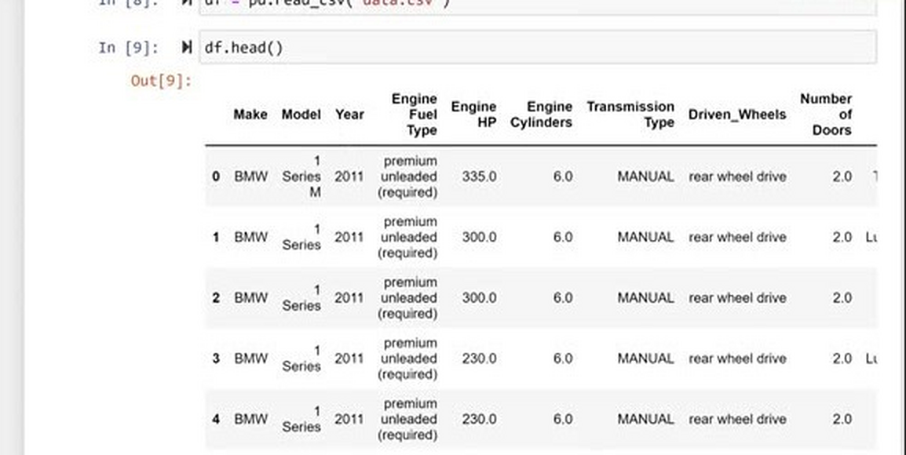
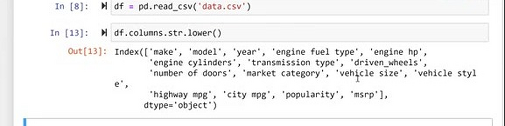
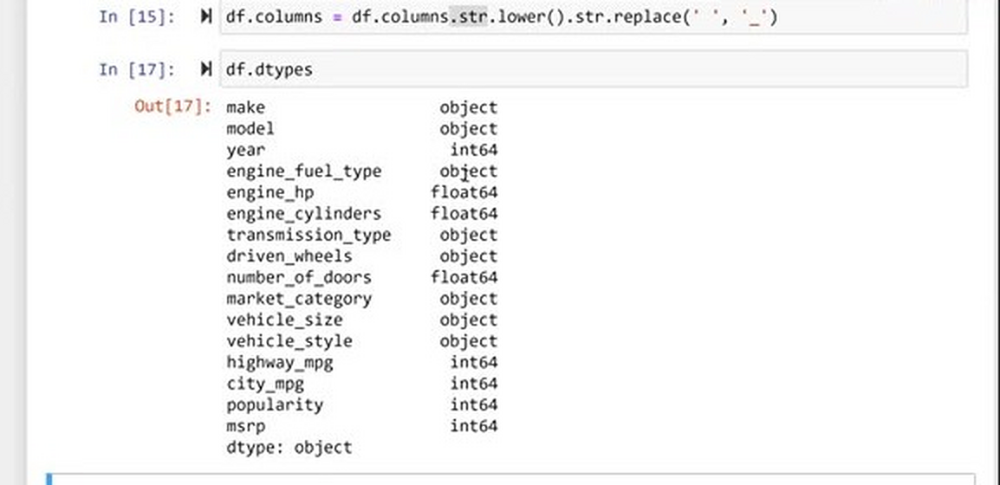
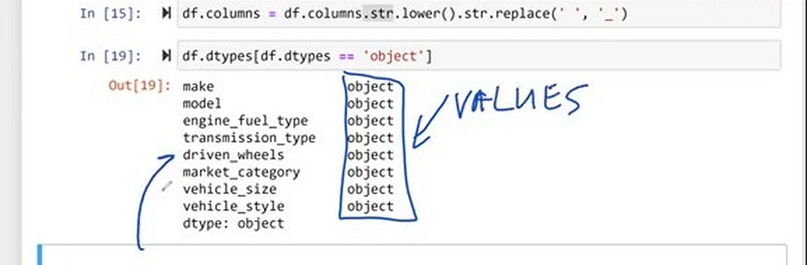
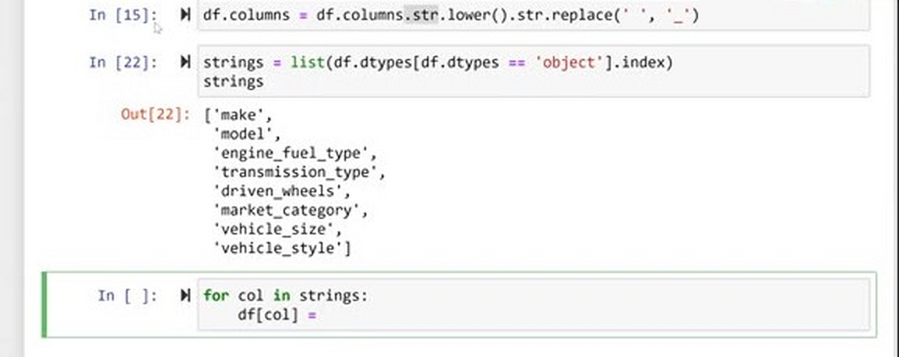
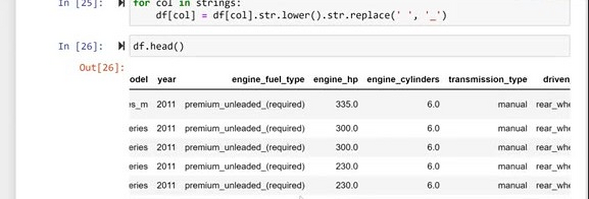

# Data preparation

Now we take the car price dataset and prepare it for machine learning: we
download it, load it with pandas, and make the column names and the string
values consistent.

## Getting the data

The dataset lives on Kaggle, but there is a copy in the mlbookcamp-code
repository, in the chapter-02-car-price folder. To get it, open data.csv,
grab the URL of the raw file and download it. You can use wget from the
terminal, or simply save the file from your browser:

```python
data = 'https://raw.githubusercontent.com/alexeygrigorev/mlbookcamp-code/master/chapter-02-car-price/data.csv'
!wget $data
```

wget fetches the file and puts it in the current directory, so now we have
data.csv locally.



## Loading the data

To load a CSV file in pandas we use the read_csv function. It reads the data
and returns a DataFrame:

```python
import pandas as pd

df = pd.read_csv('data.csv')
```

Usually the first thing I do after loading is look at the first five rows —
this is what head() is for:

```python
df.head()
```



We see the manufacturer of the car, the model, the year and a lot of other
characteristics. And this — MSRP, the manufacturer suggested retail price —
is what we want to predict.

## Making the column names consistent

Looking at the column names, there is some inconsistency. Sometimes there are
uppercase letters (Make, Model), sometimes there are spaces (Engine Fuel
Type), sometimes underscores (Driven_Wheels).

Spaces are the annoying part. Usually, if we want to access the transmission
type column, we cannot use dot notation — df.Transmission Type is a syntax
error. We have to use bracket notation instead, df['Transmission Type']. To
keep life simple, let's clean the names: make everything lowercase and
replace spaces with underscores.

In pandas, every DataFrame has the columns attribute, which contains the
names of the columns. It is an index — a special data structure in pandas,
very similar to a series — and like a series it has the str accessor for
doing string manipulations. So we can apply a string function to all the
column names at once:

```python
df.columns.str.lower()
```

We can also chain multiple string commands. The other one we want is
replace, to replace spaces with underscores:

```python
df.columns.str.lower().str.replace(' ', '_')
```

This gives us the new names:

```
Index(['make', 'model', 'year', 'engine_fuel_type', 'engine_hp',
       'engine_cylinders', 'transmission_type', 'driven_wheels',
       'number_of_doors', 'market_category', 'vehicle_size', 'vehicle_style',
       'highway_mpg', 'city_mpg', 'popularity', 'msrp'],
      dtype='object')
```

This alone changes nothing — we need to write the result back to the columns
attribute:

```python
df.columns = df.columns.str.lower().str.replace(' ', '_')
```

Now the column names are uniform: all lowercase, no spaces. Cleaner.



## Finding the string columns

The values have the same problem: sometimes they are all caps (BMW, MANUAL),
sometimes not. Let's normalize the string values the same way.

First we need to find out which columns are strings — we cannot apply string
methods to numbers. For that we use the dtypes attribute. It tells us, for
every column, what type it is:

```python
df.dtypes
```



The type we are interested in is object — in pandas, that is how strings are
stored. It can technically be other objects, but when we read data from a CSV
file, an object column is nothing else but strings.

To select only the columns of type object, we compare dtypes with 'object'.
This gives us a series where the values are the types and the index contains
the column names:

```python
df.dtypes[df.dtypes == 'object']
```

The values are all "object" — we are not interested in them. What we want are
the names, so we take the index of this series and convert it to a Python
list. No particular reason, it just looks nicer:

```python
strings = list(df.dtypes[df.dtypes == 'object'].index)
strings
```

```
['make',
 'model',
 'engine_fuel_type',
 'transmission_type',
 'driven_wheels',
 'market_category',
 'vehicle_size',
 'vehicle_style']
```





## Normalizing the string values

Now that we have all the string column names, we loop over them and apply the
same transformation we used for the column names: lowercase everything and
replace spaces with underscores, writing the result back to the DataFrame:

```python
for col in strings:
    df[col] = df[col].str.lower().str.replace(' ', '_')
```

After the loop the data looks cleaner. Everything is lowercase, and spaces in
values are replaced with underscores:

```python
df.head()
```



The dataset is prepared, and in the next lesson we take a closer look at it
with [exploratory data analysis](03-eda.md).

## Materials

[Slides](https://www.slideshare.net/AlexeyGrigorev/ml-zoomcamp-2-slides)

## Notes

**Pandas attributes and methods:** 

* `pd.read_csv(<file_path_string>)` -> read csv files 
* `df.head()` -> take a look of the dataframe 
* `df.columns` -> retrieve colum names of a dataframe 
* `df.columns.str.lower()` -> lowercase all the letters 
* `df.columns.str.replace(' ', '_')` -> replace the space separator 
* `df.dtypes` -> retrieve data types of all features 
* `df.index` -> retrieve indices of a dataframe

The entire code of this project is available in [this jupyter notebook](notebook.ipynb).

<table>
   <tr>
      <td>⚠️</td>
      <td>
         The notes are written by the community. <br>
         If you see an error here, please create a PR with a fix.
      </td>
   </tr>
</table>

* [Notes from Peter Ernicke](https://knowmledge.com/2023/09/18/ml-zoomcamp-2023-machine-learning-for-regression-part-1/)
