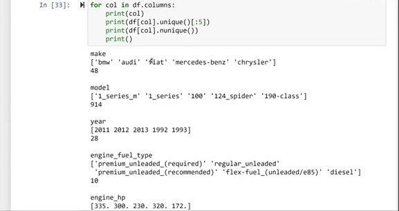
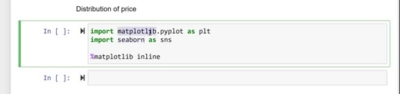
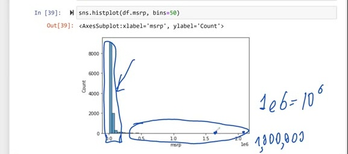
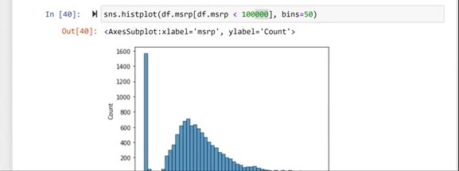
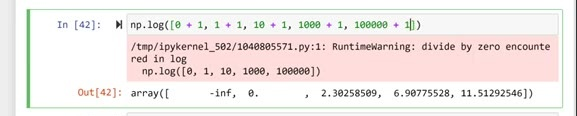
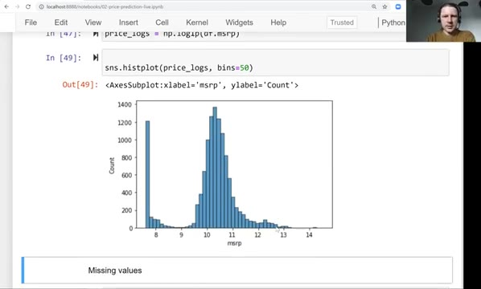
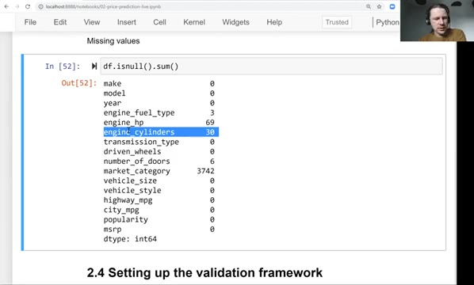

# Exploratory data analysis

In the previous lesson we prepared the columns of our DataFrame. Now we do
exploratory data analysis (EDA): we look at every column, see what kind of
values are there, and try to get a feeling for the data and the problem
before training a model.

## Looking at every column

We already know that some columns are strings and some are numbers. To see
what is inside each of them, we iterate over all columns and print some
statistics for every one: the column name, a few values, and the number of
unique values:

```python
for col in df.columns:
    print(col)
    print(df[col].unique()[:5])
    print(df[col].nunique())
    print()
```

unique() returns the unique values in a column — here we take the first five.
nunique() returns how many unique values there are. The output starts like
this:

```
make
['bmw' 'audi' 'fiat' 'mercedes-benz' 'chrysler']
48

model
['1_series_m' '1_series' '100' '124_spider' '190-class']
914

year
[2011 2012 2013 1992 1993]
28

engine_fuel_type
['premium_unleaded_(required)' 'regular_unleaded'
 'premium_unleaded_(recommended)' 'flex-fuel_(unleaded/e85)' 'diesel']
10

engine_hp
[335. 300. 230. 320. 172.]
356
```



Walking through the output: make is the manufacturer of a car — BMW, Audi,
Fiat, Mercedes-Benz, Chrysler, 48 of them in total. Model is more granular:
every manufacturer has multiple models, which is why there are 914 unique
values. Year is a numerical column with 28 different years. Engine fuel type
is the type of fuel the engine gets — diesel and others, ten types in total.
Engine horsepower says how powerful the engine is, and then we have the
number of cylinders, the transmission type, the driven wheels, the market
category, the vehicle size and style — all the characteristics we
potentially know about a car.

Highway mpg is how many miles the car can drive on a highway per gallon of
fuel, and city mpg is the same in the city. Popularity is something the
authors of the dataset computed: they looked at Twitter and counted how many
mentions a car had — the idea is that a more popular car has more mentions.
And finally MSRP: the price of a car. This is what we want to predict, and of
course there are many different values there.

## Distribution of price

The price column deserves a closer look. Looking at numbers is not very
informative — we don't see the big picture. So we visualize it. For plotting
we use two libraries: matplotlib, which is a low-level plotting library, and
seaborn, a library on top of it that makes things easier. The %matplotlib
inline line makes sure the plots are displayed in the notebook:

```python
import matplotlib.pyplot as plt
import seaborn as sns

%matplotlib inline
```



We want to see the distribution of prices — how many cars cost what. A
histogram shows exactly that: it splits the value range into buckets and
draws one bar per bucket, with the height showing how many values fall into
it. The bins parameter controls how many bars we get:

```python
sns.histplot(df.msrp, bins=50)
```



The 1e6 on the x axis is scientific notation: 10 to the power of 6, that is,
one million. And what we see is that a lot of prices are pretty cheap — most
of the cars are concentrated on the left. Then there are very few cars that
are super expensive: maybe one car costs 2 million, one costs 1.5 million,
and a few cost around a million. There are not so many of them, but they
have huge values.

This kind of distribution is called a long-tail distribution: most of the
data sits in one place, and a shallow tail stretches far to the right.
Long-tail distributions are very common for prices: most things are cheap
because that's what the general public can afford, but there are a few
super-expensive items for the few people who can buy them.

To see the shape better, we zoom in on prices below 100,000:

```python
sns.histplot(df.msrp[df.msrp < 100000], bins=50)
```



This is the left part of the previous histogram, and it is much easier to
read. There is a strange peak of cars that cost 1,000 — probably the minimal
price possible to put on the platform, which is why a bunch of cars cost
exactly that. Then the number of cars slowly grows up to around 25,000 —
about 700 cars cost that much — and after that it goes down as the price
grows. Except for that peak at 1,000, this is a pretty reasonable
distribution to expect for prices.

## Removing the long tail with a logarithm

While this distribution is not unexpected, it is not really good for machine
learning: the long tail will confuse the model and screw things up. We want
to get rid of it, and the usual trick is to apply the logarithm to the
price.

The logarithm compresses large values. For large numbers, the value of the
logarithm is not that large: going from 10 to 1,000 is a big jump, but the
increase between their logarithms is not that high. So the logarithm takes
very high values and makes them lower.

There is one problem with the plain logarithm: the logarithm of zero doesn't
exist. If there is a zero in the data, numpy complains — it returns negative
infinity and prints a warning:



In our case prices are always 1,000 or more, so this can't happen. Still,
it's pretty common to add one to all values before taking the logarithm,
just to be safe. NumPy has a shortcut for exactly this: log1p, where "1p"
stands for "plus one". It adds one to every value and then takes the
logarithm:

```python
np.log1p([0, 1, 10, 1000, 100000])
```

```
array([ 0.        ,  0.69314718,  2.39789527,  6.90875478, 11.51293546])
```

Let's apply it to the prices and call the result price_logs:

```python
price_logs = np.log1p(df.msrp)
```

Now we can plot the histogram of the logged prices:

```python
sns.histplot(price_logs, bins=50)
```



The tail is gone. All the large prices collapsed into a small area on the
right, and the cars for usual consumers are still concentrated around the
center. The shape now resembles a bell curve: a clear center of the
distribution that goes down on both the left and the right side. This is
called a normal distribution. (We still have that weird peak at 1,000, but
apart from it, it looks close to normal.)

This situation is ideal for models: models do much better when the target
variable looks like a normal distribution than with long-tail ones. That is
why we typically want to get rid of long tails, and applying the logarithm
to the price, like we just did, is one way of doing it.

## Missing values

One more thing before we finish: missing values. Some values in the dataset
were not recorded. When pandas doesn't have a value, it shows it as NaN —
not a number. We saw this when looking at the data: some cars have NaN in
the number of doors column.

To count how many missing values there are, we use isnull(): for every cell
it says whether the value in this cell is missing or not. In this form it is
not super useful, so we follow it with sum(), which sums across every column
and tells us the number of missing values in each:

```python
df.isnull().sum()
```

```
make                    0
model                   0
year                    0
engine_fuel_type        3
engine_hp              69
engine_cylinders       30
transmission_type       0
driven_wheels           0
number_of_doors         6
market_category      3742
vehicle_size            0
vehicle_style           0
highway_mpg             0
city_mpg                0
popularity              0
msrp                    0
dtype: int64
```



For quite a few cars we don't know the fuel type, the market category, the
horsepower or the number of cylinders. We need to keep this in mind: before
training the model, we will need to do something with these missing values.

To summarize: we looked at the different values in every column, then looked
at the distribution of the price, saw that it has a long tail and removed
its effect with a logarithm transformation, and finally checked the missing
values. In the next lesson we set up the validation framework, because
before training a model we need to make sure we can validate it — see
[setting up the validation framework](04-validation-framework.md).

## Materials

[Slides](https://www.slideshare.net/AlexeyGrigorev/ml-zoomcamp-2-slides)

## Notes

**Pandas attributes and methods:** 

* `df[col].unique()` -> return a list of unique values in the series 
* `df[col].nunique()` -> return the number of unique values in the series 
* `df.isnull().sum()` -> return the number of null values in the dataframe 

**Matplotlib and seaborn methods:**

* `%matplotlib inline` -> assure that plots are displayed in jupyter notebook's cells
* `sns.histplot()` -> show the histogram of a series 
   
**Numpy methods:**
* `np.log1p()` -> apply log transformation to a variable, after adding one to each input value.

Long-tail distributions usually confuse the ML models, so the recommendation is to transform the target variable distribution to a normal one whenever possible. 

The entire code of this project is available in [this jupyter notebook](https://github.com/alexeygrigorev/mlbookcamp-code/blob/master/chapter-02-car-price/02-carprice.ipynb).  

<table>
   <tr>
      <td>⚠️</td>
      <td>
         The notes are written by the community. <br>
         If you see an error here, please create a PR with a fix.
      </td>
   </tr>
</table>

* [Notes from Peter Ernicke](https://knowmledge.com/2023/09/19/ml-zoomcamp-2023-machine-learning-for-regression-part-2/)
