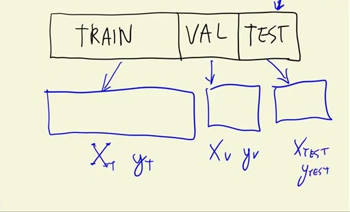
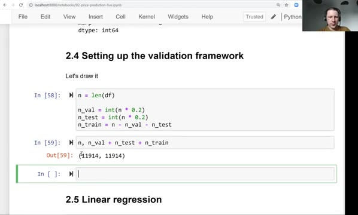
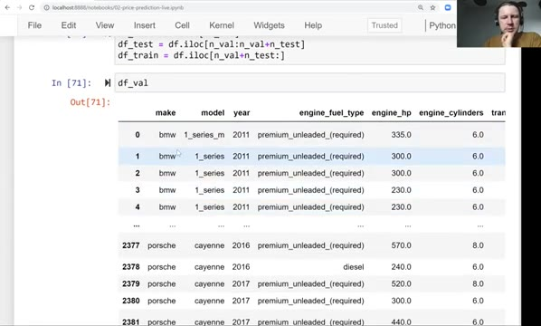
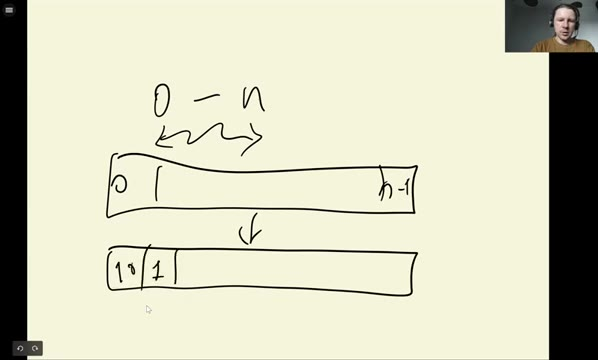
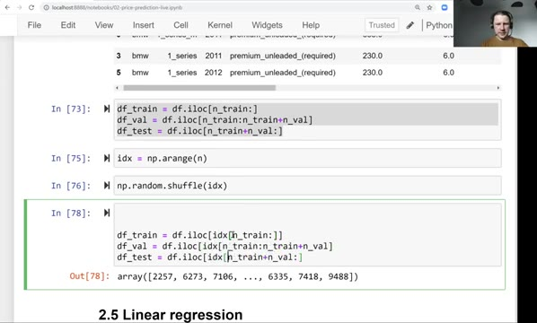
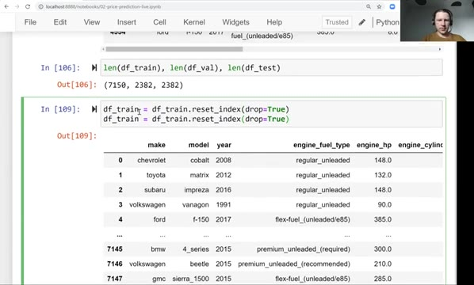
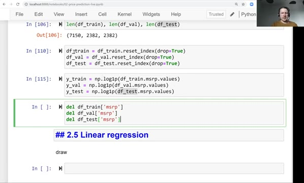

# Setting up the validation framework

The dataset is cleaned and explored, so now we set up the validation framework:
we split the data into train, validation and test parts, and prepare the target
variable for each part. We do it manually, with plain pandas and NumPy.

## Train, validation and test

From the previous lesson we know why we need to validate models. To do it, we
take our dataset and split it into three parts. The first part we use for
training, the second one for validation, and the last one for testing. We train
a model, check if it works fine on the validation dataset, and leave the test
dataset alone: we use it only very occasionally, at the very end, to check that
our model is doing good.

Then, from each of these parts we create a feature matrix X and the target
variable y:



This is what we implement now with pandas.

## Calculating the sizes of the parts

We will do a 60/20/20 split, so we first need to calculate how many records 20%
actually is. Our dataframe has almost 12,000 records, so 20% of that is
approximately 2,400. We want a whole number of records, not a fraction like
2382.8, so we cut the fraction off with `int()`:

```python
n = len(df)

n_val = int(n * 0.2)
n_test = int(n * 0.2)
n_train = n - n_val - n_test
```

Ideally we would write `n_train = int(n * 0.6)` as well, but because of
rounding, the three parts may stop adding up to `n` - and we would accidentally
leave a few records out. So instead, we take validation and test out first, and
whatever remains goes to training.

For our dataset the sizes are:

```python
n, n_val, n_test, n_train
```

```
(11914, 2382, 2382, 7150)
```



## Taking a part of the dataframe with iloc

Now we know the sizes, and we need to take a part of the dataframe of that
size. For that we use `iloc`, which we saw in the introduction to pandas. We
usually give it a list of indices, but it also accepts ranges. To get the first
ten records:

```python
df.iloc[:10]
```

This is from the beginning till 10, not inclusive, so records 0 to 9. The same
way `df.iloc[10:20]` takes records from 10 to 19, and `df.iloc[10:]` takes
everything from 10 till the end.

So the simplest thing we can do is cut the dataframe sequentially:

```python
df_val = df.iloc[:n_val]
df_test = df.iloc[n_val:n_val+n_test]
df_train = df.iloc[n_val+n_test:]
```

There is a problem here, though: the split is sequential. In our dataset the
cars are ordered by make, so validation now contains all the BMWs at the
beginning and all the Porsches at the end, and there are no BMWs in train at
all:



We see that there is some order in this dataset, and we need to break it. In
general it is always a good idea to shuffle the data: if there is some
accidental order in it, we want to make sure it does not affect the split.

## Shuffling the records

Here is the idea. In `iloc` we can pass an arbitrary sequence of numbers, and
it will return the rows in that order. So we can take the numbers from 0 to
n-1, reshuffle them, and then take the first 20% of the shuffled numbers for
validation, the next 20% for test, and the rest for train:



To generate the sequence of numbers we use `np.arange` from NumPy, and to
shuffle it we use `np.random.shuffle`:

```python
idx = np.arange(n)
np.random.shuffle(idx)
```

Now we index the dataframe with the shuffled numbers instead of the sequential
ranges:

```python
df_train = df.iloc[idx[:n_train]]
df_val = df.iloc[idx[n_train:n_train+n_val]]
df_test = df.iloc[idx[n_train+n_val:]]
```

We take the first `n_train` numbers for train, the next `n_val` numbers for
validation, and everything that is left for test:



There is one more problem with this code: when you run it on your computer, you
will get different records - your first car will not be a Porsche or a GMC, but
something else. To make the results reproducible, we set a random seed before
shuffling. We talked about it in the introduction to NumPy:

```python
np.random.seed(2)

idx = np.arange(n)
np.random.shuffle(idx)
```

With the seed set to 2, the first record in train is a Chevrolet, and if you
have the same version of NumPy, you will get exactly the same subset on your
computer.

## Resetting the index

Let's check the lengths of the three dataframes:

```python
len(df_train), len(df_val), len(df_test)
```

```
(7150, 2382, 2382)
```

Looking at `df_train`, we see that the index now contains the original row
numbers - 2735, 6720 and so on, in random order. Sometimes it is inconvenient:
we don't really need to know what the original index of each record was. So we
reset the index and reassign the result back to the dataframe. We pass
`drop=True` because we don't need the old index as a column:

```python
df_train = df_train.reset_index(drop=True)
df_val = df_val.reset_index(drop=True)
df_test = df_test.reset_index(drop=True)
```

Now the index goes from 0 to 7149 again.



## Preparing y and removing msrp

The dataframes will be used to make the feature matrix X. The target y comes
from the `msrp` column, and we already know that we need to apply the log1p
transformation to it because of the long tail in its distribution. Instead of
keeping a pandas series, we immediately take its values with `.values` to get a
NumPy array - we don't need the indexes and other pandas things for y:

```python
y_train = np.log1p(df_train.msrp.values)
y_val = np.log1p(df_val.msrp.values)
y_test = np.log1p(df_test.msrp.values)
```

The last thing we need to do is remove `msrp` from the dataframes, for which we
use the `del` operator:

```python
del df_train['msrp']
del df_val['msrp']
del df_test['msrp']
```

We delete it because we might accidentally use it. If the price gets into the
features, we will use the price to predict the price - and of course the model
will be perfect. Then we might spend a lot of time figuring out what is wrong.
This happened to me many times, so after splitting the data I always take the
target out into a separate variable and delete it from the dataframe
completely.



That is the whole validation framework. We implemented it manually, without any
library - just plain pandas and NumPy. We saw how to split the dataset into
three parts, and now we are ready to move to the training part: in the next
lesson we will talk about [linear regression](05-linear-regression-simple.md).

## Materials

[Slides](https://www.slideshare.net/AlexeyGrigorev/ml-zoomcamp-2-slides)

## Notes

In general, the dataset is splitted into three parts: training, validation, and test. For each partition, we need to obtain feature matrices (X) and vectors of targets (y). First, the size of the partitions is calculated. Next, the records are shuffled to ensure that the values in the three partitions contain non-sequential records from the dataset. Finally, the partitions are created using the shuffled indices.

**Pandas attributes and methods:** 

* `df.iloc[]` -> return subsets of records of a dataframe, being selected by numerical indices
* `df.reset_index()` -> restate the orginal indices 
* `del df[col]` -> eliminate a column variable 

**Numpy methods:**

* `np.arange()` -> return an array of numbers 
* `np.random.shuffle()` -> return a shuffled array
* `np.random.seed()` -> set a seed for reproducibility

The entire code of this project is available in [this jupyter notebook](https://github.com/alexeygrigorev/mlbookcamp-code/blob/master/chapter-02-car-price/02-carprice.ipynb). 

<table>
   <tr>
      <td>⚠️</td>
      <td>
         The notes are written by the community. <br>
         If you see an error here, please create a PR with a fix.
      </td>
   </tr>
</table>

* [Notes from Peter Ernicke](https://knowmledge.com/2023/09/19/ml-zoomcamp-2023-machine-learning-for-regression-part-3/)
