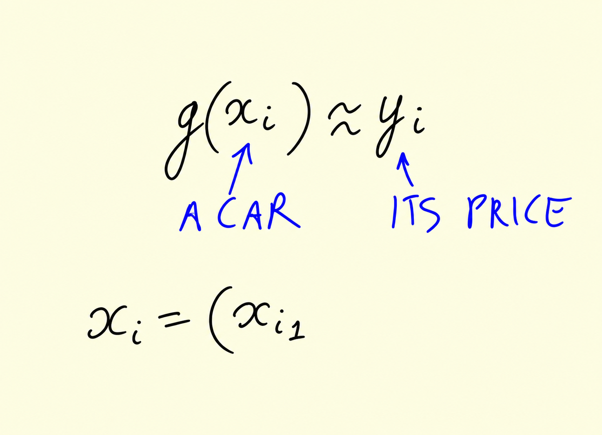
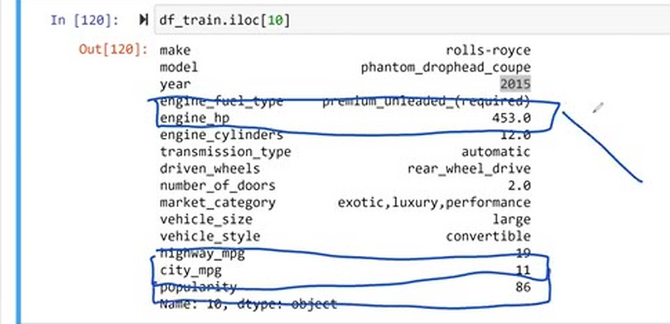
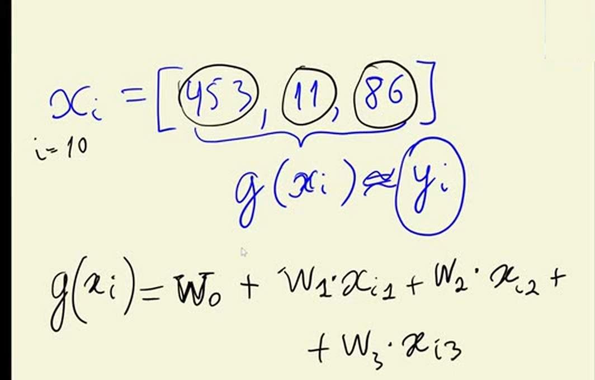
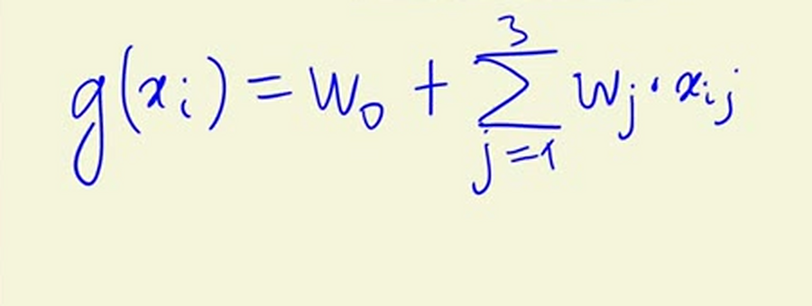
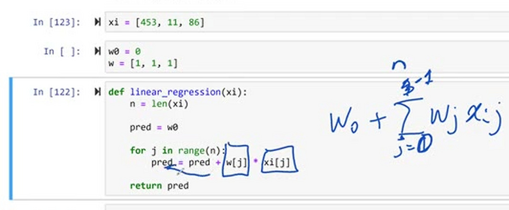
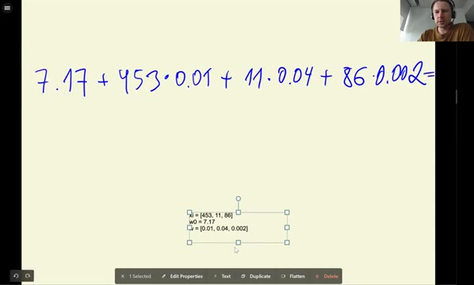
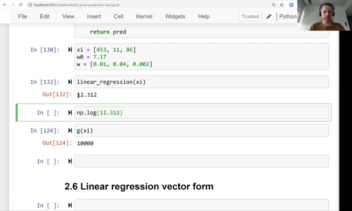

# Linear regression

In this lesson we look at linear regression, the model we use for solving
regression problems - problems where we predict a number, like the price of a
car. We derive the formula, implement it in Python for one car, and see what
the prediction is made of.

## The formula for one car

Linear regression is a model for solving regression problems. Remember from
the introduction: there is regression, there is classification and there is
ranking. Regression means predicting numbers, and the output of this model is a
number - in our case, the price of a car.

You probably remember this formula from the introduction lesson:

```text
g(X) ≈ y
```

Here g is our model, X is the feature matrix and y is our target - the price.
The model g will be linear regression.

Before we go to the matrix form, let's simplify and look at one observation
instead of the entire feature matrix. One observation is one car, and this is
its price:



A car can be a row in our feature matrix, so we can think of it as a vector
with n elements: the first feature is x<sub>i1</sub>, then x<sub>i2</sub>, and
so on until x<sub>in</sub>. We want a function that takes all these features
and produces something close to the price:

```text
g(xi) ≈ yi
```

Let's take an example from the training dataset - remember, we don't look at
validation or test here, only at training. Let's take row number 10. It is a
Rolls-Royce Phantom Drophead Coupe manufactured in 2015, and it has a lot of
characteristics. We take just three of them: engine horsepower, city miles per
gallon and popularity:



So for this car the feature vector is:

```python
xi = [453, 11, 86]
```

Here i is 10, and the features are engine horsepower (453), miles per gallon in
the city (11) and popularity (86). Popularity is the number of times people
mention this car on Twitter. Now we need a function that takes this xi and
produces a prediction for this car.

## The linear regression formula

We need to combine these values in a way that gives us something close to the
price. The formula for linear regression is:

$$g(x_i) = w_0 + w_1 \cdot x_{i1} + w_2 \cdot x_{i2} + w_3 \cdot x_{i3}$$

First we have the bias term w<sub>0</sub> - this is the prediction we make
without knowing anything about the car. But we do know something, so each
feature is multiplied by its weight: horsepower gets weight w<sub>1</sub>,
miles per gallon gets w<sub>2</sub>, popularity gets w<sub>3</sub>.



The part with the features is a sum, so we can write the formula more
compactly. Because we already use i for the car, we use j for the features, and
it goes from 1 to n (in our example, 3):

$$g(x_i) = w_0 + \sum_{j=1}^{n} w_j \cdot x_{ij}$$



## Implementing it in Python

Let's implement this. We have the feature vector xi, the bias term w0, and a
vector w with a weight for each feature:

```python
xi = [453, 11, 86]
w0 = 7.17
w = [0.01, 0.04, 0.002]
```

We will talk about where these weights come from later - for now, we came up
with them ourselves. The function starts the prediction at w0 and, for every
feature, adds the feature multiplied by its weight:

```python
def linear_regression(xi):
    n = len(xi)

    pred = w0

    for j in range(n):
        pred = pred + w[j] * xi[j]

    return pred
```

The formula says the sum goes from 1 to n, but in Python indexes start at 0,
so our loop goes from 0 to n-1. That's the whole implementation - it simply
adds up w<sub>j</sub> times x<sub>ij</sub> for every element of the feature
vector.



## What the prediction is made of

Let's apply it to our car:

```python
linear_regression(xi)
```

```
12.312
```

To make sense of this number, let's look at the parts it is made of:



- We start with the bias term, 7.17. This is what we predict for an average
  car if we don't know anything about it.
- Then we know the car has 453 horsepower. Each horsepower adds 0.01 to the
  prediction: if the car had only one horsepower, the price would be higher by
  0.01, and for 100 horsepower it's higher by 1. The more horsepower the engine
  has, the more expensive the car becomes - that's logical.
- The next feature is miles per gallon in the city, with weight 0.04. The more
  fuel the car consumes in the city, the more expensive it is. This can make
  sense: cars that consume more fuel are probably fancier.
- The last one is popularity, the number of mentions on Twitter, with a pretty
  low weight of 0.002. It doesn't seem to affect the price much: a lot of
  people would need to mention a car for this term to matter.

## From log price back to dollars

The prediction 12.312 is not the price in dollars. Remember that we applied the
log1p transformation to y because of the long tail in the price distribution,
so our model predicts the logarithm of the price. To undo the logarithm we
need the exponent. In NumPy there is a function for that:

```python
np.expm1(12.312)
```

```
222347.2221101062
```

So our prediction for this car is about 222,000 dollars. And there is a
shortcut: `np.expm1` is the inverse of `np.log1p` - apply one after the other
and you are back where you started:

```python
np.log1p(222347.2221101062)
```

```
12.312
```



That's linear regression for one car: we implemented the formula on a small
feature vector of size three. In the next lesson we generalize it to all the
cars at once - the [vector form](06-linear-regression-vector.md).

## Materials

[Slides](https://www.slideshare.net/AlexeyGrigorev/ml-zoomcamp-2-slides)

## Notes

Model for solving regression tasks, in which the objective is to adjust a line for the data and make predictions on new values. The input of this model is the **feature matrix** `X` and a `y` **vector of predictions** is obtained, trying to be as close as possible to the **actual** `y` values. The linear regression formula is the sum of the bias term \( $w_0$ \), which refers to the predictions if there is no information, and each of the feature values times their corresponding weights as \( $x_{i1} \cdot w_1 + x_{i2} \cdot w_2 + ... + x_{in} \cdot w_n$ \).

So the simple linear regression formula looks like:

$g(x_i) = w_0 + x_{i1} \cdot w_1 + x_{i2} \cdot w_2 + ... + x_{in} \cdot w_n$.

And that can be further simplified as:

$g(x_i) = w_0 + \displaystyle\sum_{j=1}^{n} w_j \cdot x_{ij}$

Here is a simple implementation of Linear Regression in python:

~~~~python
w0 = 7.1
def linear_regression(xi):
    
    n = len(xi)
    
    pred = w0
    w = [0.01, 0.04, 0.002]
    for j in range(n):
        pred = pred + w[j] * xi[j]
    return pred
~~~~
        

If we look at the $\displaystyle\sum_{j=1}^{n} w_j \cdot x_{ij}$ part in the above equation, we know that this is nothing else but a vector-vector multiplication. Hence, we can rewrite the equation as $g(x_i) = w_0 + x_i^T \cdot w$

We need to assure that the result is shown on the untransformed scale by using the inverse function `exp()`. 

The entire code of this project is available in [this jupyter notebook](https://github.com/alexeygrigorev/mlbookcamp-code/blob/master/chapter-02-car-price/02-carprice.ipynb).  

<table>
   <tr>
      <td>⚠️</td>
      <td>
         The notes are written by the community. <br>
         If you see an error here, please create a PR with a fix.
      </td>
   </tr>
</table>

* [Notes from Peter Ernicke](https://knowmledge.com/2023/09/20/ml-zoomcamp-2023-machine-learning-for-regression-part-4/)
