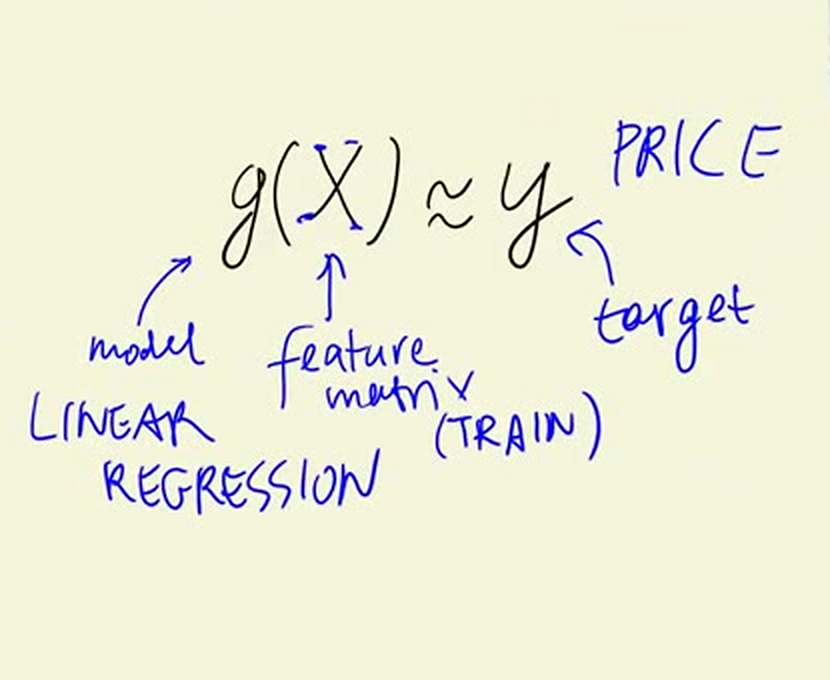
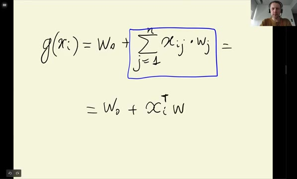
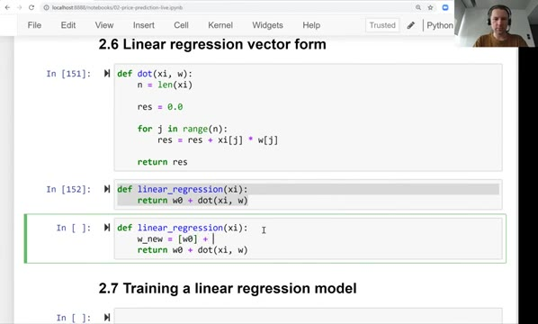
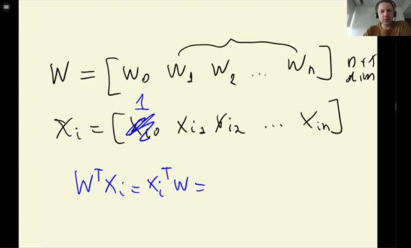
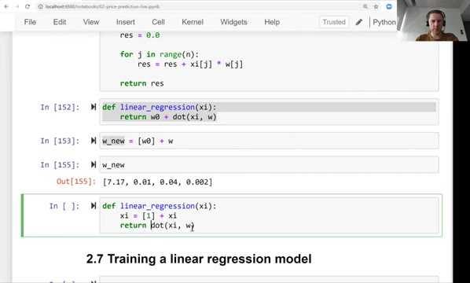
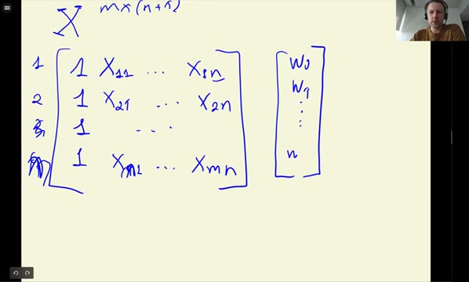
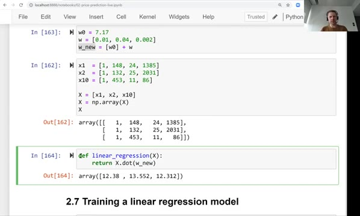

# Linear regression: vector form

Last time we implemented linear regression for a single car. Now we generalize
it: first to a dot product for one car, then to a matrix-vector multiplication
that produces predictions for all the cars in the dataset at once.

## The dot product

Remember where we are. g is our model - linear regression, X is the feature
matrix (the training data) and y is the target, the price:



Let's again write the formula for a single car first. We have the bias term and
then a sum that goes from 1 to n, where we multiply each feature with its
weight:

$$g(x_i) = w_0 + \sum_{j=1}^{n} x_{ij} \cdot w_j$$

If you look at the sum, you can see that it is nothing else but a dot product -
a vector-vector multiplication. We talked about dot products in the introduction
to NumPy, and using that notation we can rewrite the formula slightly
differently: we take the vector x<sub>i</sub>, transpose it, and multiply it
with the vector of weights:

$$g(x_i) = w_0 + x_i^T w$$



This notation is more compact, so let's implement it. We already have the
`linear_regression` function; let's first extract the sum into a function of
its own. It is the same vector-vector multiplication we implemented before:
start the result at zero and, for each element, multiply the pair and add it to
the result:

```python
def dot(xi, w):
    n = len(xi)

    res = 0.0

    for j in range(n):
        res = res + xi[j] * w[j]

    return res
```

Now the linear regression function becomes short - it just adds the bias term
to the dot product between the features and the weights:

```python
def linear_regression(xi):
    return w0 + dot(xi, w)
```



## The fictional feature

We can make it even shorter. The bias term w0 is kind of hanging out there all
alone, without a feature. Let's bring it into the dot product: we imagine that
there is one extra feature of our car, x<sub>i0</sub>, and this feature is
always 1.

Then the vector of weights becomes w0, w1, w2 and so on up to wn - it is an
n+1 dimensional vector now. And the vector of features becomes
x<sub>i0</sub>, x<sub>i1</sub>, x<sub>i2</sub> and so on, where
x<sub>i0</sub> is 1:



Why does this work? When we do the dot product, w0 gets multiplied by 1, so it
simply stays there, and the rest is the same dot product as before. The result
is equivalent to what we had - which means we can use the dot product notation
for the entire linear regression.

In code, in Python, adding two lists with `+` creates a new list and prepends
the first one at the beginning - exactly what we need:

```python
w_new = [w0] + w
```

```python
[7.17, 0.01, 0.04, 0.002]
```

We do the same with the features: prepend 1 to xi, and then take the dot
product of the two new vectors:

```python
def linear_regression(xi):
    xi = [1] + xi
    return dot(xi, w_new)
```

The result should be the same as before:

```python
linear_regression(xi)
```

```
12.312
```

And it is - the same 12.312 we got in the previous lesson.



## Linear regression for all cars

Now let's go back to thinking about all the examples, not just one. We have
the matrix X. Because of the fictional feature, each row of this matrix starts
with 1, followed by the features of that car: row one is car one, row two is
car two, and so on until row m.



For us X has m rows and n+1 columns. What we need to do is take each row of
this matrix, do the dot product of that row with the vector of weights w, and
that gives us the prediction for that car. Doing this for all the rows - all
the cars we have in the dataset - gives us the vector of predictions y.

You can probably recognize by now that this looks very similar to
matrix-matrix multiplication. In fact, it is matrix-vector multiplication: to
apply linear regression, we take the matrix X and multiply it with the vector
w:

$$Xw \approx y$$

Let's implement it. We take three cars and prepend 1 to each feature vector,
then put them together into a matrix - a list of lists - and turn it into a
two-dimensional NumPy array:

```python
x1  = [1, 148, 24, 1385]
x2  = [1, 132, 25, 2031]
x10 = [1, 453, 11, 86]

X = [x1, x2, x10]
X = np.array(X)
```

```python
array([[   1,  148,   24, 1385],
       [   1,  132,   25, 2031],
       [   1,  453,   11,   86]])
```

The weights vector is the same w_new from before:

```python
w0 = 7.17
w = [0.01, 0.04, 0.002]
w_new = [w0] + w
```

And now all we need to do is multiply this matrix with this vector. NumPy
arrays have a `dot` method for that:

```python
def linear_regression(X):
    return X.dot(w_new)
```

```python
linear_regression(X)
```

```
array([12.38 , 13.552, 12.312])
```

For each of the three cars we get a prediction - the price for that car:



So this is linear regression. To summarize how we got here: we started with a
for loop for one car, recognized that it is a dot product between the vector of
features and the vector of weights, made it even shorter by adding the
fictional feature - the virtual 1 - to the feature vector, and finally
generalized it to a complete feature matrix, where linear regression is
nothing else but a matrix-vector multiplication.

You may have been wondering where the weights come from - how do we set the
values for them? That is what we will talk about in the next lesson.

## Materials

[Slides](https://www.slideshare.net/AlexeyGrigorev/ml-zoomcamp-2-slides)

## Notes

The formula of linear regression can be synthesized with the dot product between features and weights. The feature vector includes the *bias* term with an *x* value of one, such as $w_{0}^{x_{i0}},\ where\ x_{i0} = 1\ for\ w_0$.

When all the records are included, the linear regression can be calculated with the dot product between ***feature matrix*** and ***vector of weights***, obtaining the `y` vector of predictions. 

The entire code of this project is available in [this jupyter notebook](https://github.com/alexeygrigorev/mlbookcamp-code/blob/master/chapter-02-car-price/02-carprice.ipynb).  

<table>
   <tr>
      <td>⚠️</td>
      <td>
         The notes are written by the community. <br>
         If you see an error here, please create a PR with a fix.
      </td>
   </tr>
</table>

* [Notes from Peter Ernicke](https://knowmledge.wordpress.com/2023/09/20/ml-zoomcamp-2023-machine-learning-for-regression-part-5/)
