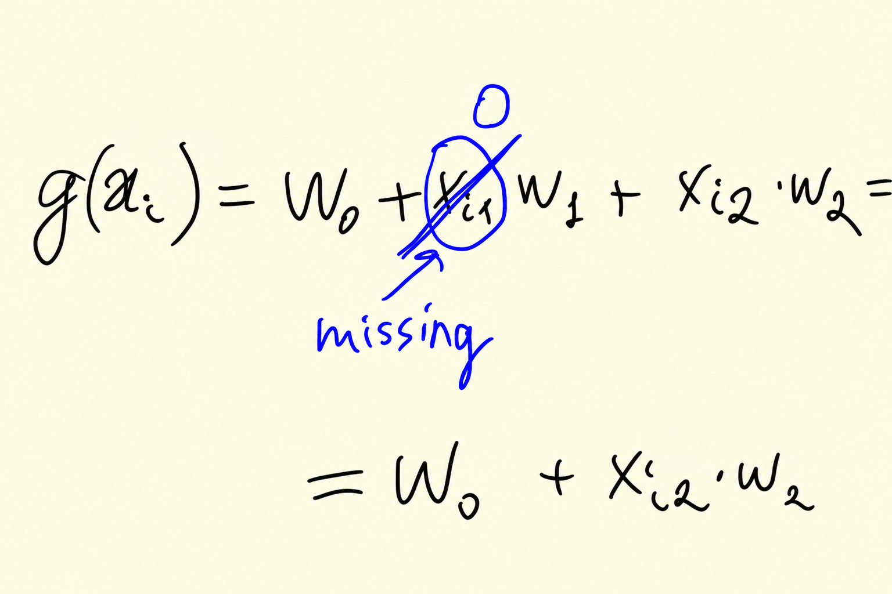
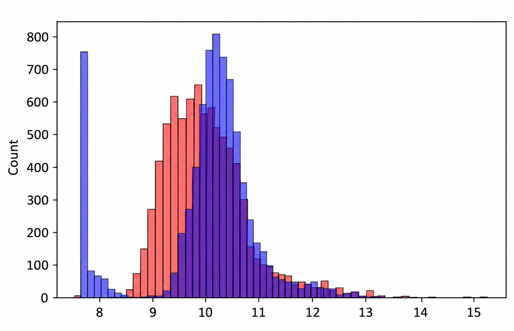

# Baseline model for car price prediction project

In the previous unit we implemented `train_linear_regression`, the
function that finds the weights of a linear regression model. Now we
finally use it on the car price data to build our first model: a
baseline. It is deliberately simple - only the numerical features -
and its quality is the reference point we will try to improve on.

## Selecting the base features

First, let's remind ourselves which columns the training dataframe
has:

```python
df_train.columns
```


Linear regression as we implemented it works only with numbers, so for
the baseline we pick the numerical columns:

- `engine_hp` - engine horsepower
- `engine_cylinders` - number of cylinders
- `highway_mpg` - miles per gallon on the highway
- `city_mpg` - miles per gallon in the city
- `popularity`

We put these five column names in a list:

```python
base = ['engine_hp', 'engine_cylinders', 'highway_mpg',
        'city_mpg', 'popularity']
```


To get a subset of columns from a dataframe, we select the columns with
this list and take the values as a NumPy array:

```python
X_train = df_train[base].values
```

## Dealing with missing values

Let's try to train the model right away:

```python
w0, w = train_linear_regression(X_train, y_train)
```

The result is not what we expect: both the bias term and the weights
are `nan` - "not a number".


Something is wrong with the data. Let's check for missing values:

```python
df_train[base].isnull().sum()
```

We see that `engine_hp` and `engine_cylinders` contain missing values.
The easiest way to deal with them is to fill them with zeros:

```python
X_train = df_train[base].fillna(0).values
```


Filling with zeros might look strange - a car with zero horsepower
doesn't exist, and no engine has zero cylinders. To see why it still
works, look at what a missing value does in the linear regression
formula. Say we have two features, and the first one is missing:

```text
g(xi) = w0 + xi1·w1 + xi2·w2      (xi1 is missing)
     = w0 +   0·w1 + xi2·w2
     = w0 +          xi2·w2
```



When `xi1` is zero, its term `xi1 · w1` disappears, so the model
effectively ignores that feature. From a common-sense point of view,
replacing a value with the mean of that feature is often more
reasonable - we saw how to do that in the homework. But from a
practical point of view, zeros keep the process simple, and sometimes
they work just fine. For the baseline model we go with zeros.

## Training the model

Now the feature matrix has no missing values, and training finishes:

```python
X_train = df_train[base].fillna(0).values
w0, w = train_linear_regression(X_train, y_train)
```

The bias term comes out as `w0 ≈ 7.93`. Remember that we predict the
logarithm of the price, so this is on the log scale. Together with the
five weights, this is our baseline model.

## Comparing the predictions with the actual prices

Now we can apply the trained model to the training data. We use
matrix multiplication, adding the bias term separately:

```python
y_pred = w0 + X_train.dot(w)
```

To see how good the predictions are, let's plot them as a histogram
and compare with the histogram of the actual target values. We use the
same `histplot` function from seaborn that we used during
exploratory data analysis:

```python
sns.histplot(y_pred, color='red', alpha=0.5, bins=50)
sns.histplot(y_train, color='blue', alpha=0.5, bins=50)
```

The `alpha` parameter controls how transparent the bars are, so both
histograms are visible in the same plot.



Looking at the chart, the distribution of predictions does not really
match the distribution of actual values: the red peak sits to the left
of the blue one, so in many cases the model predicts a value smaller
than the actual price.

Just by looking at this chart we suspect the model is not ideal, but
that is not an objective way to say it. And when we start improving the
model, we want to be sure that it indeed improved. For that we need a
single number that quantifies how good or bad the model is. That is
exactly what we will do in the next unit with RMSE.

## Materials

[Slides](https://www.slideshare.net/AlexeyGrigorev/ml-zoomcamp-2-slides)

## Notes

* In this lesson we build a baseline model and apply the `df_train` dataset to derive weights for the bias (w0) and the features (w). For this, we use the `train_linear_regression(X, y)` function from the previous lesson.
* Linear regression only applies to numerical features. Therefore, only the numerical features from `df_train` are used for the feature matrix. 
* We notice some of the features in `df_train` are `nan`. We set them to `0` for the sake of simplicity, so the model is solvable, but it will be appropriate if a non-zeo value is used as the filler (e.g. mean value of the feature).
* Once the weights are calculated, then we apply them on  $$\\\\ \large g(X) = w_0 + X \cdot w$$ to derive the predicted y vector.
* Then we plot both predicted y and the actual y on the same histogram for a visual comparison.

The entire code of this project is available in [this jupyter notebook](https://github.com/alexeygrigorev/mlbookcamp-code/blob/master/chapter-02-car-price/02-carprice.ipynb).  

<table>
   <tr>
      <td>⚠️</td>
      <td>
         The notes are written by the community. <br>
         If you see an error here, please create a PR with a fix.
      </td>
   </tr>
</table>

* [Notes from Peter Ernicke](https://knowmledge.com/2023/09/21/ml-zoomcamp-2023-machine-learning-for-regression-part-7/)
