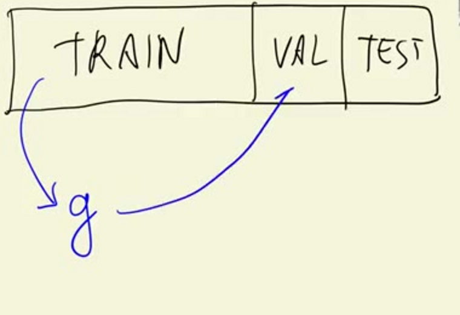
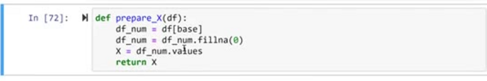
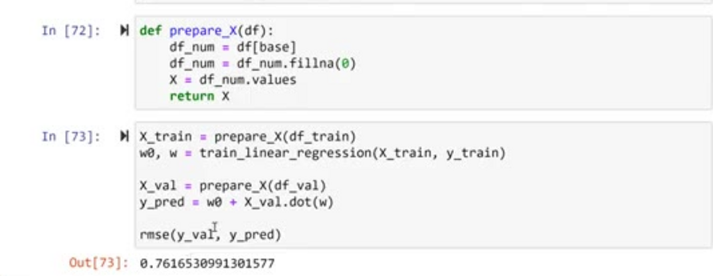
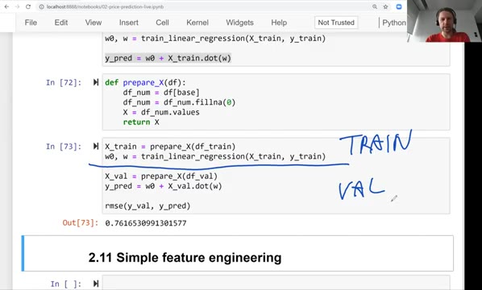

# Computing RMSE on validation data

In the previous unit we implemented RMSE, the root mean squared error, and used
it to measure the quality of our baseline model. There was one problem: we
measured it on the training data - the same data the model learned from. Here we
fix that and evaluate the model the way it should be evaluated: on the
validation data.

## The validation framework

Remember how validation works. We take the dataset and split it into three
parts: the training set, the validation set and the test set. We train the model
- let's call it g - on the training part, and then we apply it to the validation
part to see how it performs on data it has never seen.



Two lessons ago we built our first baseline model using five numerical features
- `engine_hp`, `engine_cylinders`, `highway_mpg`, `city_mpg` and `popularity` -
and then we wrote the `rmse` function for objectively measuring the quality of
the model. But when we computed the error, we applied the model to the training
dataset, the same data we used for training.

Instead, we should apply the model to the validation data and look at the root
mean squared error there.

## Preparing the feature matrix with prepare_X

Let's take the code we wrote earlier. This is the code for training the model,
and this line is where we prepare our feature matrix X:

```python
X_train = df_train[base].fillna(0).values
```

A lot of things are happening here, so let's write a special function for that.
We'll call it `prepare_X`, and it takes a dataframe:

```python
def prepare_X(df):
    df_num = df[base]
    df_num = df_num.fillna(0)
    X = df_num.values
    return X
```

The function does three things. First it selects the numerical columns, then it
fills the missing values, and finally it extracts the feature matrix - the NumPy
array - and returns it. We went from one line to five, but at least it is easier
to understand what is going on.

The point of this function is that we prepare the data in the same way
regardless of whether it is the training, validation or test dataset. It works
on any dataframe - that is why the argument is just `df` and not `df_train`.



## Computing the RMSE on validation data

Now we can train the model and validate it. First the training part: we prepare
the matrix from the training dataframe and train the model. Then the validation
part: we prepare the validation matrix with the same function, apply the model,
and compute the RMSE between the actual target values and our predictions:

```python
X_train = prepare_X(df_train)
w0, w = train_linear_regression(X_train, y_train)

X_val = prepare_X(df_val)
y_pred = w0 + X_val.dot(w)
rmse(y_val, y_pred)
```

This gives us:

```
0.7616530991301577
```



The number is pretty similar to what we had on the training data. That is what
we want to see: the model behaves on unseen data about as well as on the data it
learned from.

Looking at the code, we can see the two parts clearly:



- The training part only touches the training dataset: we prepare the matrix and
  learn the weights.
- The validation part prepares the validation dataset in the same way as the
  training dataset, then applies the model learned in the previous step, and
  computes the root mean squared error for that model.

Now we have a way of evaluating the quality of our model using the root mean
squared error on the validation dataset. This also means we can check whether a
change actually improves the model - and this is what we will do next, starting
with [feature engineering](11-feature-engineering.md).

## Materials

[Slides](https://www.slideshare.net/AlexeyGrigorev/ml-zoomcamp-2-slides)

## Notes

Calculation of the RMSE on validation partition of the dataset of car price prediction. In this way, we have a metric to evaluate the model's 
performance. 

The entire code of this project is available in [this jupyter notebook](https://github.com/alexeygrigorev/mlbookcamp-code/blob/master/chapter-02-car-price/02-carprice.ipynb). 

<table>
   <tr>
      <td>⚠️</td>
      <td>
         The notes are written by the community. <br>
         If you see an error here, please create a PR with a fix.
      </td>
   </tr>
</table>

* [Notes from Peter Ernicke](https://knowmledge.com/2023/09/22/ml-zoomcamp-2023-machine-learning-for-regression-part-8/)
