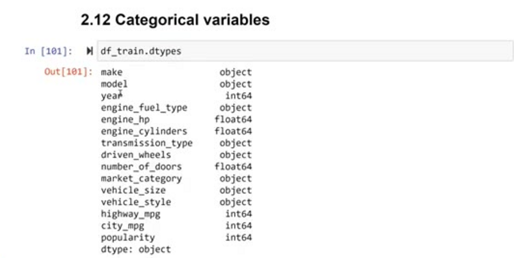
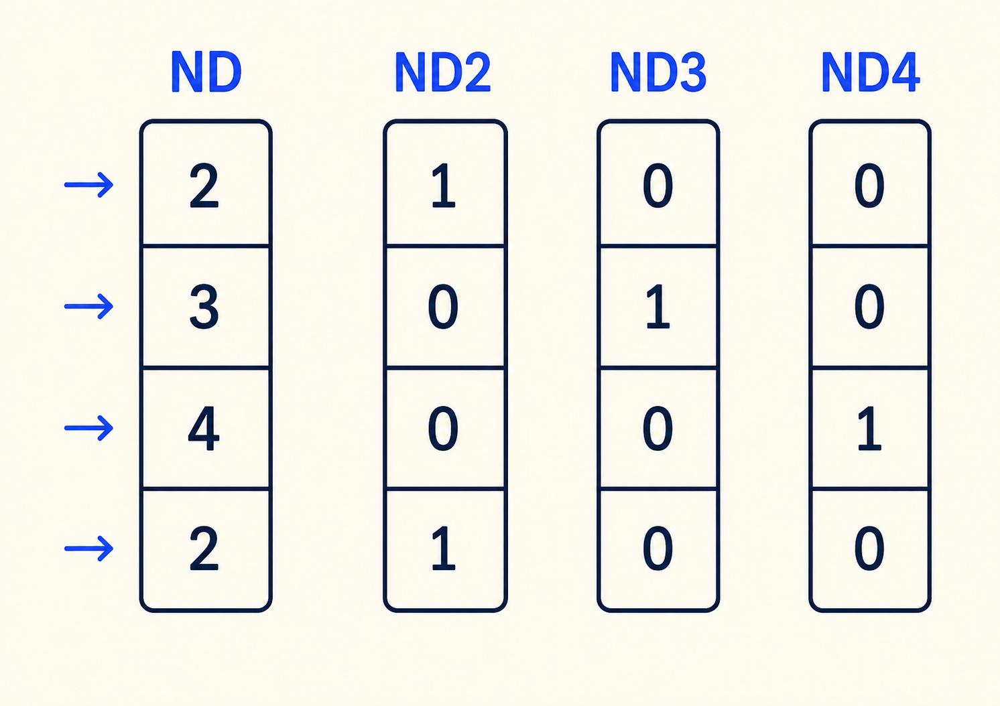
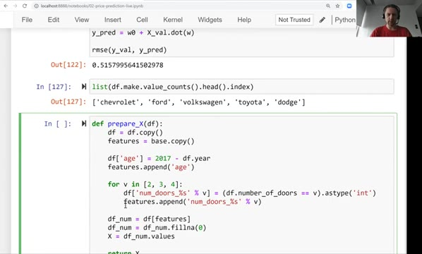
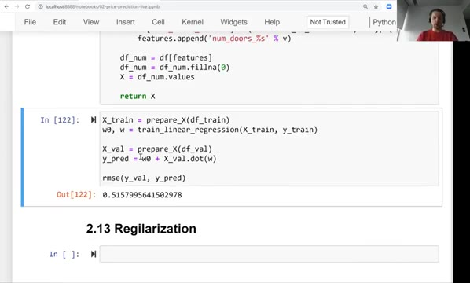
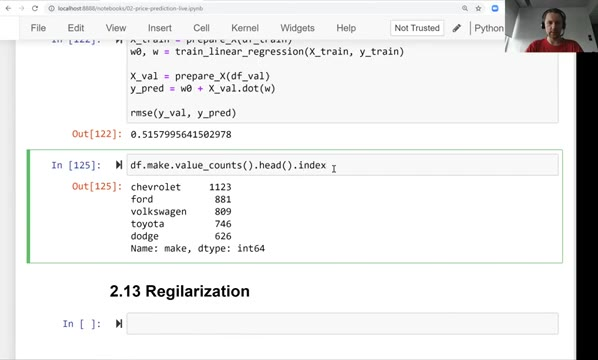
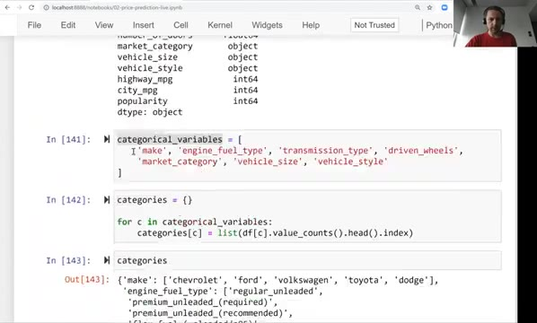
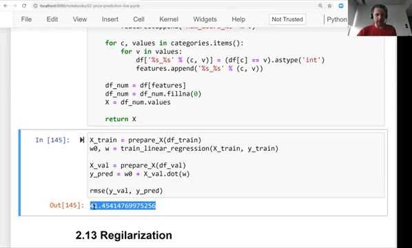
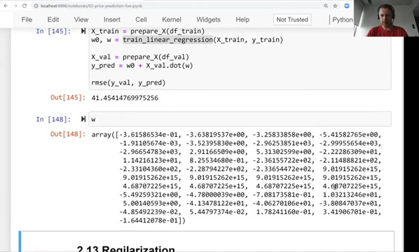

# Categorical variables

Categorical variables are variables that contain categories instead of numbers.
In this unit we add them to our car price model and see that one of them breaks
it completely - which is exactly the problem the next unit solves.

## Variables that are categories

So far we only used numerical features. But the dataset has quite a few
categorical variables - variables that are categories. They are typically
strings: `make`, `model`, `engine_fuel_type`, `transmission_type`,
`driven_wheels` and others. If we look at the data types, all the columns of
type `object` are categorical variables.



There is one variable that looks numerical but is not: `number_of_doors`. It
contains 2, 3 and 4 - numbers - but these numbers are distinct categories of
cars: cars with two doors, cars with three doors and cars with four doors are
quite different. It just happened that the values of this variable are numbers,
and that's why pandas treats them as usual numbers.

We want to use variables like that in our model, because they could be
important. For example, cars with two doors are probably more expensive than
cars with four doors.

## Encoding categories as binary columns

ML models can only work with numbers, so we need to encode categorical
variables. The typical way of doing it: for each value of the column, we create
a separate binary column. If our column contains the values 2, 3, 4 and 2 again,
we represent it with three columns - one for each door count - and put 1 in the
column that matches the row, and 0 everywhere else:



One categorical column becomes multiple binary columns, and each row gets
exactly one 1.

In pandas, the comparison operator does most of the work. When we say
`df.number_of_doors == 2`, we get `True` for every car that has two doors:

```python
df_train.number_of_doors == 2
```

The result is a series of booleans, so the only thing left is to turn it into
integers - ones and zeros - with `astype(int)`.

To create the columns, we can write a loop over the values `[2, 3, 4]` and use a
string template for the name, so that each value gets its own column:

```python
for v in [2, 3, 4]:
    df_train['num_doors_%s' % v] = (df_train.number_of_doors == v).astype('int')
```

## Adding doors to prepare_X

Let's modify our `prepare_X` function again. We make a copy of the dataframe as
before, because we don't want to accidentally write these columns into our data.
We also make a copy of the `base` list: if we used `append` on `base` itself, we
would append `age` to it every time the function runs.

```python
def prepare_X(df):
    df = df.copy()
    features = base.copy()

    df['age'] = 2017 - df.year
    features.append('age')

    for v in [2, 3, 4]:
        df['num_doors_%s' % v] = (df.number_of_doors == v).astype('int')
        features.append('num_doors_%s' % v)

    df_num = df[features]
    df_num = df_num.fillna(0)
    X = df_num.values
    return X
```

Now the features list contains the baseline features, then `age`, and then the
three new features: `num_doors_2`, `num_doors_3` and `num_doors_4`.



We validate the model with the same code as before:

```python
X_train = prepare_X(df_train)
w0, w = train_linear_regression(X_train, y_train)

X_val = prepare_X(df_val)
y_pred = w0 + X_val.dot(w)
rmse(y_val, y_pred)
```

The previous result was 0.5172, and now we get:

```
0.5157995641502978
```

It improved only slightly - the improvement is almost negligible. The number of
doors feature is not that useful.



## Adding the make

But I'm pretty sure that `make` should be quite useful. If we look at the values
of this column, there are a lot of them - 48 unique makes. We can take the most
popular ones with `value_counts`:

```python
df.make.value_counts().head()
```



The output shows the counts, and the names themselves are in the index, so we
wrap it in a list:

```python
makes = list(df.make.value_counts().head().index)
```

This gives us the five most popular makes of cars: chevrolet, ford,
volkswagen, toyota and dodge. We can include them in the same way as the number
of doors - one binary column per make:

```python
for v in makes:
    df['make_%s' % v] = (df.make == v).astype('int')
    features.append('make_%s' % v)
```

We validate again, and this time the results improve by about one percent -
0.5077 instead of 0.5158. Not as drastic as when we added `age`, but quite okay.

## Doing the same for all categorical variables

We can do the same for the other categorical variables: `engine_fuel_type`,
`transmission_type`, `driven_wheels`, `market_category`, `vehicle_size` and
`vehicle_style`. I'm not adding `model` here because there are simply too many
models.

First we collect the top five most common values for each of them into a
dictionary:

```python
categorical_variables = [
    'make', 'engine_fuel_type', 'transmission_type', 'driven_wheels',
    'market_category', 'vehicle_size', 'vehicle_style'
]

categories = {}

for c in categorical_variables:
    categories[c] = list(df_train[c].value_counts().head().index)
```



Then we take `prepare_X` and throw in all the categories. We need two loops: one
over the key-value pairs of the dictionary, and inside it another loop over the
values of each category:

```python
for c, values in categories.items():
    for v in values:
        df['%s_%s' % (c, v)] = (df[c] == v).astype('int')
        features.append('%s_%s' % (c, v))
```



## Something went wrong

We execute the same validation code again, and now the value is significantly
higher than what we had before. Before we had 0.5, and now all of a sudden it's
41:

```
41.45414769975256
```

Something went wrong. If we look at the weights that our
`train_linear_regression` function outputs, they are huge - some of them are
around 10 to the power of 15. We wanted to improve our model by adding more
variables, but we just made it worse.



In the [next unit](13-regularization.md) we will see why that happened and how
to fix it.

## Materials

[Slides](https://www.slideshare.net/AlexeyGrigorev/ml-zoomcamp-2-slides)

## Notes

Categorical variables are typically represented as strings, and pandas identifies them as object types. However, some variables that appear to be numerical may actually be categorical (e.g., the number of doors a car has). All these categorical variables need to be converted to a numerical form because ML
models can interpret only numerical features. It is possible to incorporate certain categories from a feature, not necessarily all of them. 
This transformation from categorical to numerical variables is known as One-Hot encoding. 

The entire code of this project is available in [this jupyter notebook](https://github.com/alexeygrigorev/mlbookcamp-code/blob/master/chapter-02-car-price/02-carprice.ipynb). 

<table>
   <tr>
      <td>⚠️</td>
      <td>
         The notes are written by the community. <br>
         If you see an error here, please create a PR with a fix.
      </td>
   </tr>
</table>

* [Notes from Peter Ernicke](https://knowmledge.com/2023/09/23/ml-zoomcamp-2023-machine-learning-for-regression-part-10/)

## Comments

This way of encoding categorical features is called "one-hot encoding".
We'll learn more about it in Session 3. 
