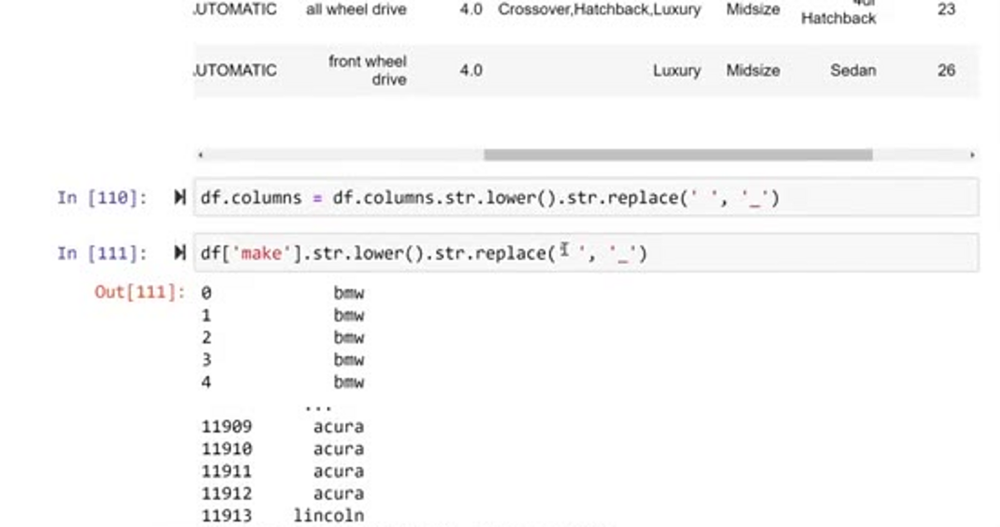
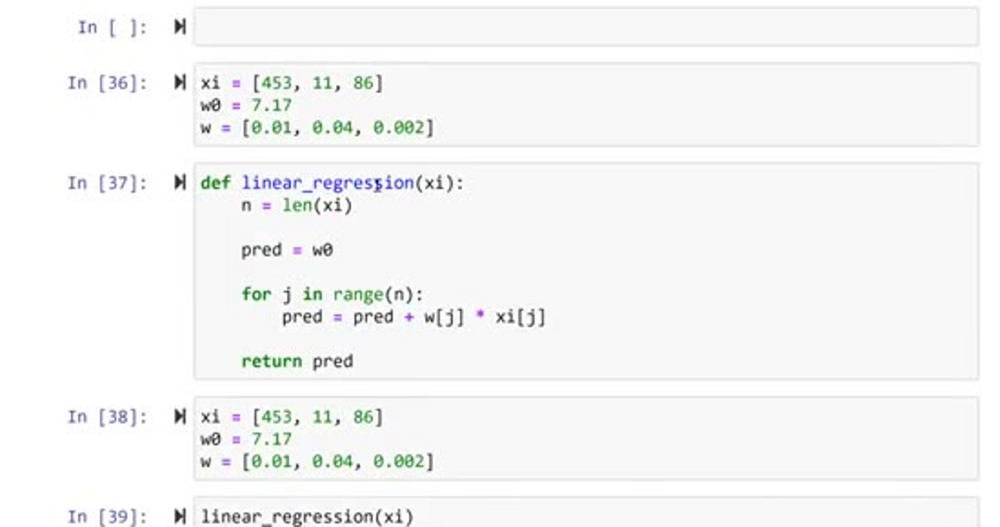
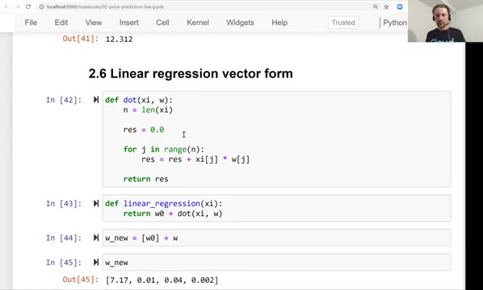
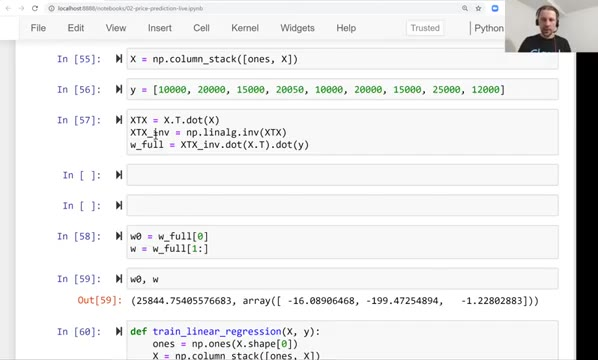
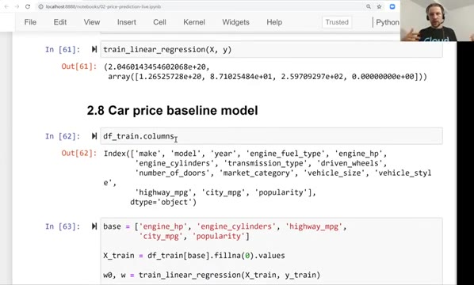
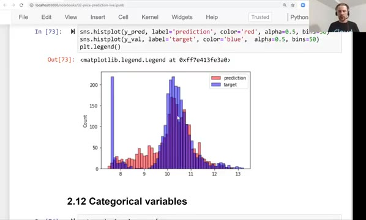
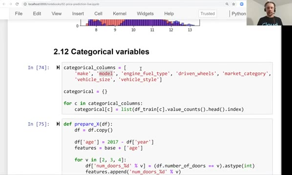

# Car price prediction project summary

This is the last lesson of session two, so let's summarize what we learned. The
whole session was one project: predicting the price of a car. Let's walk through
it one more time and see how each piece fits together.

## The project

We downloaded a dataset of cars that had prices and different characteristics -
things like make, model, engine fuel type, transmission type and others. The
target variable we wanted to predict was the price, MSRP, which stands for
manufacturer's suggested retail price.

## Data preparation and EDA

First we cleaned the dataset and prepared it, so it looks more uniform. The
column names had spaces and inconsistent capitalization, and the string values
did too, so we made everything lowercase with underscores - now it looks
cleaner.

Then we did exploratory data analysis. We identified that the distribution of
price has a long tail, and we removed the long tail by applying the logarithmic
transformation. That's a good idea, because when a distribution has a long tail,
machine learning models usually have problems with it - after the
transformation it looks like a bell shaped curve.

We also saw that the dataset has missing values, and with missing data we cannot
really train a model, so we need to do something about it - we decided to simply
replace them with zeros.

## The validation framework

Then we set up the validation framework: we split the data into training,
validation and test parts. This turned out to be one of the most useful things
we did - it let us detect problems with the model early.

## Linear regression and the normal equation

Next we looked at how linear regression works. First for a single example,
implemented as a simple formula with a for loop. Then we extended it to the
vector form using the dot product, and finally to the matrix form - a matrix
vector multiplication. The output of linear regression is the weights vector:
the bias term and the weights.

And then we looked at how to actually obtain these weights - how to train the
model. We saw that machine learning is not magic: it's just a formula, and this
formula is called the normal equation. We implemented it in NumPy, and with this
implementation we trained our first model - the baseline model, which used only
the five base numerical features.

The baseline model didn't do really well, as we saw in the graph. But judging
from a graph alone is not an objective way to measure the performance of a
model. That's why we talked about RMSE, the root mean squared error - a metric
for evaluating the quality of regression models.

The `prepare_X` function we wrote gave us the same way of preparing the feature
matrix for the training and the validation datasets. That allowed us to
experiment a lot faster: throughout the session we just kept redefining this
function and copy-pasting the same validation cell.

## Feature engineering and categorical variables

After that we did simple feature engineering - creating new features from
existing ones. We created the age feature, and it improved the performance of
our model drastically: the distribution of predictions started to match the
distribution of actual values much better than previously.

Then we looked at how to integrate categorical variables. We represented each
categorical variable with a bunch of binary columns. This way of encoding
categorical variables is called one-hot encoding, and we will talk about it in
more details in the next session, when we talk about classification.

After adding all the categorical features we found out that the performance of
our model degraded significantly - all of a sudden the RMSE became very huge.
Luckily we had the validation framework, so we could spot the problem easily.
The reason was numerical instability, and as a way to solve it we used
regularization: we added a small number to the diagonal of the matrix X
transpose X before inverting it. That helped, and the performance of the model
with all the categorical features increased quite a lot compared to the previous
version.

To summarize the whole project in one list:

- EDA - looking at data, finding missing values
- Target variable distribution - long tail, so we applied the log transformation
- Validation framework: train/validation/test split - it helped us detect problems
- Normal equation - not magic, but math
- Implemented it with NumPy
- RMSE to validate our model
- Feature engineering: age, categorical features
- Regularization to fight numerical instability

## Tuning and the final model

After regularization we tried different values of the regularization parameter
to find the best one. We concluded that 0.001 seems like a good choice - maybe
it's not the absolute best, but it's on the same level as the others, so we
decided to go with it.

Then we trained our final model: we combined the training and validation
datasets into one full train dataset, used our `prepare_X` function again - it's
very convenient - and trained the model. We also saw how to apply this model to
a car for which we don't know the price. Well, actually we do know it, because
the car came from the test dataset, but we pretended we don't - and the
prediction we got wasn't far off from the actual price.

## What's next

The [next unit](17-explore-more.md) has no video - it's just text describing
other things you can try to learn about the topic better. After that there will
be homework, where you will do what we learned in this session yourself.

And in the next section we will talk about classification. There, instead of
implementing everything ourselves like we did here, we will use a library -
scikit-learn. Now that we saw how to implement things ourselves, we are ready to
use the library.

## Notes

In summary, this session covered some topics, including data preparation, exploratory data analysis, the validation framework, linear regression model, LR vector and 
normal forms, the baseline model, root mean squared error, feature engineering, regularization, tuning the model, and using the best model with new data. All these concepts 
were explained using the problem to predict the price of cars. 

<table>
   <tr>
      <td>⚠️</td>
      <td>
         The notes are written by the community.  
         If you see an error here, please create a PR with a fix.
      </td>
   </tr>
</table>

* [Notes from Maximilien Eyengue](https://github.com/maxim-eyengue/Python-Codes/blob/main/ML_Zoomcamp_2024/02_regression/Summary_Session_02.md)
