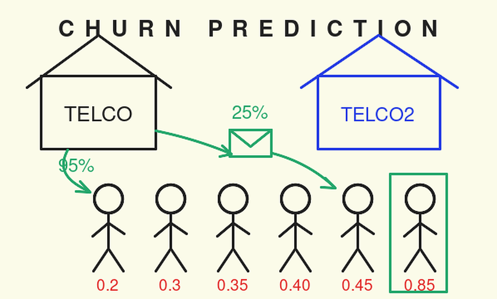
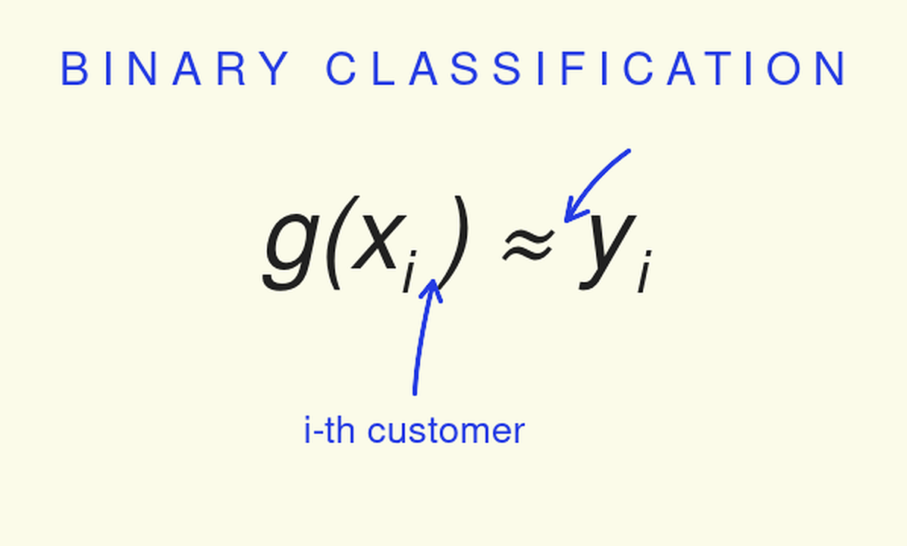
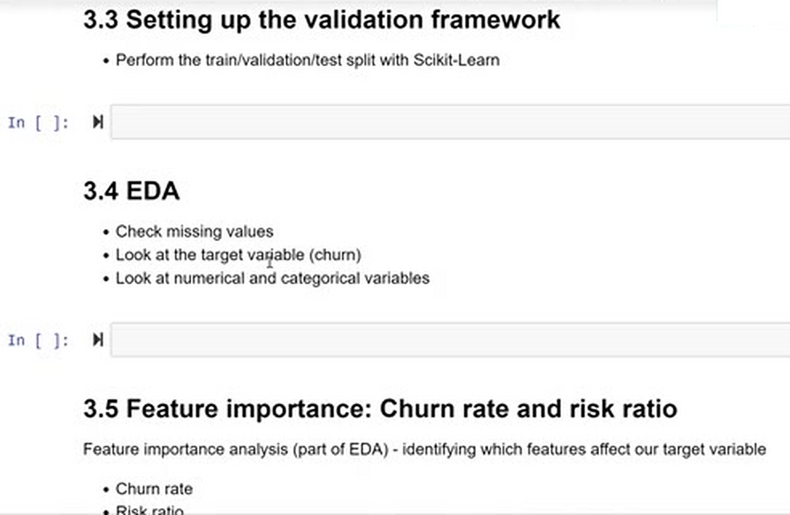

# Churn prediction project

We start a new project: predicting customer churn for a telecom company.
In this first unit we look at the problem statement, how churn prediction
fits into machine learning as binary classification, and the dataset we
will work with for the whole module.

## The problem of churn

Churn is when a customer stops using a service. A telecom company has
many customers, and every month some of them decide to terminate their
contracts and switch to another provider. Losing customers is expensive,
so the company wants to identify the people who are likely to leave
before they actually do.

The idea is simple: for every customer, we compute a score between 0
and 1 - the probability that this customer is about to churn. Then the
company can target the customers with high scores and try to retain
them, for example by sending an email with discounts or special
promotions.

## Classification

To predict this score we use machine learning. The task is binary
classification: we look at one customer and predict one of two possible
outcomes. For the i-th customer, we want our model g to approximate the
target y:

$$\large g\left(x_{i}\right) \approx y_{i}$$

Here x is the feature vector - everything we know about the customer -
and y is the target variable. The target is binary, so y belongs to
{0, 1}:

- 1 is the positive class: the customer churned
- 0 is the negative class: the customer stayed

The output of the model - the score - is the likelihood of churning.
In this project, 1 means the customer left the company and 0 means the
customer stayed.

We learn g from historical data. We take the customers of the previous
month - we already know what happened to them. For each of them we know
the demographics, what services they use, what kind of contract they
have and how much they pay, and we know whether they stayed or left.
The model finds the patterns in this data, and then we apply it to the
current customers to score them.

## The dataset

For this project we use the
[Telco Customer Churn dataset](https://www.kaggle.com/blastchar/telco-customer-churn)
from Kaggle. It contains information about customers of a telecom
company and whether they churned.

Each row is one customer. The columns describe:

- Customer ID
- Demographics: gender, whether the customer is a senior citizen,
  whether they have a partner and dependents
- Services: phone service, multiple lines, internet service, online
  security, online backup, device protection, tech support, streaming
  TV and streaming movies
- Account information: contract type, paperless billing, payment method
- Charges: monthly and total charges
- Tenure: the number of months the customer has stayed with the company
- Churn: the target - whether the customer left

The whole module walks through this project step by step: we prepare
the data, set up a validation framework, do EDA and feature importance
analysis, then train a logistic regression model and use it to score
customers.

## Materials

[Slides](https://www.slideshare.net/AlexeyGrigorev/ml-zoomcamp-3-machine-learning-for-classification)

## Notes

The project aims to identify customers that are likely to churn or stop to using a service. Each customer has a score associated with the probability of churning. Considering this data, the company would send an email with discounts or other promotions to avoid churning.

The ML strategy applied to approach this problem is binary classification, which for one instance ($i^{th}$ customer), can be expressed as:

$$\large g\left(x_{i}\right) = y_{i}$$

In the formula, $y_i$ is the model's prediction and belongs to {0,1}, with 0 being the negative value or no churning, and 1 the positive value or churning. The output corresponds to the likelihood of churning.

In brief, the main idea behind this project is to build a model with historical data from customers and assign a score of the likelihood of churning.

For this project, we used a [Kaggle dataset](https://www.kaggle.com/blastchar/telco-customer-churn).

|⚠️|The notes are written by the community. If you see an error here, please create a PR with a fix.|
|---|:-:|

* [Notes from Peter Ernicke](https://knowmledge.com/2023/09/25/ml-zoomcamp-2023-machine-learning-for-classification-part-1/)
