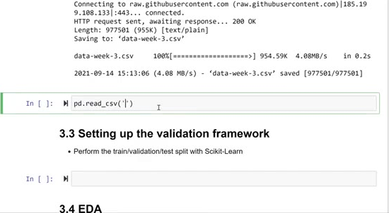
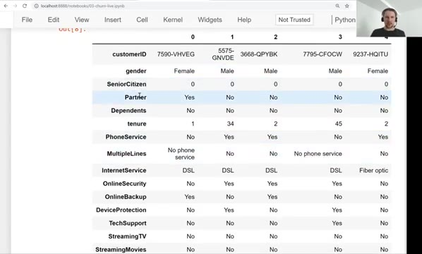
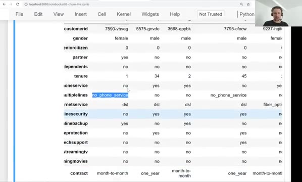
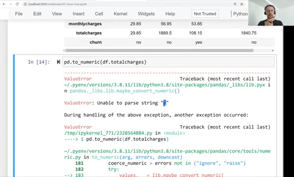
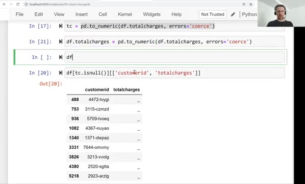
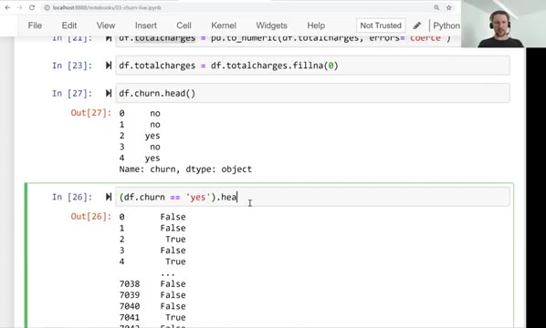

# Data preparation

In this unit we download the churn dataset, read it with pandas and
prepare it for machine learning: make the column names and values
uniform, fix the column that pandas read incorrectly, and translate the
target variable to numbers.

First, the imports:

```python
import pandas as pd
import numpy as np

import matplotlib.pyplot as plt
```

## Downloading and reading the data

The dataset is hosted on GitHub, so we download it with `wget`:

```python
data = 'https://raw.githubusercontent.com/alexeygrigorev/mlbookcamp-code/master/chapter-03-churn-prediction/WA_Fn-UseC_-Telco-Customer-Churn.csv'

!wget $data -O data-week-3.csv
```



In a Jupyter notebook, the `!` prefix runs a shell command instead of
Python code, and the `$` lets us use a Python variable - here `data` -
inside that shell command. The `-O` flag says how to name the
downloaded file.

The file is about 955 KB. Now we read it with pandas and look at it:

```python
df = pd.read_csv('data-week-3.csv')
df.head()
```

The dataframe has 21 columns: `customerid`, `gender`, `seniorcitizen`,
`partner`, `dependents`, `tenure`, `phoneservice`, `multiplelines`,
`internetservice`, `onlinesecurity`, `onlinebackup`,
`deviceprotection`, `techsupport`, `streamingtv`, `streamingmovies`,
`contract`, `paperlessbilling`, `paymentmethod`, `monthlycharges`,
`totalcharges` and `churn`. With this many columns, `df.head()` hides
some of them behind `...` in the middle. To see all of them at once we
can transpose the dataframe - flip rows and columns - with `df.head().T`.
The output is long, so we show only some of the rows:

```text
                                0                       1              2  \
customerid                 7590-vhveg              5575-gnvde    3668-qpybk
gender                         female                    male          male
seniorcitizen                      0                       0              0
partner                          yes                      no             no
dependents                        no                      no             no
tenure                             1                      34              2
phoneservice                      no                     yes            yes
multiplelines            no_phone_service                      no             no
internetservice                  dsl                     dsl            dsl
contract                month-to-month                one_year  month-to-month
paymentmethod        electronic_check             mailed_check   mailed_check
monthlycharges                 29.85                   56.95          53.85
totalcharges                   29.85                  1889.5         108.15
churn                            no                      no            yes

                                          3                 4
customerid                       7795-cfocw        9237-hqitu
gender                                 male            female
seniorcitizen                          0                   0
partner                               no                  no
dependents                            no                  no
tenure                                45                   2
phoneservice                          no                 yes
multiplelines            no_phone_service                  no
internetservice                       dsl         fiber_optic
contract                         one_year    month-to-month
paymentmethod     bank_transfer_(automatic)  electronic_check
monthlycharges                        42.3               70.7
totalcharges                      1840.75             151.65
churn                                  no                 yes
```



## Making everything uniform

The column names are inconsistent: some start with an uppercase letter
(`CustomerID`, `Tenure`), some contain spaces (`Monthly Charges` is
`MonthlyCharges` here, but the values inside columns do contain
spaces). The values are also inconsistent - we see `No`, `Yes`,
`No phone service` and so on. We lowercase everything and replace
spaces with underscores:

```python
df.columns = df.columns.str.lower().str.replace(' ', '_')

categorical_columns = list(df.dtypes[df.dtypes == 'object'].index)

for c in categorical_columns:
    df[c] = df[c].str.lower().str.replace(' ', '_')
```

First we normalize the column names. Then we select all columns with
the `object` dtype - in pandas this usually means strings - and apply
the same transformation to their values. This is exactly what we did in
the car-price project in the previous module. After this, values like
`Electronic check` become `electronic_check` and `Month-to-month`
stays `month-to-month`, but without the space.



## Fixing the totalcharges column

Let's check the types that pandas inferred:

```python
df.dtypes
```

Two things stand out:

- `seniorcitizen` is `int64` - it is stored as 0/1 instead of yes/no.
  That's fine, we will treat it as a categorical variable later.
- `totalcharges` is `object` - a string column - although it clearly
  contains numbers.

Let's try to convert it to numbers:

```python
pd.to_numeric(df.totalcharges)
```

This fails:

```text
ValueError: Unable to parse string "_" at position 488
```



The reason: in the original data, missing values in this column were
encoded with a space. Our normalization step replaced spaces with
underscores, so the missing values became `"_"`, and pandas cannot
parse that as a number.

We can force the conversion with `errors='coerce'`. Unparseable strings
are then replaced with NaN:

```python
tc = pd.to_numeric(df.totalcharges, errors='coerce')
```

Let's see how many missing values this creates:

```python
tc.isnull().sum()
```

There are 11 such rows. We can inspect them:

```python
df[tc.isnull()][['customerid', 'totalcharges']]
```



These are customers who just joined - their tenure is small and they
haven't been billed yet, so their total charges are not available. For
them we simply fill the missing values with zero:

```python
df.totalcharges = pd.to_numeric(df.totalcharges, errors='coerce')
df.totalcharges = df.totalcharges.fillna(0)
```

Zero is not always the best replacement, but in this case it is
acceptable: it matches the fact that these customers haven't paid
anything yet.

## Encoding the target variable

The target, `churn`, still contains strings:

```python
df.churn.head()
```

```text
0     no
1     no
2    yes
3     no
4    yes
Name: churn, dtype: object
```



For classification we need numbers. We compare the column with `'yes'`
- this produces a boolean series - and cast it to integers:

```python
df.churn = (df.churn == 'yes').astype(int)
```

Now `churn` is 1 for customers who churned and 0 for those who stayed.
The data is ready for the next step: splitting it into train,
validation and test sets.

## Materials

[Slides](https://www.slideshare.net/AlexeyGrigorev/ml-zoomcamp-3-machine-learning-for-classification)

## Notes

This session covered data obtention and some procedures of data preparation. 

**Commands, functions, and methods:** 

* `!wget` - Linux shell command for downloading data 
* `pd.read.csv()` - read csv files 
* `df.head()` - take a look of the dataframe 
* `df.head().T` - take a look of the transposed dataframe 
* `df.columns` - retrieve column names of a dataframe 
* `df.columns.str.lower()` - lowercase all the letters in the columns names of a dataframe
* `df.columns.str.replace(' ', '_')` - replace the space separator in the columns names of a dataframe
* `df.dtypes` - retrieve data types of all series 
* `df.index` - retrieve indices of a dataframe
* `pd.to_numeric()` - convert a series values to numerical values. The `errors='coerce'` argument allows making the transformation despite some encountered errors. 
* `df.fillna()` - replace NAs with some value 
* `(df.x == "yes").astype(int)` - convert x series of yes-no values to numerical values. 

The entire code of this project is available in [this jupyter notebook](https://github.com/DataTalksClub/machine-learning-zoomcamp/blob/main/cohorts/2026/03-classification/notebook.ipynb).


<table>
   <tr>
      <td>⚠️</td>
      <td>
         The notes are written by the community. <br>
         If you see an error here, please create a PR with a fix.
      </td>
   </tr>
</table>

* [Notes from Peter Ernicke](https://knowmledge.com/2023/09/26/ml-zoomcamp-2023-machine-learning-for-classification-part-2/)
