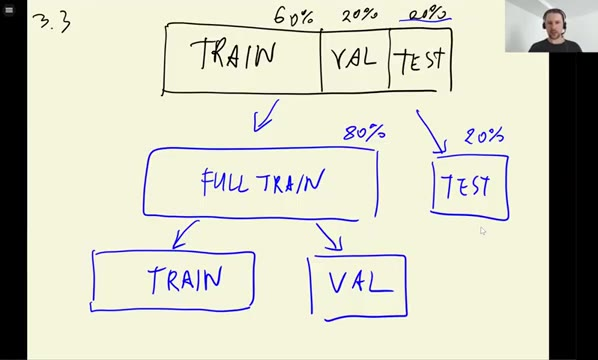
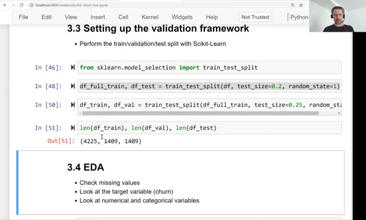
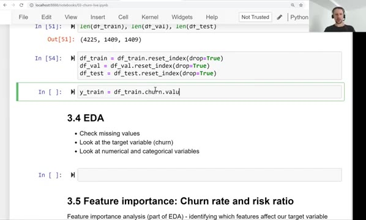
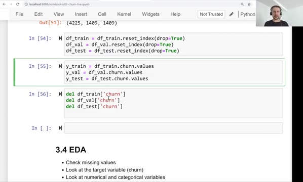

# Setting up the validation framework

Before training anything, we split the data into train, validation and
test sets using Scikit-Learn, and we put the target variable aside so
it cannot leak into the features.

## Splitting the data

We use `train_test_split` from `sklearn.model_selection`:

```python
from sklearn.model_selection import train_test_split
```

We want the classic 60/20/20 split: 60% of the data for training, 20%
for validation and 20% for testing. The function only splits in two, so
we do it in two steps.



First we set aside the test set - 20% of all the data:

```python
df_full_train, df_test = train_test_split(df, test_size=0.2, random_state=1)
```

The remaining 80% we call the full train set. Then we split it again
into train and validation:

```python
df_train, df_val = train_test_split(df_full_train, test_size=0.25, random_state=1)
```

Note that here we use 0.25, not 0.2. The second split gets only 80% of
the original data, and we want the validation set to be 20% of the
original. Since 20% of 80% is 25%, `test_size=0.25` gives us exactly
what we need - and that's why validation and test end up the same size:

```python
len(df_train), len(df_val), len(df_test)
```

```text
(4225, 1409, 1409)
```



The full dataset has 7043 customers: 4225 for training (60%), 1409 for
validation (20%) and 1409 for testing (20%).

The `random_state=1` argument fixes the seed of the random shuffling.
The split is random, but with a fixed seed it is reproducible - running
the notebook again gives exactly the same split.

## Resetting the index

`train_test_split` shuffles the rows, so after splitting the row
indexes are a random mixture of numbers. We reset them:

```python
df_train = df_train.reset_index(drop=True)
df_val = df_val.reset_index(drop=True)
df_test = df_test.reset_index(drop=True)
```



The `drop=True` argument discards the old index instead of adding it
back as a column. We do the same for the full train set when we start
working with it.

## Isolating the target

The target for this project is the `churn` column. We extract it from
each dataframe as a NumPy array with `.values`:

```python
y_train = df_train.churn.values
y_val = df_val.churn.values
y_test = df_test.churn.values
```

Then we delete the column from the dataframes:

```python
del df_train['churn']
del df_val['churn']
del df_test['churn']
```



This is a safety measure: we don't want to accidentally use the target
as a feature when we train the model. Note that we keep `churn` inside
`df_full_train` for now - we need it in the next unit, where we do
exploratory data analysis.

## Materials

[Slides](https://www.slideshare.net/AlexeyGrigorev/ml-zoomcamp-3-machine-learning-for-classification)

## Notes

Splitting the dataset with **Scikit-Learn**. 

**Classes, functions, and methods:** 

* `train_test_split` - Scikit-Learn class for splitting a dataset into two parts. The `test_size` argument states how large the test set should be. The `random_state` argument sets a random seed for reproducibility purposes.  
* `df.reset_index(drop=True)` - reset the indices of a dataframe and delete the previous ones. 
* `df.x.values` - extract the values from x series
* `del df['x']` - delete x series from a dataframe 

The entire code of this project is available in [this jupyter notebook](https://github.com/DataTalksClub/machine-learning-zoomcamp/blob/main/cohorts/2026/03-classification/notebook.ipynb).

<table>
   <tr>
      <td>⚠️</td>
      <td>
         The notes are written by the community. <br>
         If you see an error here, please create a PR with a fix.
      </td>
   </tr>
</table>

* [Notes from Peter Ernicke](https://knowmledge.com/2023/09/27/ml-zoomcamp-2023-machine-learning-for-classification-part-3/)
