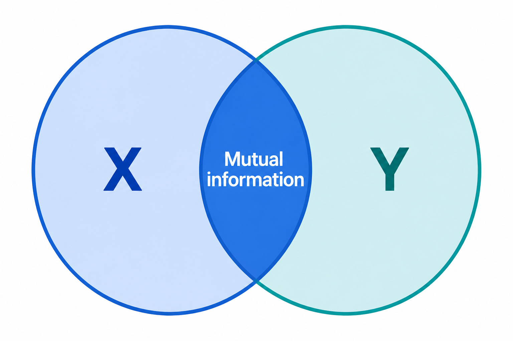

# Feature importance: Mutual information

The churn rate and risk ratio from the previous unit tell us which
groups within one variable churn more, but they don't let us compare
whole variables with each other. Mutual information fixes that: it is a
single number per variable that measures how important it is.

## The concept

Mutual information is a concept from
[information theory](https://en.wikipedia.org/wiki/Mutual_information).
It tells us how much we can learn about one variable if we know the
value of another.

Applied to our project: how much do we learn about churn if we know the
customer's contract type? If knowing a feature always gives us useful
information about churn, the mutual information between them is high
and the feature is important. If the feature tells us nothing, the
mutual information is 0.

In this project we use mutual information to measure the importance of
categorical variables.



## Measuring it with Scikit-Learn

The function we need is `mutual_info_score` from Scikit-Learn:

```python
from sklearn.metrics import mutual_info_score
```

Let's measure it for a few variables. For `contract`:

```python
mutual_info_score(df_full_train.churn, df_full_train.contract)
```

```text
0.0983203874041556
```

For `gender`:

```python
mutual_info_score(df_full_train.gender, df_full_train.churn)
```

```text
0.0001174846211139946
```

And for `partner`:

```python
mutual_info_score(df_full_train.partner, df_full_train.churn)
```

```text
0.009967689095399745
```

The order of the arguments doesn't matter - mutual information is
symmetric, so `mutual_info_score(df_full_train.contract,
df_full_train.churn)` gives the same 0.0983.

The numbers confirm what we saw with the risk ratios. Contract has by
far the highest score: knowing the contract type teaches us a lot about
churn. Gender is almost 0: knowing the gender tells us practically
nothing. Partner sits in between.

## Applying it to all categorical variables

We could repeat this manually for all 16 variables, but there is a
shorter way. `mutual_info_score` takes two arguments, while pandas
`apply` passes one series at a time - so we wrap it in a function of
one argument:

```python
def mutual_info_churn_score(series):
    return mutual_info_score(series, df_full_train.churn)
```

Now we apply it to every categorical column and sort the result from
most to least important:

```python
mi = df_full_train[categorical].apply(mutual_info_churn_score)
mi.sort_values(ascending=False)
```

```text
contract            0.098320
onlinesecurity      0.063085
techsupport         0.061032
internetservice     0.055868
onlinebackup        0.046923
deviceprotection    0.043453
paymentmethod       0.043210
streamingtv         0.031853
streamingmovies     0.031581
paperlessbilling    0.017589
dependents          0.012346
partner             0.009968
seniorcitizen       0.009410
multiplelines       0.000857
phoneservice        0.000229
gender              0.000117
dtype: float64
```

The result puts everything on one scale. Contract is the most
important categorical variable, followed by `onlinesecurity` and
`techsupport` - customers without these services churn more, as we saw
in the risk ratio tables. At the bottom of the list we find
`multiplelines`, `phoneservice` and `gender` - variables that tell us
almost nothing about churn.

This covers the categorical variables. For numerical ones we need a
different measure - correlation, which is the next unit.

## Materials

[Slides](https://www.slideshare.net/AlexeyGrigorev/ml-zoomcamp-3-machine-learning-for-classification)

## Notes

Mutual information is a concept from information theory, which measures how much we can learn about one variable if we know the value of another. In this project, we can think of this as how much do we learn about churn if we have the information from a particular feature. So, it is a measure of the importance of a categorical variable. 

**Classes, functions, and methods:** 

* `mutual_info_score(x, y)` - Scikit-Learn class for calculating the mutual information between the x target variable and y feature. 
* `df[x].apply(y)` - apply a y function to the x series of the df dataframe. 
* ` df.sort_values(ascending=False).to_frame(name='x')` - sort values in an ascending order and called the column as x. 

The entire code of this project is available in [this jupyter notebook](https://github.com/DataTalksClub/machine-learning-zoomcamp/blob/main/cohorts/2026/03-classification/notebook.ipynb). 

<table>
   <tr>
      <td>⚠️</td>
      <td>
         The notes are written by the community. <br>
         If you see an error here, please create a PR with a fix.
      </td>
   </tr>
</table>

* [Notes from Peter Ernicke](https://knowmledge.com/2023/09/28/ml-zoomcamp-2023-machine-learning-for-classification-part-6/)
