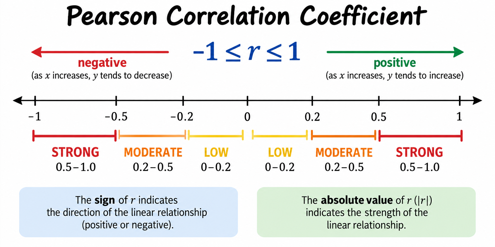
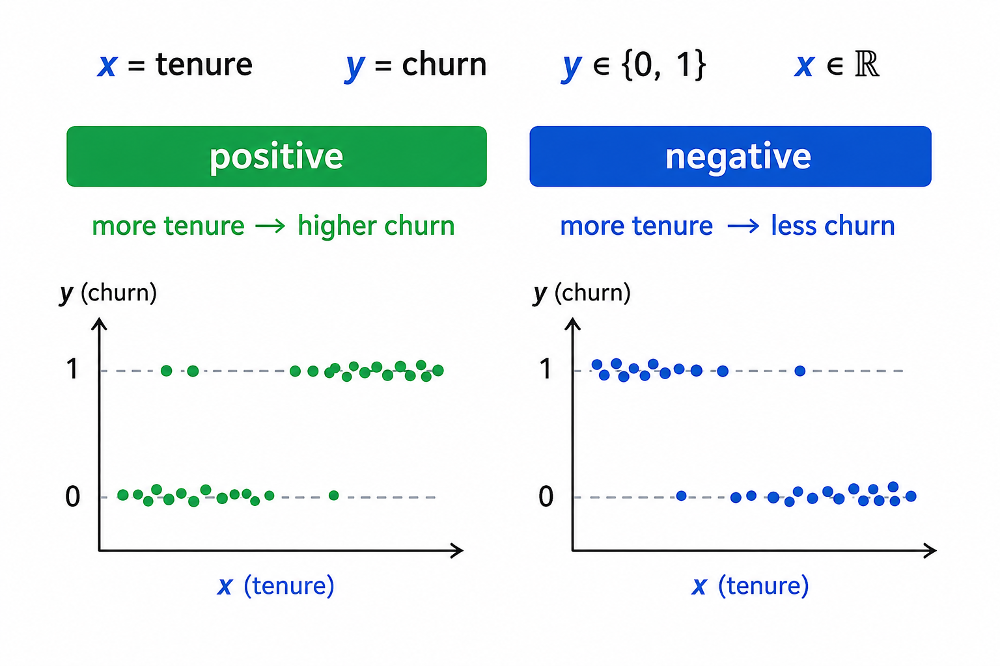
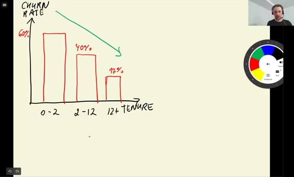
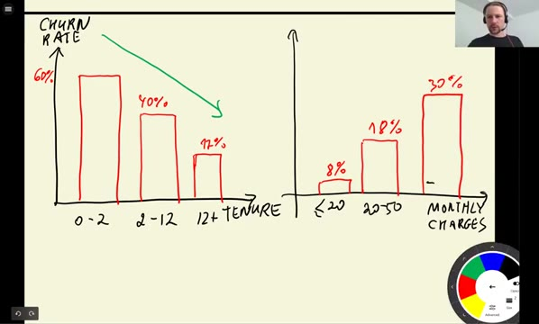

# Feature importance: Correlation

Mutual information measures the importance of categorical variables.
For numerical variables we use the correlation coefficient instead: it
tells us how strongly each numerical feature is related to churn.

## The correlation coefficient

The correlation coefficient - the
[Pearson correlation coefficient](https://en.wikipedia.org/wiki/Pearson_correlation_coefficient),
usually denoted r - measures the degree of dependency between two
variables. It is always a number between -1 and 1:

- A value close to 1 means strong positive correlation: when one
  variable grows, the other grows too.
- A value close to -1 means strong negative correlation: when one
  variable grows, the other decreases.
- A value close to 0 means there is no dependency: a change in one
  variable tells us nothing about the other.

The sign gives the direction of the relationship, and the absolute
value gives its strength. One way to interpret the magnitude:

- LOW when the absolute value of r is between 0 and 0.2
- MEDIUM when it is between 0.2 and 0.5
- STRONG when it is between 0.5 and 1.0



In our case one of the two variables is churn - a binary 0/1 column.
If the correlation between a numerical feature and churn is positive,
customers with higher values of that feature churn more; if it is
negative, they churn less. The larger the absolute value, the more
important the feature.



## Correlation of numerical features with churn

We have three numerical variables: `tenure`, `monthlycharges` and
`totalcharges`. Pandas computes their correlation with the target in
one call with `corrwith`:

```python
df_full_train[numerical].corrwith(df_full_train.churn)
```

```text
tenure           -0.351885
monthlycharges    0.196805
totalcharges     -0.196353
dtype: float64
```


Let's read this:

- Tenure has a medium negative correlation. The longer customers stay
  with the company, the less likely they are to churn.
- Monthly charges have a low-to-medium positive correlation: the more
  customers pay per month, the more likely they are to churn.
- Total charges have a low-to-medium negative correlation - not
  surprising, since total charges accumulate with tenure.

To rank features by importance we don't care about the direction, only
about the strength, so we take the absolute values:

```python
df_full_train[numerical].corrwith(df_full_train.churn).abs()
```

```text
tenure            0.351885
monthlycharges    0.196805
totalcharges      0.196353
dtype: float64
```

Tenure is the most important numerical feature.

## Checking the relationship with groups

We can double-check the correlation by splitting customers into groups
and computing the churn rate in each - the same idea we used for
categorical variables, now applied to bins of a numerical one.

Tenure is measured in months and goes up to 72:

```python
df_full_train.tenure.max()
```

```text
72
```

We split it into three groups - two months or less, up to a year, and
longer than a year - and look at the churn rate in each:

```python
df_full_train[df_full_train.tenure <= 2].churn.mean()
```

```text
0.5953420669577875
```

```python
df_full_train[(df_full_train.tenure > 2) & (df_full_train.tenure <= 12)].churn.mean()
```

```text
0.3994413407821229
```

```python
df_full_train[df_full_train.tenure > 12].churn.mean()
```

```text
0.17634908339788277
```

The pattern is striking. Customers who have been with the company for
two months or less churn at almost 60%. For customers of up to a year
it is about 40%, and for those who stayed longer than a year only
about 18%. Churn clearly decreases as tenure grows - exactly what the
negative correlation told us.



The same check for monthly charges:

```python
df_full_train[df_full_train.monthlycharges <= 20].churn.mean()
```

```text
0.08795411089866156
```

```python
df_full_train[(df_full_train.monthlycharges > 20) & (df_full_train.monthlycharges <= 50)].churn.mean()
```

```text
0.18340943683409436
```

```python
df_full_train[df_full_train.monthlycharges > 50].churn.mean()
```

```text
0.32499341585462205
```

Here the relationship goes the other way: customers paying at most $20
churn at about 9%, and customers paying more than $50 churn at about
32%. The more people pay monthly, the more likely they are to leave -
the positive correlation confirmed.



We now know the importance of categorical variables (mutual
information) and numerical variables (correlation). Next we prepare the
categorical variables for the model with one-hot encoding.

## Materials

[Slides](https://www.slideshare.net/AlexeyGrigorev/ml-zoomcamp-3-machine-learning-for-classification)

## Notes

**Correlation coefficient** measures the degree of dependency between two variables. This value is negative if one variable grows while the other decreases, and it is positive if both variables increase. Depending on its size, the dependency between both variables could be low, moderate, or strong. It allows measuring the importance of numerical variables. 

If `r` is correlation coefficient, then the correlation between two variables is:

- LOW when `r` is between [0, -0.2) or [0, 0.2)
- MEDIUM when `r` is between [-0.2, -0.5) or [0.2, 0.5)
- STRONG when `r` is between [-0.5, -1.0] or [0.5, 1.0]

Positive Correlation vs. Negative Correlation
* When `r` is positive, an increase in x will increase y.
* When `r` is negative, an increase in x will decrease y.
* When `r` is 0, a change in x does not affect y.

**Functions and methods:** 

* `df[x].corrwith(y)` - returns the correlation between x and y series. This is a function from pandas.

The entire code of this project is available in [this jupyter notebook](https://github.com/DataTalksClub/machine-learning-zoomcamp/blob/main/cohorts/2026/03-classification/notebook.ipynb).

<table>
   <tr>
      <td>⚠️</td>
      <td>
         The notes are written by the community. <br>
         If you see an error here, please create a PR with a fix.
      </td>
   </tr>
</table>

* [Notes from Peter Ernicke](https://knowmledge.com/2023/09/29/ml-zoomcamp-2023-machine-learning-for-classification-part-7/)
