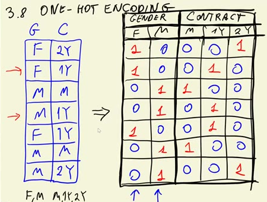
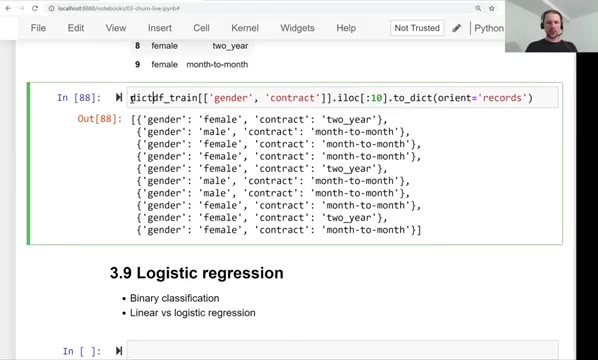
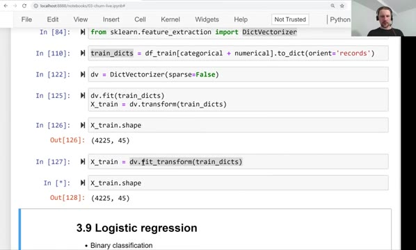
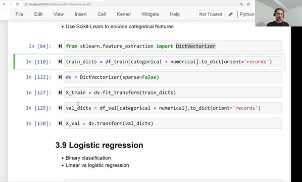

# One-hot encoding

In this lesson we encode categorical features as numbers, so they can be
used by a machine learning model. The technique is called one-hot
encoding, and Scikit-Learn gives us a convenient way to do it with
`DictVectorizer`.

## Why we need encoding

So far we looked at categorical variables one at a time: churn rate per
contract type, risk ratio per payment method, mutual information. That
told us which features are useful. Now we want to put all the features
together into one matrix and train a model on it.

Machine learning models work with numbers. Our numerical variables -
`tenure`, `monthlycharges`, `totalcharges` - are already numbers. But
`contract` contains strings like `two_year`, and `paymentmethod`
contains strings like `electronic_check`. We cannot multiply a string
by a weight, so we need to translate these values into numbers first.

## One-hot encoding

One-hot encoding replaces one categorical column with several binary
columns - one per category. Each new column says whether the row has
that category (1) or not (0).

For example, in our dataset `contract` has three possible values:
`month-to-month`, `one_year` and `two_year`. One row of the dataset

```json
{"contract": "two_year", "tenure": 72, "monthlycharges": 115.5}
```

becomes

```text
contract=month-to-month  contract=one_year  contract=two_year  tenure  monthlycharges
                      0                  0                  1      72           115.5
```

Only one of the contract columns is "hot" (set to 1) - that is where
the name one-hot encoding comes from.



We do this for every categorical feature. The `paymentmethod` feature
has four values, so it becomes four columns. `gender` has two values,
so it becomes two columns. The numerical features pass through
unchanged - we keep them as they are.

## Turning rows into dictionaries

`DictVectorizer` takes a list of dictionaries, one dictionary per row.
We convert a dataframe to this format with pandas:

```python
dicts = df[categorical + numerical].to_dict(orient='records')
```

The `orient='records'` argument means "one dictionary per row". After
this, `dicts` is a list that looks like this:

```python
[{'contract': 'two_year', 'tenure': 72, 'monthlycharges': 115.5},
 {'contract': 'month-to-month', 'tenure': 10, 'monthlycharges': 95.25},
 ...]
```



## DictVectorizer

`DictVectorizer` lives in `sklearn.feature_extraction`:

```python
from sklearn.feature_extraction import DictVectorizer

dv = DictVectorizer(sparse=False)

train_dict = df_train[categorical + numerical].to_dict(orient='records')
X_train = dv.fit_transform(train_dict)
```

Like every Scikit-Learn transformer, it has a `fit` step and a
`transform` step:

- `fit` learns the list of categories for each column
- `transform` turns dictionaries into a matrix

`fit_transform` does both in one call. With `sparse=False` the result is
a usual NumPy array. By default `DictVectorizer` returns a sparse
matrix - a data structure that stores only the non-zero elements,
because most of the matrix is zeros. Sparse matrices are more memory
efficient, but for this dataset it is simpler to work with a dense
array.



To see what columns the vectorizer created, use
`dv.get_feature_names_out()`. For the full dataset we get 45 names:
one column per category value (`contract=month-to-month`,
`internetservice=fiber_optic`, ...) plus the three numerical columns.
The resulting matrix has 45 columns, one per feature name:

```python
X_train.shape
```

```
(4225, 45)
```

4225 is the number of rows in the training set, 45 is the number of
features after encoding.


## Encoding the validation set

The validation set must be encoded in exactly the same way as the
training set. That is why we call `fit` only on the training data - for
the validation data we reuse the already fitted vectorizer and call
only `transform`:

```python
val_dict = df_val[categorical + numerical].to_dict(orient='records')
X_val = dv.transform(val_dict)
```



If we called `fit` again on validation, the columns could come out in a
different order - or a category that appears only in validation would
create a new column. The matrix would no longer match the one the model
was trained on.

## Alternative: OneHotEncoder

Scikit-Learn also has a dedicated `OneHotEncoder` class that works on
dataframes directly instead of dictionaries. We show how to combine it
with feature scaling in the second notebook for this module
(`notebook-scaling-ohe.ipynb`).

## Materials

[Slides](https://www.slideshare.net/AlexeyGrigorev/ml-zoomcamp-3-machine-learning-for-classification)

## Notes

One-Hot Encoding allows encoding categorical variables in numerical ones. This method represents each category of a variable as one column, and a 1 is assigned if the value belongs to the category or 0 otherwise. 

**Classes, functions, and methods:** 

* `df[x].to_dict(orient='records')` - convert x series to dictionaries, oriented by rows. 
* `DictVectorizer().fit_transform(x)` - Scikit-Learn class for one-hot encoding by converting x dictionaries into a sparse matrix. It does not affect the numerical variables. 
* `DictVectorizer().get_feature_names()` -  return the names of the columns in the sparse matrix.  

The entire code of this project is available in [this jupyter notebook](https://github.com/DataTalksClub/machine-learning-zoomcamp/blob/main/cohorts/2026/03-classification/notebook.ipynb). 

<table>
   <tr>
      <td>⚠️</td>
      <td>
         The notes are written by the community. <br>
         If you see an error here, please create a PR with a fix.
      </td>
   </tr>
</table>

* [Notes from Peter Ernicke](https://knowmledge.com/2023/09/29/ml-zoomcamp-2023-machine-learning-for-classification-part-8/)
