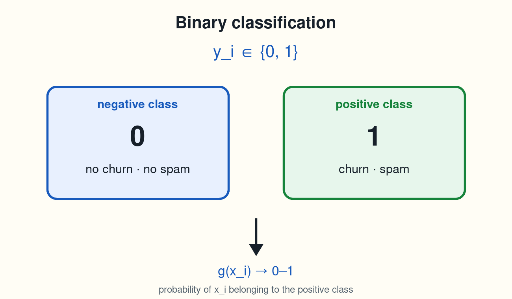
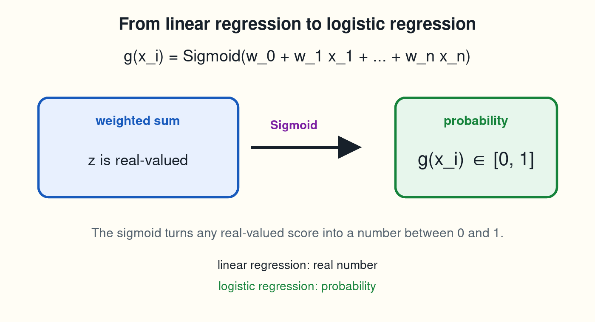
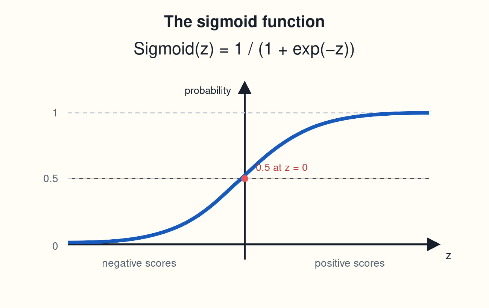
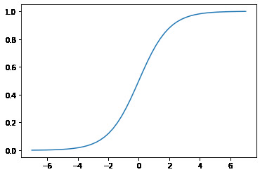
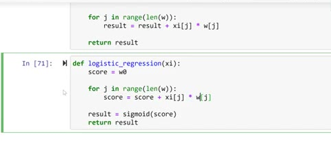

# Logistic regression

In this lesson we look at logistic regression - the model we will use
for churn prediction. We see how it relates to linear regression from
the previous module, implement the sigmoid function, and write the
model in code.

## Binary classification

Our problem - predicting churn - is a binary classification problem:
the target variable takes one of two values. We encoded it as 1 for
customers who churned (the positive class) and 0 for customers who
stayed (the negative class). Spam detection is another example: 1 for
spam, 0 for not spam.

A supervised model is a function that maps features to the target:

<p align="center">
    $\large g\left(x_{i}\right) \approx y_{i}$
</p>

For classification, the output of `g` is a number between 0 and 1: the
probability that `xi` belongs to the positive class. If the model
outputs 0.8 for a customer, we say it believes there is an 80% chance
this customer will churn.



## From linear regression to logistic regression

In the previous module we used linear regression, which computes a
weighted sum of the features:

<p align="center">
    $\large g\left(x_{i}\right) = w_{0} + w_{1}x_{1} + w_{2}x_{2} + ... + w_{n}x_{n}$
</p>

Here `w0` is the bias term (what we predict when all features are zero)
and `w1 ... wn` are the weights - each one says how much its feature
contributes to the prediction. The output can be any real number, which
is fine for predicting a price, but a probability must stay between 0
and 1.

Logistic regression is the same linear model with one extra step: we
apply the sigmoid function to the weighted sum:

<p align="center">
    $\large g\left(x_{i}\right) = Sigmoid\left(w_{0} + w_{1}x_{1} + w_{2}x_{2} + ... + w_{n}x_{n}\right)$
</p>



<p align="center">
    $\large Sigmoid\left(z\right)=\frac{1}{1 + exp\left( -z \right)}$
</p>



The sigmoid squashes any real number into the range between 0 and 1.
That turns the raw score into a probability. Both models are called
linear models, because the score inside is still a linear combination
of the features - only the final transformation differs.

## The sigmoid function

In NumPy:

```python
def sigmoid(z):
    return 1 / (1 + np.exp(-z))
```

A few sanity checks show the properties of the function:

```python
sigmoid(10000)
```

```
1.0
```

A large positive score maps to 1.0. A large negative score maps to 0,
and at exactly 0 the sigmoid gives 0.5 - a coin flip. To see the shape,
we evaluate the sigmoid on values from -7 to 7 and plot it:

```python
z = np.linspace(-7, 7, 51)
plt.plot(z, sigmoid(z))
```



The curve has an S shape: scores below roughly -5 give a probability
close to 0, scores above roughly 5 give a probability close to 1, and
everything in between moves smoothly between the two extremes. A score
of 0 means a 50% chance.

## Implementing the models

Here is linear regression from the previous module, written out with a
loop:

```python
def linear_regression(xi):
    result = w0
    
    for j in range(len(w)):
        result = result + xi[j] * w[j]
        
    return result
```

Logistic regression needs only one change - pass the score through the
sigmoid before returning it:

```python
def logistic_regression(xi):
    score = w0
    
    for j in range(len(w)):
        score = score + xi[j] * w[j]
        
    result = sigmoid(score)
    return result
```



The two functions are almost identical. That is the whole idea of this
lesson: logistic regression is linear regression with a sigmoid on top,
which makes the output interpretable as a probability.

In the next lesson we stop implementing things by hand and train this
model with Scikit-Learn.

## Materials

[Slides](https://www.slideshare.net/AlexeyGrigorev/ml-zoomcamp-3-machine-learning-for-classification)

## Notes

In general, supervised models can be represented with this formula: 

<p align="center">
    $\large g\left(x_{i}\right) = y_{i}$
</p>

Depending on what is the type of target variable, the supervised task can be regression or classification (binary or multiclass). Binary classification tasks can have negative (0) or positive (1) target values. The output of these models is the probability of $x_i$ belonging to the positive class.  

Logistic regression is similar to linear regression because both models take into account the bias term and weighted sum of features. The difference between these models is that the output of linear regression is a real number, while logistic regression outputs a value between zero and one, applying the sigmoid function to the linear regression formula. 

<p align="center">
    $\large g\left(x_{i}\right) = Sigmoid\left(w_{0} + w_{1}x_{1} + w_{2}x_{2} + ... + w_{n}x_{n}\right)$
</p>

<p align="center">
    $\large Sigmoid\left(z\right)=\frac{1}{1 + exp\left( -z \right)}$
</p>

In this way, the sigmoid function allows transforming a score into a probability. 

The entire code of this project is available in [this jupyter notebook](https://github.com/DataTalksClub/machine-learning-zoomcamp/blob/main/cohorts/2026/03-classification/notebook.ipynb). 

<table>
   <tr>
      <td>⚠️</td>
      <td>
         The notes are written by the community. <br>
         If you see an error here, please create a PR with a fix.
      </td>
   </tr>
</table>

* [Notes from Peter Ernicke](https://knowmledge.com/2023/09/30/ml-zoomcamp-2023-machine-learning-for-classification-part-9/)
