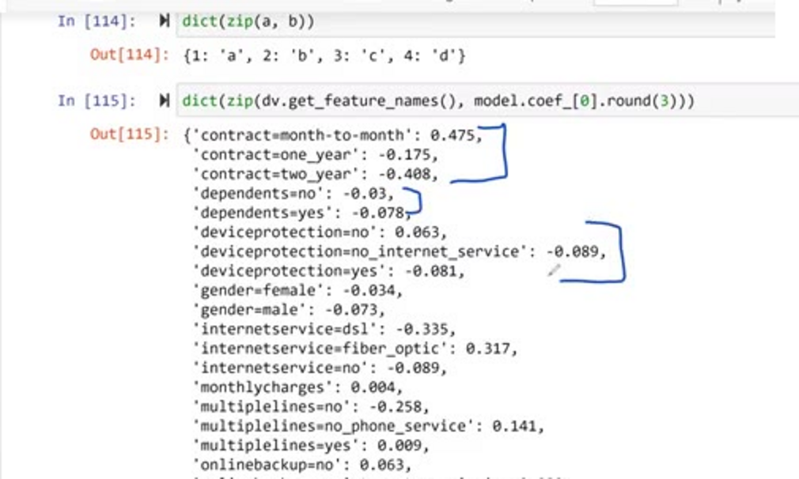
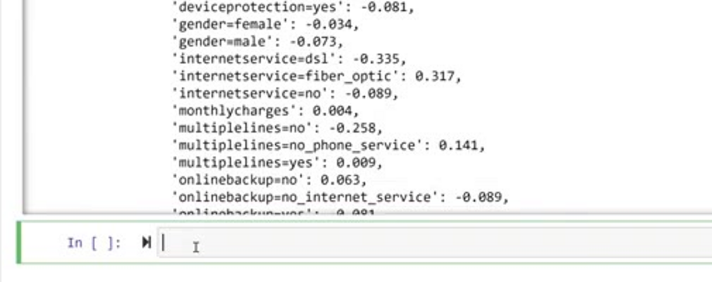
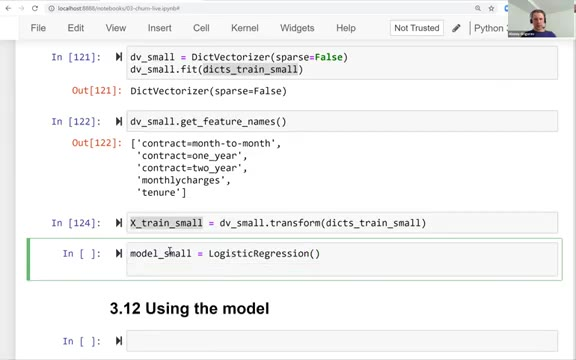
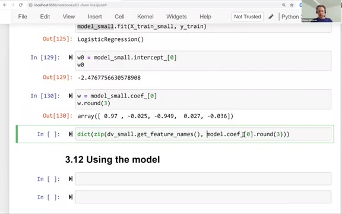
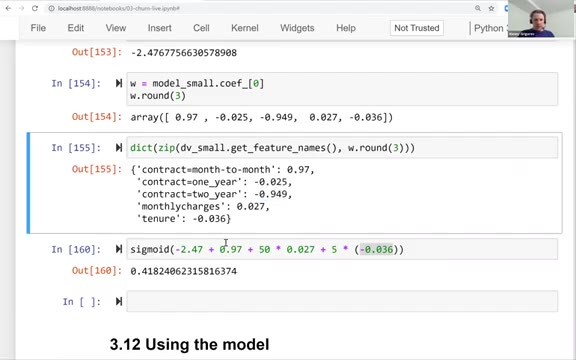
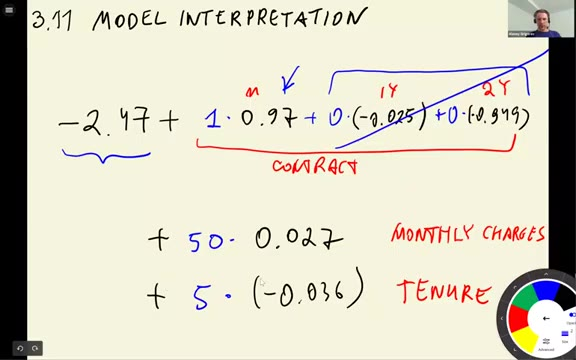
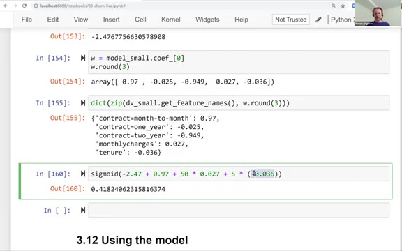

# Model interpretation

In this lesson we look inside the trained model: we match each weight
with its feature name, and then train a smaller model on three features
to see clearly how the weights work.

## Looking at the coefficients

The model we trained has 45 weights, but `model.coef_[0]` is just an
array of numbers - we do not know which weight belongs to which column.
Let's pair them up.

First, a quick reminder of how `zip` works. It takes two sequences and
joins them element by element:

```python
a = [1, 2, 3, 4]
b = 'abcd'
dict(zip(a, b))
```

```
{1: 'a', 2: 'b', 3: 'c', 4: 'd'}
```



We can do the same with the feature names and the weights:

```python
dict(zip(dv.get_feature_names_out(), model.coef_[0].round(3)))
```

```
{'contract=month-to-month': 0.475,
 'contract=one_year': -0.175,
 'contract=two_year': -0.408,
 ...
 'gender=female': -0.034,
 'gender=male': -0.073,
 'internetservice=dsl': -0.335,
 'internetservice=fiber_optic': 0.316,
 'internetservice=no': -0.089,
 ...
 'tenure': -0.07,
 'totalcharges': 0.0}
```



Now each weight has a name. The interpretation is the same as in linear
regression: a positive weight pushes the score - and therefore the
predicted probability - up, a negative weight pushes it down.

Some of what we see matches the feature importance analysis from the
beginning of the module. Recall that `internetservice=fiber_optic` had
a high churn risk and `contract=month-to-month` too - both get clearly
positive weights. Customers with `contract=two_year` almost never
churn, and its weight is the most negative one.

Note how the one-hot encoding works here. In the formula, every
category of a feature has its own weight, but for any given customer
only one of them is multiplied by 1 - all the others are multiplied by
0. So for contract, a month-to-month customer only "uses" the weight
0.475, a two-year customer only the weight -0.408.

The weights of the full model are a bit hard to trust individually -
there are many correlated features, and 45 weights is a lot to look at.
Let's train a smaller model.

## A smaller model

We take three features: `contract`, `tenure` and `monthlycharges` -
the ones that looked most important during EDA:

```python
small = ['contract', 'tenure', 'monthlycharges']

dicts_train_small = df_train[small].to_dict(orient='records')
dicts_val_small = df_val[small].to_dict(orient='records')
```

We encode them with a fresh `DictVectorizer`:

```python
dv_small = DictVectorizer(sparse=False)
dv_small.fit(dicts_train_small)
```

This time the vectorizer creates only five columns:

```python
dv_small.get_feature_names_out()
```

```
['contract=month-to-month',
 'contract=one_year',
 'contract=two_year',
 'monthlycharges',
 'tenure']
```



Three binary columns for the contract categories, plus the two
numerical features. Train the model on this small matrix:

```python
X_train_small = dv_small.transform(dicts_train_small)

model_small = LogisticRegression(solver='lbfgs')
model_small.fit(X_train_small, y_train)
```

And look at what it learned. The bias term:

```python
w0 = model_small.intercept_[0]
w0
```

```
-2.476775657751665
```



The weights, paired with their names:

```python
w = model_small.coef_[0]
dict(zip(dv_small.get_feature_names_out(), w.round(3)))
```

```
{'contract=month-to-month': 0.97,
 'contract=one_year': -0.025,
 'contract=two_year': -0.949,
 'monthlycharges': 0.027,
 'tenure': -0.036}
```

Now the picture is much clearer:

- Compared to a two-year contract (weight -0.949), being on
  month-to-month (weight +0.97) pushes churn probability up a lot
- Each extra month of tenure slightly decreases it (-0.036 per month)
- Monthly charges slightly increase it (+0.027 per dollar)

## Scoring a customer by hand

With five numbers we can compute a prediction manually. Take a
customer on a two-year contract, paying $30 per month, with 24 months
of tenure. The score is the bias plus the weighted features - only one
of the three contract weights applies, because only one of them is 1:

```python
-2.47 + (-0.949) + 30 * 0.027 + 24 * (-0.036)
```

```
-3.473
```

The score is -3.473. To turn it into a probability, apply the sigmoid.
In a notebook, the underscore `_` refers to the output of the previous
cell:

```python
sigmoid(_)
```

```
0.030090303318277657
```



Only a 3% chance of churn - exactly what we would expect from a
loyal customer on a two-year contract.

Try another one: month-to-month contract, $50 per month, 5 months of
tenure. The score is -2.47 + 0.97 + 50 * 0.027 - 5 * 0.036 = -0.33,
and the sigmoid of that is about 0.42 - a 42% churn risk.





One useful observation: the sigmoid of 0 is 0.5. So if the score is
positive, the customer is more likely to churn than not; if it is
negative, less likely. In the example above the score was -0.33, just
below the middle.

## Materials

[Slides](https://www.slideshare.net/AlexeyGrigorev/ml-zoomcamp-3-machine-learning-for-classification)

## Notes

This video was about the interpretation of coefficients, and training a model with fewer features. 

In the formula of the logistic regression model, only one of the one-hot encoded categories is multiplied by 1, and the other by 0. In this way, we only consider the appropriate category for each categorical feature. 

**Classes, functions, and methods:** 

* `zip(x,y)` - returns a new list with elements from x joined with their corresponding elements on y 

The entire code of this project is available in [this jupyter notebook](https://github.com/DataTalksClub/machine-learning-zoomcamp/blob/main/cohorts/2026/03-classification/notebook.ipynb). 

<table>
   <tr>
      <td>⚠️</td>
      <td>
         The notes are written by the community. <br>
         If you see an error here, please create a PR with a fix.
      </td>
   </tr>
</table>

* [Notes from Peter Ernicke](https://knowmledge.com/2023/10/01/ml-zoomcamp-2023-machine-learning-for-classification-part-11/)
