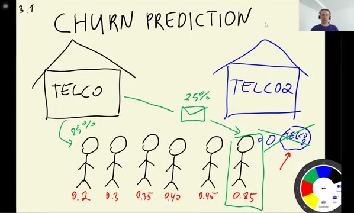
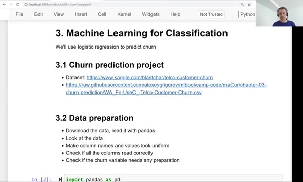
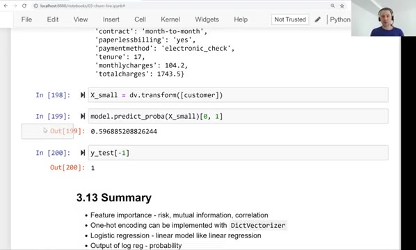

# Summary

In this module we built a complete churn prediction project. This is a
quick recap of everything we did, from the raw dataset to a model that
scores customers.

## What we did

The dataset was the Telco churn data: about 7,000 customers of a telecom
company, with information about their contracts, services and payments.
Around 27% of them churned.

We went through the standard project pipeline:

- Data preparation - cleaned up column names, fixed the `totalcharges`
  column, and converted the target to 0/1
- Validation framework - split the data into train, validation and test
  (60%/20%/20%) with Scikit-Learn
- EDA - looked at missing values, the target variable, and the
  distribution of the features
- Feature importance - measured the risk ratio and difference for
  categorical features, mutual information (`contract` was the most
  informative one, 0.098), and the correlation coefficient for numerical
  features (`tenure` was the most correlated, 0.35)
- One-hot encoding - turned categorical variables into binary columns
  with `DictVectorizer`, ending up with a 45-column feature matrix
- Logistic regression - trained it with Scikit-Learn, reached about 80%
  accuracy on validation and 81.5% on test
- Model interpretation - matched weights to feature names with `zip`,
  trained a smaller model on `contract`, `tenure` and `monthlycharges`,
  and computed a prediction by hand
- Using the model - retrained on the full training data and scored
  individual customers

## Main takeaways

- Feature importance - risk, mutual information, correlation
- One-hot encoding can be implemented with `DictVectorizer`
- Logistic regression - a linear model like linear regression
- The output of logistic regression is a probability
- Interpretation of weights is similar to linear regression

The same scheme works for many other binary classification problems:
spam detection, default prediction, lead scoring - anywhere the answer
is yes/no and you want a probability with it.

For ideas on how to extend this project, see
[Explore more](14-explore-more.md).

## Materials

[Slides](https://www.slideshare.net/AlexeyGrigorev/ml-zoomcamp-3-machine-learning-for-classification)

## Notes

In this session, we worked on a project to predict churning in customers from a company. We learned the feature importance of numerical and categorical variables, including risk ratio, mutual information, and correlation coefficient. Also, we understood one-hot encoding and implemented logistic regression with Scikit-Learn. 

<table>
   <tr>
      <td>⚠️</td>
      <td>
         The notes are written by the community.  
         If you see an error here, please create a PR with a fix.
      </td>
   </tr>
</table>
