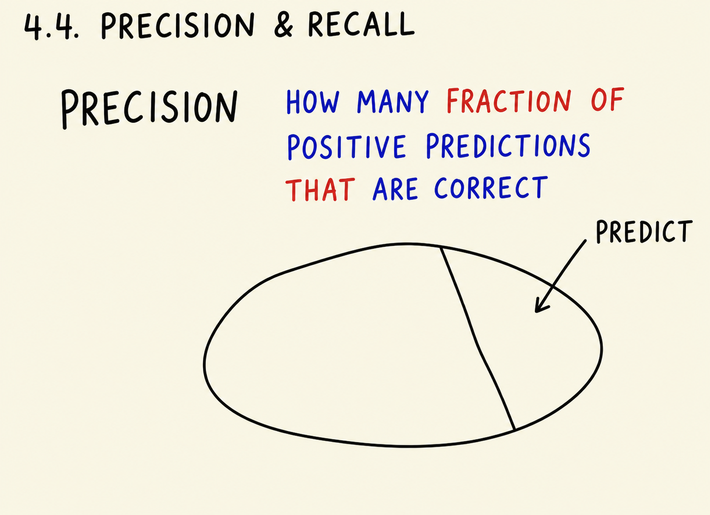
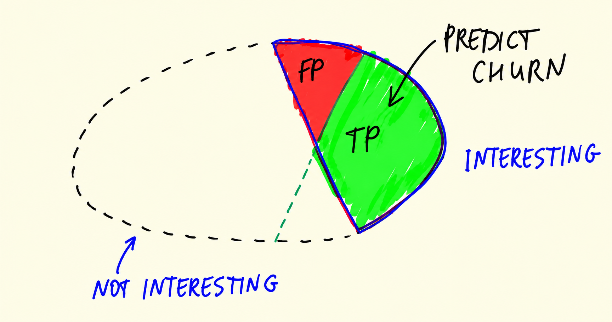
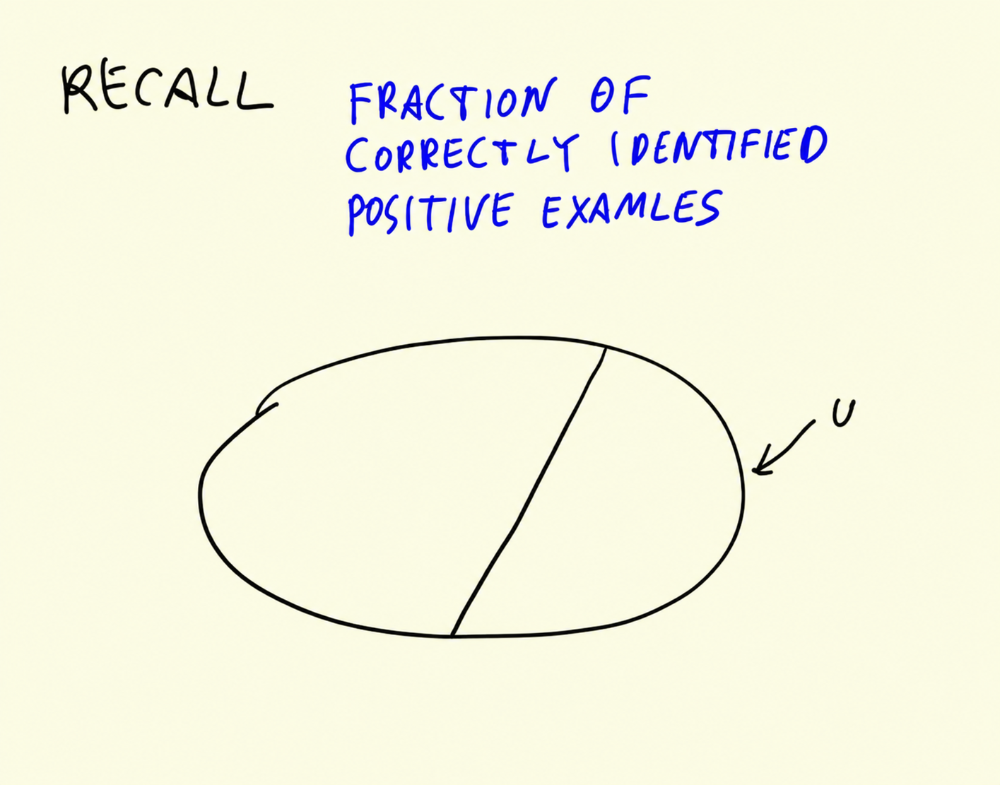
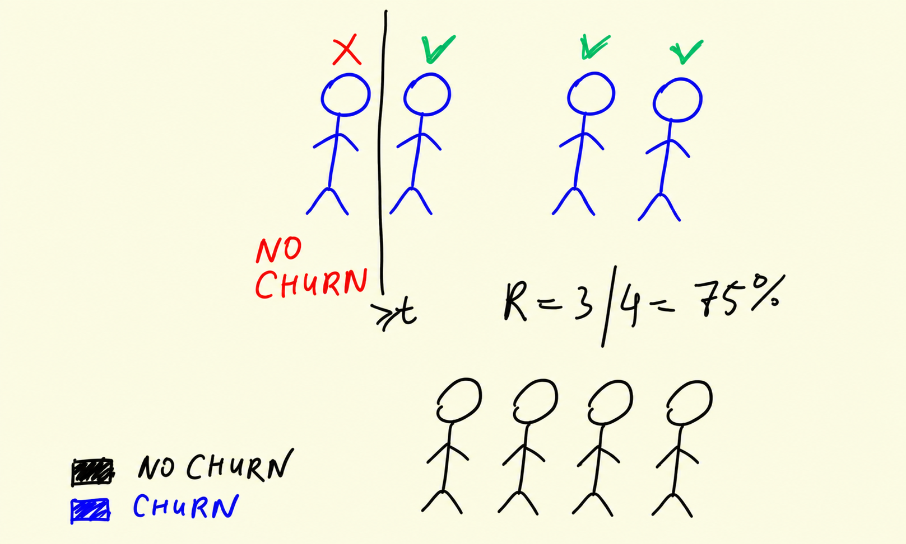
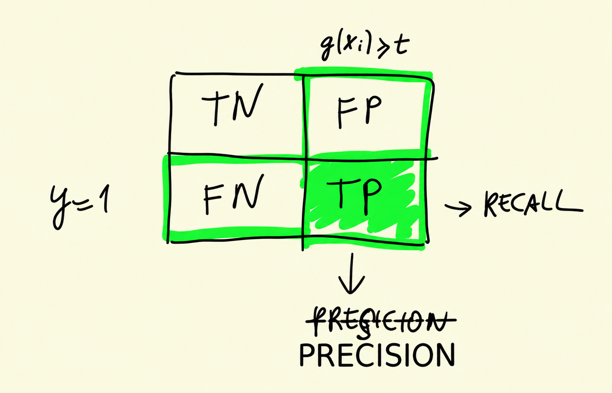

# Precision and Recall

The confusion table showed us our model makes two very different kinds of mistakes. Precision and recall are the two metrics that look at each kind separately: they both focus on the positive class - the customers we want to catch - and they both see problems that accuracy hides.

## Precision

Precision tells us the fraction of positive predictions that are correct. It looks only at the customers we predicted to churn - the positive column of the confusion table (TP and FP):

```text
P = TP / (TP + FP)
```



For our model:

```python
p = tp / (tp + fp)
p
```

This gives `0.6752411575562701` - precision of about 67%.

In the terms of the churn problem: we send a retention email to everyone predicted to churn. That is 210 + 101 = 311 people, but only 210 of them (the true positives) were actually going to leave. The other 101 - about a third of all emails - go to customers who were never at risk, and the discount we send them is wasted.



## Recall

Recall measures the fraction of actual positive instances that we identified correctly. It looks at the customers who really churned - the positive row of the confusion table (TP and FN):

```text
R = TP / (TP + FN)
```



For our model:

```python
r = tp / (tp + fn)
r
```

This gives `0.5440414507772021` - recall of about 54%.

Again in the terms of the problem: 210 + 176 = 386 customers actually churned, but our model flagged only 210 of them. For the remaining 176 - about 46% of all churners - we did nothing: no email, no discount, and the customer left. This is the part accuracy never showed us.



## Why not just accuracy

Recall what accuracy said: 80% correct, only 4 points above the dummy model. Precision and recall explain where the model actually stands: of the customers we alert, two thirds are real (precision 67%), but we miss almost half of the customers who leave (recall 54%).



These numbers reflect the errors of our model that accuracy did not notice because of class imbalance: churners are only 27% of the data, so the 12% of false negatives barely move the accuracy number, yet they are half of all the customers we care about. When the classes are imbalanced - churn, fraud, medical diagnosis - precision and recall are the metrics to look at.

## Materials

[Slides](https://www.slideshare.net/AlexeyGrigorev/ml-zoomcamp-4-evaluation-metrics-for-classification)

## Notes

**Precision** tell us the fraction of positive predictions that are correct. It takes into account only the **positive class** (TP and FP - second column of the confusion matrix), as is stated in the following formula:


$$P = \cfrac{TP}{TP + FP}$$


**Recall** measures the fraction of correctly identified positive instances. It considers parts of the **positive and negative classes** (TP and FN - second row of confusion table). The formula of this metric is presented below: 


$$R = \cfrac{TP}{TP + FN}$$


 In this problem, the precision and recall values were 67% and 54% respectively. So, these measures reflect some errors of our model that accuracy did not notice due to the **class imbalance**. 

**MNEMONICS:**

- Precision : From the `pre`dicted positives, how many we predicted right. See how the word `pre`cision is similar to the word `pre`diction? 

- Recall : From the `real` positives, how many we predicted right. See how the word `re`c`al`l is similar to the word `real`?

<table>
   <tr>
      <td>⚠️</td>
      <td>
         The notes are written by the community. <br>
         If you see an error here, please create a PR with a fix.
      </td>
   </tr>
</table>

* [Notes from Peter Ernicke](https://knowmledge.com/2023/10/05/ml-zoomcamp-2023-evaluation-metrics-for-classification-part-4/)
