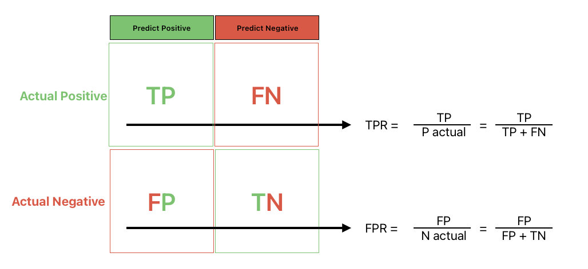
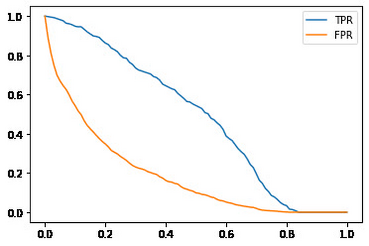
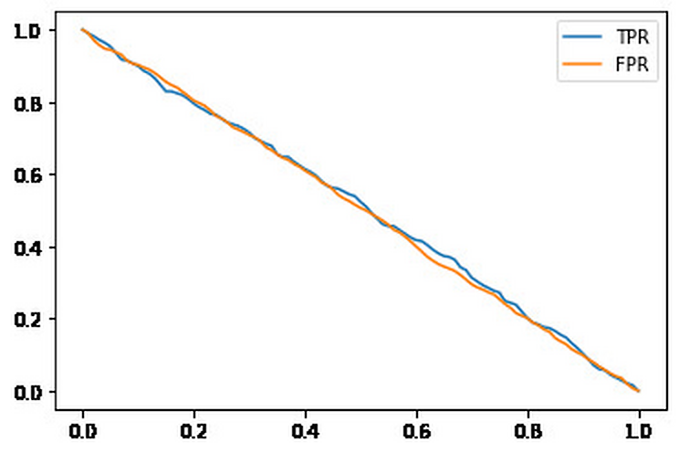
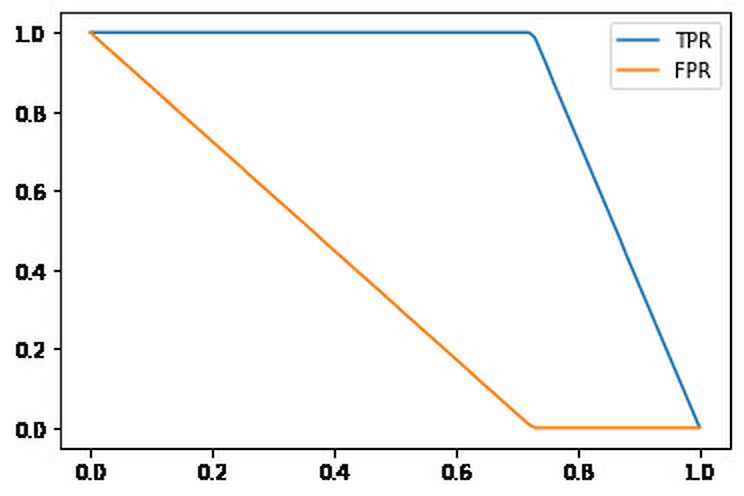
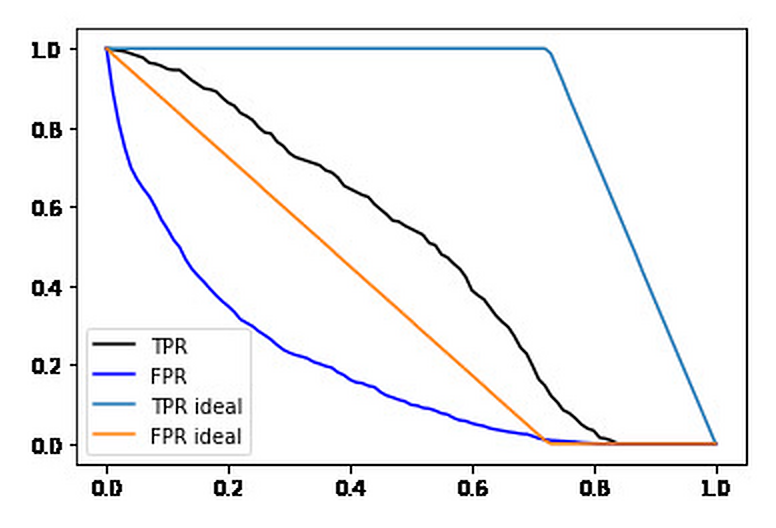
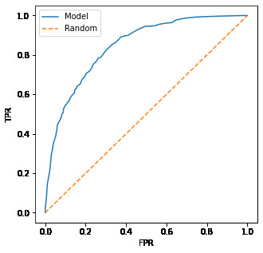

# ROC Curves

Precision and recall look at the model at one fixed threshold. A ROC curve looks at all possible thresholds at once, which makes it a way to evaluate the performance of a binary classifier over its whole range of operating points. ROC stands for Receiver Operating Characteristic - the idea comes from the Second World War, where it was used to evaluate the strength of radio detectors.

## TPR and FPR

The ROC curve is built from two rates derived from the confusion table.

The true positive rate (TPR) is the fraction of actual positives we identified correctly - it is the same thing as recall: TP divided by all positive observations (TP and FN, the second row of the table). This is the metric we want to maximize.

```text
TPR = TP / (TP + FN)
```

The false positive rate (FPR) is the fraction of actual negatives we got wrong: FP divided by all negative observations (FP and TN, the first row of the table). This is the metric we want to minimize.

```text
FPR = FP / (FP + TN)
```



For our model at threshold 0.5:

```python
tpr = tp / (tp + fn)
fpr = fp / (fp + tn)
```

TPR is `0.5440414507772021` (the same 54% as recall) and FPR is `0.09872922776148582` - we bother 10% of the customers who were never going to churn.

## TPR and FPR at all thresholds

These two numbers describe the model at one threshold. Now let's compute them for many thresholds. We loop over 101 thresholds from 0 to 1 and record tp, fp, fn and tn for each:

```python
scores = []

thresholds = np.linspace(0, 1, 101)

for t in thresholds:
    actual_positive = (y_val == 1)
    actual_negative = (y_val == 0)
    
    predict_positive = (y_pred >= t)
    predict_negative = (y_pred < t)

    tp = (predict_positive & actual_positive).sum()
    tn = (predict_negative & actual_negative).sum()

    fp = (predict_positive & actual_negative).sum()
    fn = (predict_negative & actual_positive).sum()
    
    scores.append((t, tp, fp, fn, tn))

columns = ['threshold', 'tp', 'fp', 'fn', 'tn']
df_scores = pd.DataFrame(scores, columns=columns)

df_scores['tpr'] = df_scores.tp / (df_scores.tp + df_scores.fn)
df_scores['fpr'] = df_scores.fp / (df_scores.fp + df_scores.tn)
```

Plotting both rates against the threshold shows how the trade-off shifts: as the threshold grows, we flag fewer customers, so both the true positive rate and the false positive rate fall:

```python
plt.plot(df_scores.threshold, df_scores['tpr'], label='TPR')
plt.plot(df_scores.threshold, df_scores['fpr'], label='FPR')
plt.legend()
```



## The random model

To read this curve we need points of reference. The first one: a model that outputs random scores. We generate a uniform random score for every customer:

```python
np.random.seed(1)
y_rand = np.random.uniform(0, 1, size=len(y_val))
```

Its accuracy at threshold 0.5 is `0.5017743080198722` - a coin flip, as expected. Computing the TPR/FPR table for these random scores (with the same loop, wrapped in a reusable function `tpr_fpr_dataframe`) and plotting gives two almost straight lines going down together:



For the random model, at any threshold the fraction of positives we catch is the same as the fraction of negatives we bother - it cannot tell the two groups apart.

## The ideal model

The second reference: an ideal model that ranks all customers perfectly - every churner gets a higher score than every non-churner. We build it by hand: sort the customers so all 1023 negatives come first, then all 386 positives, and give them scores evenly spread from 0 to 1:

```python
num_neg = (y_val == 0).sum()
num_pos = (y_val == 1).sum()

y_ideal = np.repeat([0, 1], [num_neg, num_pos])
y_ideal_pred = np.linspace(0, 1, len(y_val))
```

Where should we put the threshold? At the fraction of negatives, 0.726 - the ideal score that separates the two groups:

```python
accuracy_score(y_ideal, y_ideal_pred >= 0.726)
```

This gives `1.0` - perfect predictions, as an ideal model should. Its TPR and FPR vs threshold:



The ideal TPR stays at 1.0 for every threshold below 0.726 - it catches all churners while they all score higher than any non-churner - and only then drops. The ideal FPR falls to 0 at that same point.

## Putting everything together

Plotting our model together with the ideal one makes the comparison obvious: the black TPR curve of our model is clearly below the ideal, and the blue FPR curve above the ideal - the gap between them is the room our model still has to improve:

```python
plt.plot(df_scores.threshold, df_scores['tpr'], label='TPR', color='black')
plt.plot(df_scores.threshold, df_scores['fpr'], label='FPR', color='blue')

plt.plot(df_ideal.threshold, df_ideal['tpr'], label='TPR ideal')
plt.plot(df_ideal.threshold, df_ideal['fpr'], label='FPR ideal')

plt.legend()
```



## The ROC curve

The ROC curve itself plots TPR against FPR - not against the threshold. Each point on the curve is the model operating at one threshold: the bottom-left corner is a conservative model (flag almost nobody, bother almost nobody), the top-right corner flags everybody. We plot our model against the random one, which becomes the diagonal line from (0, 0) to (1, 1):

```python
plt.figure(figsize=(5, 5))

plt.plot(df_scores.fpr, df_scores.tpr, label='Model')
plt.plot([0, 1], [0, 1], label='Random', linestyle='--')

plt.xlabel('FPR')
plt.ylabel('TPR')

plt.legend()
```



The lesson to take away: the closer the curve hugs the top-left corner - high true positive rate at a low false positive rate - the better the model. A curve sitting on the diagonal belongs to a random model.

## ROC curves with scikit-learn

We don't have to compute the table by hand: `roc_curve` from scikit-learn does it in one call, returning the false positive rates, the true positive rates and the thresholds:

```python
from sklearn.metrics import roc_curve

fpr, tpr, thresholds = roc_curve(y_val, y_pred)
```

The resulting curve is the same:

```python
plt.figure(figsize=(5, 5))

plt.plot(fpr, tpr, label='Model')
plt.plot([0, 1], [0, 1], label='Random', linestyle='--')

plt.xlabel('FPR')
plt.ylabel('TPR')

plt.legend()
```


What kind of information do we get from this curve - and how do we boil it down to a single number? That is the ROC AUC metric, the topic of the next lesson.

## Materials

[Slides](https://www.slideshare.net/AlexeyGrigorev/ml-zoomcamp-4-evaluation-metrics-for-classification)

- [Continuation of this lesson](https://www.youtube.com/watch?v=B5PATo1J6yw&list=PL3MmuxUbc_hIhxl5Ji8t4O6lPAOpHaCLR)

## Notes

ROC stands for Receiver Operating Characteristic, and this idea was applied during the Second World War for evaluating the strength of radio detectors. This measure considers **False Positive Rate** (FPR) and **True Postive Rate** (TPR), which are derived from the values of the confusion matrix.

**FPR** is the fraction of false positives (FP) divided by the total number of negatives (FP and TN - the first row of confusion matrix), and we want to `minimize` it. The formula of FPR is the following: 

<p align="center">
    $FPR = \large \frac{FP}{TN + FP}$
</p>

In the other hand, **TPR** or **Recall** is the fraction of true positives (TP) divided by the total number of positives (FN and TP - second row of confusion table), and we want to `maximize` this metric. The formula of this measure is presented below: 

<p align="center">
    $TPR =\large \frac{TP}{TP + FN}$
</p>


ROC curves consider Recall and FPR under all the possible thresholds. If the threshold is 0 or 1, the FPR and Recall scores are the opposite of the threshold (1 and 0 respectively), but they have different meanings, as we explained before. 

We need to compare the ROC curves against a point of reference to evaluate its performance, so the corresponding curves of random and ideal models are required. It is possible to plot the ROC curves with FPR and Recall scores vs thresholds, or FPR vs Recall. 


**Classes and methods:** 
* `np.repeat([x,y], [z,w])` - returns a numpy array with a z number of x values first, and then a w number of y values. 
* `roc_curve(x, y)` - sklearn.metrics class for calculating the false positive rates, true positive rates, and thresholds, given a target x dataset and a predicted y dataset. 

The entire code of this project is available in [this jupyter notebook](https://github.com/alexeygrigorev/mlbookcamp-code/blob/master/course-zoomcamp/04-evaluation/notebook.ipynb). 

<table>
   <tr>
      <td>⚠️</td>
      <td>
         The notes are written by the community. <br>
         If you see an error here, please create a PR with a fix.
      </td>
   </tr>
</table>

* [Notes from Peter Ernicke](https://knowmledge.com/2023/10/06/ml-zoomcamp-2023-evaluation-metrics-for-classification-part-5/)
