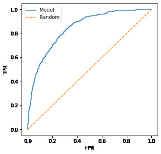
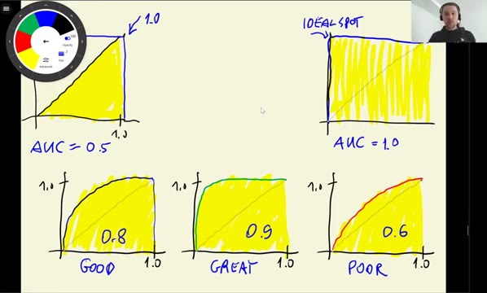
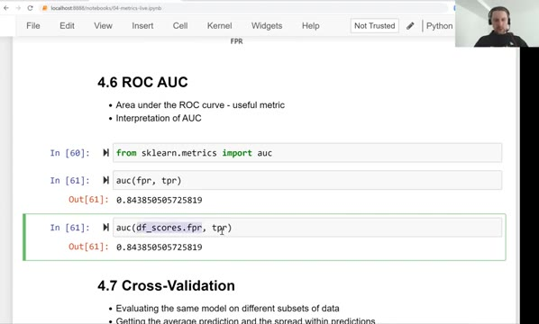
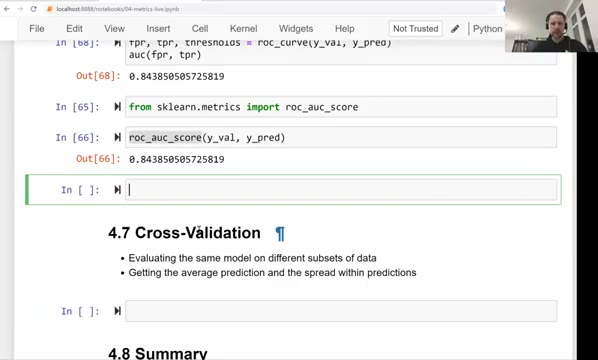
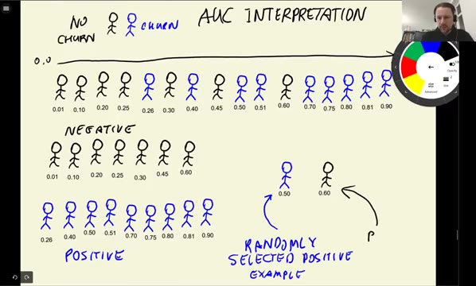
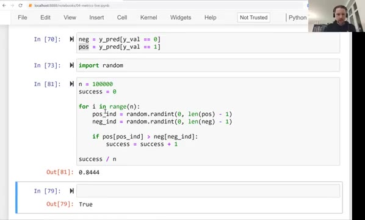
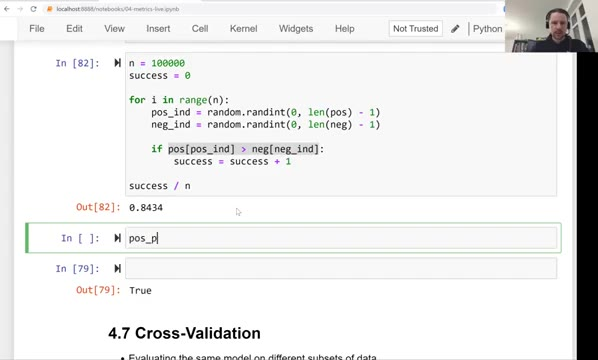

# ROC AUC

A curve is a picture, not a number. In this lesson we compress the ROC curve into a single metric - the area under the ROC curve, abbreviated ROC AUC or just AUC - and then look at a very useful interpretation of what that number actually means.

## Area under the ROC curve

Here is the ROC curve of our model again - the TPR against the FPR at all thresholds. The AUC of a model is the area under this curve:



The interpretation of the reference points follows straight from the shape of the curve:

- The ideal model covers the whole square above the diagonal, so its AUC is 1.
- The random model sits on the diagonal and covers only the triangle below it, so its AUC is 0.5.

A real model lands between 0.5 and 1: the closer its curve is to the top-left corner, the larger the area under it. As a rule of thumb, an AUC around 0.8 is considered good, 0.9 is great, and 0.6 is poor.



Scikit-learn computes the area with `auc`, which works for any curve, not only ROC curves:

```python
from sklearn.metrics import auc

auc(fpr, tpr)
```

This gives `0.843850505725819`. Feeding it the table we computed by hand in the previous lesson gives practically the same number - `0.8438796286447967` - and the ideal curve gives `0.9999430203759136`, almost exactly 1.



There is also a shortcut that computes the ROC curve and the area in one step:

```python
from sklearn.metrics import roc_auc_score

roc_auc_score(y_val, y_pred)
```

This gives `0.843850505725819` - the same value as with `auc(fpr, tpr)`. Our churn model has an AUC of 0.84: clearly better than random, not far from ideal.



## Interpreting AUC

AUC has a second, probabilistic interpretation that makes it very intuitive: AUC is the probability that a randomly selected positive example has a greater score than a randomly selected negative example.

In our case: pick a random customer who churned and a random customer who stayed - how likely is it that our model gave the churner the higher risk score? That probability is exactly the AUC.



We can check this by simulation. First we split the predictions into the scores of negatives and positives:

```python
neg = y_pred[y_val == 0]
pos = y_pred[y_val == 1]
```

Then we repeatedly draw one score from each group at random and count how often the positive one wins:

```python
import random

n = 100000
success = 0 

for i in range(n):
    pos_ind = random.randint(0, len(pos) - 1)
    neg_ind = random.randint(0, len(neg) - 1)

    if pos[pos_ind] > neg[neg_ind]:
        success = success + 1

success / n
```



The result is `0.8434` - practically the same as the AUC of `0.843850505725819`.

The same comparison in vectorized NumPy: draw 50000 random indices into each group at once, compare the scores element-wise, and take the mean of the resulting boolean array:

```python
n = 50000

np.random.seed(1)
pos_ind = np.random.randint(0, len(pos), size=n)
neg_ind = np.random.randint(0, len(neg), size=n)

(pos[pos_ind] > neg[neg_ind]).mean()
```

This gives `0.84646` - again close to the AUC.



Because of this ranking interpretation, AUC is a popular metric for binary classification: it says how well the model separates the two classes, and it does not depend on the class balance or on any particular threshold.

## Materials

[Slides](https://www.slideshare.net/AlexeyGrigorev/ml-zoomcamp-4-evaluation-metrics-for-classification)

## Notes

The Area under the ROC curves can tell us how good is our model with a single value. The AUROC of a random model is 0.5, while for an ideal one is 1. 

In other words, AUC can be interpreted as the probability that a randomly selected positive example has a greater score than a randomly selected negative example.

**Classes and methods:** 

* `auc(x, y)` - sklearn.metrics class for calculating area under the curve of the x and y datasets. For ROC curves x would be false positive rate, and y true positive rate. 
* `roc_auc_score(x, y)` - sklearn.metrics class for calculating area under the ROC curves of the x false positive rate and y true positive rate datasets.
* `randint(x, y, size=z)` - np.random class for generating random integers from the “discrete uniform” distribution; from `x` (inclusive) to `y` (exclusive) of size `z`. 

The entire code of this project is available in [this jupyter notebook](notebook.ipynb).  

<table>
   <tr>
      <td>⚠️</td>
      <td>
         The notes are written by the community. <br>
         If you see an error here, please create a PR with a fix.
      </td>
   </tr>
</table>

* [Notes from Peter Ernicke](https://knowmledge.com/2023/10/07/ml-zoomcamp-2023-evaluation-metrics-for-classification-part-6/)
