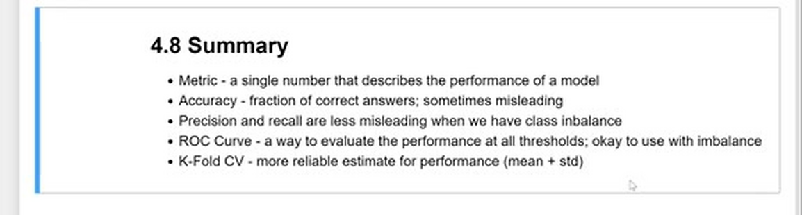

# Summary

In this final lesson of module 4 we wrap up everything we learned about evaluating a binary classifier. This week was about different metrics to evaluate the churn model: accuracy, the confusion table, precision, recall, ROC curves (TPR, FPR, the random model, and the ideal model), ROC AUC, and cross-validation for parameter tuning.

## The metrics in one place

- Metric: a single number that describes the performance of a model
- Accuracy: the fraction of correct answers; sometimes misleading, especially with class imbalance - a dummy model predicting "no churn" for everybody already gets 73%
- Precision and recall: less misleading when we have class imbalance; precision checks how many of our positive predictions are right, recall checks how many real positives we caught
- ROC Curve: a way to evaluate the performance at all thresholds; okay to use with imbalance
- ROC AUC: the area under the ROC curve - 0.5 for a random model, 1.0 for an ideal one; interpretable as the probability that a random positive scores higher than a random negative
- K-Fold CV: a more reliable estimate for performance (mean + std), used for parameter tuning

With the metric chosen and the parameter tuned, the model is ready: in module 5 we take this churn model and deploy it as a service. There are also a few ideas to dig deeper in [Explore more](09-explore-more.md).

## Materials

[Slides](https://www.slideshare.net/AlexeyGrigorev/ml-zoomcamp-4-evaluation-metrics-for-classification)

## Notes

General definitions: 

* **Metric:** A single number that describes the performance of a model
* **Accuracy:** Fraction of correct answers; sometimes misleading 
* Precision and recall are less misleading when we have class imbalance
* **ROC Curve:** A way to evaluate the performance at all thresholds; okay to use with imbalance
* **K-Fold CV:** More reliable estimate for performance (mean + std)

In brief, this weeks was about different metrics to evaluate a binary classifier. These measures included accuracy, confusion table, precision, recall, ROC curves(TPR, FPR, random model, and ideal model), and AUROC. Also, we talked about a different way to estimate the performance of the model and make the parameter tuning with cross-validation. 

The code of this project is available in [this jupyter notebook](https://github.com/alexeygrigorev/mlbookcamp-code/blob/master/course-zoomcamp/04-evaluation/notebook.ipynb).  

<table>
   <tr>
      <td>⚠️</td>
      <td>
         The notes are written by the community.  
         If you see an error here, please create a PR with a fix.
      </td>
   </tr>
</table>

- [Notes from Maximilien Eyengue](https://github.com/maxim-eyengue/Python-Codes/blob/main/ML_Zoomcamp_2024/04_evaluation/Summary_Session_04.md)
