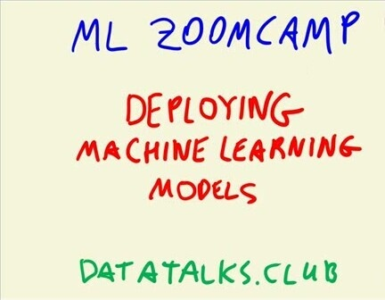
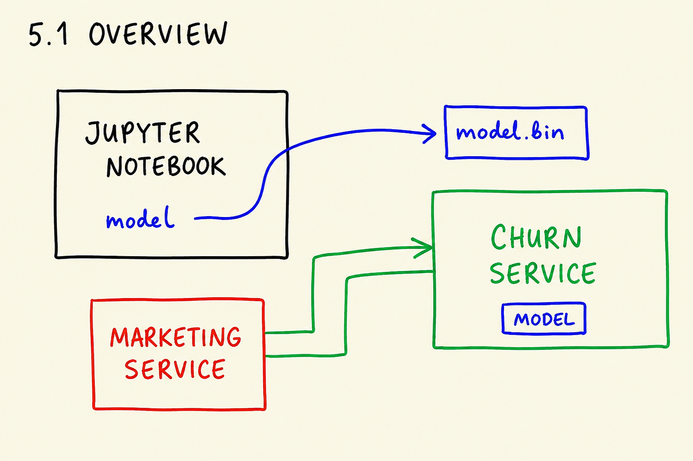
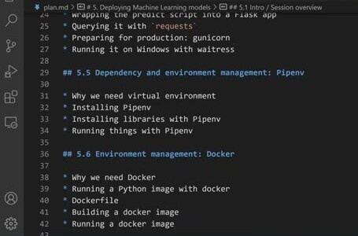
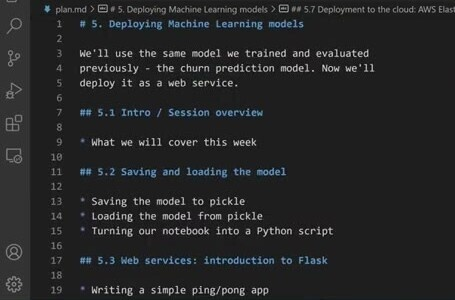
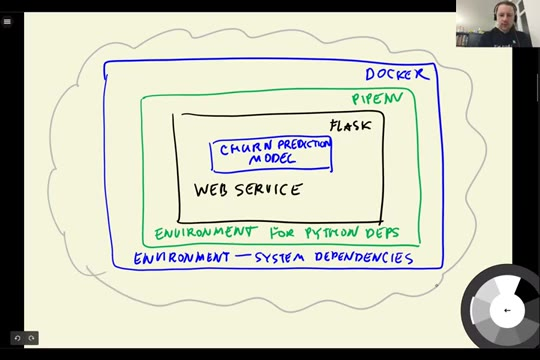

# Intro / Session overview

In this unit we look at what we will build in module 5: taking the churn
prediction model we trained earlier and turning it into a service that other
systems can call over the network.

## The problem: the model lives in a notebook

In module 3 we trained a model that predicts whether a customer of a telecom
company will churn - stop using the service. The model is useful only if
people can actually use it. Right now it lives inside a notebook: to get a
prediction, we open the notebook, run all the cells, and look at the output.
That is fine for us, but the rest of the company cannot work this way.

Imagine the marketing team wants to send a promo email to customers who are
likely to leave. Their system needs to ask the model: "what is the churn
probability of this customer?" - automatically, for thousands of customers,
without anyone opening a notebook.

The solution is to deploy the model: run it on a server and expose an API
endpoint. Other services - like the marketing service - send a request with
the customer information to this endpoint, and get the prediction back in the
response. Based on that response, the marketing service can decide to send a
promo email or do nothing.

## The plan for this module

We will take the churn model from the notebook to a working web service step
by step:

- Saving and loading the model with pickle, and turning the notebook into a
  Python script, so the model can be used without re-training it every time.
- Creating a web service with Flask: first a small ping/pong service, then
  the actual churn service that answers prediction requests.
- Preparing the service for production with gunicorn (or waitress on
  Windows) instead of the Flask development server.
- Managing the project dependencies with Pipenv, so the service runs with the
  library versions we tested it with.
- Packaging everything into a Docker container, so it can run the same way on
  any machine.
- Finally, deploying the container to the cloud with AWS Elastic Beanstalk
  (optional), which makes the service available on the internet.

Each step removes one thing that ties the model to our laptop: the notebook,
the development server, the system-wide Python packages, the operating system
and finally the local machine itself.

## Materials

[Slides](https://www.slideshare.net/AlexeyGrigorev/ml-zoomcamp-5-model-deployment)

## Notes

In this session, we talked about the earlier model we made in chapter 3 for churn prediction.  
This chapter contains the deployment of the model. If we want to use the model to predict new values without running the code, there's a way to do this. The way to use the model in different machines without running the code, is to deploy the model in a server (run the code and make the model). After deploying the code in a machine used as server we can make some endpoints (using api's) to connect from another machine to the server and predict values.

Model deployment is crucial when you need to use the model across different machines or applications without having to retrain or rerun the code. By deploying the model as a web service, external systems (like marketing services) can send requests to the server to get predictions, such as whether a customer is likely to churn. Based on the prediction, actions like sending promotional offers can be automated.

To deploy the model in a server there are some steps:
1. **Train and Save the Model**: After training the model, save it as a file, to use it for making predictions in future (session 02-pickle).
2. **Create API Endpoints**: Make the API endpoints in order to request predictions. It is possible to use the Flask framework to create web service API endpoints that other services can interact with (session 03-flask-intro and 04-flask-deployment).
3. **Some other server deployment options** (sessions 5 to 9):
   - **Pipenv**: Create isolated environments to manage the Python dependencies of the web service, ensuring they don't interfere with other services on the machine.
   - **Docker**: Package the service in a Docker container, which includes both system and Python dependencies, making it easier to deploy consistently across different environments. 
4. **Deploy to the Cloud**: Finally, deploy the Docker container to a cloud service like AWS to make the model accessible globally, ensuring scalability and reliability.

<table>
   <tr>
      <td>⚠️</td>
      <td>
         The notes are written by the community.  
         If you see an error here, please create a PR with a fix.
      </td>
   </tr>
</table>

* [Notes from Peter Ernicke](https://knowmledge.com/2023/10/09/ml-zoomcamp-2023-deploying-machine-learning-models-part-1/)
