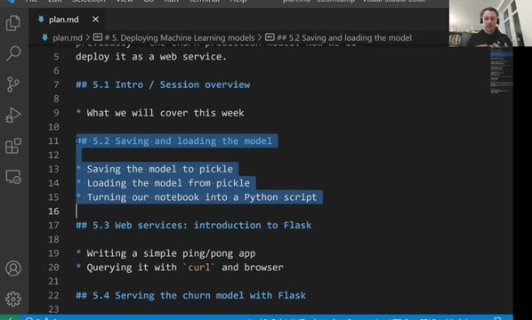
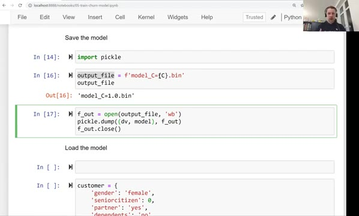
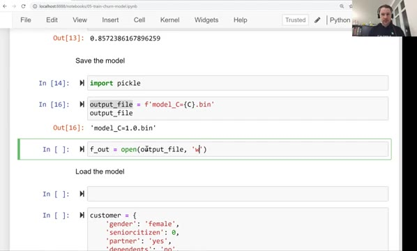
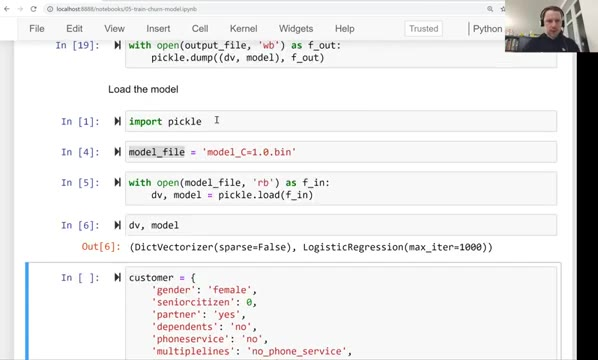
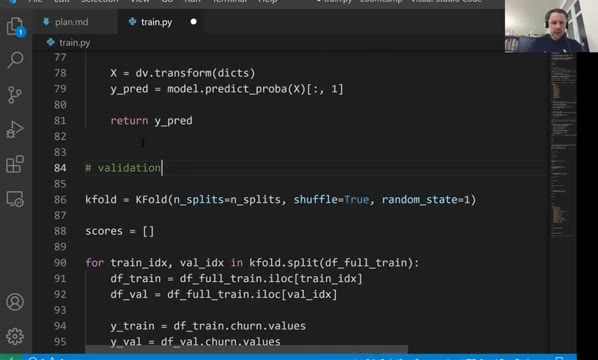

# Saving and loading the model

In this unit we save the trained churn model to a file with pickle, load it
back, and turn the notebook into a Python script - so the model can be used
later without training it again.



## Why we need to save the model

Training gives us two objects: the `DictVectorizer` that turns customer
records into a feature matrix, and the logistic regression model itself. Both
live in the memory of the notebook process - close the notebook and they are
gone.

Re-training the model every time we want a prediction is wasteful: training
takes time, and we would get a slightly different model depending on the data
split and random state. What we want instead is to train once, save the
result to a file, and later simply load that file in the web service.

## Saving with pickle

Pickle is a standard Python library for serializing objects: it writes a
Python object into a binary file, and can read it back later. We save both
the vectorizer and the model together as a tuple:

```python
import pickle

output_file = f'model_C={C}.bin'

with open(output_file, 'wb') as f_out:
    pickle.dump((dv, model), f_out)
```



The `'wb'` mode means write-binary - pickle produces binary data, so we must
not open the file in text mode. We name the file with the value of `C` we
used, because after tuning in the previous module we know this parameter, and
it is useful to see it in the filename: `model_C=1.0.bin`.



The vectorizer has to travel with the model. It was fitted on the training
data and it "remembers" which categorical values map to which feature columns
- without it, we cannot prepare a new customer record the same way.

## Loading the model

To use the model - for example, from a web service - we load the file back:

```python
import pickle

with open('model_C=1.0.bin', 'rb') as f_in:
    dv, model = pickle.load(f_in)
```

Here `'rb'` is read-binary. `pickle.load` returns the tuple we saved, and we
unpack it into `dv` and `model`. From this point we can score customers
without running any training code.



One warning: never unpickle a file from a source you do not trust. Pickle
files can contain code, and loading one executes it - only load files you
created yourself or that come from someone you trust.

## From notebook to script

The last step is moving the training code out of the notebook into a plain
Python script. The script - [train.py](code/train.py) in the module's
[code/](code/) directory - contains the same steps we developed in the
notebook:

- loading and cleaning the churn dataset,
- splitting it into train and test,
- the `train` and `predict` functions,
- cross-validation with `KFold` to report the AUC for `C=1.0`,
- training the final model and saving it with pickle.



A script is what we will actually run on a server: it is reproducible, it can
be executed by a scheduler or a CI job, and it does not require a running
Jupyter instance.

In the [next unit](03-flask-intro.md) we create our first web service with
Flask.

## Materials

[Slides](https://www.slideshare.net/AlexeyGrigorev/ml-zoomcamp-5-model-deployment)

## Notes
**In this session we'll cover the idea "How to use the model in future without training and evaluating the code"**
- To save the model we made before there is an option using the pickle library:
  - First install the library with the command ```pip install pickle-mixin``` if you don't have it.
  - After training the model and making it ready for the prediction process, use this code to save the model for later.
  - ```python
    import pickle
    
    with open('model.bin', 'wb') as f_out: # 'wb' means write-binary
        pickle.dump((dict_vectorizer, model), f_out)
    ```
  - In the code above we'll make a binary file named model.bin, and write the dict_vectorizer for one hot encoding and the model as array in it. (We will save it as binary in case it wouldn't be readable by humans)
  - To be able to use the model in future without running the code, We need to open the binary file we saved before.
  - ```python
    import pickle
    
    with open('mode.bin', 'rb') as f_in: # very important to use 'rb' here, it means read-binary 
        dict_vectorizer, model = pickle.load(f_in)
    ## Note: never open a binary file you do not trust the source!
    ```
   - With unpacking the model and the dict_vectorizer, We're able to predict again for new input values without training a new model by re-running the code.

<table>
   <tr>
      <td>⚠️</td>
      <td>
         The notes are written by the community. <br>
         If you see an error here, please create a PR with a fix.
      </td>
   </tr>
</table>

* [Notes from Peter Ernicke](https://knowmledge.com/2023/10/10/ml-zoomcamp-2023-deploying-machine-learning-models-part-2/)
