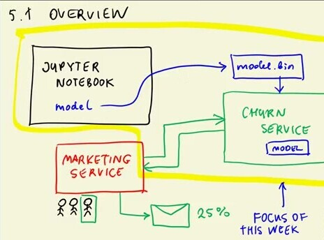
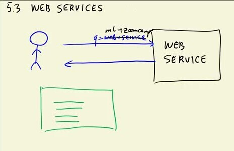
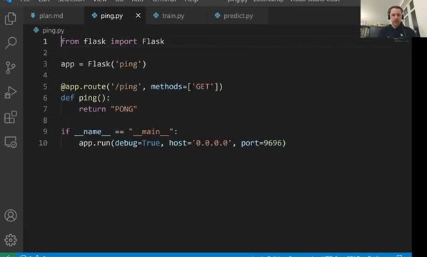

# Web services: introduction to Flask

In this unit we learn what a web service is and write our first one: a tiny
Flask app that answers a ping request with "PONG".



## What is a web service?

A web service is a way for applications to talk to each other over HTTP - the
same protocol your browser uses to load websites. One application (a client)
sends a request to an address (a URL), and the other application (the server)
sends back a response.



The client says not only where to send the request, but also what it wants to
do - this is the HTTP method. The most common ones:

- GET - retrieve something. Opening a page in the browser sends a GET
  request; searching for a cat picture on Google is a GET request too.
- POST - send data to the server, for example the signup form with your name
  and email, or a customer record we want to score.
- PUT - similar to POST, but the request says where the data should go.
- DELETE - remove something from the server.

For our model deployment we care about two of them: GET for a health-check
endpoint, and POST for sending customer data to the model.

## A ping/pong service in Flask

Flask is a Python framework for building web services. Install it with
`pip install flask`. Our first service is the smallest useful example - the
[ping.py](code/ping.py) script:

```python
from flask import Flask

app = Flask('ping')

@app.route('/ping', methods=['GET'])
def ping():
    return "PONG"

if __name__ == "__main__":
    app.run(debug=True, host='0.0.0.0', port=9696)
```



Line by line:

- `app = Flask('ping')` creates the application and gives it a name.
- `@app.route('/ping', methods=['GET'])` is a decorator: it tells Flask that
  the function below should handle GET requests to the `/ping` address. This
  address is called a route.
- `ping()` returns the response body - the string `PONG`.
- The `if __name__ == "__main__"` block runs the development server, but only
  when we execute the file directly (`python ping.py`), not when we import it
  from another file. `host='0.0.0.0'` makes the server listen on all network
  interfaces - not only localhost - and `port=9696` sets the port.

A note on addresses: `localhost` (also `127.0.0.1`) is the machine itself.
Binding to `0.0.0.0` instead means "accept requests coming from the network",
which is what we want once the service runs on a server. For local
development either works.

## Testing it

Run the service:

```bash
python ping.py
```

Then, from another terminal, query it with curl - a command-line tool for
making HTTP requests:

```bash
curl http://localhost:9696/ping
```

The response is:

```
PONG
```

Opening `http://localhost:9696/ping` in a browser works as well - the browser
also sends a GET request. With that, we have a running web service. In the
[next unit](04-flask-deployment.md) we replace `PONG` with actual churn
predictions.

## Materials

- [Slides](https://www.slideshare.net/AlexeyGrigorev/ml-zoomcamp-5-model-deployment)
- [0.0.0.0 vs localhost](https://stackoverflow.com/a/20778887/861423)
- [Top-level script environment (`__main__`)](https://docs.python.org/3.9/library/__main__.html)
- [Route decorator](https://flask.palletsprojects.com/en/2.2.x/api/#flask.Flask.route)

## Notes
In this session we talked about what is a web service and how to create a simple web service.
- What is actually a web service
  - A web service is a method used to communicate between electronic devices.
  - There are some methods in web services that we can use to satisfy our problems. Here below we would list some.
    - **GET:**  GET is a method used to retrieve files, For example when we are searching for a cat image in google we are actually requesting cat images with GET method.
    - **POST:** POST is the second common method used in web services. It enables sending data to a server to create or update a resource. For example in a sign up process, when we are submiting our name, username, passwords, etc we are posting our data to a server that is using the web service. (Note that there is no specification where the data goes)
    - **PUT:** PUT is same as POST but we are specifying where the data is going to.
    - **DELETE:** DELETE is a method that is used to request to delete some data from the server.
    -  For more information just google the HTTP methods, You'll find useful information about this.
- To create a simple web service, there are plenty libraries available in every language. Here we would like to introduce Flask library in python.
  - If you haven't installed the library just try installing it with the code ```pip install Flask```
  - To create a simple web service just run the code below:
  - ```python
    from flask import Flask
    
    app = Flask('ping') # give an identity to your web service
    
    @app.route('/ping', methods=['GET']) # use decorator to add Flask's functionality to our function
    def ping():
        return 'PONG'
    
    if __name__ == '__main__':
       app.run(debug=True, host='0.0.0.0', port=9696) # run the code in local machine with the debugging mode true and port 9696
    ```
   - With the code above we made a simple web server and created a route named ping that would send pong string.
   - To test it, just use the `cURL` command in a new terminal by typing ```curl http://localhost:9696/ping```, or simply open your browser and search ```localhost:9696/ping```, You'll see that the 'PONG' string is received. Congrats You've made a simple web server 🥳.
- To use our web server to predict new values we must modify it. See how in the next session.

<table>
   <tr>
      <td>⚠️</td>
      <td>
         The notes are written by the community. <br>
         If you see an error here, please create a PR with a fix.
      </td>
   </tr>
</table>

* [Notes from Peter Ernicke](https://knowmledge.com/2023/10/11/ml-zoomcamp-2023-deploying-machine-learning-models-part-3/)
