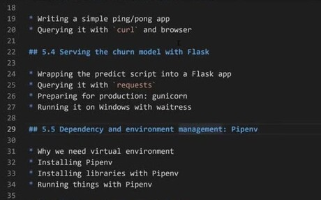
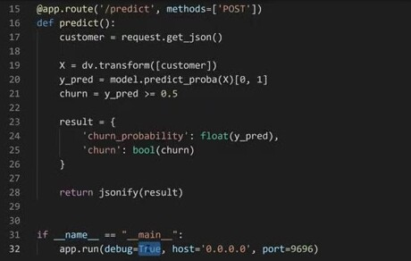
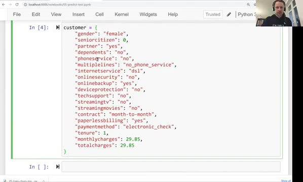
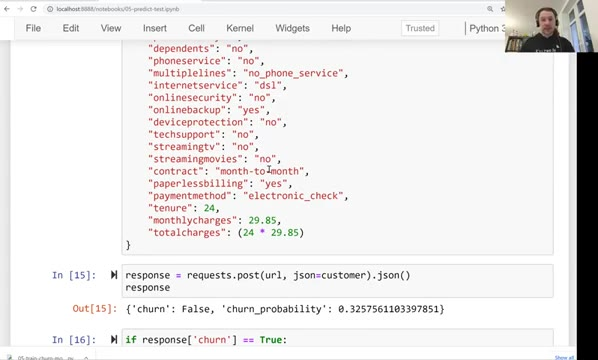
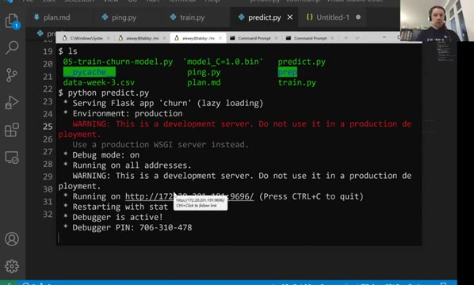
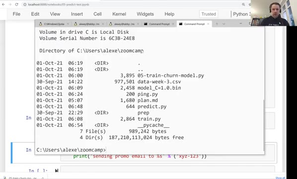

# Serving the churn model with Flask

In this unit we wrap the churn model into a Flask web service: it loads the
pickled model, listens for POST requests with customer data, and replies with
the churn probability.



## The web service

We take the ping app from the [previous unit](03-flask-intro.md) and extend
it. The full service is in [predict.py](code/predict.py):

```python
import pickle

from flask import Flask
from flask import request
from flask import jsonify


model_file = 'model_C=1.0.bin'

with open(model_file, 'rb') as f_in:
    dv, model = pickle.load(f_in)

app = Flask('churn')

@app.route('/predict', methods=['POST'])
def predict():
    customer = request.get_json()

    X = dv.transform([customer])
    y_pred = model.predict_proba(X)[0, 1]
    churn = y_pred >= 0.5

    result = {
        'churn_probability': float(y_pred),
        'churn': bool(churn)
    }

    return jsonify(result)


if __name__ == "__main__":
    app.run(debug=True, host='0.0.0.0', port=9696)
```



The parts worth noting:

- The model is loaded once, at start-up - not on every request. Loading is
  fast compared to training, but there is no reason to repeat it.
- The route uses the POST method: the customer data comes in the body of the
  request as JSON, and `request.get_json()` turns it into a Python
  dictionary.
- We transform the customer with the vectorizer - a list with one dictionary,
  because the transformer expects a list of records - and take the churn
  probability from the second column of `predict_proba` (index 1 is the
  probability of the positive class, "churn").
- We apply a threshold of 0.5 to get a yes/no answer, and cast NumPy values
  to native Python `float` and `bool`. JSON has no NumPy types, and Flask
  cannot serialize them.
- `jsonify(result)` turns the dictionary into a JSON response.



## Testing the service

Run the service with `python predict.py`. A browser can't test it - browsers
send GET requests, and this route expects POST. We use a small client script,
[predict-test.py](code/predict-test.py), which sends a request with the
`requests` library:

```python
import requests

url = 'http://localhost:9696/predict'

customer = {
    "gender": "female",
    "seniorcitizen": 0,
    ...
}

response = requests.post(url, json=customer).json()
print(response)

if response['churn'] == True:
    print('sending promo email to %s' % customer_id)
else:
    print('not sending promo email to %s' % customer_id)
```

The customer dictionary holds the same fields the model saw during training.
The `json=customer` argument serializes the dictionary to JSON in the request
body. Running the script prints:

```
{'churn': False, 'churn_probability': 0.3257561103397851}
not sending promo email to xyz-123
```



This is exactly how a marketing service would talk to our model: send
customer data as JSON, get the churn decision back, act on it.

## Running in production: gunicorn

When you start the app with `python predict.py`, Flask warns that its
development server is not suitable for production - it is single-threaded and
not built for heavy load. A WSGI server is the production replacement. WSGI
(Web Server Gateway Interface) is the standard way Python web applications
are served: the WSGI server imports our `app` object and handles all the
network work around it.



The common choice is gunicorn:

```bash
pip install gunicorn
gunicorn --bind=0.0.0.0:9696 predict:app
```

The last argument is `module:app_object` - our file is `predict.py` and the
Flask application inside it is called `app`. The service behaves the same,
but now it is a real production server.

On Windows, gunicorn does not work - it depends on libraries not available
there. The Windows alternative is waitress:

```bash
pip install waitress
waitress-serve --listen=0.0.0.0:9696 predict:app
```



The [next unit](05-pipenv.md) deals with the remaining piece: keeping the
project's library versions under control.

## Materials

- [Slides](https://www.slideshare.net/AlexeyGrigorev/ml-zoomcamp-5-model-deployment)
- The full serving script this unit walks through is also available in the
  [mlbookcamp-code repository](https://github.com/alexeygrigorev/mlbookcamp-code/blob/master/chapter-05-deployment/churn_serving.py)

## Notes
In this session, we talked about implementing the functionality of prediction to our churn web service and how to make it usable in development environment.
- To make the web service predict the churn value for each customer we must modify the code in session 3 with the code we had in previous chapters. Below we can see how the code works in order to predict the churn value.
- In order to predict we need to first load the previous saved model and use a prediction function in a special route.
  - To load the previous saved model we use the code below:
  - ```python
    import pickle
    
    with open('churn-model.bin', 'rb') as f_in:
      dv, model = pickle.load(f_in)
    ```
  - As we had earlier to predict a value for a customer we need a function like below:
  - ```python
    def predict_single(customer, dv, model):
      X = dv.transform([customer])  ## apply the one-hot encoding feature to the customer data 
      y_pred = model.predict_proba(X)[:, 1]
      return y_pred[0]
    ```
   - Then at last we make the final function used for creating the web service.
   - ```python
     @app.route('/predict', methods=['POST'])  ## in order to send the customer information we need to post its data.
     def predict():
     customer = request.get_json()  ## web services work best with json frame, So after the user post its data in json format we need to access the body of json.

     prediction = predict_single(customer, dv, model)
     churn = prediction >= 0.5
     
     result = {
         'churn_probability': float(prediction), ## we need to cast numpy float type to python native float type
         'churn': bool(churn),  ## same as the line above, casting the value using bool method
     }

     return jsonify(result)  ## send back the data in json format to the user
     ```
   - The whole code above is available in this link: [churn_serving.py](https://github.com/alexeygrigorev/mlbookcamp-code/blob/master/chapter-05-deployment/churn_serving.py)
   - Finally, run your code. To see the result we can't use a simple request in web browser, because we are expecting a `POST` request in our app. We can run the code below to **post** customer data as `json` and see the response
   - ```python     
     ## a new customer informations
     customer = {
       'customerid': '8879-zkjof',
       'gender': 'female',
       'seniorcitizen': 0,
       'partner': 'no',
       'dependents': 'no',
       'tenure': 41,
       'phoneservice': 'yes',
       'multiplelines': 'no',
       'internetservice': 'dsl',
       'onlinesecurity': 'yes',
       'onlinebackup': 'no',
       'deviceprotection': 'yes',
       'techsupport': 'yes',
       'streamingtv': 'yes',
       'streamingmovies': 'yes',
       'contract': 'one_year',
       'paperlessbilling': 'yes',
       'paymentmethod': 'bank_transfer_(automatic)',
       'monthlycharges': 79.85,
       'totalcharges': 3320.75
     }
     import requests ## to use the POST method we use a library named requests
     url = 'http://localhost:9696/predict' ## this is the route we made for prediction
     response = requests.post(url, json=customer) ## post the customer information in json format
     result = response.json() ## get the server response
     print(result)
     ```
 - Until here we saw how we made a simple web server that predicts the churn value for every user. When you run your app you will see a warning that it is not a WGSI server and not suitable for production environmnets. To fix this issue and run this as a production server there are plenty of ways available. 
   - One way to create a WSGI server is to use gunicorn. To install it use the command ```pip install gunicorn```, And to run the WGSI server you can simply run it with the   command ```gunicorn --bind 0.0.0.0:9696 churn:app```. Note that in __churn:app__ the name churn is the name we set for the file containing the code ```app = Flask('churn')```(for example: churn.py), You may need to change it to whatever you named your Flask app file.  
   -  Windows users may not be able to use gunicorn library because windows system do not support some dependecies of the library. So to be able to run this on a windows machine, there is an alternative library waitress and to install it, just use the command ```pip install waitress```. 
   -  to run the waitress wgsi server use the command ```waitress-serve --listen=0.0.0.0:9696 churn:app```.
   -  To test it, you can run the code above and the result will be the same.
 - So until here you were able to make a production server that predicts the churn value for new customers. In the next session, we can see how to solve library version conflicts in each machine and manage dependencies for production environments.

<table>
   <tr>
      <td>⚠️</td>
      <td>
         The notes are written by the community. <br>
         If you see an error here, please create a PR with a fix.
      </td>
   </tr>
</table>

* [Notes from Peter Ernicke](https://knowmledge.com/2023/10/12/ml-zoomcamp-2023-deploying-machine-learning-models-part-4/)
