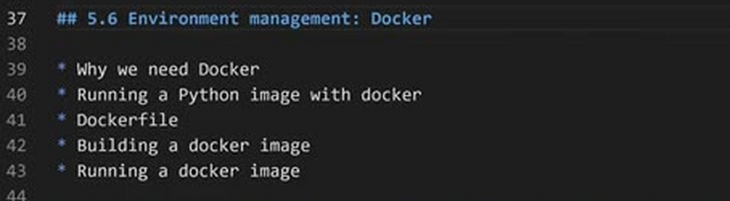
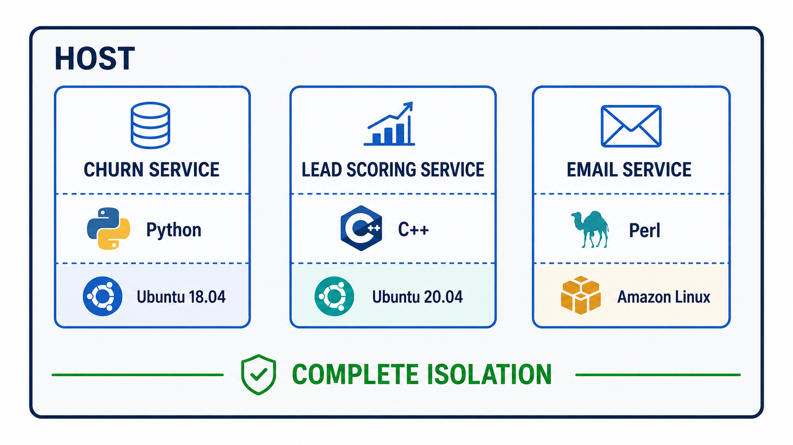
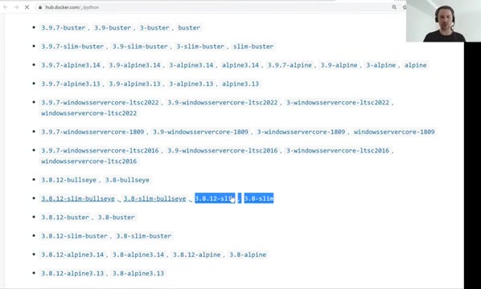
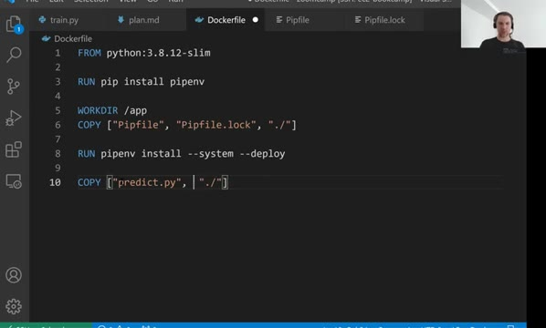
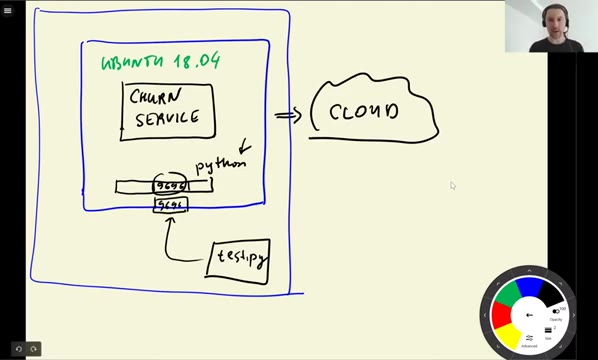

# Environment management: Docker

In this unit we package the churn service into a Docker container, so it runs
the same way everywhere - with the same Python version and the same
dependencies, independent of the host machine.



## Installing Docker

Docker runs on Linux, Windows and macOS. To install it:

### Ubuntu

```bash
sudo apt-get install docker.io
```

To run docker without `sudo`, follow [this instruction](https://docs.docker.com/engine/install/linux-postinstall/).

### Windows

Follow the instruction by Andrew Lock: https://andrewlock.net/installing-docker-desktop-for-windows/.

If you are using a subsystem, and the integration fails when running Docker
for the first time, make sure your distribution is enabled in the resources
settings.

### MacOS

Follow the steps in the [Docker docs](https://docs.docker.com/desktop/install/mac-install/).

## Why Docker

Pipenv isolates the Python packages of a project, but the rest of the
environment is still shared: the operating system, the Python version, the
system libraries. A service that works on a laptop with Python 3.10 may fail
on a server with Python 3.6.

Docker solves this by packing the application together with its whole
environment - OS, Python, system and Python dependencies, code, model file -
into an image. A container started from that image behaves identically on any
machine that runs Docker.



## The Dockerfile

A Docker image is built from a Dockerfile - a recipe that starts from a base
image and describes each step to add on top of it. This is the Dockerfile for
our churn service - [code/Dockerfile](code/Dockerfile):

```dockerfile
FROM python:3.8.12-slim

RUN pip install pipenv

WORKDIR /app

COPY ["Pipfile", "Pipfile.lock", "./"]

RUN pipenv install --system --deploy

COPY ["predict.py", "model_C=1.0.bin", "./"]

EXPOSE 9696

ENTRYPOINT ["gunicorn", "--bind=0.0.0.0:9696", "predict:app"]
```



Instruction by instruction:

- `FROM python:3.8.12-slim` - the base image: Python 3.8.12 on a minimal
  Debian. The slim variant is smaller, which makes the image faster to build
  and to download.
- `RUN pip install pipenv` - install Pipenv inside the image; we need it to
  install the project dependencies.
- `WORKDIR /app` - create the `/app` directory and make it the working
  directory for the following instructions.
- `COPY ["Pipfile", "Pipfile.lock", "./"]` - copy the two dependency files
  into the image.
- `RUN pipenv install --system --deploy` - install exactly what the lock file
  says. The `--system` flag installs the packages into the system Python of
  the image instead of creating another virtual environment inside the
  container (the container itself is already an isolated environment), and
  `--deploy` makes pipenv fail if the lock file is not up to date.
- `COPY ["predict.py", "model_C=1.0.bin", "./"]` - copy the service code and
  the model into the image.
- `EXPOSE 9696` - document that the container listens on port 9696. The
  container's network is isolated, so the port has to be published when
  starting the container.
- `ENTRYPOINT ["gunicorn", "--bind=0.0.0.0:9696", "predict:app"]` - the
  command that runs when the container starts: our production server serving
  the Flask app. Without an ENTRYPOINT, the container would simply start a
  Python shell and exit.

Note the double quotes in the exec form of ENTRYPOINT - the JSON array form
is what makes Docker run the command directly, without a shell wrapping it.



## Building and running

Build the image from the Dockerfile:

```bash
docker build -t churn-prediction .
```

The `-t` flag gives the image a name (tag): `churn-prediction`. Then start a
container from it:

```bash
docker run -it -p 9696:9696 churn-prediction:latest
```

The flags here:

- `-it` - keep the terminal attached to the container, so we can see its
  output and stop it with Ctrl-C.
- `-p 9696:9696` - publish the container's port 9696 as port 9696 on the host
  machine. The first port is on our machine, the second is inside the
  container.



The test script from the [previous unit](04-flask-deployment.md) now talks to
the containerized service - same URL, same response, but everything inside
the container came from the image. In the [next
unit](07-aws-eb.md) we deploy this container to the cloud.

## Materials

[Slides](https://www.slideshare.net/AlexeyGrigorev/ml-zoomcamp-5-model-deployment)

## Notes

- Once our project was packed in a Docker container, we're able to run our project on any machine.
- First we have to make a Docker image. In Docker image file there are settings and dependecies we have in our project. To find Docker images that you need you can simply search the [Docker](https://hub.docker.com/search?type=image) website.

Here a Dockerfile (There should be no comments in Dockerfile, so remove the comments when you copy)

```docker
# First install the python 3.8, the slim version uses less space
FROM python:3.8.12-slim

# Install pipenv library in Docker 
RUN pip install pipenv

# create a directory in Docker named app and we're using it as work directory 
WORKDIR /app                                                                

# Copy the Pip files into our working derectory 
COPY ["Pipfile", "Pipfile.lock", "./"]

# install the pipenv dependencies for the project and deploy them.
RUN pipenv install --deploy --system

# Copy any python files and the model we had to the working directory of Docker 
COPY ["*.py", "churn-model.bin", "./"]

# We need to expose the 9696 port because we're not able to communicate with Docker outside it
EXPOSE 9696

# If we run the Docker image, we want our churn app to be running
ENTRYPOINT ["gunicorn", "--bind=0.0.0.0:9696", "churn_serving:app"]
```

The flags `--deploy` and `--system` make sure that we install the dependencies directly inside the Docker container without creating an additional virtual environment (which `pipenv` does by default). 

If we don't put the last line `ENTRYPOINT`, we will be in a python shell.
Note that for the entrypoint, we put our commands in double quotes.

After creating the Dockerfile, we need to build it:

```bash
docker build -t churn-prediction .
```

To run it,  execute the command below:

```bash
docker run -it -p 9696:9696 churn-prediction:latest
```

Flag explanations: 

- `-t`: is used for specifying the tag name "churn-prediction".
- `-it`: in order for Docker to allow us access to the terminal.
- `--rm`: allows us to remove the image from the system after we're done.  
- `-p`: to map the 9696 port of the Docker to 9696 port of our machine. (first 9696 is the port number of our machine and the last one is Docker container port.)
- `--entrypoint=bash`: After running Docker, we will now be able to communicate with the container using bash (as you would normally do with the Terminal). Default is `python`.

At last you've deployed your prediction app inside a Docker container. Congratulations 🥳

<table>
   <tr>
      <td>⚠️</td>
      <td>
         The notes are written by the community. <br>
         If you see an error here, please create a PR with a fix.
      </td>
   </tr>
</table>

* [Notes from Peter Ernicke](https://knowmledge.com/2023/10/14/ml-zoomcamp-2023-deploying-machine-learning-models-part-6/)
