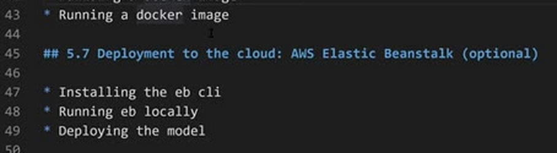
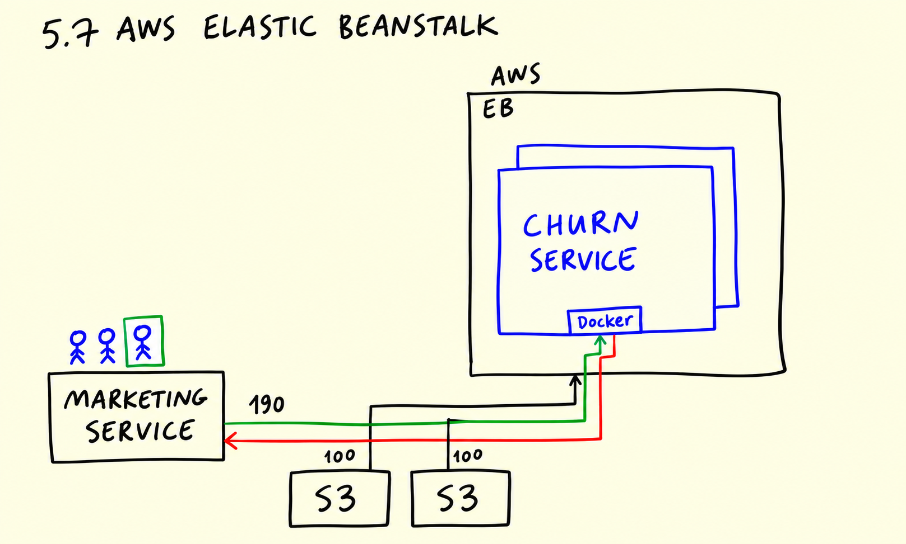
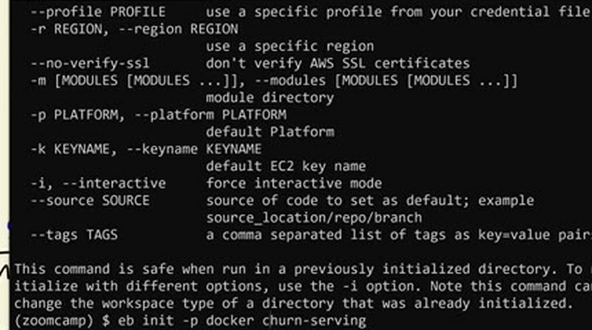
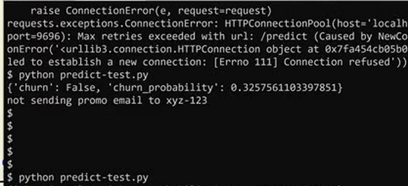
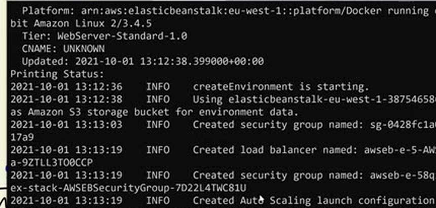
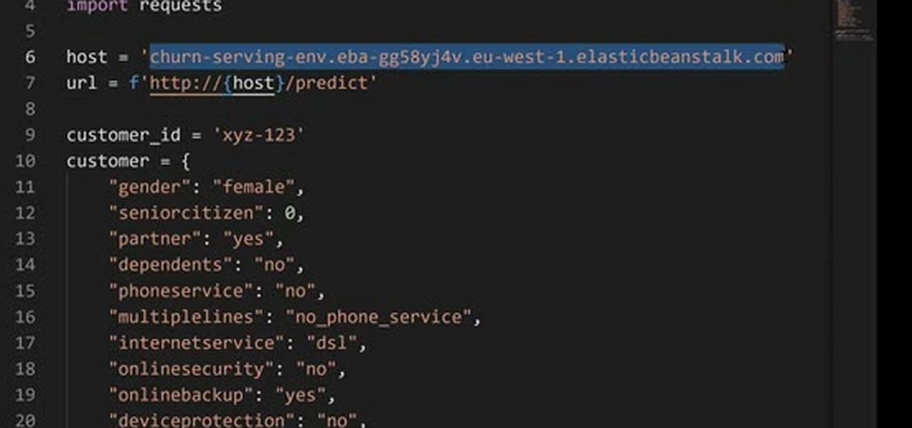
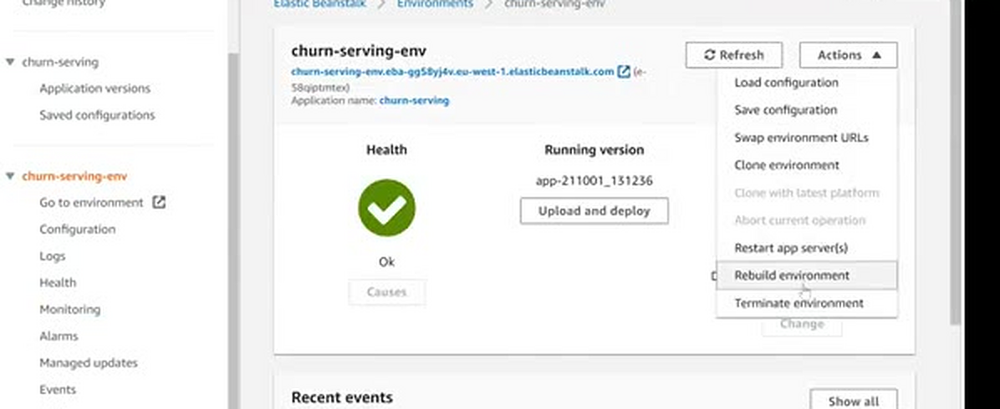

# Deployment to the cloud: AWS Elastic Beanstalk (optional)

In this optional unit we deploy the Docker image of the churn service to AWS
Elastic Beanstalk, which makes it reachable from anywhere on the internet.



## Why the cloud

So far the service runs only on our machine. For the marketing service to use
it, the model has to run somewhere both can reach - a server in the cloud. A
cloud provider gives us virtual machines on demand, and AWS is the most
popular one. You need an AWS account to follow along; see
[creating an account on AWS](https://mlbookcamp.com/article/aws) for the
details.

Elastic Beanstalk (EB) is AWS's simple deployment service: we give it our
application - here, a Docker image - and it takes care of the rest. It starts
the instances, keeps the application running and scales it: when many
requests come in, it launches more instances of the container; when the
traffic goes down, it scales back.

The setup mirrors the scenario from the [first unit](01-intro.md): the
marketing service sends requests to the EB environment; EB forwards them to
the Docker container running our Flask app; the container responds with the
churn probability, and EB relays the answer back.



## Deploying step by step

First we need the EB command line tool. We install it as a development
dependency - it is only needed from our machine to create and manage the
environment, the container itself doesn't use it:

```bash
pipenv install awsebcli --dev
```

Initialize the EB application. This asks about the region and the platform
and creates the configuration in `.elasticbeanstalk/config.yml`:

```bash
eb init -p docker -r eu-north-1 churn-serving
```

- `-p docker` - the platform is Docker: EB will run our Dockerfile.
- `-r eu-north-1` - the AWS region; pick the one closest to your users.
- `churn-serving` - the name of the application.



You can look at the generated configuration with `less
.elasticbeanstalk/config.yml`. Before deploying to the cloud, we can check
that everything works locally - EB builds the Docker image and runs it:

```bash
eb local run --port 9696
```



The test script from the [earlier unit](04-flask-deployment.md) can test it
as before. When it works, create the real environment in AWS:

```bash
eb create churn-serving-env
```



This takes a few minutes: EB starts the instances, deploys the container and
creates a URL for the environment. That URL is the endpoint for the
prediction requests - update the host in the test script to use it. No port
number is needed: EB accepts requests on the standard HTTP port and routes
them to the container.



Two things to keep in mind. The environment URL is public - anyone who finds
it can call our service, so a real production deployment needs authentication
or network-level access control. And when you are done playing with the
service, delete the environment, otherwise AWS keeps charging for the
instances:

```bash
eb terminate churn-serving-env
```



## Materials

- [Slides](https://www.slideshare.net/AlexeyGrigorev/ml-zoomcamp-5-model-deployment)
- [Creating an account on AWS](https://mlbookcamp.com/article/aws)

## Notes

### Deployment to the Cloud using AWS Elastic Beanstalk
AWS is the most popular cloud provider, and Elastic Beanstalk offers a simple way to deploy applications with just a few commands. It's well-suited for deploying containerized applications, like our churn prediction service packaged in a Docker container.

In this session, we explored how to deploy a machine learning model to the cloud using AWS Elastic Beanstalk, leveraging Docker to containerize the application for easy deployment and scalability.

#### Architecture Overview
1.  The churn prediction service is packaged into a Docker container.
2.  This container is deployed to AWS Elastic Beanstalk.
3.  A marketing service sends requests to the Elastic Beanstalk environment.
4.  Elastic Beanstalk forwards these requests to the Docker container.
5.  The container processes the request and sends the response back to Elastic Beanstalk.
6.  Elastic Beanstalk relays the response to the requesting service.

#### Scalability with Elastic Beanstalk (EB)
Elastic Beanstalk automatically scales the application based on traffic. If the churn prediction service receives a high volume of requests, EB automatically adds more instances of the service to handle the load without interruption (horizontal scaling). Similarly, when traffic decreases, EB scales down the number of instances to optimize resource utilization.

#### Deployment Steps
1.  **Install the AWS EB CLI:**

    ```bash
    pipenv install awsebcli --dev
    ```
    Note: This installs the EB CLI as a development dependency, as it's not needed within the container itself.
    
2.  **Initialize the EB environment:**
    ```bash
    eb init -p docker -r eu-north-1 churn-serving
    ```
    This command configures the EB environment with the following parameters:
    *   `-p docker`: Specifies the platform as Docker.
    *   `-r eu-north-1`: Sets the region to `eu-north-1`. You can choose a different region based on your account information.
    *   `churn-serving`: Defines the name of the environment.
      
3.  **Verify the EB Configuration:**
    ```bash
    less .elasticbeanstalk/config.yml
    ```
    This command allows you to review the generated configuration file.
    
4.  **Test Locally:**
   
    ```bash
    eb local run --port 9696
    ```
    This command starts the application locally using the specified port. You can use the `predict.py` script to test the service locally.
    
5.  **Deploy to AWS:**
    ```bash
    eb create churn-serving-env
    ```
    This command creates the Elastic Beanstalk environment and deploys the application.
    
6.  **Access the Deployed Service:**

After successful deployment, Elastic Beanstalk provides the endpoint URL for the service. Update the `predict-test` script with the new host address. Note that you'll no longer need the port number when accessing the deployed service.

7.  **Security Considerations:**

The deployed service is publicly accessible. In a production environment, it's crucial to implement appropriate security measures to restrict access to authorized users or networks.

8.  **Terminate the Service:**

```bash
    eb terminate churn-serving-env
    ```
This command terminates the Elastic Beanstalk environment and removes all associated resources.

#### Additional Note
*   Remember to configure your AWS credentials before running the EB CLI commands.

### Deployment with Heroku
As we saw how to deploy our apps in AWS Let's find it out how to deploy them in Heroku.

- First of all create your web service with flask. (example file: [churn_prediction.py](https://github.com/amindadgar/customer-churn-app/blob/main/churn_serving.py)
- Then create a file named _requirements.txt_ and pass your dependencies there. Example:
 ```
 pickle
 numpy
 flask
 gunicorn
  ```
- Create another file named _Procfile_ and add the app you want to be able to run there. Example:
 ```
web: gunicorn churn_serving:app
  ```
  Note that the churn_serving name in the box above is the name of the main python file we're going to be running.
 - Create your heroku profile, Go to dashboard and the Deploy tab.
 - Follow the instruction to Deploy using Heroku Git.
 - Great, your app is now available from global universe.

I've put my heroku app files in this repository:
https://github.com/amindadgar/customer-churn-app 

<table>
   <tr>
      <td>⚠️</td>
      <td>
         The notes are written by the community. <br>
         If you see an error here, please create a PR with a fix.
      </td>
   </tr>
</table>

* [Notes from Peter Ernicke](https://knowmledge.com/2023/10/15/ml-zoomcamp-2023-deploying-machine-learning-models-part-7/)
