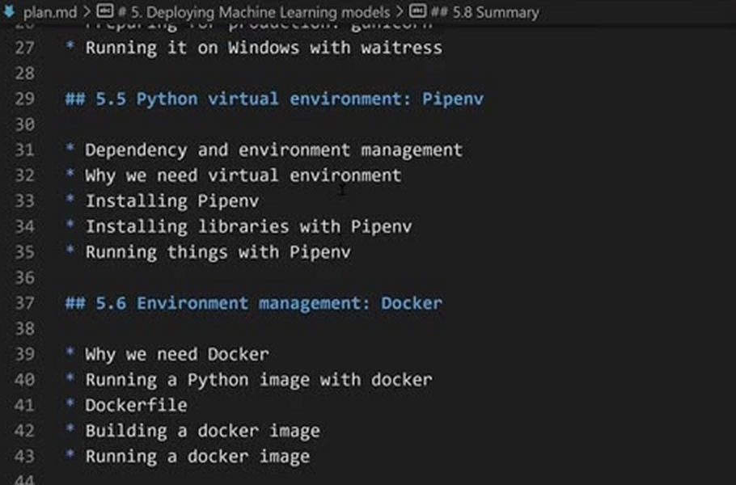
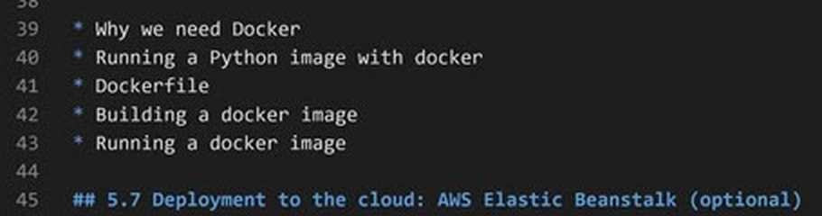
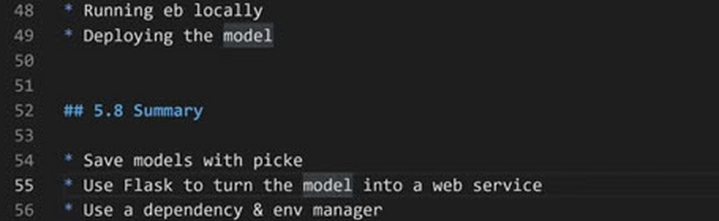

# Summary

This is the last unit of the module, so let's summarize what we did: we took
the churn prediction model from the notebook and deployed it as a web service
that other systems can call.

## What we covered

We started with a model that only existed inside a notebook, and step by step
removed everything that tied it to our laptop:

- Saving and loading the model - with pickle, so the model can be used
  without training it again, and turning the notebook into a Python script.
- Web services - we learned how applications talk over HTTP, and used Flask
  to turn the model into a service with a `/predict` endpoint that accepts
  customer data as JSON and returns the churn probability.
- Production servers - we replaced the Flask development server with
  gunicorn (and its Windows alternative, waitress).
- Dependency and environment management - with Pipenv, which gives the
  project an isolated environment and locks the exact library versions.
- Environment management - with Docker, which packs the service together
  with Python and all its dependencies into an image that runs the same way
  on any machine.
- Deployment to the cloud - with AWS Elastic Beanstalk, which runs the
  container on AWS machines and makes the service available on the internet.

To summarize the whole module in one list:

- Save models with pickle
- Use Flask to turn the model into a web service
- Use a dependency and environment manager (Pipenv)
- Package it in Docker
- Deploy to the cloud (AWS Elastic Beanstalk)

The [next unit](09-explore-more.md) has no video - it lists other tools you
can try on your own. After that there will be homework, where you will deploy
a model yourself.

In the next module we look at tree-based models - decision trees, random
forests and gradient boosting - as a different way of building the prediction
model that we deploy in this module.

## Materials

[Slides](https://www.slideshare.net/AlexeyGrigorev/ml-zoomcamp-5-model-deployment)

## Notes
In this chapter we learned these topics:
- We learned how to save the model and load it to re-use it without running the previous code.
- How to deploy the model in a web service.
- How to create a virtual environment.
- How to create a container and run our code in any operating systems.
- How to deploy our code in a public web service and access it externally from outside a local computer.

In the next chapter we will learn the algorithms such as Decision trees, Random forests and Gradient boosting as an alternative way of combining decision tress.

<table>
   <tr>
      <td>⚠️</td>
      <td>
         The notes are written by the community.  
         If you see an error here, please create a PR with a fix.
      </td>
   </tr>
</table>
