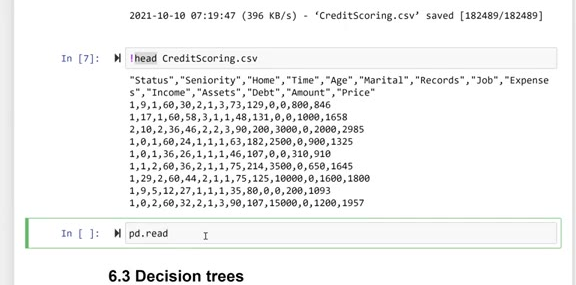
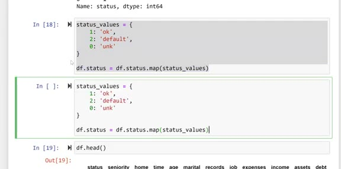
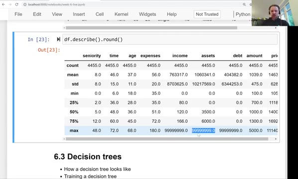
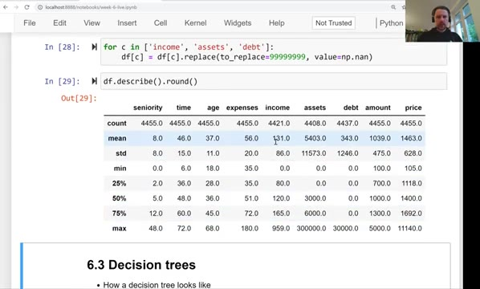
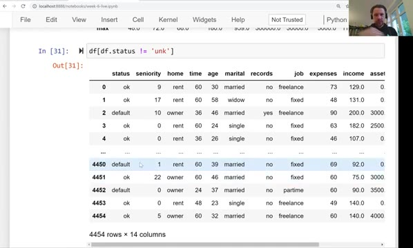
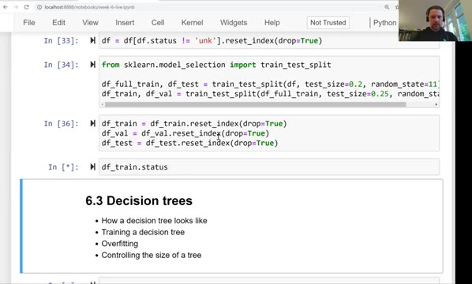
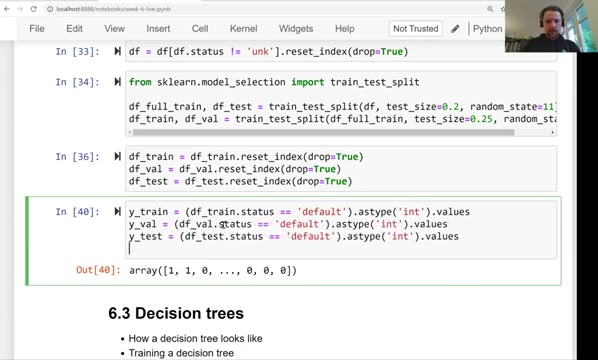

# Data cleaning and preparation

In this unit we download the credit scoring dataset and prepare it for
modeling: we re-encode the categorical columns, fix the encoded missing
values, and do the train/validation/test split.

## Downloading the dataset

First we import the libraries we need for this project:

```python
import pandas as pd
import numpy as np

import seaborn as sns
from matplotlib import pyplot as plt
%matplotlib inline
```

The dataset is a CSV file. We put the URL in a variable and download it
with `wget`:

```python
data = 'https://raw.githubusercontent.com/alexeygrigorev/mlbookcamp-code/master/chapter-06-trees/CreditScoring.csv'
```

```bash
!wget $data
```

The file is small (~178K), so it downloads quickly. Let's peek inside
with `head`:



```text
"Status","Seniority","Home","Time","Age","Marital","Records","Job","Expenses","Income","Assets","Debt","Amount","Price"
1,9,1,60,30,2,1,3,73,129,0,0,800,846
1,17,1,60,58,3,1,1,48,131,0,0,1000,1658
2,10,2,36,46,2,2,3,90,200,3000,0,2000,2985
1,0,1,60,24,1,1,1,63,182,2500,0,900,1325
...
```

Each row is one customer. Now we load it with Pandas and lowercase the
column names for consistency:

```python
df = pd.read_csv(data)
df.columns = df.columns.str.lower()
```

## Re-encoding the categorical variables

The columns `status`, `home`, `marital`, `records` and `job` are
categorical, but in the file they are encoded as numbers. For example,
`status` is 1, 2 or 0. That's not very intuitive, so we decode them
into strings.

Let's first look at the values of `status`:

```python
df.status.value_counts()
```

```text
1    3200
2    1254
0       1
Name: status, dtype: int64
```

So 3200 customers paid back their loans, 1254 defaulted, and there's
one record with the value 0 - an unknown status. We use dictionaries
and the Pandas `map` method to translate the numbers into strings:

```python
status_values = {
    1: 'ok',
    2: 'default',
    0: 'unk'
}

df.status = df.status.map(status_values)
```



We do the same for the other categorical columns:

```python
home_values = {
    1: 'rent',
    2: 'owner',
    3: 'private',
    4: 'ignore',
    5: 'parents',
    6: 'other',
    0: 'unk'
}

df.home = df.home.map(home_values)

marital_values = {
    1: 'single',
    2: 'married',
    3: 'widow',
    4: 'separated',
    5: 'divorced',
    0: 'unk'
}

df.marital = df.marital.map(marital_values)

records_values = {
    1: 'no',
    2: 'yes',
    0: 'unk'
}

df.records = df.records.map(records_values)

job_values = {
    1: 'fixed',
    2: 'partime',
    3: 'freelance',
    4: 'others',
    0: 'unk'
}

df.job = df.job.map(job_values)
```

Now the dataframe is much easier to read:

```python
df.head()
```

```text
    status  seniority   home  time  age  marital records        job  expenses  ...
0       ok          9   rent    60   30  married      no  freelance        73
1       ok         17   rent    60   58    widow      no      fixed        48
2  default         10  owner    36   46  married     yes  freelance        90
3       ok          0   rent    60   24   single      no      fixed        63
```

## Missing values

Not every problem shows up as a missing value. Let's look at the
summary statistics:

```python
df.describe().round()
```

```text
       seniority    time     age  expenses      income      assets  ...
count     4455.0  4455.0  4455.0    4455.0      4455.0      4455.0
mean         8.0    46.0    37.0      56.0    763317.0   1060341.0
std          8.0    15.0    11.0      20.0   8703625.0  10217569.0
min          0.0     6.0    18.0      35.0         0.0         0.0
max         48.0    72.0    68.0     180.0  99999999.0   99999999.0
```

The maximum values of `income`, `assets` and `debt` look suspicious:
99999999. This dataset encodes missing values as a long number of
nines. Instead of NaN, "unknown" became 99999999.



We replace these values with NaN:

```python
for c in ['income', 'assets', 'debt']:
    df[c] = df[c].replace(to_replace=99999999, value=np.nan)
```

After this, `df.describe().round()` shows the true picture - the counts
drop (income now has 4421 values instead of 4455, assets 4408, debt
4437) and the maximums become realistic.



## Removing the one unknown status

We also have that single customer with status `unk`. Since we only care
about the two classes - ok and default - we remove this row:

```python
df = df[df.status != 'unk'].reset_index(drop=True)
```



This leaves 4454 rows.

## Train/validation/test split

Now we split the data. As in the previous modules, we do it in two
steps: first we split off the test set (20%), then we split the rest
into train and validation (75/25 of what remains, which gives us the
60/20/20 distribution):

```python
from sklearn.model_selection import train_test_split

df_full_train, df_test = train_test_split(df, test_size=0.2, random_state=11)
df_train, df_val = train_test_split(df_full_train, test_size=0.25, random_state=11)
```

We reset the indexes so they are fresh and unique in each dataframe:



```python
df_train = df_train.reset_index(drop=True)
df_val = df_val.reset_index(drop=True)
df_test = df_test.reset_index(drop=True)
```

## Preparing the target variable

The models give us a probability, so the target needs to be a number.
We encode `status`: 0 for `ok`, 1 for `default`:

```python
y_train = (df_train.status == 'default').astype('int').values
y_val = (df_val.status == 'default').astype('int').values
y_test = (df_test.status == 'default').astype('int').values
```



Finally, we delete `status` from the dataframes - otherwise we would
use the target as a feature, and the model would learn to cheat:

```python
del df_train['status']
del df_val['status']
del df_test['status']
```

The data is ready. In the next unit we train our first decision tree.

## Materials

- [Slides](https://www.slideshare.net/AlexeyGrigorev/ml-zoomcamp-6-decision-trees-and-ensemble-learning)

## Notes

In this section we clean and prepare the [dataset](https://github.com/gastonstat/CreditScoring/raw/master/CreditScoring.csv) for the model which involves the following steps:

- Download the data from the given link.
- Reformat categorical columns (`status`, `home`, `marital`, `records`, and `job`) by mapping with appropriate values.
- Replace the maximum value of `income`, `assests`, and `debt` columns with NaNs.
- Replace the NaNs in the dataframe with `0` (*will be shown in the next lesson*).
- Extract only those rows in the column `status` who are either ok or default as value.
- Split the data in a two-step process which finally leads to the distribution of 60% train, 20% validation, and 20% test sets with random seed to `11`.
- Prepare target variable `status` by converting it from categorical to binary, where 0 represents `ok` and 1 represents `default`.
- Finally delete the target variable from the train/val/test dataframe.

<table>
   <tr>
      <td>⚠️</td>
      <td>
         The notes are written by the community. <br>
         If you see an error here, please create a PR with a fix.
      </td>
   </tr>
</table>

* [Notes from Peter Ernicke](https://knowmledge.com/2023/10/17/ml-zoomcamp-2023-decision-trees-and-ensemble-learning-part-2/)
* [Notes from Peter Ernicke](https://knowmledge.com/2023/10/18/ml-zoomcamp-2023-decision-trees-and-ensemble-learning-part-3/)
