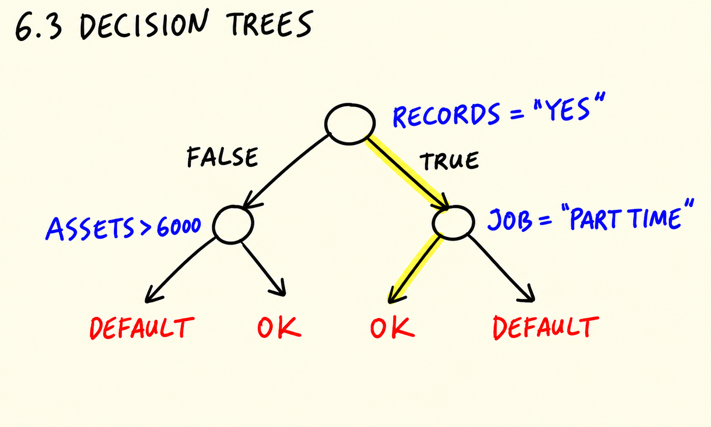
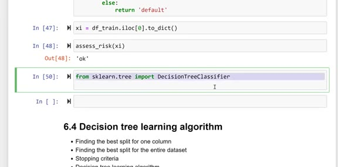
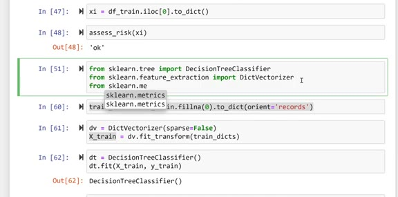
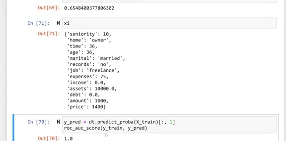
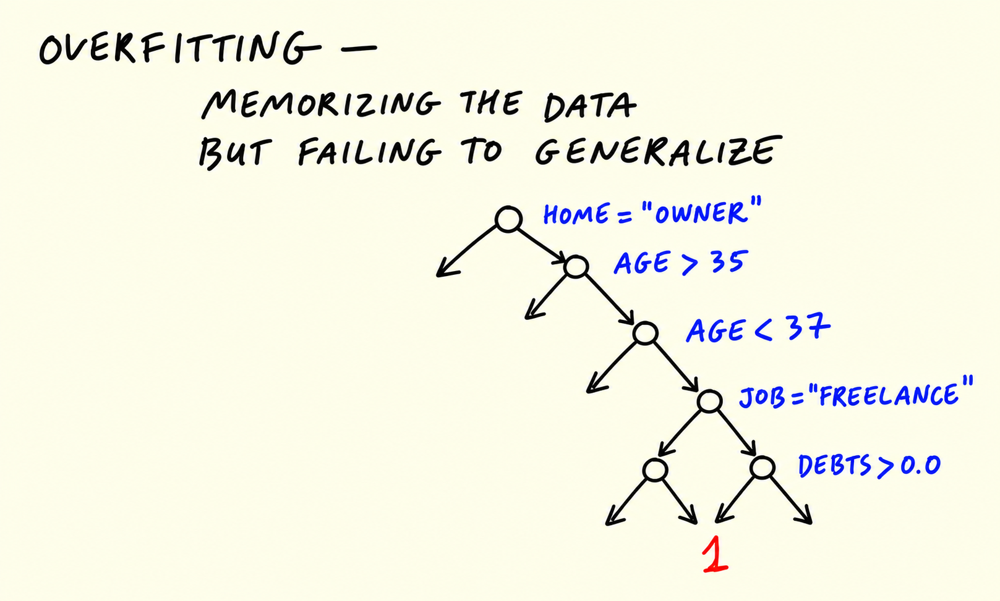
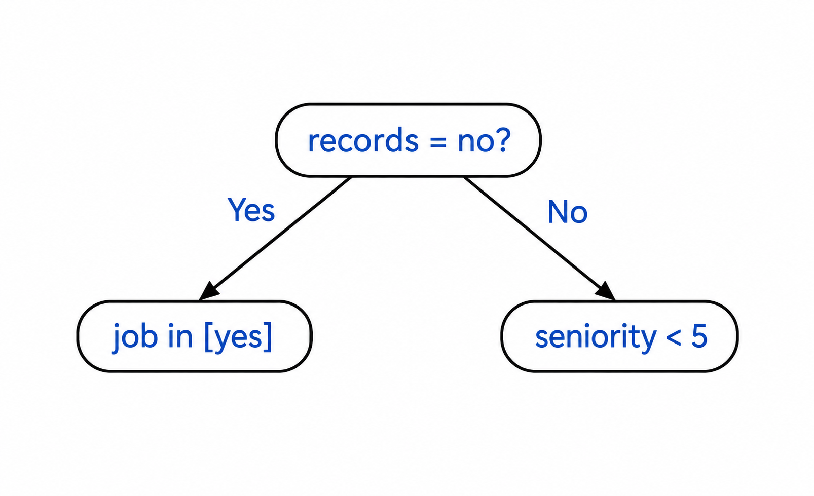
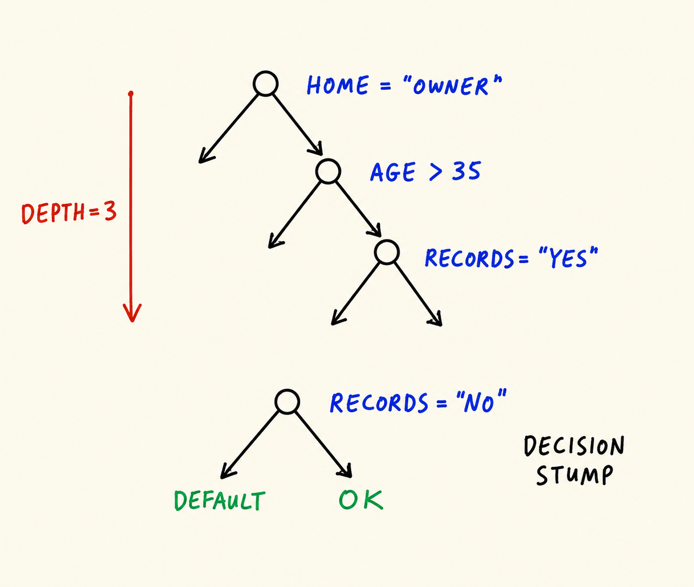

# Decision trees

In this unit we train our first decision tree with scikit-learn on the
credit scoring data, see what overfitting looks like, and learn how to
control the size of a tree.

## What a decision tree looks like

At its core, a decision tree is just a set of if/else rules. For our
credit risk problem, we could write one by hand:

```python
def assess_risk(client):
    if client['records'] == 'yes':
        if client['job'] == 'parttime':
            return 'default'
        else:
            return 'ok'
    else:
        if client['assets'] > 6000:
            return 'ok'
        else:
            return 'default'
```

Reading it from top to bottom: if the customer has records of previous
defaults and works part-time, we predict `default`. If they have
records but a different job, `ok`. If they have no records, we look at
their assets: more than 6000 means `ok`, otherwise `default`.



Let's take one customer from the training data and check what the rules
say about them:

```python
xi = df_train.iloc[0].to_dict()
assess_risk(xi)
```

```text
'ok'
```



Writing rules by hand doesn't scale. The point of the decision tree
algorithm is that it learns these rules from data automatically.

## Training a decision tree

We use `DecisionTreeClassifier` from scikit-learn. The features are
mixed: numeric columns and categorical ones we encoded as strings. We
turn each row into a dictionary, fill the missing values with 0, and
use `DictVectorizer` to convert the dictionaries into a feature matrix:

```python
from sklearn.tree import DecisionTreeClassifier
from sklearn.feature_extraction import DictVectorizer
from sklearn.metrics import roc_auc_score
from sklearn.tree import export_text
```

```python
train_dicts = df_train.fillna(0).to_dict(orient='records')

dv = DictVectorizer(sparse=False)
X_train = dv.fit_transform(train_dicts)
```

`DictVectorizer` one-hot encodes the categorical features - it creates
columns like `job=partime` and `records=no` - and leaves the numeric
ones unchanged.

Now we train the tree:

```python
dt = DecisionTreeClassifier()
dt.fit(X_train, y_train)
```



And check how it performs on the validation set:

```python
val_dicts = df_val.fillna(0).to_dict(orient='records')
X_val = dv.transform(val_dicts)

y_pred = dt.predict_proba(X_val)[:, 1]
roc_auc_score(y_val, y_pred)
```

```text
0.6548400377806302
```

## Overfitting

An AUC of 0.65 is not great. What about the data the model was trained
on?

```python
y_pred = dt.predict_proba(X_train)[:, 1]
roc_auc_score(y_train, y_pred)
```

```text
1.0
```



AUC of 1.0 on training but 0.65 on validation: the tree memorized the
training data. It learned one specific rule per customer, so on the
customers it has seen it's perfect - but these rules don't generalize
to unseen customers. This is overfitting: memorizing the data but
failing to generalize.



The reason is that we let the tree grow without limits, so it became
very deep: it kept splitting until every leaf was pure.

## Controlling the size of the tree

We can restrict the depth of the tree with the `max_depth` parameter.
A shallow tree cannot memorize each customer - it has to learn broader
rules:

```python
dt = DecisionTreeClassifier(max_depth=2)
dt.fit(X_train, y_train)
```

```python
y_pred = dt.predict_proba(X_train)[:, 1]
auc = roc_auc_score(y_train, y_pred)
print('train:', auc)

y_pred = dt.predict_proba(X_val)[:, 1]
auc = roc_auc_score(y_val, y_pred)
print('val:', auc)
```

```text
train: 0.7054989859726213
val: 0.6685264343319367
```

The training AUC went down, but the validation AUC went up. We traded
some accuracy on known customers for the ability to generalize.

## Looking inside the tree

To see the rules the tree learned, we use `export_text`:

```python
print(export_text(dt, feature_names=list(dv.get_feature_names_out())))
```

```text
|--- records=no <= 0.50
|   |--- seniority <= 6.50
|   |   |--- class: 1
|   |--- seniority >  6.50
|   |   |--- class: 0
|--- records=no >  0.50
|   |--- job=partime <= 0.50
|   |   |--- class: 0
|   |--- job=partime >  0.50
|   |   |--- class: 1
```

This is the tree in text form: customers without records and with more
than 6.5 years of seniority are predicted as `ok` (class 0), customers
with records who work part-time as `default` (class 1), and so on.



A tree with a depth of 1 - a single condition - is called a decision
stump. It's not really a tree, just one split, and it's the simplest
possible decision tree.



The question is: how does the learning algorithm decide which
condition and which threshold to use at each split? That's the topic of
the next unit.

## Materials

- [Slides](https://www.slideshare.net/AlexeyGrigorev/ml-zoomcamp-6-decision-trees-and-ensemble-learning)

## Notes

Decision Trees are powerful algorithms, capable of fitting complex datasets. The decision trees make predictions based on the bunch of *if/else* statements by splitting a node into two or more sub-nodes.

With versatility, the decision tree is also prone to overfitting. One of the reasons why this algorithm often overfits is its depth. It tends to memorize all the patterns in the train data but struggles to perform well on the unseen data (validation or test set).

To overcome the overfitting problem, we can reduce the complexity of the algorithm by reducing the depth size.

A decision tree with a depth of 1 is called `decision stump` and has only one split from the root.

**Classes, functions, and methods**:

- `DecisionTreeClassifier`: classification model from `sklearn.tree` class.
- `max_depth`: hyperparameter to control the maximum depth of decision tree algorithm.
- `export_text`: method from `sklearn.tree` class to display the text report showing the rules of a decision tree.

*Note*: we have already covered `DictVectorizer` in session 3 and `roc_auc_score` in session 4 respectively.

<table>
   <tr>
      <td>⚠️</td>
      <td>
         The notes are written by the community. <br>
         If you see an error here, please create a PR with a fix.
      </td>
   </tr>
</table>

* [Notes from Peter Ernicke](https://knowmledge.com/2023/10/19/ml-zoomcamp-2023-decision-trees-and-ensemble-learning-part-4/)
* [Notes from Peter Ernicke](https://knowmledge.com/2023/10/20/ml-zoomcamp-2023-decision-trees-and-ensemble-learning-part-5/)
