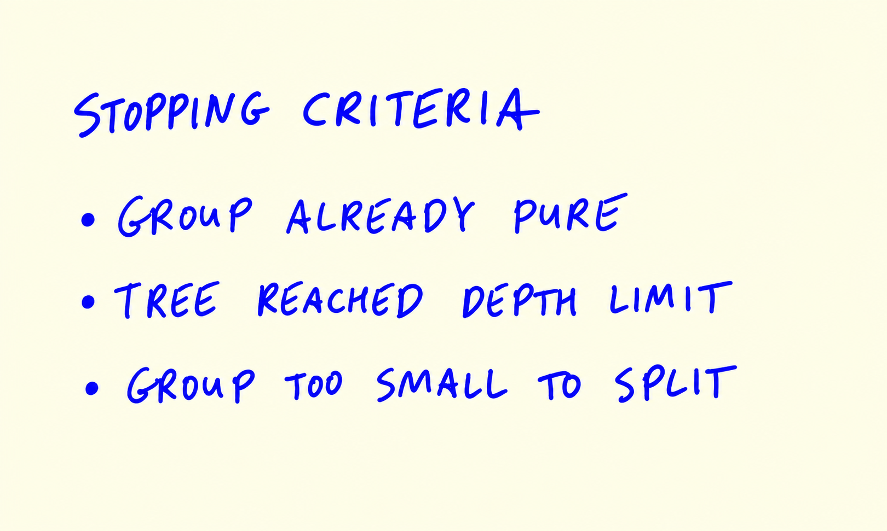

# Decision tree learning algorithm

In this unit we look inside the decision tree learning algorithm: how
it finds the best condition for a split, what impurity is, and when it
stops splitting.

## Tree vocabulary

First, the names for the parts of a tree:

- A node contains a condition, for example `assets > 3000`.
- Two branches go out of it: one for "true" and one for "false".
- The node at the top is the root; every node except the leaves is a
  parent of two other nodes.
- The nodes at the bottom are leaves (decision nodes): this is where
  the tree stops and the prediction is made.
- The depth of a tree is the number of levels - the length of the
  longest path from the root to a leaf.

To understand how the algorithm learns such a tree, we take a small
toy dataset instead of the full credit scoring data.

## Finding the best split for one column

We take eight customers with one feature, `assets`, and the target,
`status`:

```python
data = [
    [8000, 'default'],
    [2000, 'default'],
    [   0, 'default'],
    [5000, 'ok'],
    [5000, 'ok'],
    [4000, 'ok'],
    [9000, 'ok'],
    [3000, 'default'],
]

df_example = pd.DataFrame(data, columns=['assets', 'status'])
```

We want to build a decision stump - a tree with one condition,
`assets > T`. The question is: which threshold `T` is the best?

The condition splits the data into two parts: the left side where the
condition is false (`assets <= T`) and the right side where it is true
(`assets > T`). The candidate thresholds are the values in the middle
between the observed values - if we sort by `assets`, the candidates
are:

```python
Ts = [0, 2000, 3000, 4000, 5000, 8000]
```

Thresholds 0 and 8000 don't really make sense (one side would be
empty), but the algorithm still tries them. Let's split with
`T = 4000`:

```python
T = 4000
df_left = df_example[df_example.assets <= T]
df_right = df_example[df_example.assets > T]

display(df_left)
print(df_left.status.value_counts(normalize=True))
display(df_right)
print(df_right.status.value_counts(normalize=True))
```

The left side has four customers: three `default` and one `ok`. The
right side: three `ok` and one `default`.

For each side we predict the majority class - the most frequent status.
Left: `default`. Right: `ok`. The mistake rate on the left is 1/4 =
25% (the one `ok` customer), and on the right also 1/4 = 25%.

This mistake rate is called the misclassification rate, and it is one
way of measuring how impure a group is. A pure group contains only one
class - zero misclassification rate. We can compute the rates for both
sides with `value_counts(normalize=True)` and average them, weighted by
the group sizes:

```text
T    decision LEFT   impurity LEFT   decision RIGHT  impurity RIGHT  AVG
0    default         0%              ok              43%             21%
2000 default         0%              ok              33%             16%
3000 default         0%              ok              20%             10%
4000 default         25%             ok              25%             25%
5000 default         50%             ok              50%             50%
8000 default         43%             ok              0%              21%
```

The best threshold is `T = 3000`: the average impurity is only 10%. So
the best split for this column is `assets > 3000`.

```text
       ASSETS > 3000 
        /         \                            
   FALSE           TRUE
   DEFAULT         OK
```

## Checking multiple features

Real data has many features, and the algorithm needs to find the best
split among all of them. Let's add a second feature, `debt`:

```python
data = [
    [8000, 3000, 'default'],
    [2000, 1000, 'default'],
    [   0, 1000, 'default'],
    [5000, 1000, 'ok'],
    [5000, 1000, 'ok'],
    [4000, 1000, 'ok'],
    [9000,  500, 'ok'],
    [3000, 2000, 'default'],
]

df_example = pd.DataFrame(data, columns=['assets', 'debt', 'status'])
```

For `debt` the candidate thresholds are `[500, 1000, 2000]`. We put all
thresholds in a dictionary and loop over both features and all their
thresholds:

```python
thresholds = {
    'assets': [0, 2000, 3000, 4000, 5000, 8000],
    'debt': [500, 1000, 2000]
}

for feature, Ts in thresholds.items():
    print('#####################')
    print(feature)
    for T in Ts:
        print(T)
        df_left = df_example[df_example[feature] <= T]
        df_right = df_example[df_example[feature] > T]

        display(df_left)
        print(df_left.status.value_counts(normalize=True))
        display(df_right)
        print(df_right.status.value_counts(normalize=True))

        print()
    print('#####################')
```

For `debt`, the best split gives an average impurity of 16% - worse
than the 10% we got with `assets`. So the best split overall is still
`assets > 3000`. With more features we would simply add more rows to
this comparison.

## The split-finding algorithm

In pseudocode, finding the best split works like this:

```text
FOR each feature in FEATURES:
    FIND all thresholds for the feature
    FOR each threshold in thresholds:
        SPLIT the dataset using "feature > threshold" condition
        COMPUTE the impurity of this split
SELECT the condition with the LOWEST IMPURITY
```

The misclassification rate is not the only impurity measure.
Scikit-learn uses more sensitive criteria: Gini impurity and entropy.
For regression trees the equivalent is MSE. The idea stays the same:
pick the split with the lowest impurity. And while we looked at
classification here, decision trees can also solve regression problems.

## Stopping criteria

After the root is split, the algorithm applies the same procedure
recursively to the left and right sides. When does it stop?

- The group is already pure - the misclassification rate is 0%, no
  point in splitting further.
- The tree reached the maximum depth limit - controlled by
  `max_depth`.
- The group is too small to split - controlled by `min_samples_leaf`.
- The maximum number of leaves (decision nodes) was reached.



These stopping criteria are what keep a tree from overfitting.

## The full algorithm

Putting everything together:

- Find the best split: for every feature, try all possible thresholds
  and pick the condition with the lowest impurity.
- If the stopping criteria are not met (max depth not reached, groups
  large enough and not pure), repeat for the left side and the right
  side.

In the next unit we tune `max_depth` and `min_samples_leaf` for our
credit scoring project.

## Materials

- [Slides](https://www.slideshare.net/AlexeyGrigorev/ml-zoomcamp-6-decision-trees-and-ensemble-learning)

## Notes

This lesson first reviews the topics learned in the previous lesson about how to train a decision tree using scikit-learn, and handle a decision tree model not generalizing well due to overfitting of the data. 

In this lesson, we learn about how to best split a decision tree and different classification criteria that can be used to split a tree. We dive deep in an example, splitting trees with `misclassification` criteria. Additionally, different stopping criteria to break the iterative tree split are discussed.     

* **Structure of a decision tree**: A decision tree is a data structure 
composed of **nodes** (which contain conditions) and **branches** (which represent the values for a condition: True or False).  The tree starts with a **root node**, which is the parent of two other nodes, and each of these nodes can also be the parent of others. At the last level of the tree, there are terminal nodes, also called **leaves**.

* **Depth of a decision tree**: The **depth** of a tree is the number of levels it has, or simply the length of the longest path from the root node to a leaf node.
  
* **Rules & Conditions, Thresholds**: The learning algorithm for a decision tree involves determining the best **conditions** to split the data at each node in order to achieve the best possible classifier. When there are many **features**, the algorithm considers each feature with its optimized **threshold** to determine the best feature for splitting at a particular node. In essence, at each node, the algorithm evaluates all possible thresholds for every feature and calculates the resulting misclassification rate. It then selects the condition
(feature and threshold) that yields the lowest impurity.

* **Misclassification rate**: After each split, the goal is to divide the data into two sets that are as **pure** as possible. This means that the data within each set should belong predominantly to either one class, or the other. Another way to describe this is to aim for the lowest possible **misclassification rate** (impurity). The misclassification rate is a weighted average of the error rates obtained after splitting the data into two sets.  The predicted class for each set is determined by the **majority class** present in this set.

* **Impurity criteria**: Common misclassification rate measurements are **GINI Impurity** and **Entropy**. It is also possible to use **MSE** for regression problems.
  
* **Decision trees can be used to solve regression problems**: While we focused on decision tree classifiers, it's important to note that decision trees can also be applied to regression problems using decision tree regressors.

* **Stopping Criteria**: The process of recursively splitting the data at each child node eventually stops based on certain **stopping criteria**. These criteria prevent the model from overfitting and include:

    *   The group is already **pure**: 0% impurity.
    *   The **maximum depth** has been reached.
    *   The group is **smaller** than the minimum size set for groups.
    *   The maximum number of **leaves/terminal nodes** has been reached.

#### Decision Tree Learning Algorithm in a Nutshell

*   At a node, find the best split.
*   Stop if max\_depth is reached.
*   For each child node, if the node is sufficiently large and not pure, repeat the process from the beginning.

<table>
   <tr>
      <td>⚠️</td>
      <td>
         The notes are written by the community. <br>
         If you see an error here, please create a PR with a fix.
      </td>
   </tr>
</table>

* [Notes from Peter Ernicke](https://knowmledge.com/2023/10/21/ml-zoomcamp-2023-decision-trees-and-ensemble-learning-part-6/)
* [Notes from Peter Ernicke](https://knowmledge.com/2023/10/22/ml-zoomcamp-2023-decision-trees-and-ensemble-learning-part-7/)
