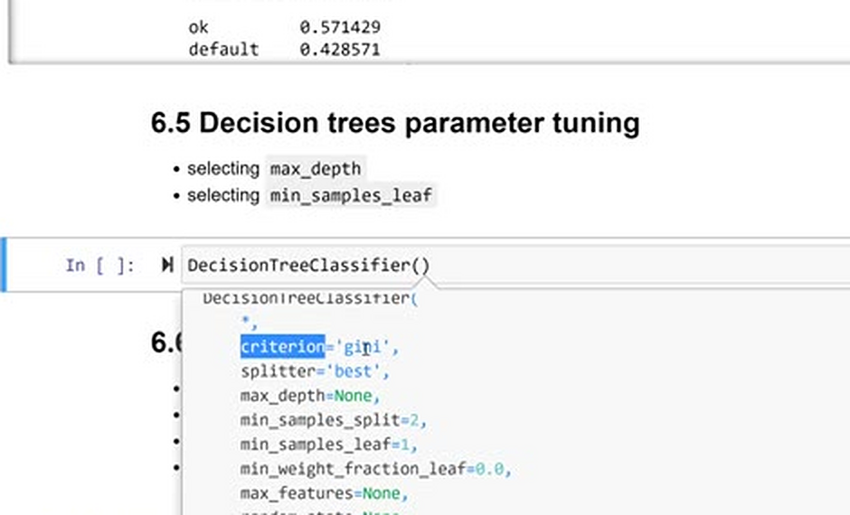
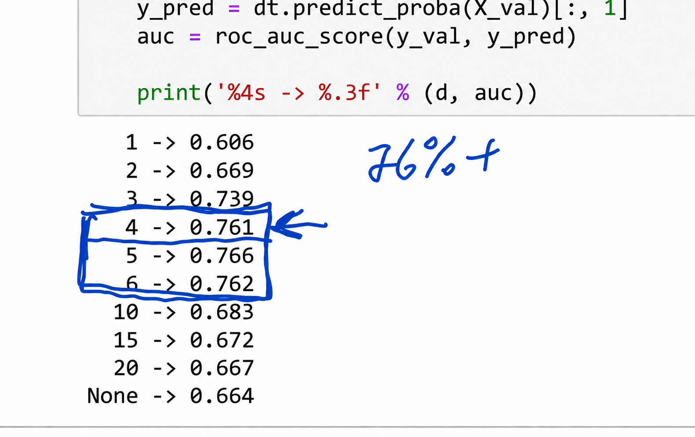
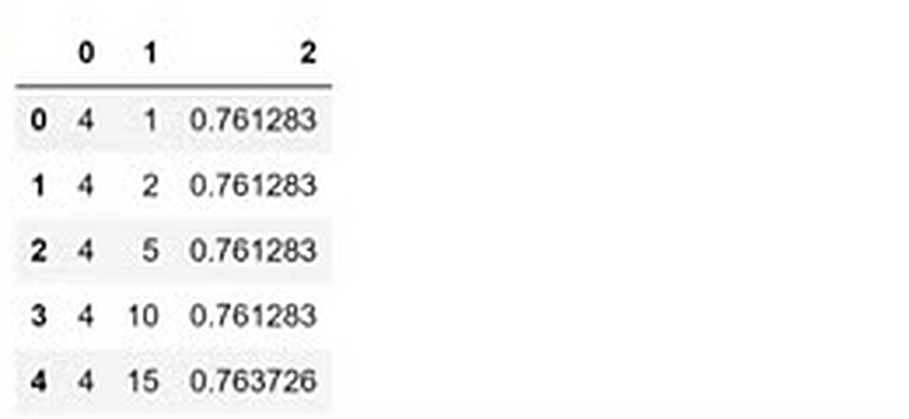
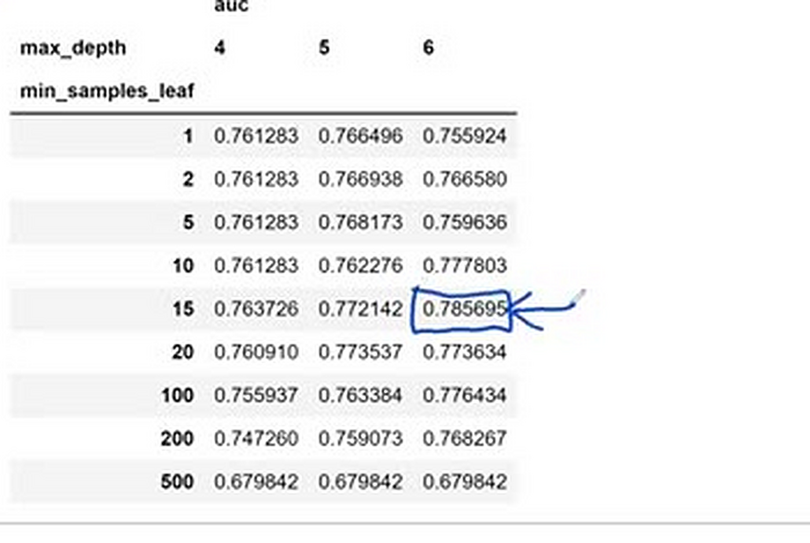
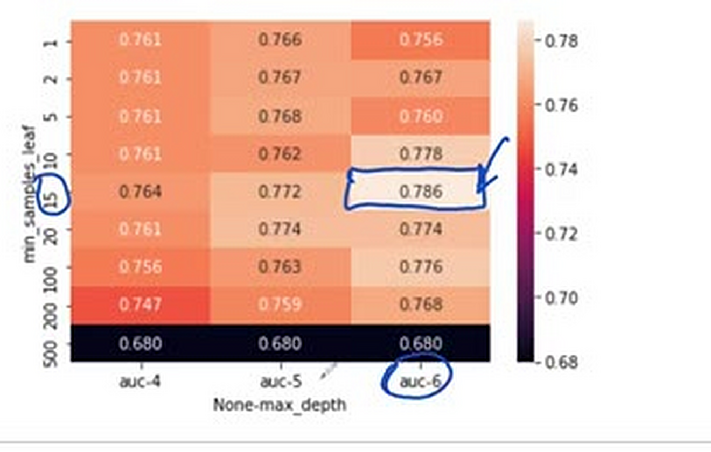
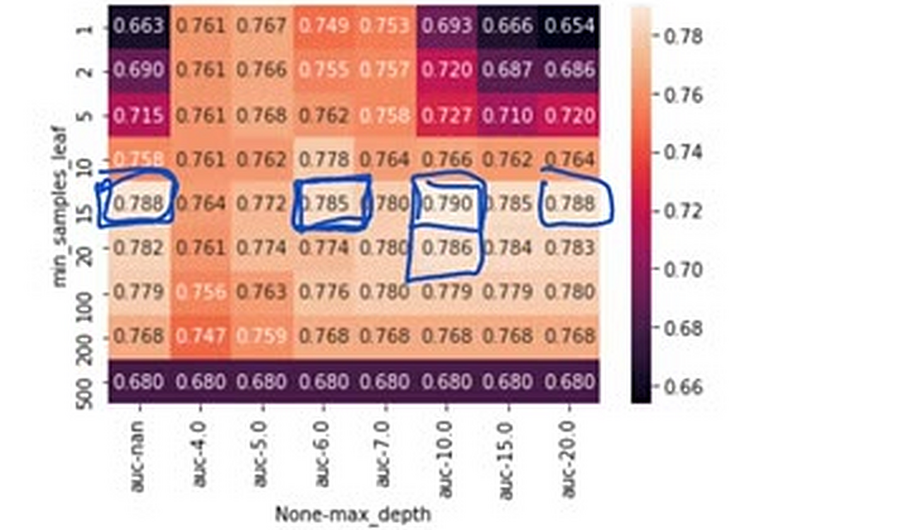
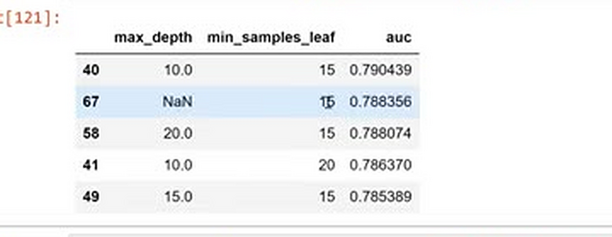

# Decision trees parameter tuning

In this unit we tune the decision tree: we try different values of
`max_depth` and `min_samples_leaf`, pick the combination with the best
validation AUC, and look at the final tree.

## Which parameters to tune

`DecisionTreeClassifier` has many parameters - `criterion`, which is
the impurity measure, `max_depth`, `min_samples_leaf`, and others. The
two that matter most are:

- `max_depth` - the maximum number of levels. It limits how specific
  the rules can get.
- `min_samples_leaf` - the minimum number of samples in a leaf. It
  prevents the tree from creating leaves that cover just one or two
  customers.



Tuning means selecting the values that give the best score on the
validation set - AUC in our case.

## Selecting max_depth

We start with `max_depth` alone. We try depths from 1 to 20, plus
`None` (no limit), and record the validation AUC for each:

```python
depths = [1, 2, 3, 4, 5, 6, 10, 15, 20, None]

for depth in depths: 
    dt = DecisionTreeClassifier(max_depth=depth)
    dt.fit(X_train, y_train)
    
    y_pred = dt.predict_proba(X_val)[:, 1]
    auc = roc_auc_score(y_val, y_pred)
    
    print('%4s -> %.3f' % (depth, auc))
```

```text
   1 -> 0.606
   2 -> 0.669
   3 -> 0.739
   4 -> 0.761
   5 -> 0.767
   6 -> 0.744
  10 -> 0.683
  15 -> 0.654
  20 -> 0.654
None -> 0.662
```

Depths 4, 5 and 6 are the best (AUC around 0.76). Trees that are too
shallow underfit; deep trees overfit and end up worse than the simple
ones.



## Adding min_samples_leaf

Now we take the promising depths - 4, 5 and 6 - and for each of them
try several values of `min_samples_leaf`. We store the results as
tuples in a list:

```python
scores = []

for depth in [4, 5, 6]:
    for s in [1, 5, 10, 15, 20, 500, 100, 200]:
        dt = DecisionTreeClassifier(max_depth=depth, min_samples_leaf=s)
        dt.fit(X_train, y_train)

        y_pred = dt.predict_proba(X_val)[:, 1]
        auc = roc_auc_score(y_val, y_pred)
        
        scores.append((depth, s, auc))
```



Then we put the scores into a dataframe:

```python
columns = ['max_depth', 'min_samples_leaf', 'auc']
df_scores = pd.DataFrame(scores, columns=columns)
```

The sorted dataframe is hard to scan. It's easier to reshape it: rows
for `min_samples_leaf`, columns for `max_depth`, and the AUC in the
cells. That's what the `pivot` method does:

```python
df_scores_pivot = df_scores.pivot(index='min_samples_leaf', columns=['max_depth'], values=['auc'])
df_scores_pivot.round(3)
```

```text
                    auc              
max_depth             4      5      6
min_samples_leaf                     
1                 0.761  0.767  0.759
5                 0.761  0.768  0.759
10                0.761  0.762  0.778
15                0.764  0.772  0.785
20                0.761  0.774  0.774
100               0.756  0.763  0.776
200               0.747  0.759  0.768
500               0.680  0.680  0.680
```



Even easier to read as a heatmap - the best cell is the lightest one:

```python
sns.heatmap(df_scores_pivot, annot=True, fmt=".3f")
```



The best combination is `max_depth=6` and `min_samples_leaf=15`, with
an AUC of 0.785 - better than anything we saw when tuning `max_depth`
alone.

Note that we only searched depths 4-6 for the second parameter. On a
large dataset it would be too slow to try every combination, so we
first select `max_depth` and then tune the rest. On this small dataset
we could afford to check more combinations - and if we did, other
close pairs would show up. It's a good habit to start with a coarse
search and refine it.



## The final tree

Let's train the tree with the tuned parameters and look at the rules it
learned:

```python
dt = DecisionTreeClassifier(max_depth=6, min_samples_leaf=15)
dt.fit(X_train, y_train)

print(export_text(dt, feature_names=list(dv.get_feature_names_out())))
```

```text
|--- records=no <= 0.50
|   |--- seniority <= 6.50
|   |   |--- amount <= 862.50
|   |   |   |--- price <= 925.00
|   |   |   |   |--- amount <= 525.00
|   |   |   |   |   |--- class: 1
|   |   |   |   |--- amount >  525.00
|   |   |   |   |   |--- class: 1
|   |   |   |--- price >  925.00
|   |   |   |   |--- price <= 1382.00
|   |   |   |   |   |--- class: 0
|   |   |   |   |--- price >  1382.00
|   |   |   |   |   |--- class: 0
|   |   |--- amount >  862.50
|   |   |   |--- assets <= 8250.00
...
```

This tree is still readable, unlike the unlimited one from before: it
starts with `records`, then looks at `seniority`, `amount`, `price` and
`assets` to decide whether a customer is likely to default.

One caution: when you scan the results, watch out for parameter values
that don't make sense, like `nan` creeping into the grid. A
combination can show a good score by accident - check that the values
you pick actually control the size of the tree the way you intend.



## Materials

- [Slides](https://www.slideshare.net/AlexeyGrigorev/ml-zoomcamp-6-decision-trees-and-ensemble-learning)

## Notes

In this lesson, we will discuss about different parameters used to control a Decision Tree (DT). Two of them, `max_depth` and `min_samples_leaf` have a greater importance than the others. We will further see how we first tune `max_depth` parameter and then move to tuning other parameters will help. After that, a dataframe will be created with all possible combinations of `max_depth`, `min_sample_leaf` and the auc score corresponding to them. These results will be visualized using a heatmap by pivoting the dataframe to easily determine the best possible `max_depth` and `min_samples_leaf` combination. Finally, the DT will be retrained using the identified parameter combination. The DT so trained will be viewed as a tree diagram, for visualizing decision rules.     

### Steps
* **Fine-Tuning Process:** iterate to find optimal parameter settings.
    *   Start by tuning `max_depth` with various values to determine a subset of optimal
depths.
    *   Then, using this subset, fine-tune the model further by exploring different
`min_samples_leaf` values.

    This method is computationally efficient for **large datasets**, though it may not be optimal for smaller ones.

* **Heatmaps for Visualization:** Store the scores (e.g., AUC) obtained during tuning in a pivot table, and create a heatmap with `seaborn` to easily identify high score areas, which helps pinpoint the optimal `max_depth` and `min_samples_leaf` combination.

**NB:** Choose parameter values that effectively control the tree's size and avoid values like 'nan' (Not a Number), even if they seem to lead to better scores.

### Importance of  `max_depth` and `min_samples_leaf`

*   **Controlling Overfitting:** these parameters play a critical role in preventing overfitting.
    *   `max_depth` limits the tree's complexity, preventing it from growing too deep and memorizing the training data.
    *   `min_samples_leaf` ensures that leaf nodes have a sufficient number of samples,
reducing the chance of creating nodes that are too specific to the training data.

*   **Impact on Bias and Variance:** They also affect the model's bias and variance.
    *   Increasing `max_depth` and decreasing `min_samples_leaf` can lead to a more complex model with lower bias but higher variance.
    *   Decreasing `max_depth` and increasing `min_samples_leaf` results in a simpler model with higher bias but lower variance.
      
It's then important to find the right balance between `max_depth` and `min_samples_leaf` to achieve optimal model performance.
This involves a trade-off between bias and variance, and the best values depend on the specific dataset and problem.

<table>
   <tr>
      <td>⚠️</td>
      <td>
         The notes are written by the community. <br>
         If you see an error here, please create a PR with a fix.
      </td>
   </tr>
</table>

* [Notes from Peter Ernicke](https://knowmledge.com/2023/10/23/ml-zoomcamp-2023-decision-trees-and-ensemble-learning-part-8/)
