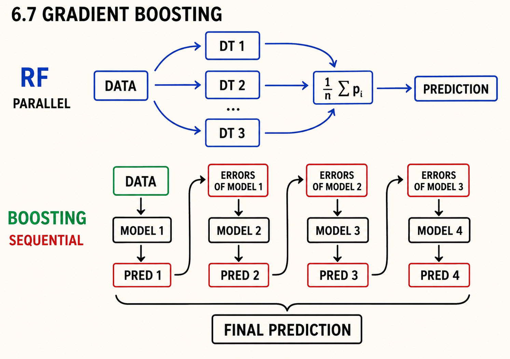
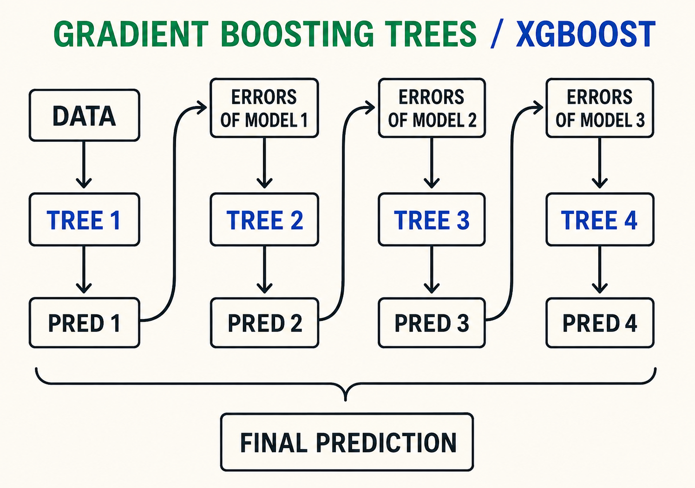
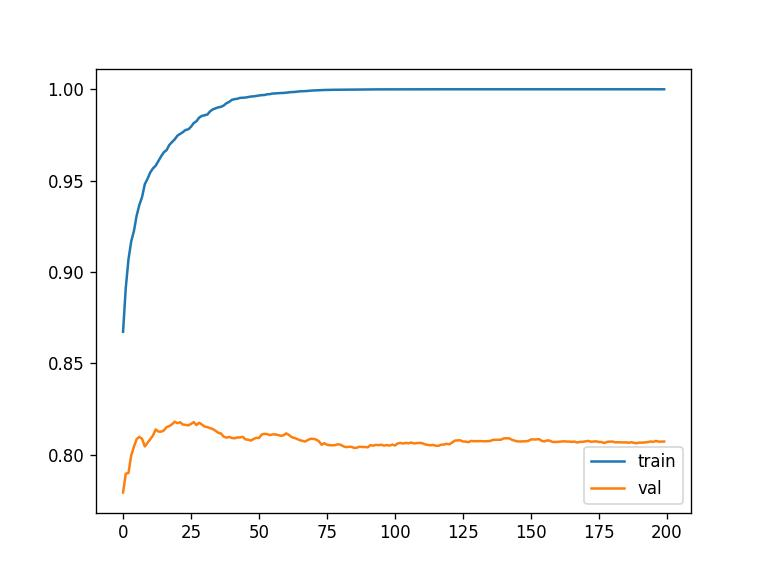

# Gradient boosting and XGBoost

In this unit we look at the second way of combining many models: gradient
boosting. Unlike random forest, where trees are trained independently,
boosting trains models one by one, each next model fixing the errors of the
previous ones. We use XGBoost - the most popular implementation of gradient
boosting - to train our first model and to monitor how it learns.

## Boosting vs random forest

In random forest, all the trees are trained in parallel: each tree gets a
random subset of features, they don't talk to each other, and their
predictions are averaged at the end.

Gradient boosting works sequentially. First we train one model and look at
where it makes errors. Then we train the second model on these errors, so it
learns to fix the mistakes of the first one. The third model fixes the errors
of the second one, and so on. The final prediction combines what all the
models in the sequence have learned.



When the models in this sequence are decision trees, the method is called
gradient boosting trees:



## Installing XGBoost

XGBoost is not part of scikit-learn, so first we install it:

```bash
pip install xgboost
```

And import it - by convention it is imported as `xgb`:

```python
import xgboost as xgb
```

## Wrapping the data into DMatrix

XGBoost does not work with NumPy arrays directly. Instead, we wrap the data
into a special data structure called `DMatrix`, which is optimized for
training XGBoost models. We create it from the feature matrix and the target
array, and also pass the feature names:

```python
features = list(dv.get_feature_names_out())
dtrain = xgb.DMatrix(X_train, label=y_train, feature_names=features)
dval = xgb.DMatrix(X_val, label=y_val, feature_names=features)
```

## Training the first model

We train the model with `xgb.train`, which takes a dictionary of parameters,
the training DMatrix, and the number of boosting rounds - the number of
models in our sequence. We start with ten rounds:

```python
xgb_params = {
    'eta': 0.3,
    'max_depth': 6,
    'min_child_weight': 1,

    'objective': 'binary:logistic',
    'nthread': 8,

    'seed': 1,
    'verbosity': 1,
}

model = xgb.train(xgb_params, dtrain, num_boost_round=10)
```

A few of these parameters are worth explaining:

- `eta` is the learning rate - how large the correction each next model
  applies is.
- `max_depth` and `min_child_weight` control the size of the trees, same as
  `max_depth` and `min_samples_leaf` in decision trees and random forest.
- `objective` is the task we are solving - `binary:logistic` is binary
  classification, and it makes the model output probabilities.

After training, we predict with `model.predict(dval)` and evaluate:

```python
y_pred = model.predict(dval)
roc_auc_score(y_val, y_pred)
```

This gives us 0.8152745150274878 - already better than the tuned decision
tree, with just ten rounds.

## Performance monitoring

Ten rounds was a blind shot: we don't know how the model behaves during
training. To watch it learn, we pass a watchlist - a list of datasets to
evaluate after each round. By default XGBoost monitors logloss, the metric
it optimizes, but that is hard to interpret - so we switch the evaluation
metric to AUC, the metric we have been using all along. We also train for
200 rounds now, and ask XGBoost to print the metrics every five rounds:

```python
watchlist = [(dtrain, 'train'), (dval, 'val')]
```

```python
%%capture output

xgb_params = {
    'eta': 0.3,
    'max_depth': 6,
    'min_child_weight': 1,

    'objective': 'binary:logistic',
    'eval_metric': 'auc',

    'nthread': 8,
    'seed': 1,
    'verbosity': 1,
}

model = xgb.train(xgb_params, dtrain, num_boost_round=200,
                  verbose_eval=5,
                  evals=watchlist)
```

The `%%capture output` magic captures the printed output of the cell into a
variable called `output`, so we can parse it later. The output itself looks
like this:

```text
[0]	train-auc:0.86300	val-auc:0.76818
[5]	train-auc:0.92863	val-auc:0.80606
[10]	train-auc:0.95002	val-auc:0.81558
[15]	train-auc:0.96558	val-auc:0.81680
[20]	train-auc:0.97316	val-auc:0.81775
...
```

The train AUC grows quickly towards its maximum, while the validation AUC
flattens out. That is the signature of overfitting: after some number of
rounds, the model keeps improving on the training data without getting better
on unseen data.

## Parsing the monitoring output

To analyze these numbers with pandas, we parse the captured text into a
dataframe - each line gives us the iteration number and the two AUC values:

```python
def parse_xgb_output(output):
    results = []

    for line in output.stdout.strip().split('\n'):
        it_line, train_line, val_line = line.split('\t')

        it = int(it_line.strip('[]'))
        train = float(train_line.split(':')[1])
        val = float(val_line.split(':')[1])

        results.append((it, train, val))

    columns = ['num_iter', 'train_auc', 'val_auc']
    df_results = pd.DataFrame(results, columns=columns)
    return df_results
```

Now we can plot both AUC curves against the iteration number:

```python
df_score = parse_xgb_output(output)

plt.plot(df_score.num_iter, df_score.train_auc, label='train')
plt.plot(df_score.num_iter, df_score.val_auc, label='val')
plt.legend()
```



The train curve goes to one, while the validation curve quickly stops
improving. This plot is what we will use in the next unit for tuning: the
number of boosting rounds where the validation AUC peaks tells us how many
rounds to use.

## Materials

[Slides](https://www.slideshare.net/AlexeyGrigorev/ml-zoomcamp-6-decision-trees-and-ensemble-learning)

## Notes

**Gradient Boosting**

Unlike Random Forest where each decision tree trains independently, in the Gradient Boosting Trees, the models are combined sequentially, where each model takes the prediction errors made by the previous model and then tries to improve the prediction. This process continues to `n` number of iterations, and in the end, all the predictions get combined to make the final prediction.

XGBoost is one of the libraries which implements the gradient boosting technique. To make use of the library, we need to install with `pip install xgboost`. To train and evaluate the model, we need to wrap our train and validation data into a special data structure from XGBoost which is called `DMatrix`. This data structure is optimized to train XGBoost models faster.

**XGBoost Training Parameters**

*   `eta`: learning rate, which indicates how fast the model learns.
*   `max_depth`: to control the size of the trees.
*   `min_child_weight`: to control the minimum size of a child node.
*   `objective`: To specify which problem we are trying to solve, either regression, or classification (binary: `'binary:logistic'`, or other).
*   `nthread`: 8, used for parallelized training.
*   `seed`: 1, for reproducibility.
*   `verbosity`: 1 (`True`) to show warnings, if any, during model training.

**Classes, functions, and methods**:

- `xgb.train()`: method to train xgboost model.
- `xgb_params`: key-value pairs of hyperparameters to train xgboost model.
- `watchlist`: list to store training and validation data to evaluate the performance of the model after each training iteration. The list takes tuple of train and validation set from DMatrix wrapper, for example, `watchlist = [(dtrain, 'train'), (dval, 'val')]`.
- `%%capture output`: IPython magic command which captures the standard output and standard error of a cell.

<table>
   <tr>
      <td>⚠️</td>
      <td>
         The notes are written by the community. <br>
         If you see an error here, please create a PR with a fix.
      </td>
   </tr>
</table>

- [Notes from Peter Ernicke](https://knowmledge.com/2023/10/25/ml-zoomcamp-2023-decision-trees-and-ensemble-learning-part-10/)
- [Notes from Peter Ernicke](https://knowmledge.com/2023/10/26/ml-zoomcamp-2023-decision-trees-and-ensemble-learning-part-11/)

### Extracting results from `xgb.train(..)`

In the video we use jupyter magic command `%%capture output` to extract the output of `xgb.train(..)` method.

Alternatively you can use the `evals_result` parameter of the `xgb.train(..)`. You can pass an empty dictionary in for this parameter and the train() method will populate it with the results. The result will be of type `OrderedDict` so we have to transform it to a dataframe. For this, `zip()` can help. Here's an example code snippet:

```python
evals_result = {}

model = xgb.train(params=xgb_params,
                  dtrain=dm_train,
                  num_boost_round=200,
                  verbose_eval=5,
                  evals=watchlist,
                  evals_result=evals_result)

columns = ['iter', 'train_auc', 'val_auc']
train_aucs = list(evals_result['train'].values())[0]
val_aucs = list(evals_result['val'].values())[0]

df_scores = pd.DataFrame(
    list(zip(
        range(1, len(train_aucs) + 1),
        train_aucs,
        val_aucs
    )), columns=columns)

plt.plot(df_scores.iter, df_scores.train_auc, label='train')
plt.plot(df_scores.iter, df_scores.val_auc, label='val')
plt.legend()
```

### Installing XGBoost on Mac

Some students reported problems with installing XGBoost on Mac.

When you run `pip install xgboost` and when you try to `import xgboost` in a script you might get an warning or error stating that libomp has not been installed and to run `brew install libomp` in the terminal.

Be careful: this will install a version of libomp that does not work with `xgboost`!

This shows in one of two ways after attempting to run `xgb.DMatrix(X_train, label=y_train, feature_names=features)`:

- **python script:** Segmentation fault: 11
- **jupyter notebook:** Never finished running, and notebook is unresponsive until kernal restart. However confusingly it sometimes works

#### Conda

If you use anaconda or miniconda, try installing xgboost with conda.

First, uninstall xgboost with pip (if you already installed it previously with pip):

```bash
pip uninstall xgboost
```

Then re-install it with conda:

```bash
conda install -c conda-forge xgboost
```

It will also install the required version of libomp.

#### Without conda

If you don't use conda, you can manualy install a different version of libopm that works well with XGBoost.

The versions of libomp with this problem are 12.x.x and 13.x.x, however issue has a workaround [xgboost issue #7039](https://github.com/dmlc/xgboost/issues/7039) installing the older libomp 11 using the terminal. In the terminal run `brew list --version libomp`, to determine the current version of libomp if any. Then if you have a problematic version run `brew unlink libomp`.

To install the old version of libomp run:

```bash
brew update
wget https://raw.githubusercontent.com/chenrui333/homebrew-core/0094d1513ce9e2e85e07443b8b5930ad298aad91/Formula/libomp.rb
brew install --build-from-source ./libomp.rb
```

and then run

```bash
brew list --version libomp
```

to check that everything worked, it should now state `libomp 11.1.0`, and your code should now be able to run.
