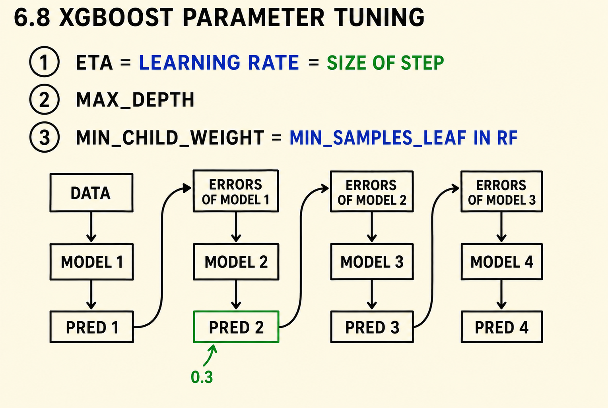
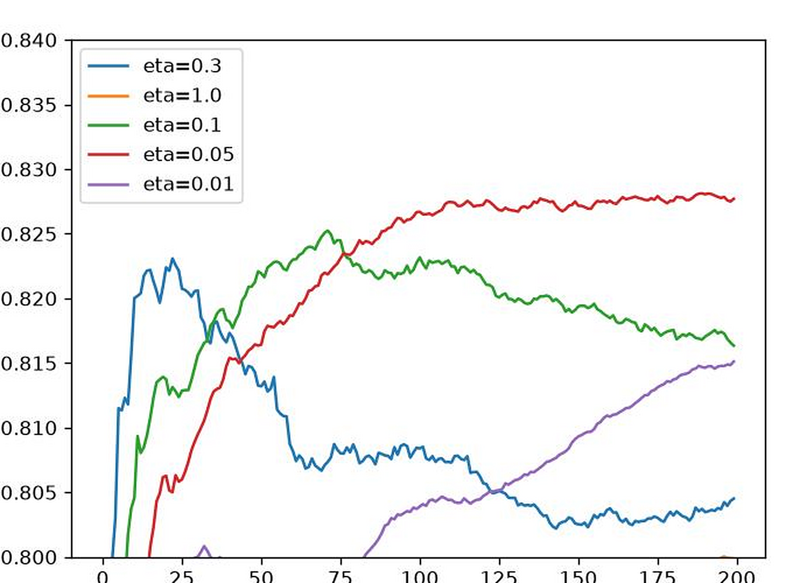
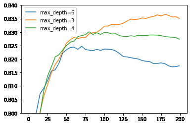
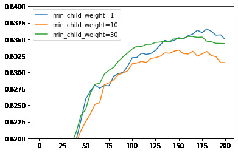

# XGBoost parameter tuning

In the previous unit we trained an XGBoost model with default parameters and
learned how to monitor its progress. Now we tune the three most important
XGBoost parameters - `eta`, `max_depth` and `min_child_weight` - using the
train/validation curves we learned to parse.

## The parameters to tune

The three parameters we tune are:

1. `eta` - the learning rate. It controls the size of the step each next
   model takes when correcting the errors of the previous ones.
2. `max_depth` - the maximum depth of each tree.
3. `min_child_weight` - the minimal size of a leaf, the analogue of
   `min_samples_leaf` in random forest.



XGBoost has many more parameters - we tune only these three, in this order:
first `eta`, then `max_depth`, then `min_child_weight`. For each parameter we
train a model per value, parse the monitoring output with the
`parse_xgb_output` function from the previous unit, and compare the
validation AUC curves.

## Tuning eta

We keep a dictionary `scores` that maps the parameter value to the parsed
learning curve. For each value of `eta`, we train a model, capture the output
and store the parsed dataframe:

```python
scores = {}
```

```python
%%capture output

xgb_params = {
    'eta': 0.01,
    'max_depth': 6,
    'min_child_weight': 1,

    'objective': 'binary:logistic',
    'eval_metric': 'auc',

    'nthread': 8,
    'seed': 1,
    'verbosity': 1,
}

model = xgb.train(xgb_params, dtrain, num_boost_round=200,
                  verbose_eval=5,
                  evals=watchlist)
```

```python
key = 'eta=%s' % (xgb_params['eta'])
scores[key] = parse_xgb_output(output)
key
```

This gives us `'eta=0.01'`. We repeat this - changing the value of `eta` in
the parameters - for 0.3, which is the value we used before, and then 1.0,
0.1 and 0.05. Then we plot the validation AUC of every run on one chart:

```python
for key, df_score in scores.items():
    plt.plot(df_score.num_iter, df_score.val_auc, label=key)

plt.ylim(0.8, 0.84)
plt.legend()
```



The learning rate controls how fast the model learns. With `eta=1.0` the
model takes the full correction from each new tree and quickly saturates -
its curve falls below the zoom window. With `eta=0.3` the validation AUC
rises fast, peaks early and then starts to degrade. With `eta=0.01` the
curve climbs slowly and would need many more rounds to reach its best. The
best trade-off is a middle value: `eta=0.1` reaches the top AUC and stays
stable, so we take it.

## Tuning max_depth

Next we fix `eta=0.1` and tune `max_depth` the same way. We reset `scores`
to start a fresh comparison, and train with `max_depth` of 6 - the baseline
we already have - then 3, 4 and 10:

```python
key = 'max_depth=%s' % (xgb_params['max_depth'])
scores[key] = parse_xgb_output(output)
```

After plotting all four, the worst is clearly `max_depth=10`, so we remove
it from the comparison:

```python
del scores['max_depth=10']
```

Then we plot the remaining curves again, zooming in with
`plt.ylim(0.8, 0.84)`: `max_depth=6` is the second worst, and the best depth
is a small one - `max_depth=3` gives the highest and most stable validation
AUC.



## Tuning min_child_weight

The last parameter is `min_child_weight`. We reset `scores` once more and
compare the baseline value of 1 with 10 and 30. For example, this is the run
with the value 30:

```python
%%capture output

xgb_params = {
    'eta': 0.1,
    'max_depth': 3,
    'min_child_weight': 30,

    'objective': 'binary:logistic',
    'eval_metric': 'auc',

    'nthread': 8,
    'seed': 1,
    'verbosity': 1,
}

model = xgb.train(xgb_params, dtrain, num_boost_round=200,
                  verbose_eval=5,
                  evals=watchlist)
```

```python
key = 'min_child_weight=%s' % (xgb_params['min_child_weight'])
scores[key] = parse_xgb_output(output)
```

The three curves are close to each other even after zooming in with
`plt.ylim(0.82, 0.84)`: for this parameter the differences are small. So we
keep the default value, `min_child_weight=1`.



## The final model

Putting it all together: `eta=0.1`, `max_depth=3`, `min_child_weight=1`.
Looking at the plots, the validation AUC is at its best around 175 boosting
rounds, so we train the final model of this unit with `num_boost_round=175`:

```python
xgb_params = {
    'eta': 0.1,
    'max_depth': 3,
    'min_child_weight': 1,

    'objective': 'binary:logistic',
    'eval_metric': 'auc',

    'nthread': 8,
    'seed': 1,
    'verbosity': 1,
}

model = xgb.train(xgb_params, dtrain, num_boost_round=175)
```

Other parameters worth knowing about:

- `subsample` - the fraction of the training data each tree sees.
- `colsample_bytree` - the fraction of features each tree sees, like the
  random feature subsets of random forest.
- `lambda` and `alpha` - the L2 and L1 regularization terms on the weights.

The full list is in the
[XGBoost parameter documentation](https://xgboost.readthedocs.io/en/latest/parameter.html).

## Materials

[Slides](https://www.slideshare.net/AlexeyGrigorev/ml-zoomcamp-6-decision-trees-and-ensemble-learning)


## Notes

XGBoost has various tunable parameters but the three most important ones are:

- `eta` (default=0.3)
  - It is also called `learning_rate` and is used to prevent overfitting by regularizing the weights of new features in each boosting step. range: [0, 1]
- `max_depth` (default=6)
  - Maximum depth of a tree. Increasing this value will make the model more complex and more likely to overfit. range: [0, inf]
- `min_child_weight` (default=1)
  - Minimum number of samples in leaf node. range: [0, inf]

For XGBoost models, there are other ways of finding the best parameters as well but the one we implement in the notebook follows the sequence of:

- First find the best value for `eta`
- Second, find the best value for `max_depth`
- Third, find the best value for `min_child_weight`

Other useful parameter are:

- `subsample` (default=1)
  - Subsample ratio of the training instances. Setting it to 0.5 means that model would randomly sample half of the training data prior to growing trees. range: (0, 1]
- `colsample_bytree` (default=1)
  - This is similar to random forest, where each tree is made with the subset of randomly choosen features.
- `lambda` (default=1)
  - Also called `reg_lambda`. L2 regularization term on weights. Increasing this value will make model more conservative.
- `alpha` (default=0)
  - Also called `reg_alpha`. L1 regularization term on weights. Increasing this value will make model more conservative.

### Alternative: Tuning XGBoost using a loop

Instead of repeating the training process manually for each `eta` value, you can use a loop to automate it (and other parameters to be tuned):
```python
# Train XGBoost models for each eta and store AUC results
scores = {} # dictionary to store results for each eta
etas = [0.01, 0.05, 0.1, 0.3, 1.0] # list of parameter values. in this case it is 'eta'.

for eta in etas:
    evals_result = {}

    xgb_params = {
        'eta': eta,
        'max_depth': 6,
        'min_child_weight': 1,

        'objective': 'binary:logistic',
        'eval_metric': 'auc',

        'nthread': 8,
        'seed': 1,
        'verbosity': 1
    }

    model = xgb.train(
        xgb_params,
        dtrain,
        evals=watchlist,
        verbose_eval=0,
        num_boost_round=200,
        evals_result=evals_result
    )

    columns = ['iter', 'train_auc', 'val_auc']
    train_aucs = list(evals_result['train'].values())[0]
    val_aucs = list(evals_result['val'].values())[0]

    df_results = pd.DataFrame(
        list(zip(range(1, len(train_aucs) + 1), train_aucs, val_aucs)),
        columns=columns
    )

    key = f'eta={eta}'
    scores[key] = df_results
```


<table>
   <tr>
      <td>⚠️</td>
      <td>
         The notes are written by the community. <br>
         If you see an error here, please create a PR with a fix.
      </td>
   </tr>
</table>

* [Notes from Peter Ernicke](https://knowmledge.com/2023/10/27/ml-zoomcamp-2023-decision-trees-and-ensemble-learning-part-12/)
* [Notes from Peter Ernicke](https://knowmledge.com/2023/10/28/ml-zoomcamp-2023-decision-trees-and-ensemble-learning-part-13/)
