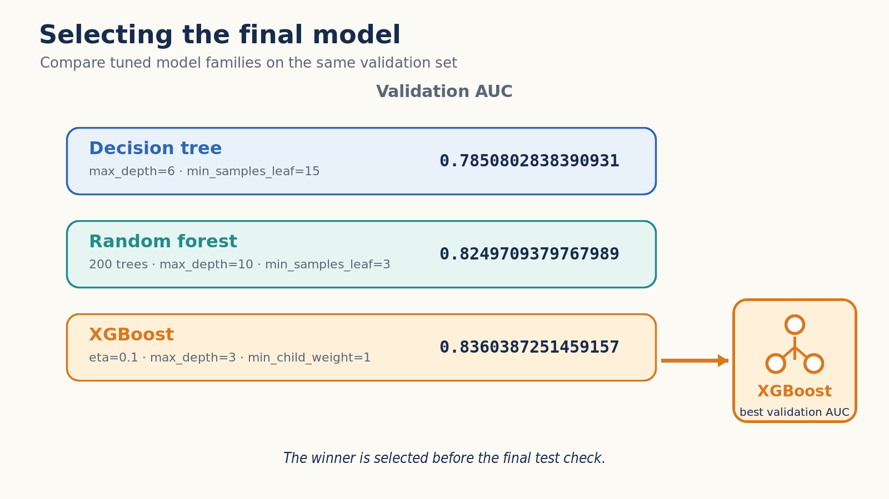
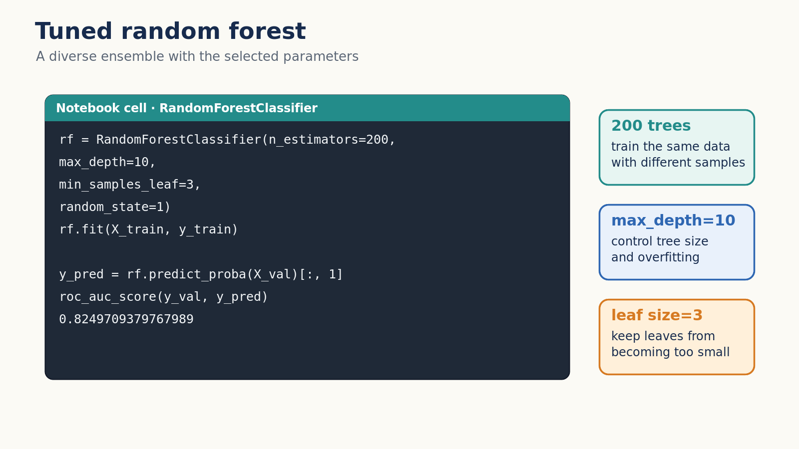
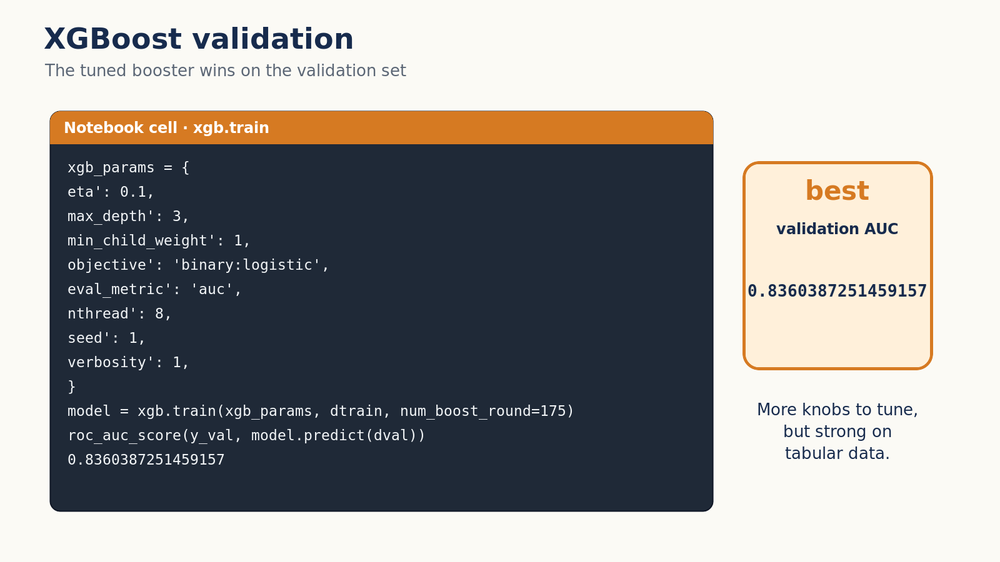
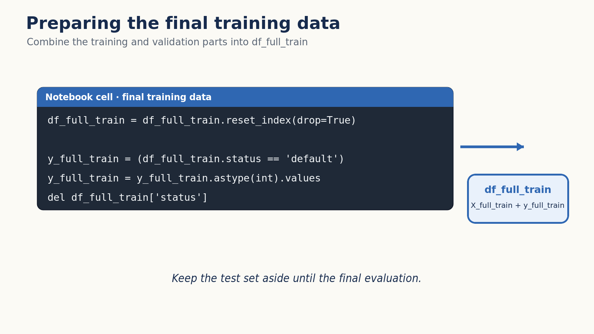
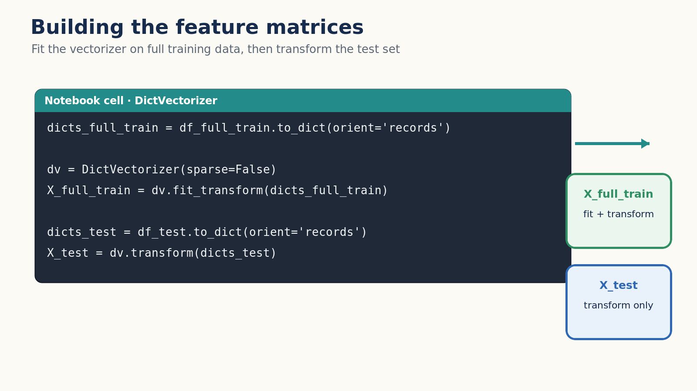
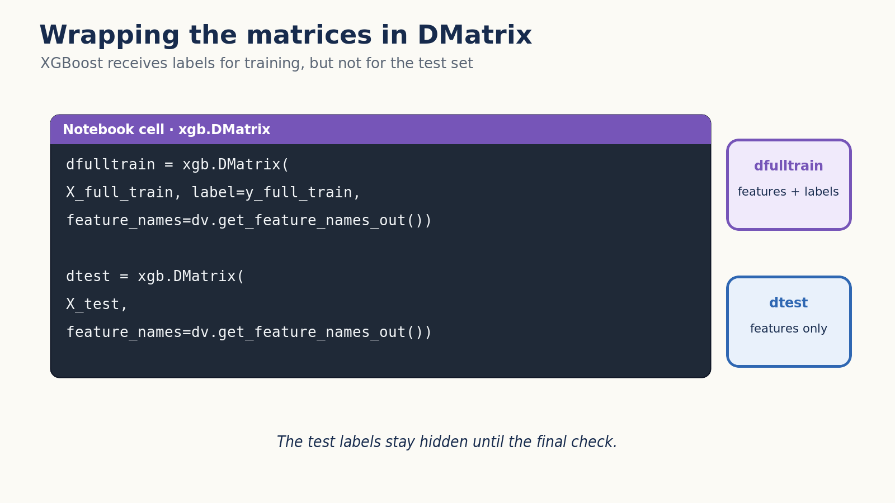
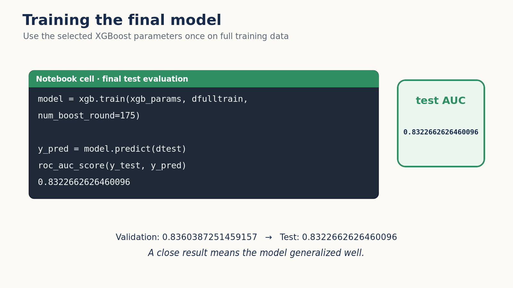

# Selecting the best model

In this unit we compare the three model families we trained in this module -
decision tree, random forest and XGBoost - pick the winner, and train the
final model on the full training data to check it on the test set.

## Comparing the three models

Each family was tuned to its best parameters in the previous units, so we
train all three on the training data and compare their AUC on the same
validation set.



The tuned decision tree - `max_depth=6` and `min_samples_leaf=15` - gives:

```python
dt = DecisionTreeClassifier(max_depth=6, min_samples_leaf=15)
dt.fit(X_train, y_train)
```

```python
y_pred = dt.predict_proba(X_val)[:, 1]
roc_auc_score(y_val, y_pred)
```

```text
0.7850802838390931
```

The tuned random forest - 200 trees with `max_depth=10` and
`min_samples_leaf=3` - gives:

```python
rf = RandomForestClassifier(n_estimators=200,
                            max_depth=10,
                            min_samples_leaf=3,
                            random_state=1)
rf.fit(X_train, y_train)
```

```python
y_pred = rf.predict_proba(X_val)[:, 1]
roc_auc_score(y_val, y_pred)
```

```text
0.8249709379767989
```



And the tuned XGBoost model - `eta=0.1`, `max_depth=3`,
`min_child_weight=1`, 175 rounds - gives:

```python
xgb_params = {
    'eta': 0.1,
    'max_depth': 3,
    'min_child_weight': 1,

    'objective': 'binary:logistic',
    'eval_metric': 'auc',

    'nthread': 8,
    'seed': 1,
    'verbosity': 1,
}

model = xgb.train(xgb_params, dtrain, num_boost_round=175)
```

```python
y_pred = model.predict(dval)
roc_auc_score(y_val, y_pred)
```

```text
0.8360387251459157
```



XGBoost wins with an AUC of about 0.836, ahead of random forest at about
0.825 and the single decision tree at about 0.785. This is a typical
outcome: boosted trees are very strong on tabular data. The price is that
XGBoost has many hyperparameters and can overfit quickly, so it needs more
attention during tuning than random forest, which works well almost out of
the box.

## Training the final model

Now that we have selected the best model and the best parameters, we use the
standard final-step recipe: combine the training and validation parts into
`df_full_train`, retrain with the same parameters, and evaluate once on the
test set - the data we have kept aside until now:

```python
df_full_train = df_full_train.reset_index(drop=True)

y_full_train = (df_full_train.status == 'default').astype(int).values
del df_full_train['status']
```



We turn both `df_full_train` and the test set into feature matrices with a
newly fitted `DictVectorizer`, and wrap them in DMatrix objects - note that
the test DMatrix needs no labels:

```python
dicts_full_train = df_full_train.to_dict(orient='records')

dv = DictVectorizer(sparse=False)
X_full_train = dv.fit_transform(dicts_full_train)

dicts_test = df_test.to_dict(orient='records')
X_test = dv.transform(dicts_test)
```



```python
dfulltrain = xgb.DMatrix(X_full_train, label=y_full_train,
                    feature_names=dv.get_feature_names_out())

dtest = xgb.DMatrix(X_test, feature_names=dv.get_feature_names_out())
```



Then we train the final model and look at its AUC on the test data:

```python
xgb_params = {
    'eta': 0.1,
    'max_depth': 3,
    'min_child_weight': 1,

    'objective': 'binary:logistic',
    'eval_metric': 'auc',

    'nthread': 8,
    'seed': 1,
    'verbosity': 1,
}

model = xgb.train(xgb_params, dfulltrain, num_boost_round=175)
```

```python
y_pred = model.predict(dtest)
roc_auc_score(y_test, y_pred)
```

```text
0.8322662626460096
```



The test AUC is about 0.832, close to the 0.836 we saw on validation. There
is no big gap between the two, which means the model generalized well: it
learned patterns that hold on data it has never seen.

## Materials

[Slides](https://www.slideshare.net/AlexeyGrigorev/ml-zoomcamp-6-decision-trees-and-ensemble-learning)


## Notes

We select the final model from decision tree, random forest, or xgboost based on the best auc scores. After that we prepare the `df_full_train` and `df_test` to train and evaluate the final model. If there is not much difference between model auc scores on the train as well as test data then the model has generalized the patterns well enough.

Generally, XGBoost models perform better on tabular data than other machine learning models but the downside is that these model are easy to overfit cause of the high number of hyperparameter. Therefore, XGBoost models require a lot more attention for parameters tuning to optimize them.

<table>
   <tr>
      <td>⚠️</td>
      <td>
         The notes are written by the community. <br>
         If you see an error here, please create a PR with a fix.
      </td>
   </tr>
</table>

* [Notes from Peter Ernicke](https://knowmledge.com/2023/10/29/ml-zoomcamp-2023-decision-trees-and-ensemble-learning-part-14/)
