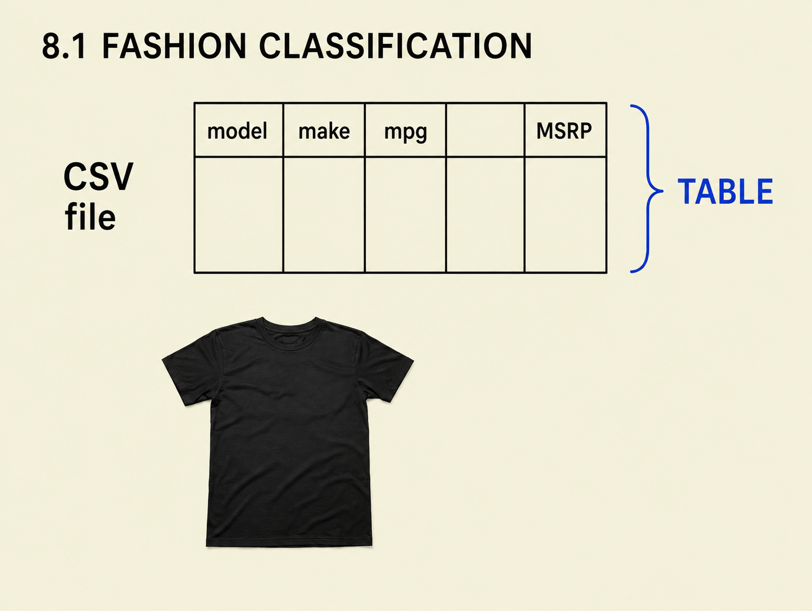
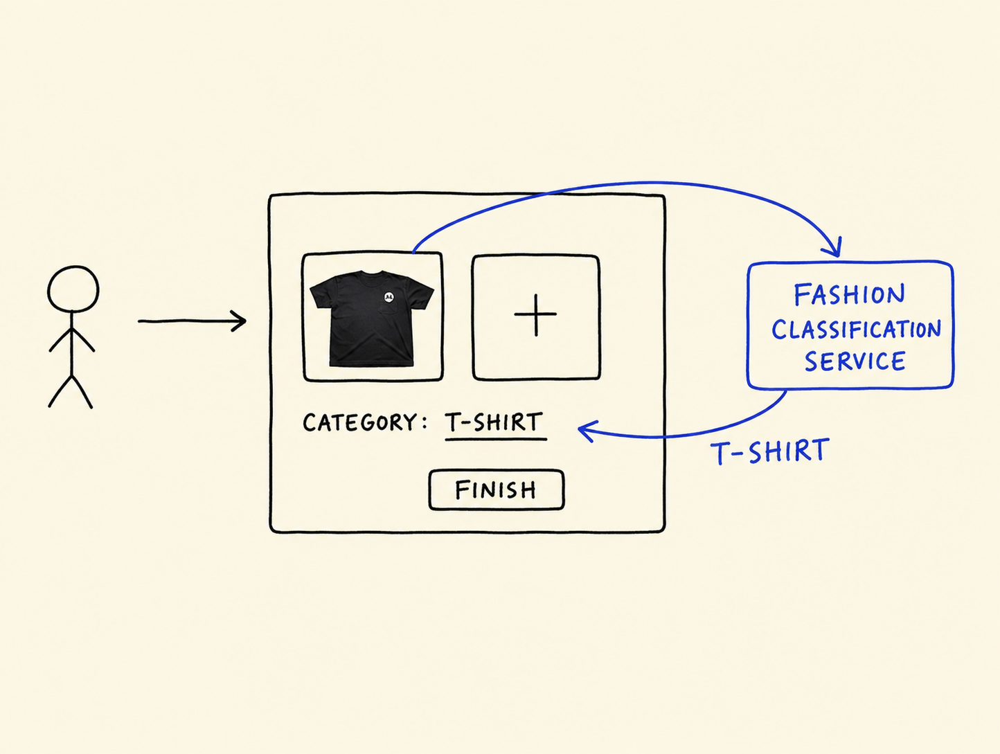
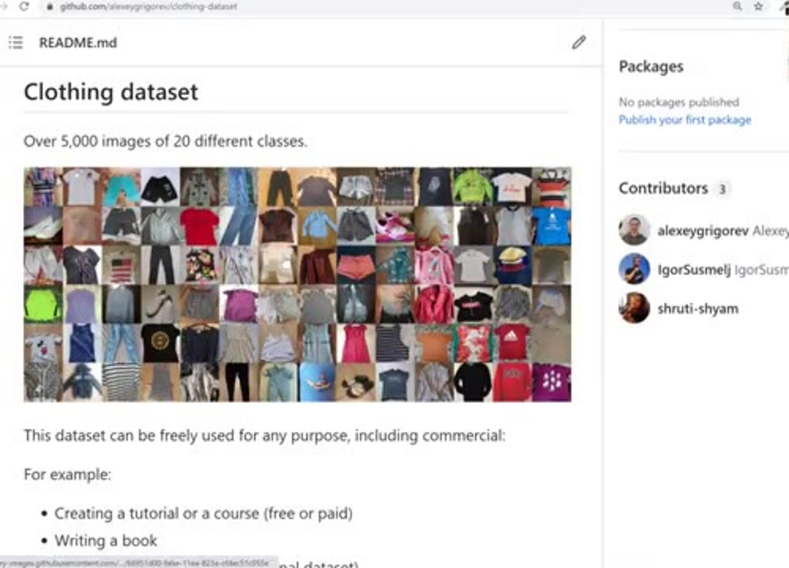
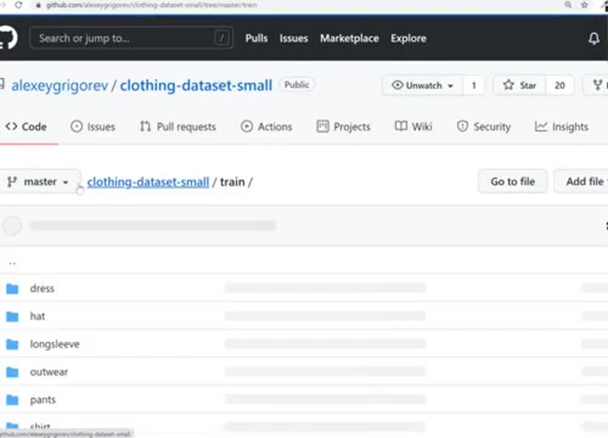
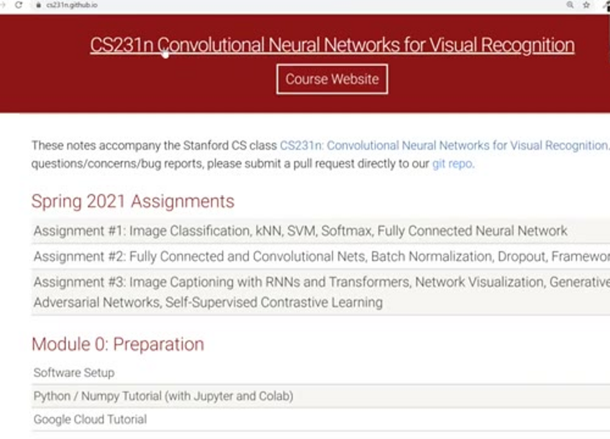
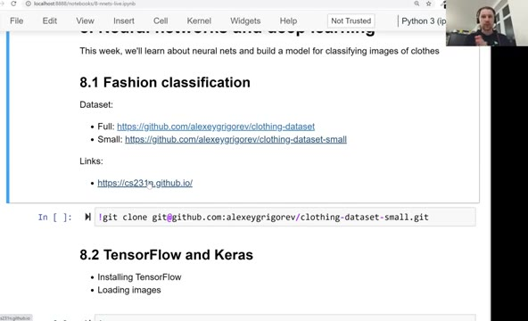
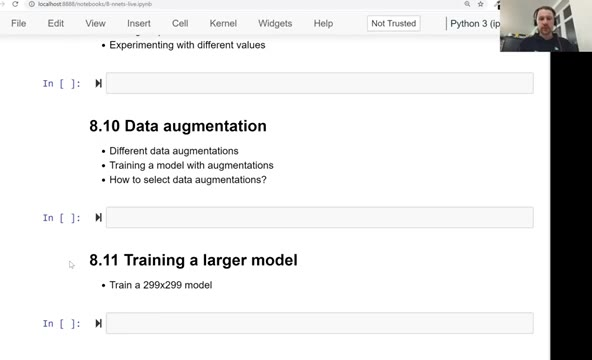

# Fashion classification

Welcome to session eight. In this module we talk about neural networks
and deep learning. This first unit is an overview: the project we will
build, the dataset we will train on, and the plan for the rest of the
module.

## From tables to images

In all previous sessions we worked with tabular data. A CSV file with
rows and columns. In session two, for example, we predicted car prices:
the columns were model, make, miles per gallon in the city and outside,
and MSRP - the price we tried to predict. Linear regression, logistic
regression and tree-based models are all made for data like this.



This week the data is different. Instead of a table, we have images -
pictures of clothes. Given a picture, we want to predict what kind of
clothing it shows: this one is a t-shirt.

## The project: fashion classification

The project is multi-class classification. We build a model that tells
whether an image belongs to one of 10 clothing categories.

The use case: an online classifieds website, the kind of website where
people sell things. A user wants to sell a t-shirt, so they create a
listing in the fashion category and upload a picture of it.



On the backend we have a fashion classification service. It takes the
picture and replies with a suggested category - in this case
"t-shirt". The user sees the suggestion, clicks publish, and the
listing is done. Uploading a picture and clicking publish is much
simpler than picking a category by hand, so this helps users create
listings faster.

Inside this service there is a neural network. It looks at the image
and predicts the category.

## The dataset

To train this model we use the clothing dataset. It has over 5000
images of 20 different classes.



We will not use all 20 classes. There is a smaller dataset, a subset
with the 10 most popular classes. This subset is already split into
train, validation and test folders, so we don't need to do the split
ourselves.

Inside the train folder there are ten folders, one per category:
dress, hat, longsleeve, outwear, pants, shirt, shoes, shorts, skirt and
t-shirt. Each folder contains the images of that category.



To get the data, clone the repository with the subset:

```bash
git clone https://github.com/alexeygrigorev/clothing-dataset-small.git
```

If you have problems cloning the repository with the data, use a
different command for cloning - check the links below.

## Theory and practice

One thing before we start. Neural networks are quite complex, and
there is a lot of theory behind how they work. It's not possible to
cover all of it in a few hours. So in this module we put more emphasis
on the practical part: I will show you how to train such a model, but I
will not derive the theory.

If you want to go deeper, have a look at
[CS231n](https://cs231n.github.io/), a Stanford course on convolutional
neural networks for visual recognition. The notes there are quite good,
and there are videos too. During this module I will sometimes say "I'm
not covering this in detail" and point you to the specific notes to
read.



## The plan

Here is what we will cover in this module:

- We use TensorFlow and Keras to train the models. TensorFlow is a
  framework for deep learning.
- We take a model that is already trained and see how to use it.
- We talk a bit about theory, to give you intuition about what happens
  under the hood and what kind of layers neural networks have.
- We cover transfer learning: taking a pre-trained model and tuning it
  for our problem.
- Then we tune the parameters: adding more layers, regularization, and
  generating more data from the data we already have.

The [notebook](notebook.ipynb) for this module follows the same
structure. This is how it starts:



And this is the second half of the plan: adding more layers,
regularization and dropout, data augmentation, and training a larger
299x299 model:



There are 13 videos in this module. Let's get started.

## Materials

- [Slides](https://www.slideshare.net/AlexeyGrigorev/ml-zoomcamp-8-neural-networks-and-deep-learning-250592316)
- Full dataset: [Kaggle](https://www.kaggle.com/agrigorev/clothing-dataset-full)
- Subset: [clothing-dataset-small on GitHub](https://github.com/alexeygrigorev/clothing-dataset-small)
- Corresponding Medium article: [Clothing Dataset](https://medium.com/data-science-insider/clothing-dataset-5b72cd7c3f1f)
- [CS231n: Convolutional Neural Networks for Visual Recognition](https://cs231n.github.io/)

## Notes

* introduction to this weeks topics
* using images as data source instead of tabular data
* classifying images of t-shirts using a convolutional neural network
* 5000 images and 20 different classes https://www.kaggle.com/agrigorev/clothing-dataset-full
* see corresponding medium.com article https://medium.com/data-science-insider/clothing-dataset-5b72cd7c3f1f
* deep learning with tensorflow and keras
* parameters, layers, regularization

<table>
   <tr>
      <td>⚠️</td>
      <td>
         The notes are written by the community. <br>
         If you see an error here, please create a PR with a fix.
      </td>
   </tr>
</table>

* [Notes from Peter Ernicke](https://knowmledge.com/2023/11/18/ml-zoomcamp-2023-deep-learning-part-1/)
