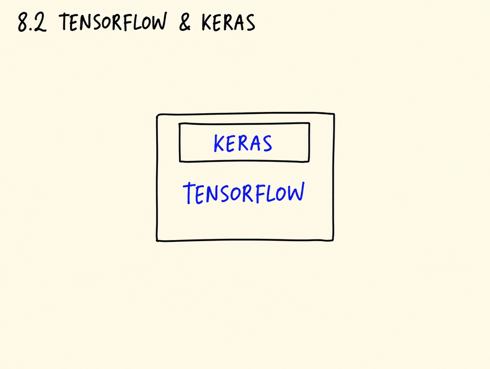
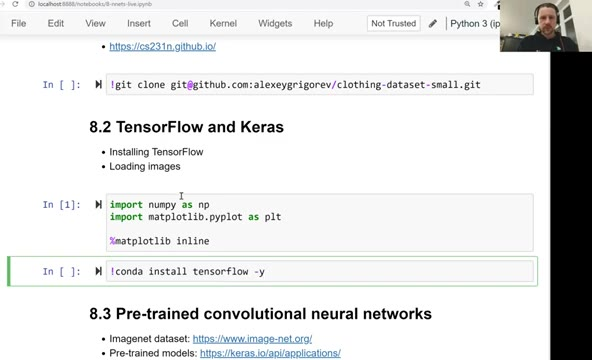
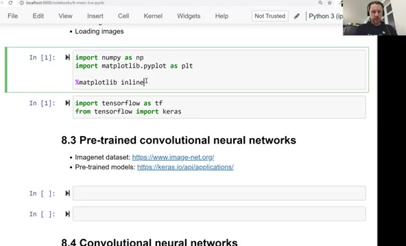
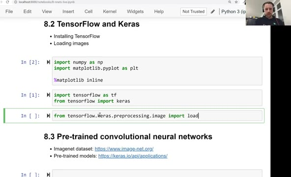
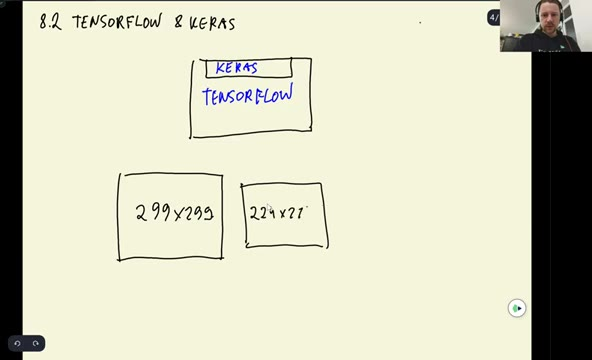
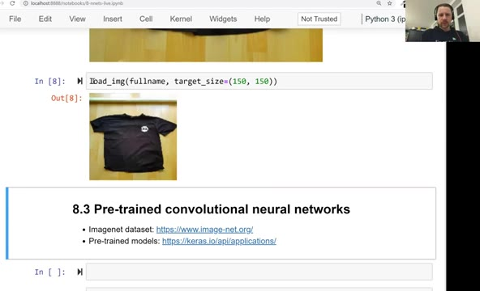
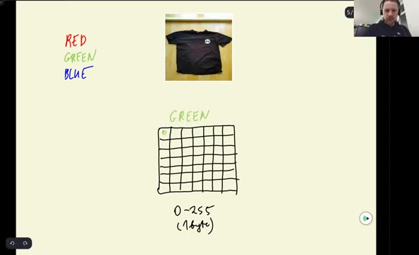
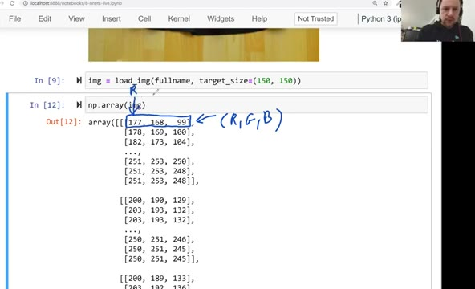

# TensorFlow and Keras

In this unit we meet the two libraries we'll use for the rest of the
module: TensorFlow and Keras. We install TensorFlow, import it, and
load our first image from the clothing dataset.

## TensorFlow and Keras

TensorFlow is a library from Google for doing deep learning. Its
website calls it an end-to-end open source machine learning platform -
it can do other things, but the main focus is deep learning. For us,
TensorFlow is a library for training deep learning models.

Keras is a higher-level abstraction on top of TensorFlow. It makes it
simpler to create, train and use neural networks. Keras lives inside
TensorFlow:



Keras used to be a separate library, but it got absorbed into
TensorFlow. Since TensorFlow 2.0 it is a part of TensorFlow - so make
sure you use TensorFlow 2.0 or above.

## Installing TensorFlow

TensorFlow doesn't come with Anaconda. To install it from a Jupyter
notebook:

```
%conda install tensorflow -y
```

The `-y` means "yes" - otherwise the notebook asks you to confirm the
installation. Alternatively, use pip:

```
%pip install tensorflow
```



If you don't have a GPU on your computer, this is all you need. With a
GPU the setup is a bit more involved. I'm not an expert in that - I
usually prefer cloud solutions where everything is already configured,
so I can just create a notebook and start training. Later in this
module I use Amazon SageMaker notebooks that already have TensorFlow
installed. In this video I still use my laptop - you can see it's
localhost.

## Importing the libraries

Once installed, we import TensorFlow and Keras:

```python
import tensorflow as tf
from tensorflow import keras
```



## Loading an image

Now let's load one of the images from the clothing dataset. There is a
special function in Keras for that - `load_img`:

```python
from tensorflow.keras.preprocessing.image import load_img
```

If you find older tutorials online, you may see the import written as
`from keras.preprocessing.image import load_img`, without
`tensorflow` in front. That was valid when Keras was a separate
library. You can take such code, add `tensorflow` in front, and it
should work without changes.



Let's load a t-shirt from the train folder. We build the path with an
f-string and pass it to `load_img`:

```python
path = './clothing-dataset-small/train/t-shirt'
name = '5f0a3fa0-6a3d-4b68-b213-72766a643de7.jpg'
fullname = f'{path}/{name}'
load_img(fullname)
```

This is actually a Machine Learning Zoomcamp t-shirt - I think I even
recorded a couple of videos wearing it.

## Resizing with target_size

A neural network expects an image of a certain size. Common sizes are
299x299, 224x224, or smaller ones like 150x150:



If we have an image of a different size, we need to resize it to one
of these formats. We do that with the `target_size` parameter:

```python
img = load_img(fullname, target_size=(150, 150))
img
```



The library behind this is PIL - the Python Imaging Library. It's what
many libraries use for processing images, and `load_img` returns a PIL
image.

## How images are represented

Internally, an image is just an array with three channels: red, green
and blue. Each channel is an array, and each cell of that array is a
number between 0 and 255 - that's one byte:



Each pixel combines three values: one from the red channel, one from
the green channel and one from the blue channel. Our t-shirt is almost
black, so for a pixel on the shirt all three values are probably
almost zero.

## From image to NumPy array

We can turn a PIL image into a NumPy array by simply wrapping it in
`np.array`:

```python
x = np.array(img)
x.shape
```

The shape is `(150, 150, 3)`: height, width, and the number of
channels. Each row of the array is one pixel with its RGB values -
the first number is red, the second green, the third blue. We have
150x150 of them.



The dtype is `uint8`. "u" means unsigned - the values go from 0 to
255, not from -128 to 127 - and "int8" means an integer that takes
eight bits, or one byte.

That's our image as a NumPy array. In the next video we'll see how to
use a pre-trained convolutional neural network to understand what is
on this image.

## Materials

[Slides](https://www.slideshare.net/AlexeyGrigorev/ml-zoomcamp-8-neural-networks-and-deep-learning-250592316)

## Notes

In the video the `load_img` function from Keras is imported using

```python
from tensorflow.keras.processing.image import load_img
```

If the import is not working, try using

```python
from tensorflow.keras.utils import load_img
```

[Tensorflow documentation](https://www.tensorflow.org/api_docs/python/tf/keras/utils/load_img)

**Classes, functions, and methods**:

- `import tensorflow as tf`: to import tensorflow library
- `from tensorflow import keras`: to import keras
- `from tensorflow.keras.preprocessing.image import load_img`: to import load_img function
- `load_img('path/to/image', targe_size=(150,150))`: to load the image of 150 x 150 size in PIL format
- `np.array(img)`: convert image into a numpy array of 3D shape, where each row of the array represents the value of red, green, and blue color channels of one pixel in the image.

* tensorflow and keras as deep learning libraries
* end-to-end open source machine learning framework
* tensorflow as library for training deep learning models
* keras as high-level abstraction on top of tensorflow
* installing tensorflow
* local vs cloud configuration
* loading and preprocessing images
* keras is part of tensorflow since version 2.0
* working with different image sizes
* processing images using the python pillow library
* encoding images as numpy arrays
* image size (i.e. 150 x 150 pixels) multiplied by number of colors (i.e. RGB) equals shape of array
* numpy array dtype as unsigned int8 (uint8) which includes the range from 0 to 255

<table>
   <tr>
      <td>⚠️</td>
      <td>
         The notes are written by the community. <br>
         If you see an error here, please create a PR with a fix.
      </td>
   </tr>
</table>

* [Notes from Peter Ernicke](https://knowmledge.com/2023/11/19/ml-zoomcamp-2023-deep-learning-part-3/)
