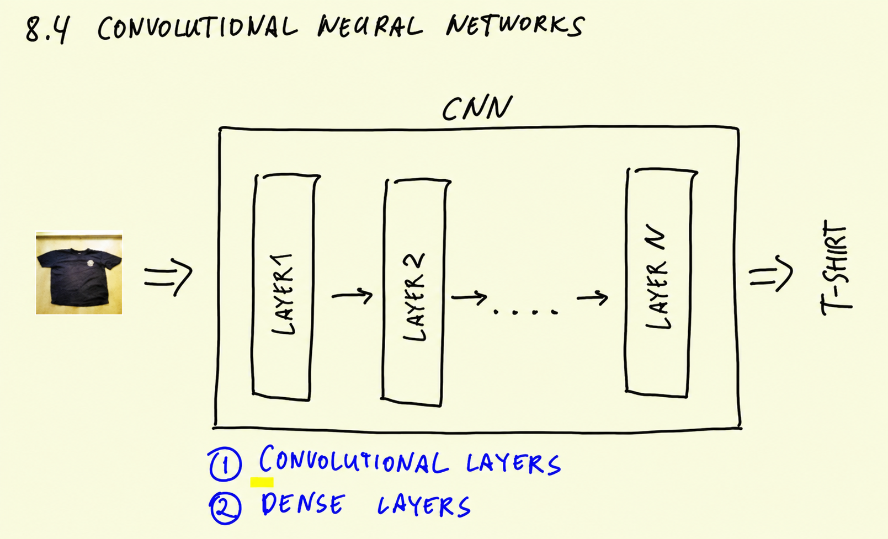
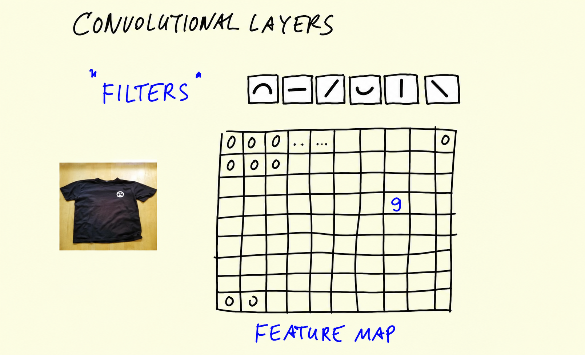
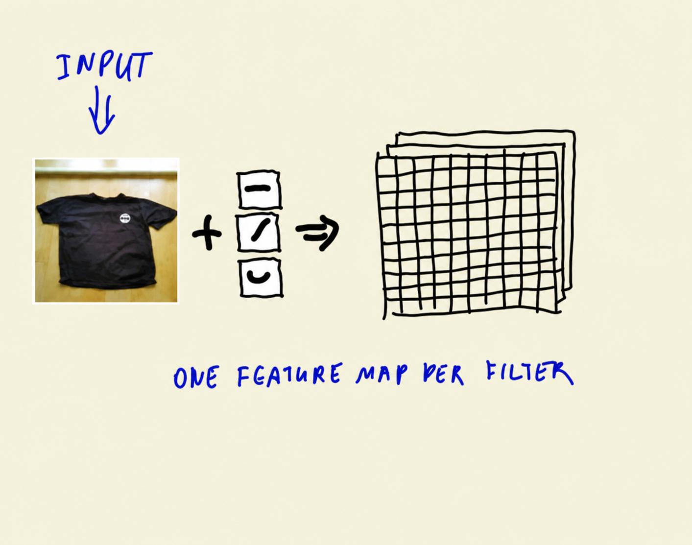
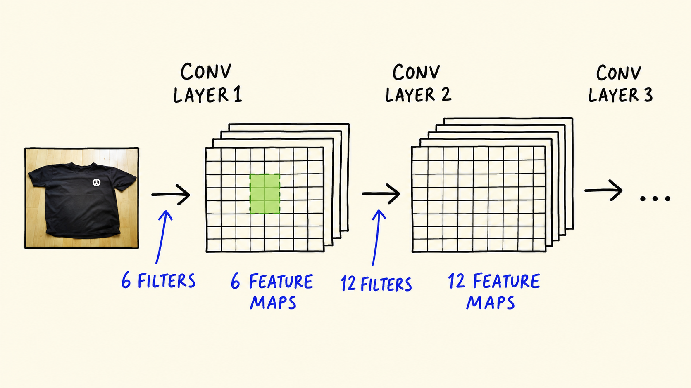
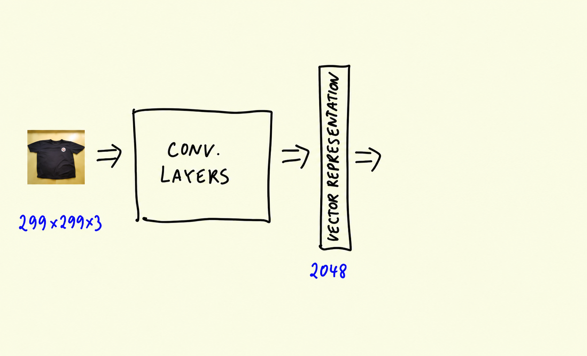
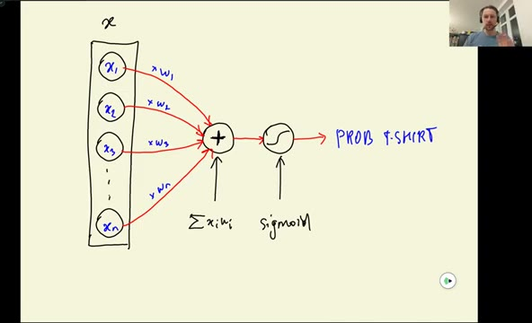
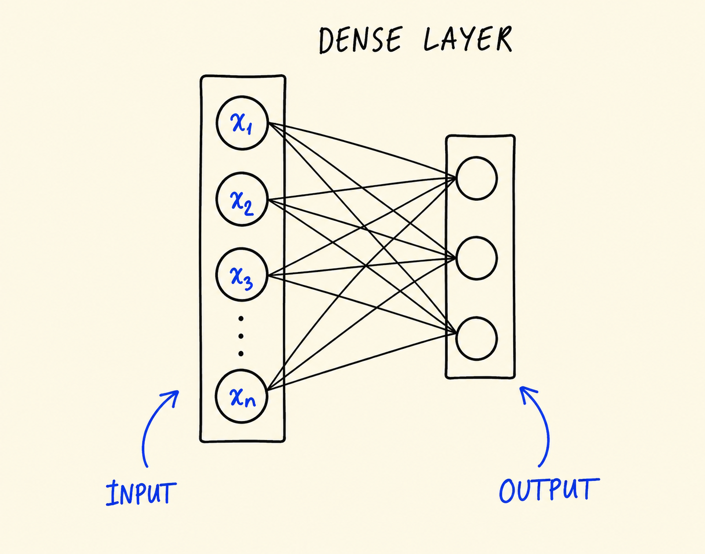
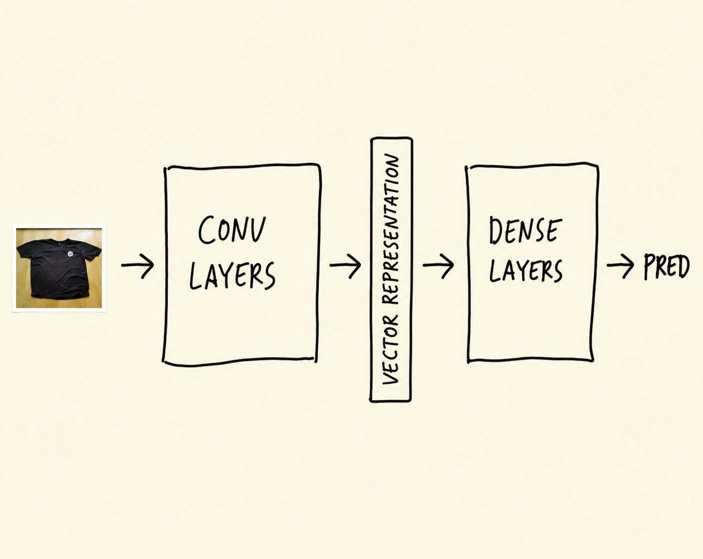

# Convolutional neural networks

The model we used in the previous unit, Xception, is a convolutional
neural network. In this unit we go inside it: what convolutional
layers and dense layers are, how filters turn an image into a vector
representation, and how that vector becomes a prediction.

## What is inside a CNN

Convolutional neural networks (CNNs) are the type of neural networks
used mostly for images. They consist of different types of layers, and
one of them is called a convolutional layer - that's where the name
comes from.

We have an image, and we want a neural network to predict what is on
it. We feed the image to a CNN - for now, think of it as a black box -
and it outputs a prediction: this is a t-shirt.



Inside the box there are layers - layer one, layer two, and so on,
possibly quite a few of them. There are two main types of layers in a
convolutional neural network:

- Convolutional layers
- Dense layers

## Convolutional layers and filters

Convolutional layers consist of filters. A filter is kind of a small
image - usually quite small, like 5x5, sometimes even smaller - and
there are quite a few of them in a layer.

The filters contain simple shapes: simple lines, stripes, circles.
This is just an example, not a real network - it's to give you an
understanding of what might be happening inside.

We take our image, take a filter, and slide this filter across the
image. Every time we apply the filter, we check how similar the filter
is to the part of the image it currently covers. The similarity is a
number: zero usually means no similarity, a higher number means bigger
similarity.

We record this number for each position of the filter. The resulting
array is called a feature map:



The feature map is the result of applying one filter to an image: we
slide the filter across the image, compute the similarity at every
position, and record it. High values mean the filter is similar to
that part of the image. In this drawing, the filter matched somewhere
in the middle (the 9), and the rest is mostly zeros.

We do this for each filter. If a convolutional layer has six filters,
it produces six feature maps - one feature map per filter:



So the input of a convolutional layer is the image, and the output is
a set of feature maps, as many as there are filters.

## Chaining convolutional layers

The output of the first convolutional layer is a set of feature maps.
We can treat this output as a new image - an image that we made from
the original one - and feed it to another convolutional layer. This
layer has its own set of filters, applies them to the output of the
first layer, and produces its own feature maps:



Here the first layer has 6 filters and produces 6 feature maps, the
second has 12 filters and produces 12 feature maps, and we can keep
going with a third layer.

Because of this chaining, each layer learns more and more complex
filters. These filters are what a neural network learns during
training. The first convolutional layer typically learns simple
filters - just stripes. The second layer combines the filters from the
first layer: a circle can be a combination of two stripes, an angle
can be two lines put together, a cross as well. By the third layer the
shapes are even more complex.

So the first layer recognizes simple patterns - stripes; where the
image has a similar stripe, the feature map has a high value. Using
this information, the second layer can detect more complex shapes -
circles or angles. And the third layer can detect things like sleeves.
Each layer detects progressively more complex features: low-level
features first, then mid-level, then high-level features of the image.

By "features" I mean things like "there are sleeves in this part of
the image" or "there is a circle in this specific area". This is not
exactly how filters look in reality, but it's a good way to think
about them. What filters actually do is look at a region across all
the values of all the feature maps in that region - they go in depth.
A higher-level filter can fire when, say, two lower-level feature maps
both have high values in the same area. This way, the more layers we
have, the more complex features we can capture. And remember - all
these filters are learned automatically. We don't tell the network
"make a filter for this kind of line". It learns them during training.

## Vector representation

We take our image and pass it through a set of convolutional layers.
The result of this is a vector representation of the image:



If the input image is 299x299x3, the vector representation could be
something like 2048 numbers - a one-dimensional array. The
dimensionality is usually 2048 or 1024 - typically powers of two.

This vector captures the information about the image. There could be
an area that says there are sleeves, an area that corresponds to
color, an area for some other part of the image, and so on. It's very
hard for people to make sense of these numbers, but for neural
networks they make sense, and they contain all the information the
network was able to extract from the image.

So the role of convolutional layers is to extract this vector
representation.

## Dense layers

With this vector we can build a model that makes the final prediction.
Dense layers take the vector representation and turn it into
predictions.

Let's start with binary classification: is this a t-shirt, or not? The
input x is the vector representation of the image, and the target y is
0 (not a t-shirt) or 1 (t-shirt). For this we usually use logistic
regression: g(x) is a sigmoid. The weights are trained, and the output
is the probability that x is a t-shirt:



Concretely: the elements of x are x1, x2, x3, up to xn. We multiply
each of them by its weight - w1, w2, w3, and so on - and sum everything
together. Then we apply the sigmoid to this sum to turn it into a
probability of being a t-shirt.

Now let's imagine we want multiple classes: in addition to t-shirt, a
shirt and a dress. We can build three models, one per class. Each model
gets the same input - the vector representation - but each has its own
set of weights: red ones for t-shirts, green ones for shirts, blue
ones for dresses.

Instead of sigmoid, for multiple classes we use softmax - it's a
generalization of sigmoid to multiple classes. The output is a
three-dimensional vector: the first component is the probability of
shirt, the second of t-shirt, the third of dress.

What we have done here is put multiple logistic regressions together -
and as a result we got a neural network.

This layer is called a dense layer. The input to the layer is the
vector representation, and the output is the predictions:



It's called "dense" because each element of the input is connected to
each element of the output - there are a lot of connections, the area
is really dense. For each output we have a weight: w1, w2, w3, and so
on. If we put all these w's together, we get one big matrix W, where
each row is the w of one output. If x is a column vector, then to
transform the input to the output, all we need to do is multiply W by
x. A dense layer is nothing else but matrix multiplication.

We can put multiple dense layers together. The layer between the input
and the final predictions is called an inner dense layer, and the last
one is the final dense layer for predictions.

## Back to our problem

For our clothing classifier: we take the image, turn it into a vector
representation with convolutional layers, convert this vector into
some inner representation with a dense layer, and then finally convert
it to the output - 10 values, one per class. From this output we
select the one with the highest value, and hopefully it's t-shirt:



That's the whole picture. Of course, here I only scratched the surface
of how convolutional neural networks work. If you want to go deeper,
check [CS231n](https://cs231n.github.io/), the Stanford course I
mentioned in the first lesson - they go into a lot of detail about how
these layers work, with very nice visualizations of the learned
filters and feature maps.

There's also a great interactive website where you can play with a CNN
right in the browser: [CNN Explainer](https://poloclub.github.io/cnn-explainer/).

One type of layer we didn't talk about is pooling layers. The purpose
of pooling is to make the feature maps smaller - it takes a feature
map and shrinks it, for example from 200x200 to 100x100. The reason
for doing this is to make the neural network smaller, to force it to
have fewer parameters. If you're interested, go through the CS231n
notes - they're really good. It's not required, but recommended.

In the next lesson we will see how this theory is useful: how to use
the convolutional part for extracting the vector representation and
how to train dense layers for our purpose.

## Materials

[Slides](https://www.slideshare.net/AlexeyGrigorev/ml-zoomcamp-8-neural-networks-and-deep-learning-250592316)

## Notes

A convolutional neural network, also know as CNN or ConvNet, is a feed-forward neural network that is generally used to analyze visual images by processing data with grid-like topology. A CNN is used to detect and classify objects in an image. In CNNs, every image is represented in the form of an array of pixel values.

The convoluion operation forms the basis of any CNN. In a convolution operation, the arrays are multiplied element-wise, and the dot product is summed to create a new array, which represents `Wx`.

A Convolution neural network has multiple hidden layers that help in extracting information from an image. The four important layers in CNN are:

1. Convolution layer
2. ReLU layer
3. Pooling layer
4. Fully connected layer (also called Dense layer)

**Convolution layer**

This is the first step in the process of extracting valuable features from an image. A convolution layer has several filters that perform the convolution operation. Every image is considered as a matrix of pixel values.

Consider a black and white image of 5x5 size whose pixel values are either 0 or 1 and also a filter matrix with a dimension of 3x3. Next, slide the filter matrix over the image and compute the dot product to get the convolved feature matrix.

```python
nn.Conv2d(
    in_channels,      # number of channels in the input image
    out_channels,     # number of filters to learn
    kernel_size,      # size of each filter (int or tuple)
    stride=1,         # step size for moving the filter
    padding=0,        # zero-padding around input
```

Explanation:

* in_channels: Input depth (e.g., 3 for RGB images).
* out_channels: Number of filters the layer will learn. Each produces one output feature map.
* kernel_size: Size of the convolutional filter. Can be a single number (square filter) or a tuple (height, width).
* stride: How many pixels the filter moves each step. Default is 1.
  
* padding: Number of pixels added around the input to control output size. Default is 0.
    

Output size after Conv2d image

$$\text{Output size} = \frac{W - K + 2P}{S} + 1$$

Where:
* 𝑊 = input size (height or width)
* 𝐾 = kernel size
* 𝑃 = padding
* 𝑆 = stride

**ReLU layer**

Once the feature maps are extracted, the next step is to move them to a ReLU layer. ReLU (Rectified Linear Unit) is an activation function which performs an element-wise operation and sets all the negative pixels to 0. It introduces non-linearity to the network, and the generated output is a rectified feature map. The relu function is: `f(x) = max(0,x)`.

**Pooling layer**

Pooling is a down-sampling operation that reduces the dimensionality of the feature map. The rectified feature map goes through a pooling layer to generate a pooled feature map.

Imagine a rectified feature map of size 4x4 goes through a max pooling filter of 2x2 size with stride of 2. In this case, the resultant pooled feature map will have a pooled feature map of 2x2 size where each value will represent the maximum value of each stride.

The pooling layer uses various filters to identify different parts of the image like edges, shapes etc.

**Fully Connected layer**

The next step in the process is called flattening. Flattening is used to convert all the resultant 2D arrays from pooled feature maps into a single linear vector. This flattened vector is then fed as input to the fully connected layer to classify the image.

**Convolutional Neural Networks in a nutshell**

- The pixels from the image are fed to the convolutional layer that performs the convolution operation
- It results in a convolved map
- The convolved map is applied to a ReLU function to generate a rectified feature map
- The image is processed with multiple convolutions and ReLU layers for locating the features
- Different pooling layers with various filters are used to identify specific parts of the image
- The pooled feature map is flattened and fed to a fully connected layer to get the final output

* convolutional neural networks (CNN) consist of different types of layers
* convolutional layer as filters (i.e. 5 x 5)
* dense layers
* sliding the filter across the cells of the entire image
* calculating similarity scores of the different positions of the filter
* creating the feature map, one feature map per filter
* chaining layers of simple and complex filters allows the CNN to "learn"
* resulting in vector representation of image
* activation functions sigmoid for binary classification and softmax for multiclass

<table>
   <tr>
      <td>⚠️</td>
      <td>
         The notes are written by the community. <br>
         If you see an error here, please create a PR with a fix.
      </td>
   </tr>
</table>

* [Notes from Peter Ernicke](https://knowmledge.com/2023/11/20/ml-zoomcamp-2023-deep-learning-part-5/)
