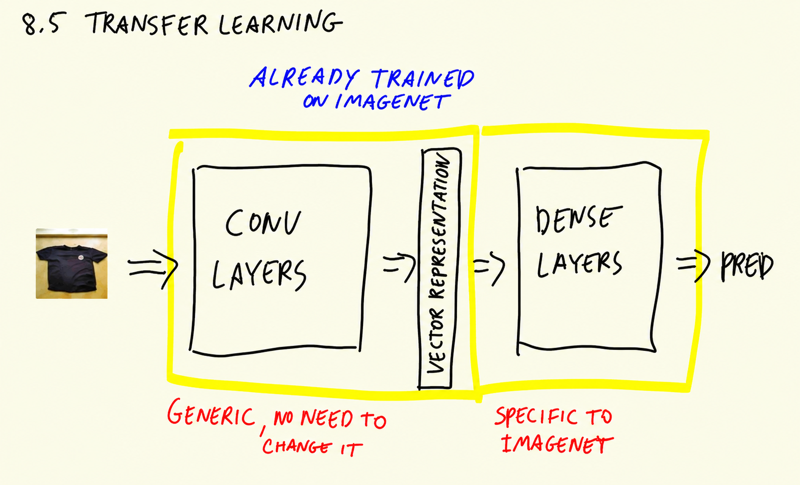
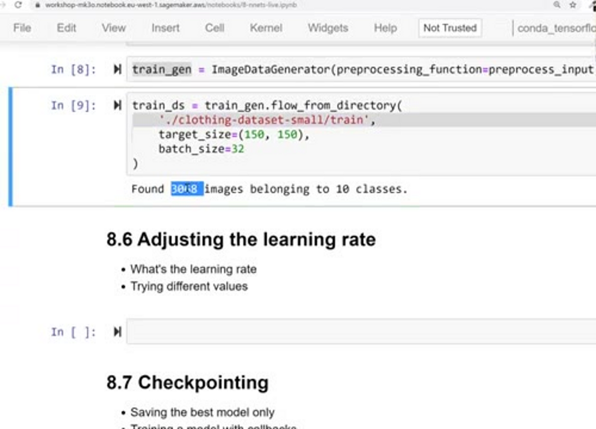
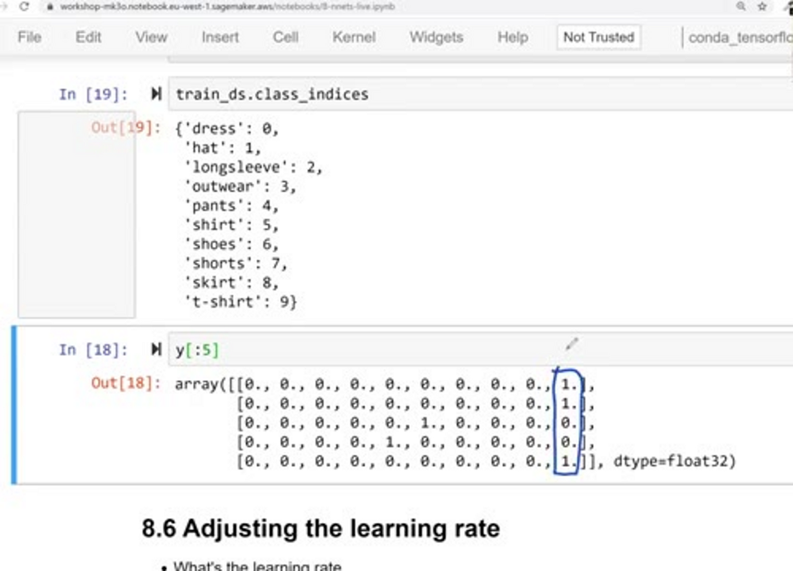
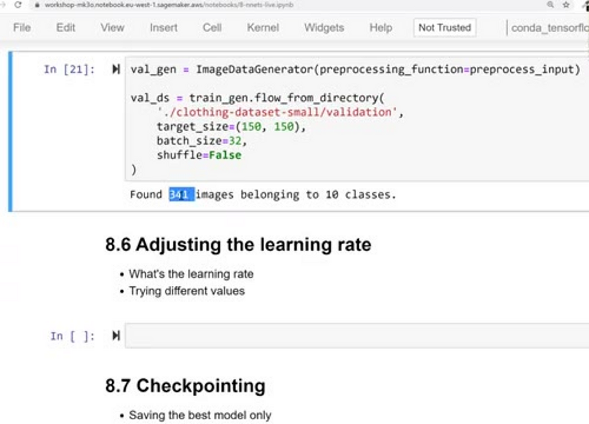
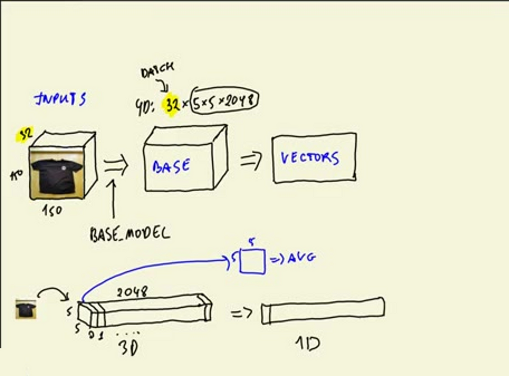
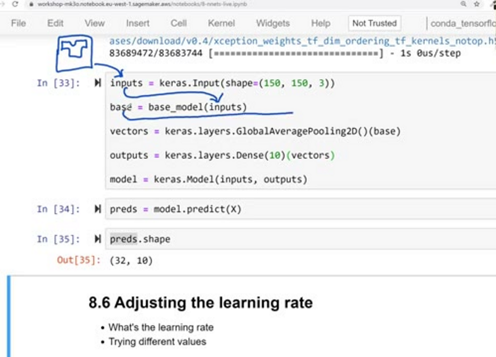
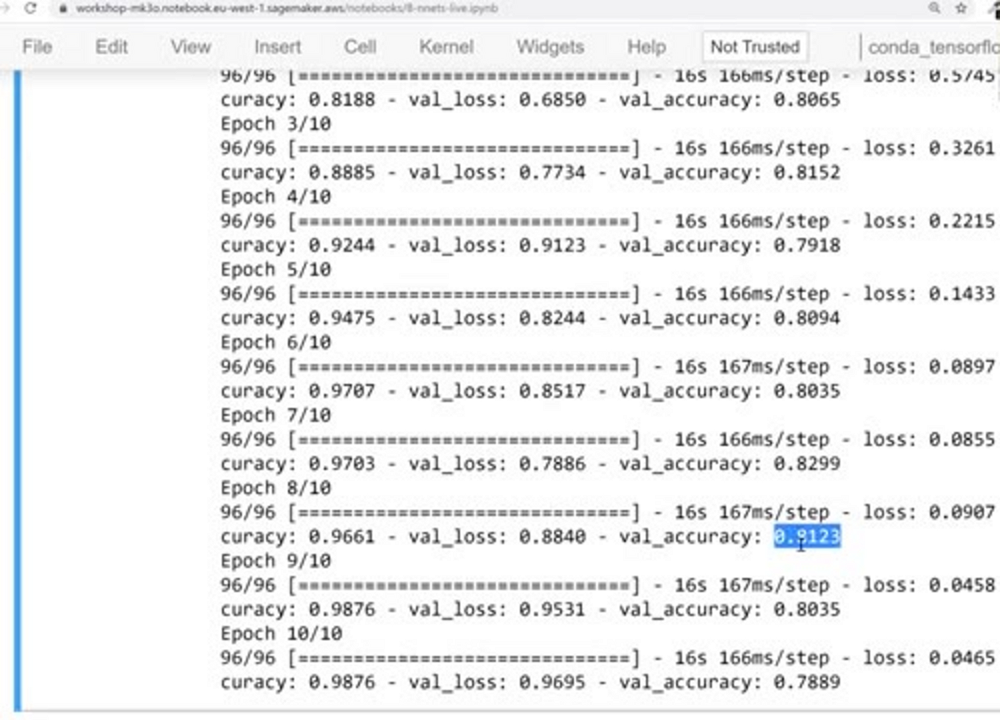
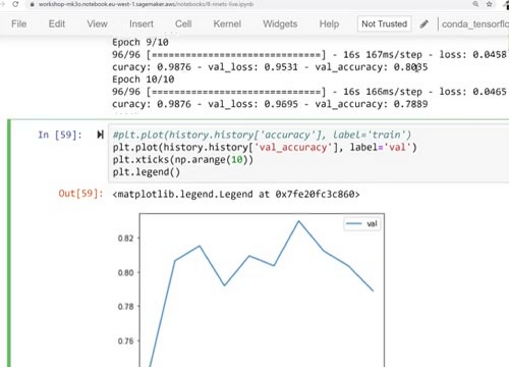

# Transfer learning

In the previous unit we looked at the internals of convolutional
neural networks: convolutional layers turn an image into a vector
representation, and dense layers use that vector to make predictions.
In this unit we put that to use: we take a neural network that is
already pre-trained - a model trained on ImageNet - and reuse it for
our task. This idea is called transfer learning.

## The idea

Remember that each layer of a neural network contains a bunch of
filters. These filters are learnable - the model learns them during
training - and the filters it learns are quite generic: they can be
used for many purposes.

Somebody trained this model on the ImageNet dataset. Training these
filters in the convolutional layers is very difficult: the model needs
to see a huge amount of images to come up with filters that make
sense. But once trained, the model can take any picture and convert it
into a vector representation - and this is quite generic. We don't
need to change it for our task.

The dense layers are a different story. They are specific to the
dataset the model was trained on. ImageNet has 1000 different classes,
so the output dense layer has a size of 1000. In our problem we want
to predict only 10 classes - and many of them, like t-shirt, don't
even exist in ImageNet.



So the plan is:

- Keep the convolutional layers - they already know how to turn an
  image into a vector representation.
- Throw away the dense layers from ImageNet and train our own dense
  layers for our 10 classes.

Everything the model learned previously - the most difficult part - is
reused, and we transfer this knowledge to a new model. That's the main
idea behind transfer learning.

## Reading the data

Let's see how to do it with Keras. The first thing we need is to read
our dataset. There is a special class for that, `ImageDataGenerator`.
It lives in `tensorflow.keras.preprocessing.image`:

```python
from tensorflow.keras.preprocessing.image import ImageDataGenerator
```

Let's create one for training:

```python
train_gen = ImageDataGenerator(preprocessing_function=preprocess_input)

train_ds = train_gen.flow_from_directory(
    './clothing-dataset-small/train',
    target_size=(150, 150),
    batch_size=32
)
```

The only thing we specify for now is the preprocessing function - the
same `preprocess_input` we used previously with Xception. From this
generator we call `flow_from_directory` to read images from a
directory.

The target size is 150x150 for now. This way we can experiment faster:
training on 299x299 images would take four times more time, because a
299x299 image is four times bigger than a 150x150 one. For
experiments, we use smaller images, and at the end we'll retrain on
bigger ones.

The batch size is how many images we process at once: not one image,
but 32. So one batch has the shape `(32, 150, 150, 3)` - 32 images,
each 150x150, with 3 channels. The batch goes through the
convolutional layers, we get 32 vectors - one per image - and 32
predictions at the end.

When we execute this cell, it says that in the train folder it found
3068 images belonging to 10 classes:



We can look at which classes it found with `train_ds.class_indices`:



The first class is dress, then hat, longsleeve, outwear, pants, and so
on - t-shirt is the last one. These are the same names as the folders
in the train directory: the generator inferred the names of the
classes from the folder structure. Everything inside the t-shirt
folder gets the t-shirt class.

The train dataset is a generator - an iterator. To get the next batch,
we use the `next` function (a for loop invokes it internally):

```python
X, y = next(train_ds)
```

It returns two things: X, the features (the images), and y, the
labels. X is very similar to what we saw previously - a bunch of
images with the `preprocess_input` function applied, because we asked
for it. The shape is `(32, 150, 150, 3)`, exactly like we wrote.

Let's also look at y - the labels. In the same screenshot above you
can see the first rows of `y[:5]`: the labels use one-hot encoding.
For example, the column of t-shirts is index 9 - the rows with a 1 in
the last column are t-shirts. This row here has a 1 in column 4,
pants: it has a 1 for pants and 0 everywhere else. It's the same
one-hot encoding method, but applied to the target variable. This is
how we usually do multi-class classification.

You can also think of it as 10 different binary variables: each column
says if this image is pants or not pants, dress or not dress, and so
on. We sort of fit 10 different binary classification models, even
though we actually fit only one.

We do the same for validation:

```python
val_gen = ImageDataGenerator(preprocessing_function=preprocess_input)

val_ds = val_gen.flow_from_directory(
    './clothing-dataset-small/validation',
    target_size=(150, 150),
    batch_size=32,
    shuffle=False
)
```

Everything is the same, except that here we don't shuffle: by default
the generator shuffles the dataset, but for validation that's not
needed - it's fine if the images always come in the same order. This
one finds 341 images belonging to the same 10 classes. Right below it
we can already start writing the base model:



## Building the model

Now let's train a model. We call the pre-trained part the base model,
and we'll train our custom model on top of it. The base model is
Xception, and we use it to extract the vector representation from the
image. Then we train the rest ourselves.

```python
base_model = Xception(
    weights='imagenet',
    include_top=False,
    input_shape=(150, 150, 3)
)

base_model.trainable = False
```

We say `weights='imagenet'` to use the ImageNet weights. The other
parameter is `include_top=False`. In Keras the mental model is a bit
different - the network is arranged from bottom to top: at the bottom
we have the input, then the convolutional layers, which produce the
vector representation, and at the top a bunch of dense layers that
make the prediction. This dense part is called the "top".
`include_top=False` means: do not include the dense layers, only the
convolutional layers. The last parameter, `input_shape`, is
150x150x3.

We don't want to train the base model - we only want to use it for
extracting the vector representation. So we say
`base_model.trainable = False`, meaning that when we train our model,
the convolutional layers don't change.

Executing this cell downloads the model, because for this input shape
it's a different model than the one we used before.

Now we create the new top. First, the input - the part of the model
that receives the images:

```python
inputs = keras.Input(shape=(150, 150, 3))

base = base_model(inputs, training=False)

vectors = keras.layers.GlobalAveragePooling2D()(base)

outputs = keras.layers.Dense(10)(vectors)

model = keras.Model(inputs, outputs)
```

The input shape is 150x150x3 - a bit redundant, but we need to repeat
it. This input goes to the base model: we apply `base_model` to
`inputs` and call the output `base`. Remember that inputs is a batch -
32 images of 150x150x3.

What exactly comes out of the base model? For our batch it's a
four-dimensional thing with shape `(32, 5, 5, 2048)` - the first
dimension is the batch size. For a single image, what we get from the
convolutional layers is a three-dimensional thing: 5x5x2048.

This doesn't look like a vector representation yet, because it's
three-dimensional. We want to turn it into a one-dimensional vector.
For that we can slice this 5x5x2048 thing into 2048 squares of 5x5,
take the average of each square, and put that average into the vector:



Taking something and representing it in a smaller dimensionality is
called pooling. Here we need average pooling, because we take an
average of each square. And because we turn a two-dimensional chunk
into a single number - a three-dimensional thing into a
one-dimensional thing - in Keras this layer is called
`GlobalAveragePooling2D`. We apply it to `base` and get the vectors.
Now the shape is `(32, 2048)`: we managed to shrink each image into a
one-dimensional vector of 2048 numbers.

By the way, this way of building a neural network - using these
building blocks as functions - is called the functional style. The
base model is actually a model, but we just invoke it as a function:
the input is `inputs`, the output is `base`. Then the pooling layer's
input is `base` and its output is `vectors`.

The last step: we want a dense layer on top to turn the vectors into
predictions. The output we want is an array of shape `(32, 10)` - 10
numbers per image, because we have 10 classes:

```python
outputs = keras.layers.Dense(10)(vectors)
```



So the whole picture: the t-shirt image goes to inputs, from there to
the base model, which produces the 5x5x2048 thing; pooling turns it
into the vector representation; and a dense layer with 10 outputs
turns the vector into predictions. We wrap it all in
`keras.Model(inputs, outputs)` and call this model version one.

Note that if we call `model.predict` now, it outputs some nonsense -
just random numbers. That's because the dense layer is initialized
with random weights, and we haven't trained the model yet.

## Optimizer and loss

To train the model we need two things: an optimizer and a loss.

The optimizer is the thing that finds the best weights for the model.
Remember the dense layer is a matrix W - training means changing each
element of this matrix and checking whether the solution gets better,
many many times. The optimizer does that. It doesn't change the
weights randomly - it tries to change them in such a way that the
model actually learns something.

Optimizers live in `keras.optimizers`. There are quite a few, and we
will use Adam. A really good resource to learn more about optimizers
is again CS231n - it explains gradient descent, which is what
optimizers use for finding the best parameters, and it says that in
practice Adam is currently recommended as the default algorithm. So
usually the recommendation is just to go with Adam.

```python
learning_rate = 0.01
optimizer = keras.optimizers.Adam(learning_rate=learning_rate)
```

Adam has multiple parameters, but the important one for us is the
learning rate. It's similar to eta in XGBoost. We'll talk about tuning
this parameter in the next lesson.

The optimizer needs to know how to check whether changing the weights
made things better or worse. For that there is the concept of loss:
the loss tells us how good the model is. Losses live in
`keras.losses`. Since this is a multi-class classification problem,
we use categorical cross-entropy. For binary classification we would
use binary cross-entropy, and for regression - mean squared error,
like in the earlier modules.

```python
loss = keras.losses.CategoricalCrossentropy(from_logits=True)
```

Categorical cross-entropy outputs a number - the lower, the better -
and the optimizer tries to make it as low as possible by changing the
parameters of our dense layers.

There is one interesting parameter here: `from_logits=True`. The docs
say that using `from_logits=True` may be more numerically stable, so
the recommendation is to use it. Here's what it means: remember the
dense layer - input, output, and then softmax applied on top. Softmax
is called an activation: it takes the raw output of the dense layer
and turns it into probabilities. This raw output is called logits. If
we don't apply softmax, we have raw scores - logits; if we apply it,
we have probabilities. With `from_logits=True` we say: keep the raw
scores, don't apply any activation. If we wanted probabilities, we
would use `from_logits=False` and add `activation='softmax'` to the
dense layer. We keep the raw scores.

Now we compile the model - something we need to do before training.
We say which optimizer to use, which loss, and which metrics we're
interested in monitoring - accuracy:

```python
model.compile(optimizer=optimizer, loss=loss, metrics=['accuracy'])
```

## Training the model

Now we're ready to train, with the `fit` method:

```python
history = model.fit(train_ds, epochs=10, validation_data=val_ds)
```

We pass the training dataset and say for how many epochs we want to
run. One epoch is going over the dataset once. The dataset consists of
batches of 32 images each (the last batch can be smaller). We train
the model on one batch at a time - that's one iteration - and going
over all batches once is one epoch. So 10 epochs means going over the
data 10 times. For validation, we use the validation dataset.

Something is not right at first - the accuracy is low. The fix: it's
not enough to say `trainable=False` on the base model, we also need to
pass `training=False` when we apply it:

```python
base = base_model(inputs, training=False)
```

Also, `model.fit` returns a history object which contains all the
training information - useful to have, so let's capture it in a
variable.



Now training works: the accuracy on train grows, the loss goes down.
After the first epoch the validation accuracy is already 75%. Accuracy
means: for how many images did we predict the class correctly. Then
it's 80, and the loss on the training set becomes quite small - from
now on it starts to overfit a little bit: the training accuracy keeps
improving but the validation accuracy doesn't.

The results are saved in the history object - `history.history` is a
dictionary with everything we saw during training. The interesting
keys are `accuracy` (train) and `val_accuracy` (validation). We can
plot them: for training it almost reaches 1.0, and for validation it
quickly reaches about 80 and then just oscillates around 80 for the
rest of the iterations - sometimes it jumps up, sometimes down.



With just these parameters - no tuning - we already have a reasonably
good model: about 80% validation accuracy. Of course, there are many
parameters we can try and tune. Like with gradient boosting, where the
most important parameter is eta - the learning rate - the same is true
for neural networks. The learning rate is the most important parameter
to tune, and that's exactly what we'll do in the next lesson.

## Materials

[Slides](https://www.slideshare.net/AlexeyGrigorev/ml-zoomcamp-8-neural-networks-and-deep-learning-250592316)

## Notes

Transfer learning is a machine learning method where a model developed for a task is reused as the starting point for a model on a second task. Usually a pretrained model is trained with large volume of images and that is why the convolutional layers and vector representation of this model can be used for other tasks as well. However, the dense layers need to be retrained because they are specific to the dataset to make predictions with. In our problem, we want to keep convoluational layers but we want to train new dense layers.

Following are the steps to create train/validation data for model:

```python
# Build image generator for training (takes preprocessing input function)
train_gen = ImageDataGenerator(preprocessing_function=preprocess_input)

# Load in train dataset into train generator
train_ds = train_gen.flow_from_directory(directory=path/to/train_imgs_dir, # Train images directory
                                         target_size=(150,150), # resize images to train faster
                                         batch_size=32) # 32 images per batch

# Create image generator for validation
val_gen = ImageDataGenerator(preprocessing_function=preprocess_input)

# Load in image for validation
val_ds = val_gen.flow_from_directory(directory=path/to/val_imgs_dir, # Validation image directory
                                     target_size=(150,150),
                                     batch_size=32,
                                     shuffle=False) # False for validation
```

Following are the steps to build model from a pretrained model:

```python
# Build base model
base_model = Xception(weights='imagenet',
                      include_top=False, # to create custom dense layer
                      input_shape=(150,150,3))

# Freeze the convolutional base by preventing the weights being updated during training
base_model.trainable = False

# Define expected image shape as input
inputs = keras.Input(shape=(150,150,3))

# Feed inputs to the base model
base = base_model(inputs, training=False) # set False because the model contains BatchNormalization layer

# Convert matrices into vectors using pooling layer
vectors = keras.layers.GlobalAveragePooling2D()(base)

# Create dense layer of 10 classes
outputs = keras.layers.Dense(10)(vectors)

# Create model for training
model = keras.Model(inputs, outputs)
```

Following are the steps to instantiate optimizer and loss function:

```python
# Define learning rate
learning_rate = 0.01

# Create optimizer
optimizer = keras.optimizers.Adam(learning_rate=learning_rate)

# Define loss function
loss = keras.losses.CategoricalCrossentropy(from_logits=True) # to keep the raw output of dense layer without applying softmax

# Compile the model
model.compile(optimizer=optimizer,
              loss=loss,
              metrics=['accuracy']) # evaluation metric accuracy
```

The model is ready to train once it is defined and compiled:

```python
# Train the model, validate it with validation data, and save the training history
history = model.fit(train_ds, epochs=10, validation_data=val_ds)
```

**Classes, function, and attributes**:
- `from tensorflow.keras.preprocessing.image import ImageDataGenerator`: to read the image data and make it useful for training/validation
- `flow_from_directory()`: method to read the images directly from the directory
- `next(train_ds)`: to unpack features and target variables
- `train_ds.class_indices`: attribute to get classes according to the directory structure
- `GlobalAveragePooling2D()`: accepts 4D tensor as input and operates the mean on the height and width dimensionalities for all the channels and returns vector representation of all images
- `CategoricalCrossentropy()`: method to produces a one-hot array containing the probable match for each category in multi classification
- `model.fit()`: method to train model
- `epochs`: number of iterations over all of the training data
- `history.history`: history attribute is a dictionary recording loss and metrics values (accuracy in our case) for each epoch

* convolutional layers convert an image into a vector representation
* dense layers use vector representations to make predictions
* using a pretrained neural network
* imagenet has 1000 different classes
* a dense layer may be specific to a certain number of classes whereas the vector representation can be applied to another dataset
* reusing the vector representation from convolutional layers means transferring knowledge and the idea behind transfer learning
* train faster on smaller size images
* the batch size
* base model vs custom model
* bottom layers vs top layers in keras
* keras optimizers
* using the adam optimizer
* weights, learning rates
* eta in xgboost
* model loss
* categorical cross entropy
* changing accuracy during several training epochs
* overfitting

<table>
   <tr>
      <td>⚠️</td>
      <td>
         The notes are written by the community. <br>
         If you see an error here, please create a PR with a fix.
      </td>
   </tr>
</table>

* [Notes from Peter Ernicke](https://knowmledge.com/2023/11/21/ml-zoomcamp-2023-deep-learning-part-6/)
* [Notes from Peter Ernicke](https://knowmledge.com/2023/11/22/ml-zoomcamp-2023-deep-learning-part-7/)
